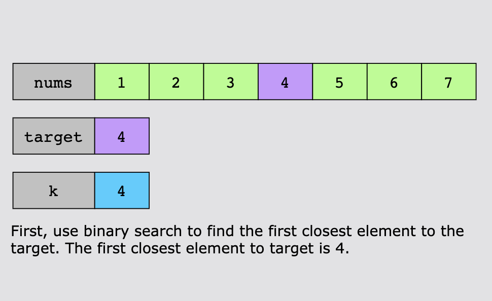
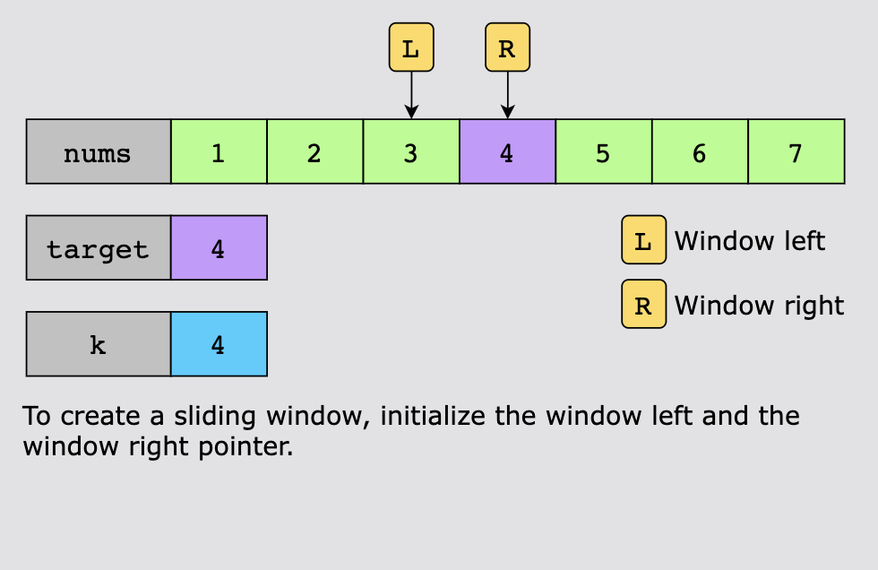
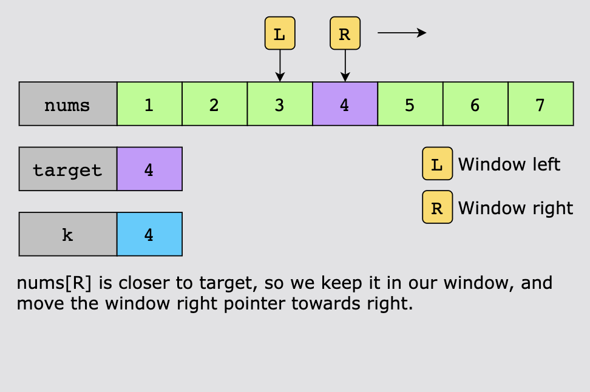
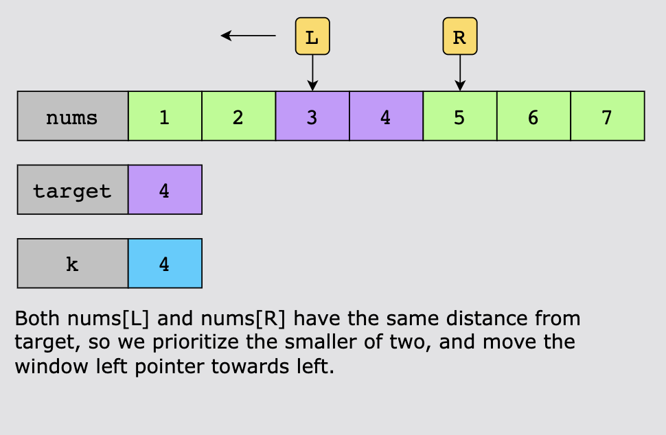
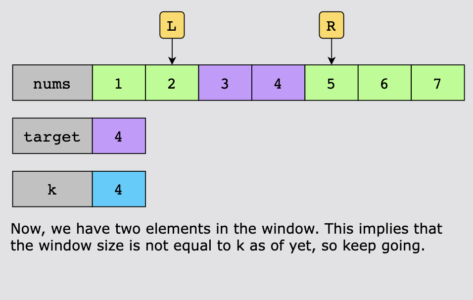
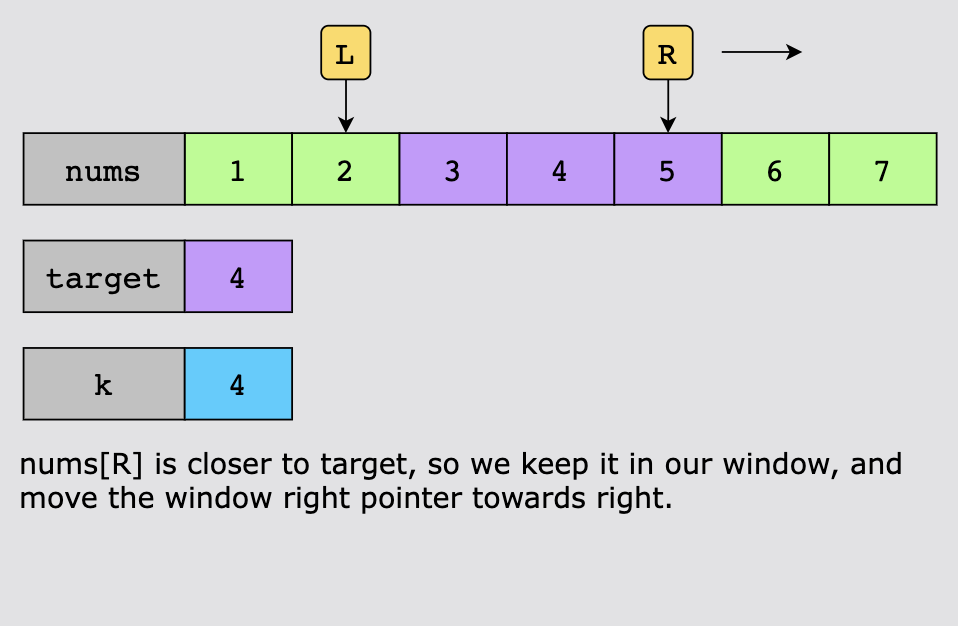
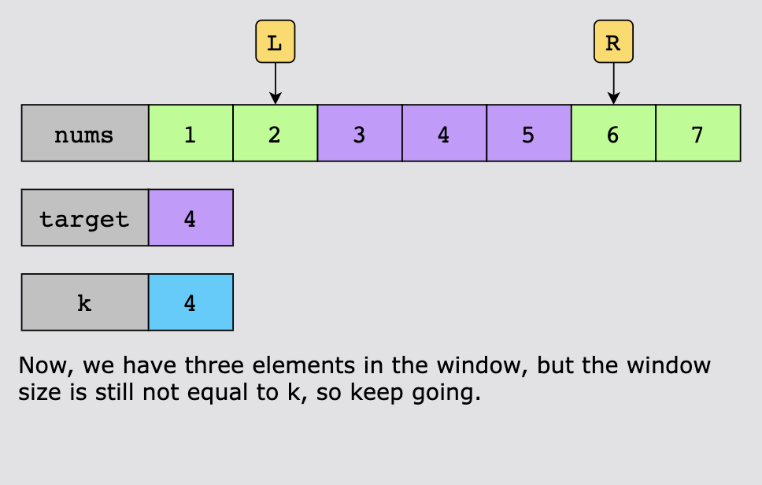
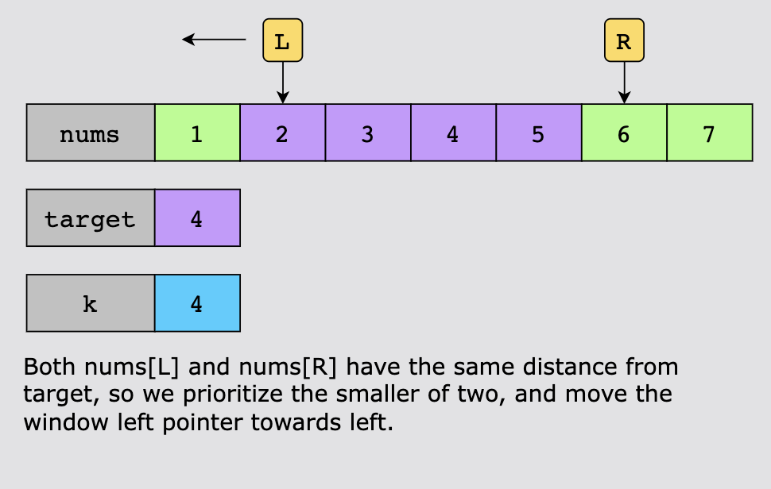
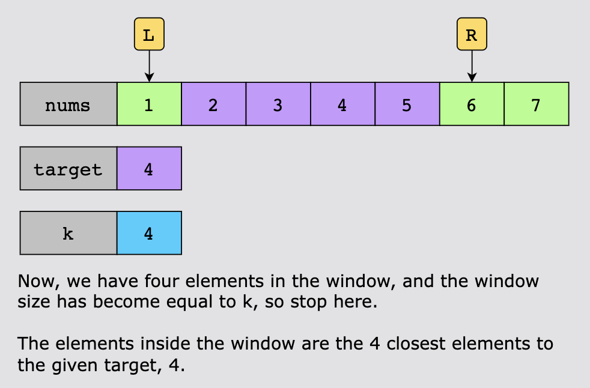

# Find K Closest Elements

Given a sorted array nums, a target value target, and an integer k, find the k closest elements to target in the array,
where "closest" is the absolute difference between each element and target. Return these elements in an array, sorted in
ascending order.

## Examples

```text
nums = [-1, 0, 1, 4, 6]
target = 1
k = 3

Output
[-1, 0, 1]

Explanation
-1 is 2 away from 1, 0 is 1 away from 1, and 1 is 0 away from 1. All other elements are more than 2 away. 
Since we need to return the elements in ascending order, the answer is [-1, 0, 1]
```

```text
nums = [5, 6, 7, 8, 9]
target = 10
k = 2

Output:
[8, 9]
```

## Constraints

- 1 <= target <= nums.length
- 1 <= nums.length <= 104
- nums is sorted in ascending order.
- -10^4 <= nums[i], x <= 10^4

## Topics

- Array
- Two Pointers
- Binary Search
- Sliding Window
- Sorting
- Heap (Priority Queue)

## Solution

### Using Optimized Binary Search

The key idea behind this algorithm is to efficiently locate the k numbers in a sorted array closest to a given target
value by minimizing unnecessary comparisons. First, the algorithm uses binary search to find the element nearest to the
target. Once this element is identified, the algorithm employs a two-pointer approach to establish a sliding window of
size k around this element. Starting with this element’s previous and next elements of this element, keep expanding
toward the left and right boundaries, choosing the closest element to the target value at each step.

Now, let’s look at the workflow of the implementation:

Before we proceed to the optimized approach, a few points need some consideration:

- If the length of nums is the same as the value of k, return all the elements.
- If target is less than or equal to the first element in nums, the first k elements in nums are the closest integers to
  target. For example, if nums= [1, 2, 3], target= 0, and k = 2, then the two closest integers to target are [1, 2].
- If target is greater than or equal to the last element in nums, the last k elements in nums are the closest integers to
  target. For example, if nums= [1, 2, 3], target= 4, and k = 2, then the two closest integers to target are [2, 3].
- Otherwise, we search for the k closest elements in the whole array.

When we have to find k elements in the complete array, instead of traversing the whole array, we can use binary search
to limit our search to the relevant parts. The optimized approach can be divided into two parts:

- Use binary search to find the index of the first closest integer to target in nums.
- Use two pointers, window_left and window_right, to maintain a sliding window. We move the pointers conditionally,
  either towards the left or right, to expand the window until its size gets equal to k. The k elements in the window are 
  the k closest integers to target.

Here’s how we’ll implement this algorithm:

- If the length of nums is the same as k, return nums.
- If target ≤ nums[0], return the first k elements in nums.
- If target ≥ nums[len(nums) - 1], return the last k elements in nums.
- Use binary search to find the index, first_closest, of the closest integer to target.
  - Initialize two pointers, left and right, to 0 and len(nums)-1, respectively.
  - Calculate the index of the middle pointer, mid, and check:
    - If the value pointed to by mid is equal to target, i.e., nums[mid] = target, return mid.
    - If nums[mid] < target, move left toward the right.
    - If nums[mid] > target, move right toward the left.
  - Once we have found the closest element to target, return the index, first_closest, which points to it.
- Create two pointers, window_left and window_right. The window_left pointer initially points to the index of the element
  that is to the left of nums[first_closest], and window_right points to the element that is to the right of window_left.
  This means window_left = nums[first_closest] - 1, and window_right = window_left + 1.
- Traverse nums while the sliding window size is less than k. In each loop, adjust the window size by moving the pointers
  as follows:
  - If nums[window_left] is closer to target than nums[window_right], or if both are at equal distance, that is, 
    |nums[window_left] - target| ≤ |nums[window_right] - target|, then window_left = window_left - 1.
  - If nums[window_right] is closer to target than nums[window_left], that is, |nums[window_right] - target| < 
    |nums[window_left] - target|, then window_right = window_right + 1.
- Once we have k elements in the window, return them as the output.












To summarize, we use binary search to locate the first closest element to target, then create a sliding window using two
pointers to select the k closest elements. The window adjusts its size by moving the pointers based on which adjacent
element is closer to the target. Eventually, the window will have the required k elements, which are then returned.

#### Time Complexity

The time complexity of the binary search is O(logn), where n is the length of the input array nums. The sliding window
step involves traversing the array once while adjusting the window size, and it takes O(k) time. The overall time
complexity becomes O(logn+k).

#### Space Complexity

The space complexity of this solution is O(1).

### Alternative Solution

Now, let’s see another way to solve this problem with slightly better time complexity. In this approach, we focus on
choosing the left bound for binary search such that the search space reduces to n - k.

We initialize the left pointer to 0 and the right pointer to len(nums) - k. These values are assigned based on the
observation that the left bound can’t exceed len(nums) - k to ensure we have enough elements for the window.

Next, while left < right, we perform a binary search to find the optimal position for the left bound of the sliding
window. We calculate mid and compare the distances between target and the elements at nums[mid] and nums[mid + k]. If
|nums[mid] - target| is greater than |nums[mid + k] - target|, it means the element at nums[mid] is farther from target
compared to the element at nums[mid + k]. In this case, it updates left to mid + 1, shifting the left bound to the right.
Otherwise, it updates the right to mid, moving the right bound closer to the left.

Once the while loop completes, return the elements of nums starting from left and including the next k elements. These
elements represent the k closest elements to target. The creation of this list will take O(k) time.

Since the initial search space has a size of n - k, the binary search takes O(log(n−k)). Therefore, the time complexity
of this solution is O(log(n−k)+k). The space complexity remains O(1).
