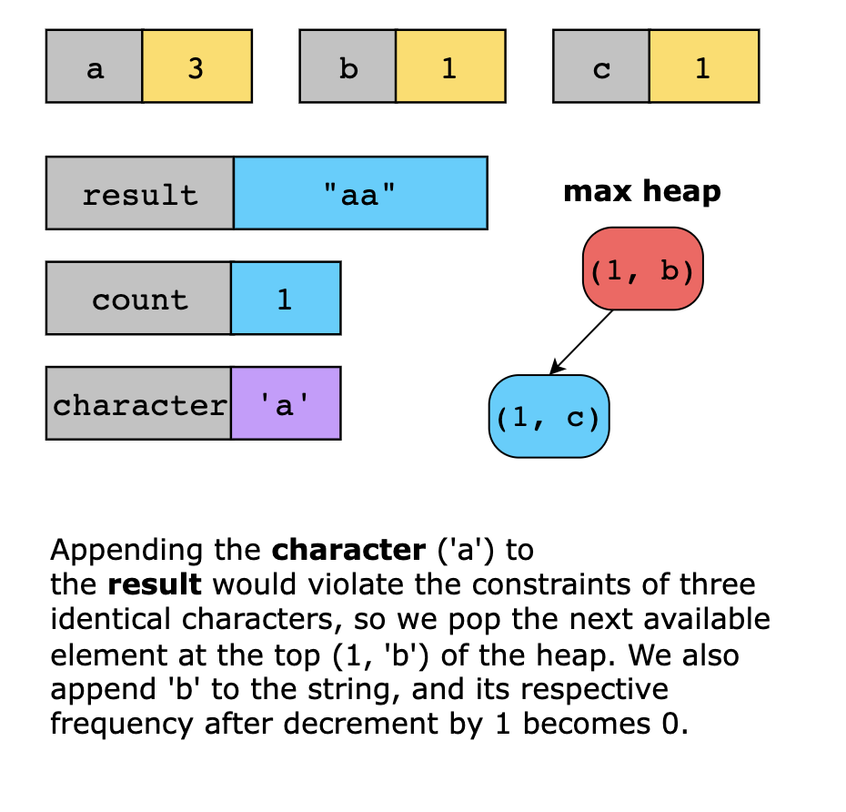

# Longest Happy String

A string is considered happy if it meets the following conditions:

1. It comprises only the characters 'a', 'b', and 'c'.
2. It does not contain the substrings "aaa", "bbb", or "ccc". 
3. The total occurrences of:
   - The character 'a' does not exceed a. 
   - The character 'b' does not exceed b. 
   - The character 'c' does not exceed c.

You are given three integers, a, b, and c, representing the maximum allowable occurrences of 'a', 'b', and 'c', 
respectively. Your task is to return the longest possible happy string. If there are multiple valid longest happy 
strings, return any one of them. If no such string can be formed, return an empty string "".

> Note: A substring is a contiguous sequence of characters within a string.

**Constraints**

- 0 ≤ `a`, `b`, `c` ≤ 100
- a + b + c > 0

## Examples

## Solution

The essence of this solution lies in constructing the longest happy string while adhering to the constraints of avoiding three consecutive identical characters. The approach uses the heaps pattern and prioritizes characters with the highest remaining frequency to maximize the length of the resulting string. A max heap keeps track of the most frequent characters to achieve this. The character with the highest frequency is added to the resulting string at each step, provided it does not violate the constraints. If adding the character would result in three consecutive identical characters, the next most frequent character is selected and added to the resulting string. By carefully managing character counts and maintaining priority with the heap, the solution ensures that valid characters are used to their maximum potential. This process continues until no valid characters can be added, resulting in the longest possible happy string or an empty string if no such string can be formed.

Now, let’s look at the solution steps below:

We initialize a max heap, pq, to store the input frequencies of 'a', 'b', and 'c'. We push the frequencies into pq, where each heap element is a tuple of the frequency and the corresponding character.

We initialize an empty list result to construct the happy string step by step.

We iterate until the heap, pq, is empty and perform the following:

We pop the character with the highest frequency from pq.

We handle repetition constraints by checking if the last two characters in the result are the same as the current character because adding it would violate the rule of avoiding three consecutive identical characters:

In this case, check if another character is available in pq. If yes, pop it, append it to the result, and push it back into pq after decrementing its count.

Push the original character back into the heap to try adding it later.

Otherwise, if adding the current character does not violate the constraints, append it to the result, decrease its count by 1, and push it back into pq if there are remaining occurrences.

Finally, we return the result as the longest happy string.

Note: In Python, strings are immutable, so we construct the result as a list and convert it to a string before returning.

Let’s look at the following illustration to get a better understanding of the solution:

### Time complexity

The solution uses a max heap to select characters based on their frequency. Let’s break it down:

1. Adding up to 3 elements ('a', 'b', 'c') to the heap takes O(log3), which simplifies to O(1).
2. A character is popped from the heap at each step, processed, and potentially pushed back. For a total of k = a + b + c characters, each heap operation takes O(log3) simplifying to O(1), as the heap size is always at most 3. Therefore, the total time for heap operations is O(k⋅1)=O(k).
3. Building the result string by appending characters takes O(k).

Combining these steps, the overall time complexity of the solution is O(k), where k=a+b+c.

### Space complexity

The heap stores at most three elements ('a', 'b', 'c'), requiring O(1) space, and the result string for the output requires O(k) space, where k=a+b+c.

The space required by the result string for the output is not counted in the solution space. Therefore, the overall space complexity is O(1).
