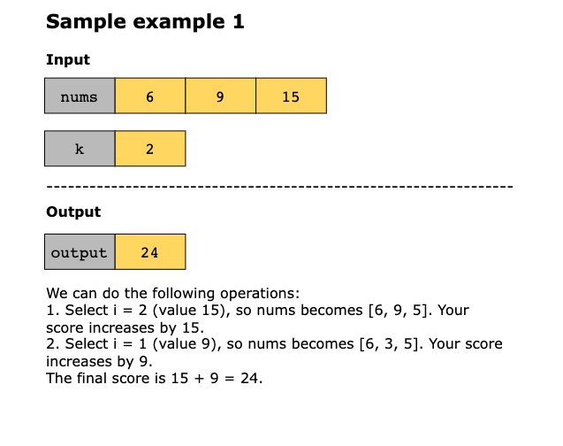
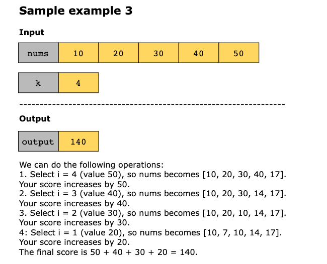
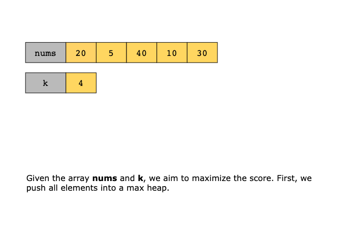
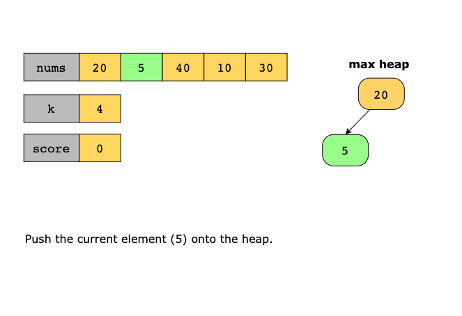
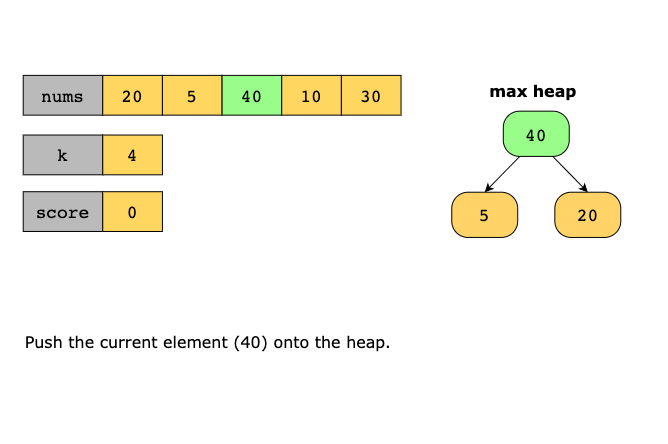
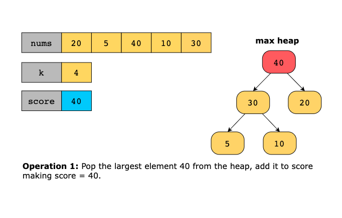
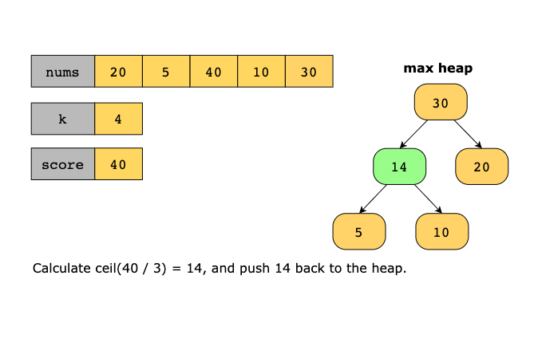
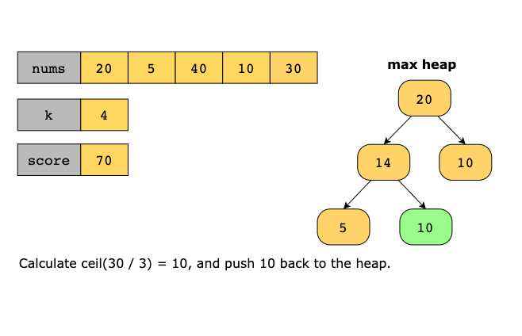
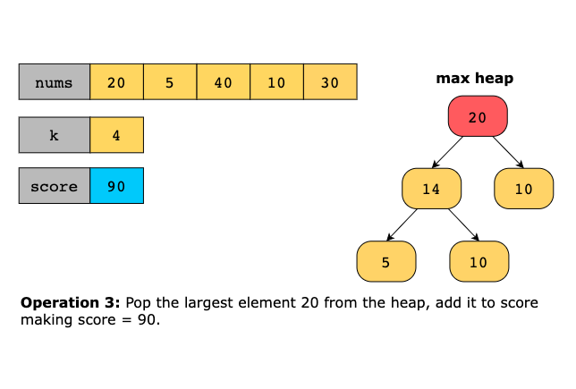
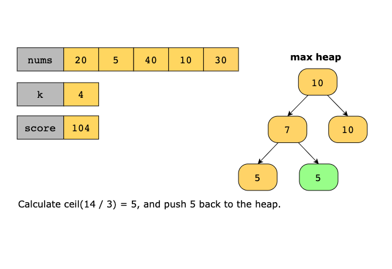

# Maximal Score After Applying K Operations

You are given an array of integers nums and an integer k. You want to perform the following operation exactly k times:

You are given a 0-indexed array of integer nums and an integer k. Your task is to maximize a score through a series of 
operations. Initially, your score is set to 0

In each operation:

1. Select an index i (where 0 ≤ i <nums.length).
2. Add the value of nums[i] to your score.
3. Replace nums[i] with ceil(nums[i] / 3).

Repeat this process exactly k times and return the highest score you can achieve.

> The ceiling function `ceil(value)` is the least integer greater than or equal to `value`.

Constraints:

- 1 ≤ nums.length, k ≤ 10^3
- 1 ≤ nums[i] ≤ 10^5

## Examples

Example 1:

---

## Solution

This algorithm maximizes the score by iteratively selecting and reducing the largest elements from the array. It uses a 
max heap to ensure efficient access to the largest element. Over k iterations, the algorithm repeatedly extracts the 
largest value, adds it to the total score, reduces it by dividing it by 3 and rounding it up, and reinserts the reduced 
value into the heap.

The steps of the algorithm are as follows:

1. Create a max heap to store all elements of nums. 
2. Initialize a variable score to 0 to keep track of the accumulated score. 
3. Iterate for k steps, and in each iteration, perform the following steps:
   - Pop the largest value from the heap using heapq.heappop and store this value in a variable largest. 
   - Add this value to the score. 
   - Calculate the reduced value of the extracted element as math.ceil(largest / 3). 
   - Push the reduced value back into the heap using heapq.heappush to maintain the max heap.
4. After k iterations, return the accumulated score.

Let’s look at the following illustration to get a better understanding of the solution:

### Time Complexity

In each iteration of the loop, pop from the heap takes O(log(n)), while pushing the updated value into the heap also 
takes O(logn). As the loop runs k times, the total time complexity for the loop is O(klogn).

### Space Complexity

The space complexity is O(n) because the heap stores n elements, where n is the number of elements in nums.
