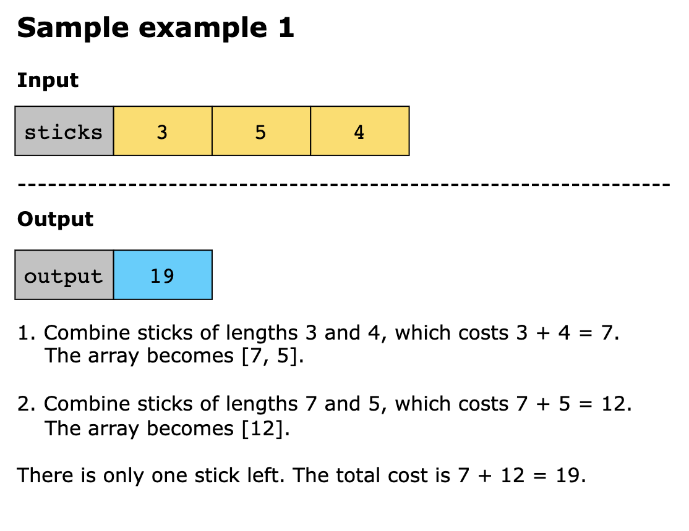
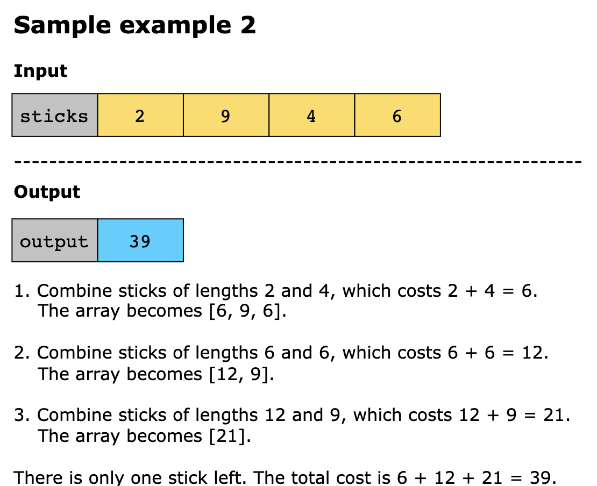
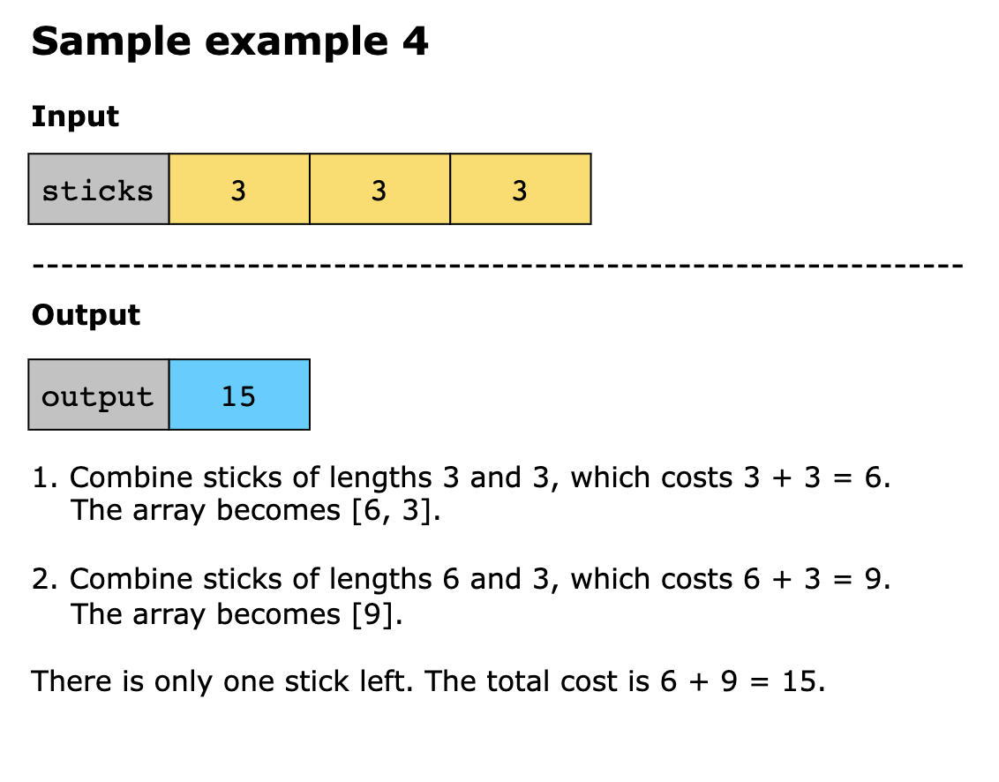

# Minimum Cost to Connect Sticks

You are given a set of sticks with positive integer lengths represented as an array, sticks, where sticks[i] denotes the
length of the ith stick.

You can connect any two sticks into one stick at a cost equal to the sum of their lengths. Once two sticks are combined, 
they form a new stick whose length is the sum of the two original sticks. This process continues until there is only one
stick remaining.

Your task is to determine the minimum cost required to connect all the sticks into a single stick.

Constraints:

- 1 ≤ sticks.length ≤ 10^3
- 1 ≤ sticks[i] ≤ 10^3

## Examples

