# Schedule Tasks on Minimum Machines

We are given an input array, tasks, where tasks[i]=[starti ,endi] represents the start and end times of n tasks. Our
goal is to schedule these tasks on machines given the following criteria:

- A machine can execute only one task at a time. 
- A machine can begin executing a new task immediately after completing the previous one. 
- An unlimited number of machines are available.

Find the minimum number of machines required to complete these n tasks.

## Constraints

- n == `tasks.length`
- 1 <= `tasks.length` <= 10^3
- 0 <= `tasks[i].start` < `tasks[i].end` <= 10^4

## Examples

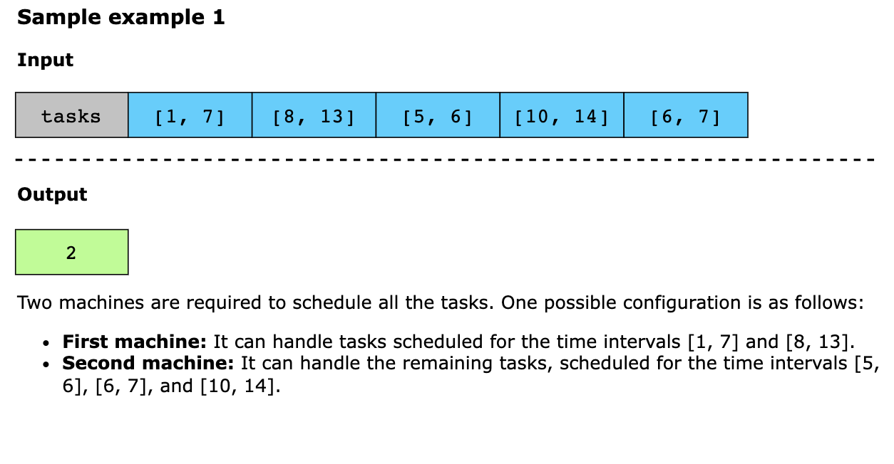

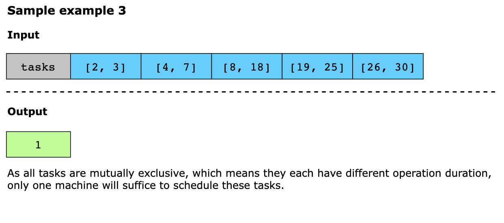
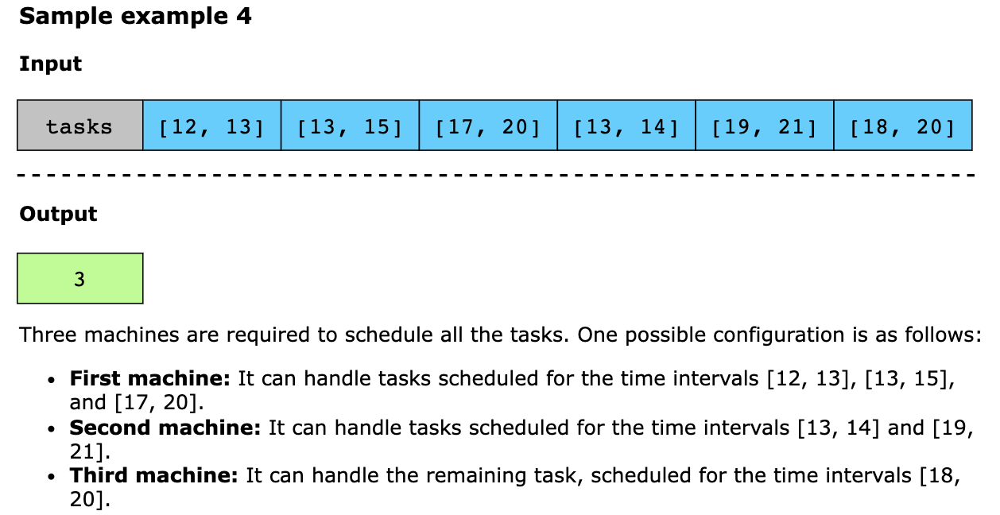

## Solution

The core intuition for solving this problem is to allocate tasks to the minimum number of machines by reusing machines 
whenever possible. The algorithm efficiently manages machine availability by sorting tasks by their start times and using
a min heap to track end times. If the earliest available machine (top of the heap) finishes before or as a task starts,
it is reused and removed from the heap. Otherwise, a new machine is allocated, and the current task’s end time is pushed
into the heap. The heap size at the end represents the minimum number of machines required.

Using the intuition above, we implement the algorithm as follows:

1. Sort the tasks array by the start time of each task to process them in chronological order. 
2. Initialize a min heap (machines) to keep track of the end times of tasks currently using machines. 
3. Iterate over each task in the sorted tasks array. 
   - Extract the start and end times of the current task. 
   - Check if the machine with the earliest finish time is free, i.e., top of machines is less than or equal to the
     current task’s start time. If it is, remove it from the heap, as the machine can be reused. 
   - Push the end time of the current task into the heap, indicating that a machine is now in use until that time. 
4. After processing all tasks, return the size of the heap, which represents the minimum number of machines required.

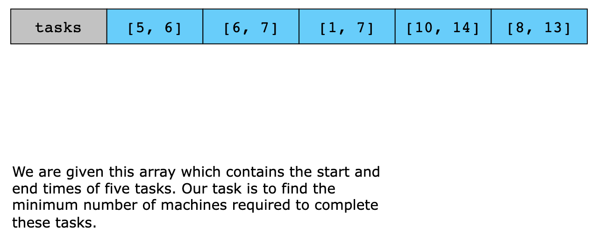
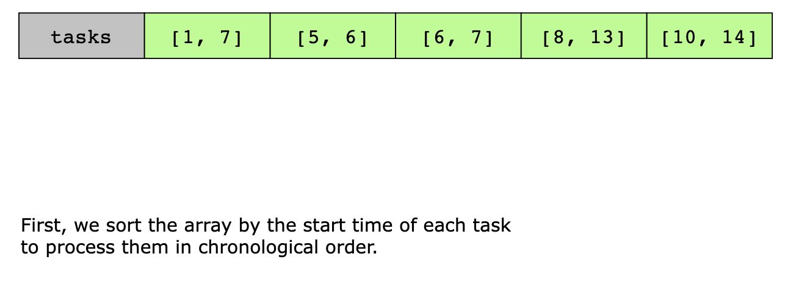
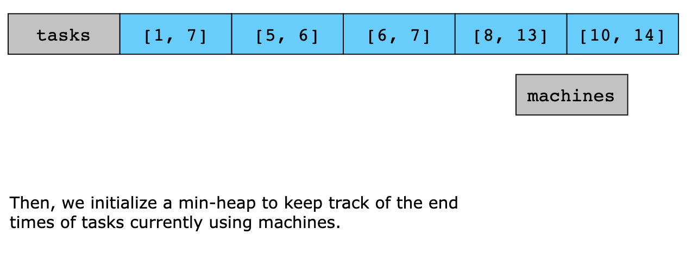
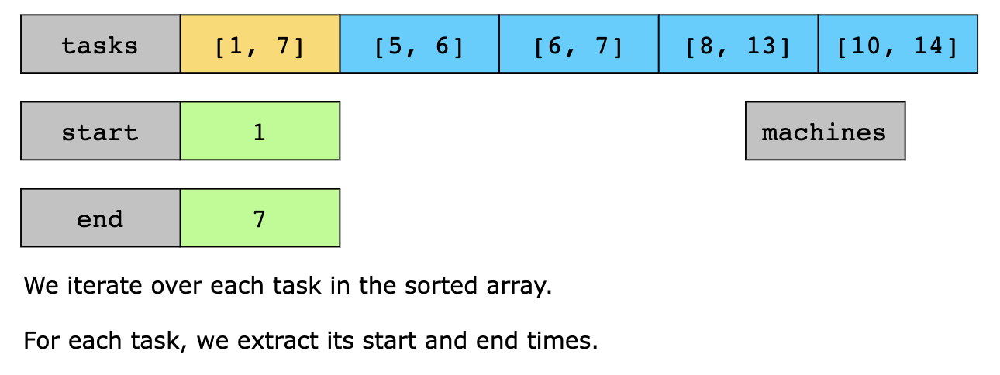
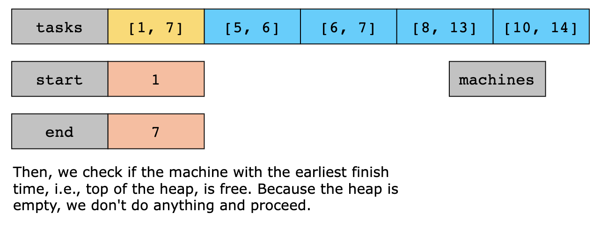
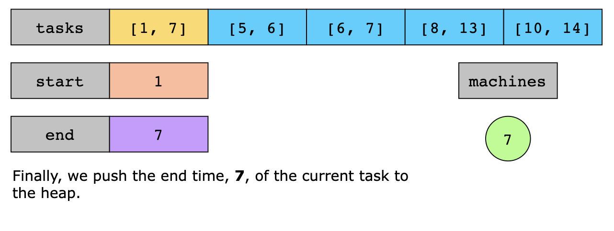
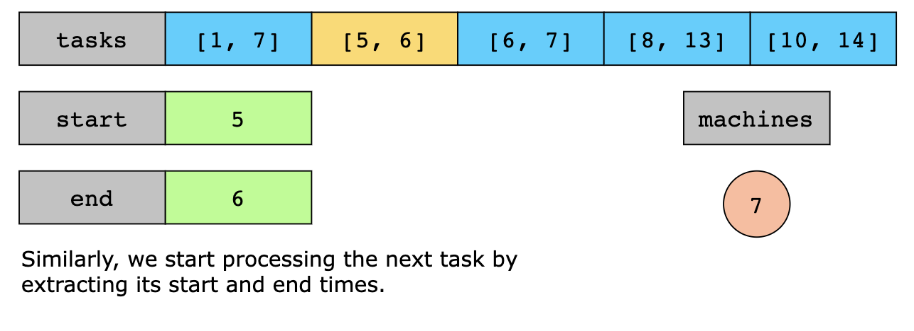
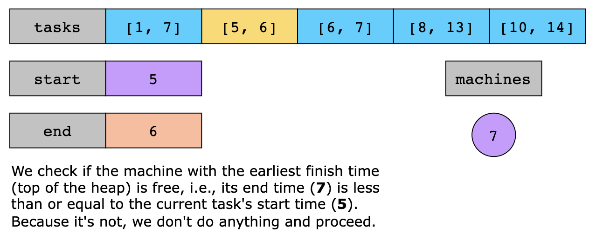
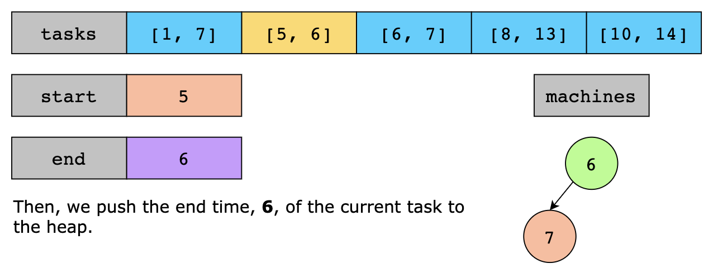
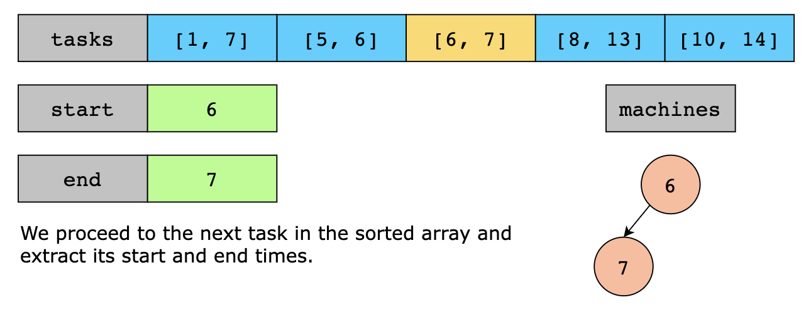
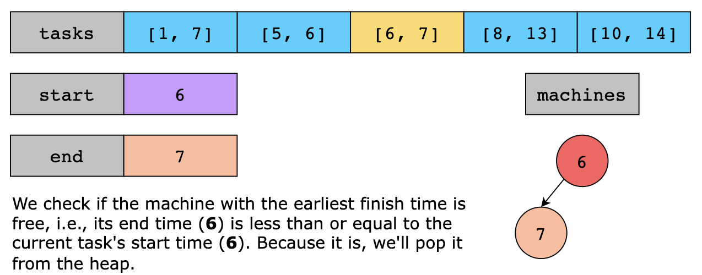
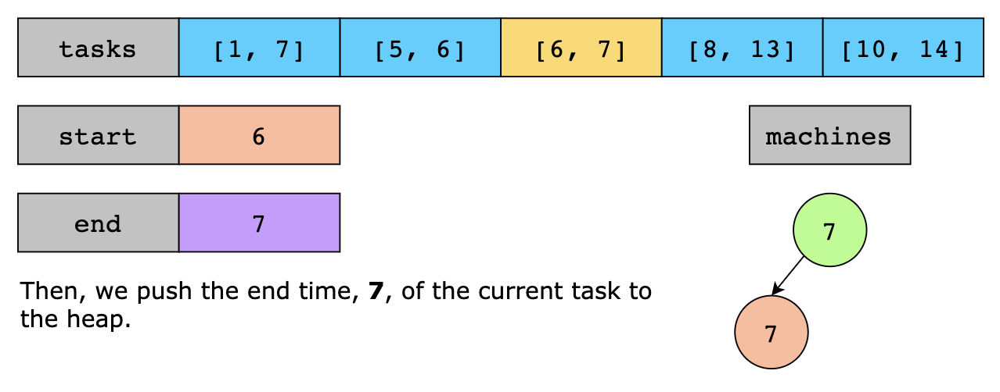
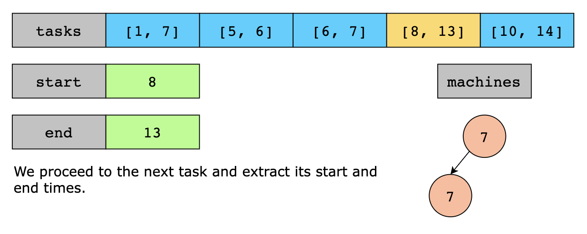
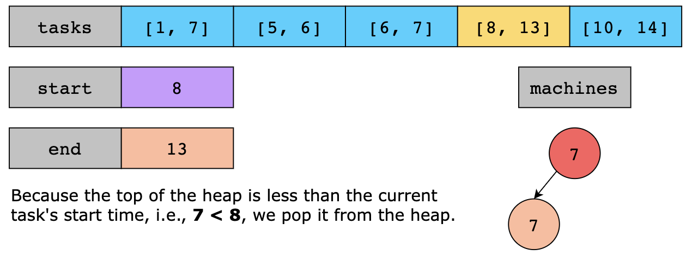
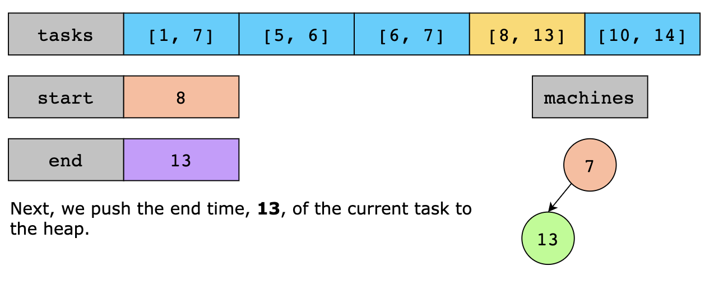
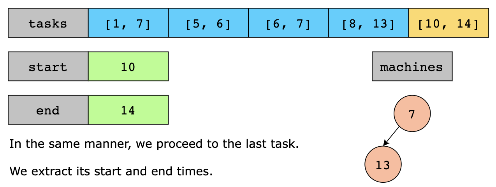

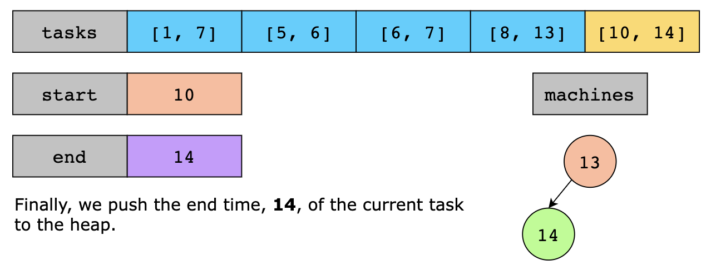
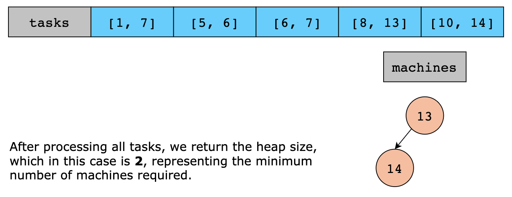

### Time Complexity

The time complexity of the above algorithm is O(nlogn), where n is the number of tasks represented by the length of the
tasks array. This is because:

- Sorting the array takes O(nlogn). 
- The total cost for heap operations is O(nlogn) because we process n tasks, and each operation on the min-heap has a
  time complexity of O(logn).

Therefore, the overall time complexity is O(nlogn).

### Space Complexity

The algorithm’s space complexity is O(n) because the min heap can grow up to a maximum size of n if every task requires
a separate machine.
