# K Closest Points to Origin

Given a list of points in the form [[x1, y1], [x2, y2], ... [xn, yn]] and an integer k, find the k closest points to the
origin (0, 0) on the 2D plane.

The distance between two points (x, y) and (a, b) is calculated using the formula:

√(x1 - a2)2 + (y1 - b2)2

Return the k closest points in any order.

## Examples

```text
Input:

points = [[3,4],[2,2],[1,1],[0,0],[5,5]]
k = 3

Output:
[[2,2],[1,1],[0,0]]

Also Valid:

[[2,2],[0,0],[1,1]]
[[1,1],[0,0],[2,2]]
[[1,1],[2,2],[0,0]]
...
[[0,0],[1,1],[2,2]]
```

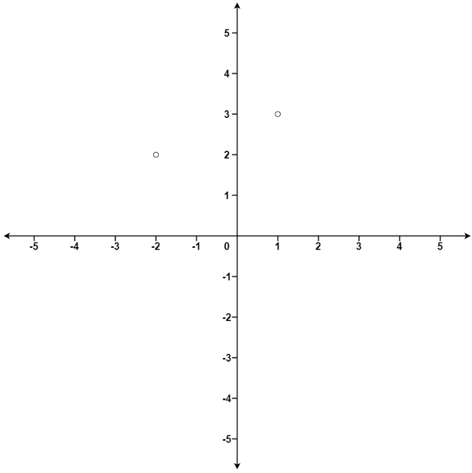

```text
Input: points = [[3,3],[5,-1],[-2,4]], k = 2
Output: [[3,3],[-2,4]]
Explanation: The answer [[-2,4],[3,3]] would also be accepted.
```

```text
Input: points = [[1,3],[-2,2]], k = 1
Output: [[-2,2]]

Explanation:
The distance between (1, 3) and the origin is sqrt(10).
The distance between (-2, 2) and the origin is sqrt(8).
Since sqrt(8) < sqrt(10), (-2, 2) is closer to the origin.
We only want the closest k = 1 points from the origin, so the answer is just [[-2,2]].
```

## Solution

- [Approach 1](#approach-1-sorting)
- [Approach 2](#approach-2-max-heap)

### Approach 1: Sorting

The simplest approach is to sort calculate the distance of each point from the origin and sort the points based on their
distance. This approach has a time complexity of O(n log n) where n is the number of points in the array, and a space
complexity of O(n) (to store the sorted array of distances).

### Approach 2: Max Heap

This problem can be solved using a similar approach to the one used to solve [Kth Largest Element in an Array](../topklargest/README.md). The key
difference is that we need to store the k closest points to the origin, rather than the k largest elements. Since we are
looking for the k smallest elements, we need a max-heap, rather than a min-heap.

By default, python's heapq module implements a min-heap, but we can make it behave like a max-heap by negating the values
of everything we push onto it.

We add the first k points to the heap by pushing a tuple containing the negative of the distance from the origin, and the
index of the point. After that is finished, our heap contains the k closest points to the origin that we've seen so far,
with the point furthest from the origin at the root of the heap.

For each point after the first k, we calculate the distance from the origin and compare it with the root of the heap. If
the current point is closer to the origin than the root of the heap, we pop the root and push the current point into the
heap. This way, the heap will always contain the k closest points to the origin we've seen so far.

At the end of the iteration, the heap will contain the k closest points to the origin. We can iterate over each point in
the heap and return the point associated with each tuple.

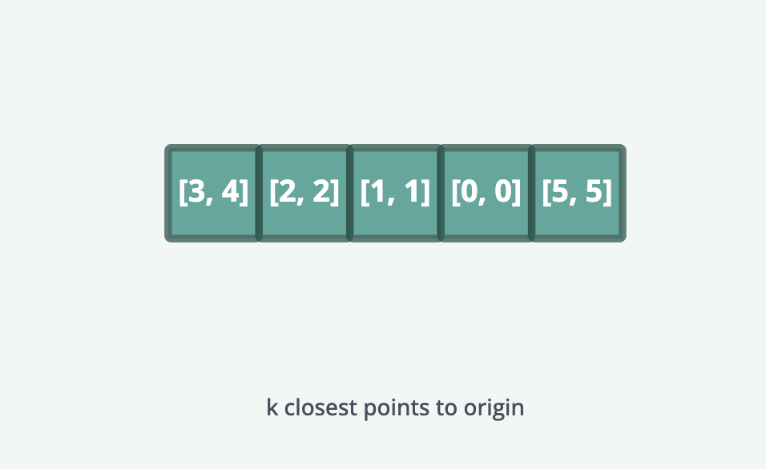
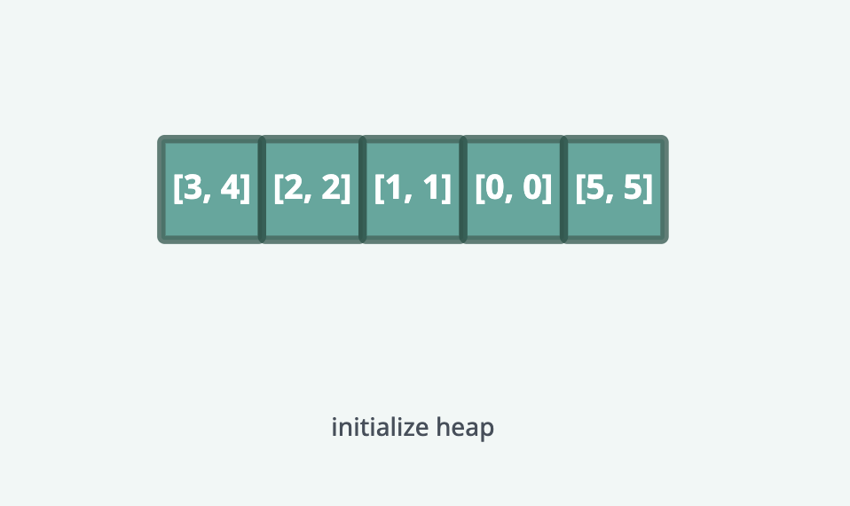
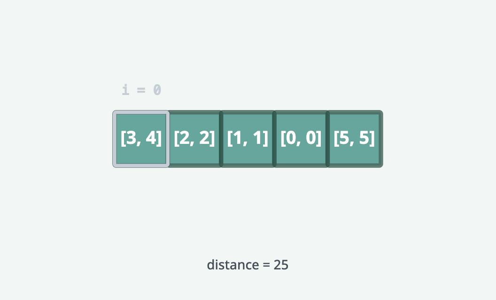
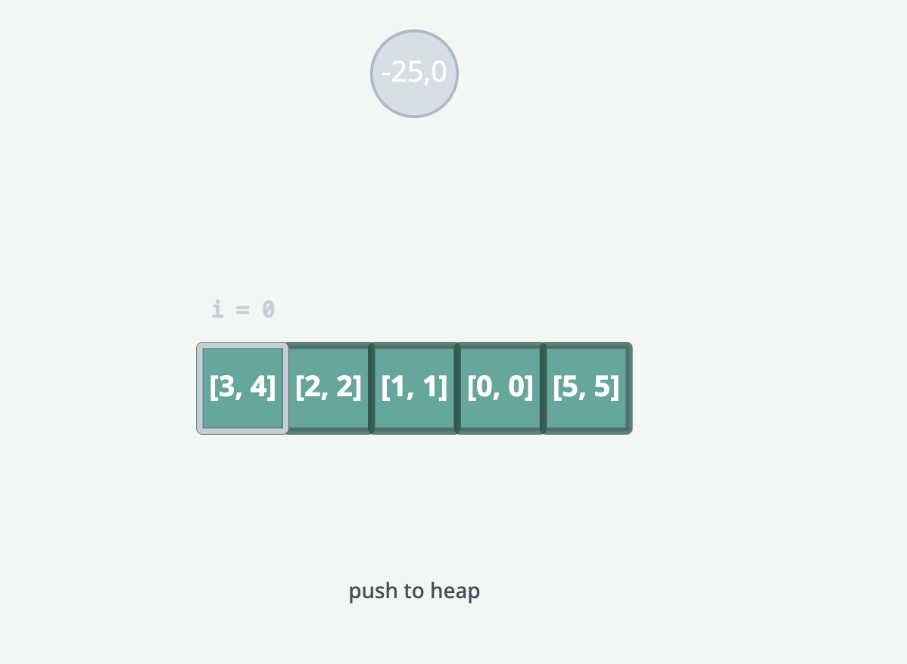
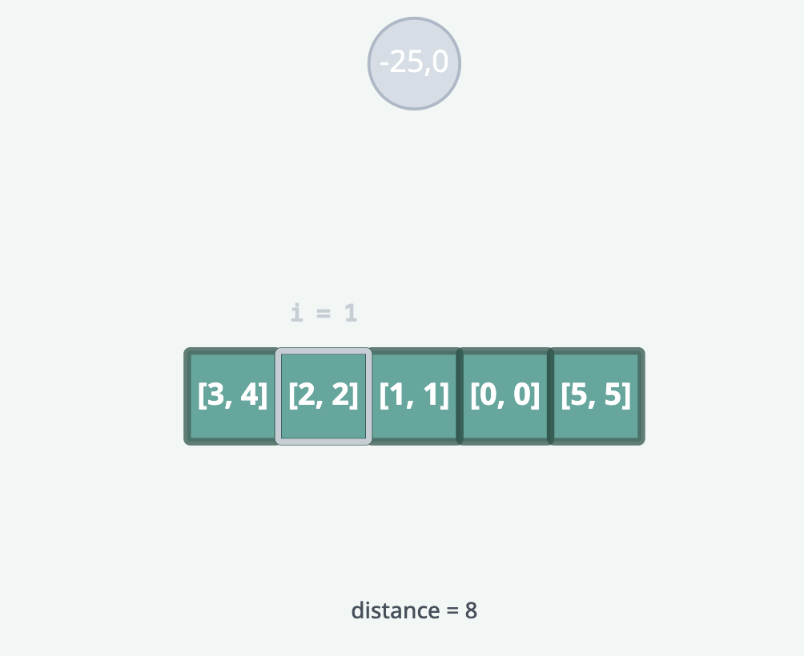
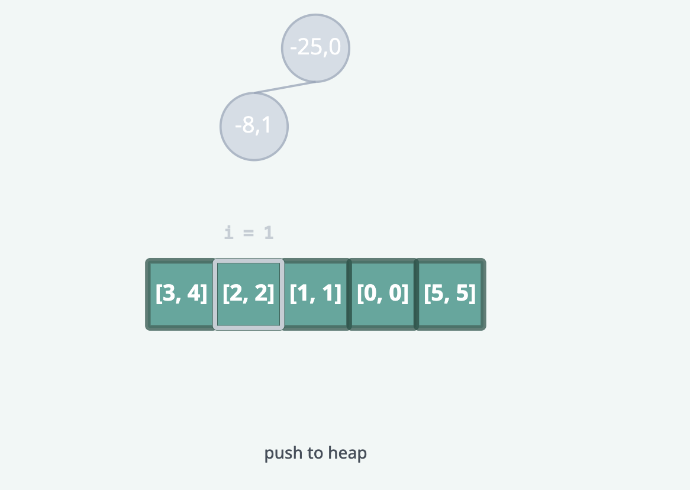
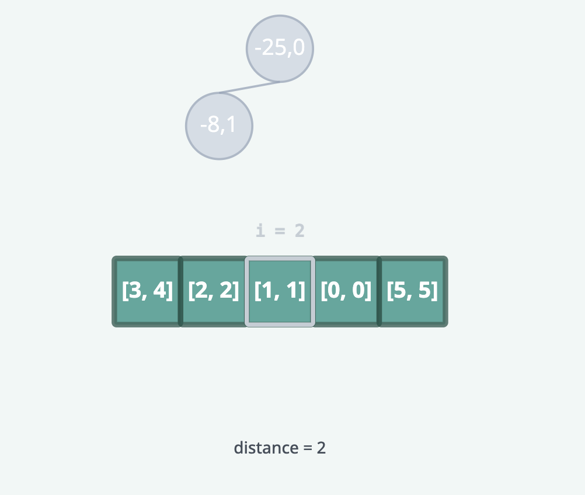

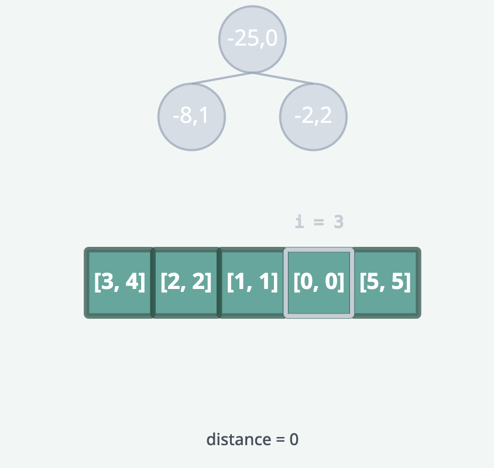
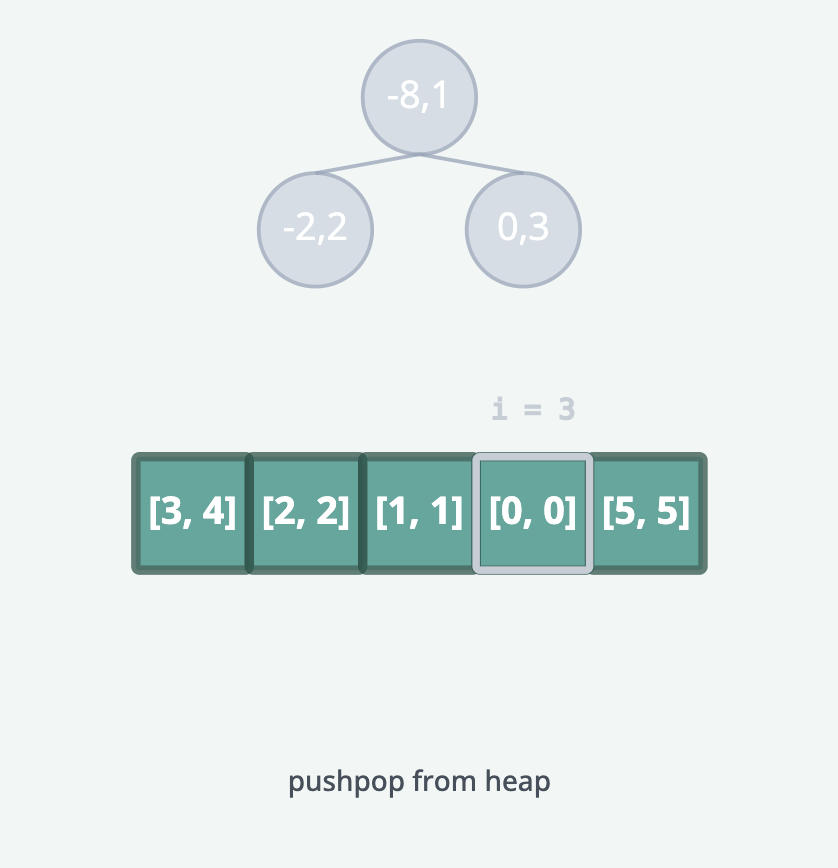
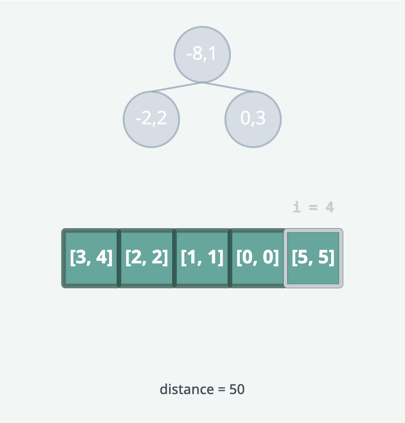
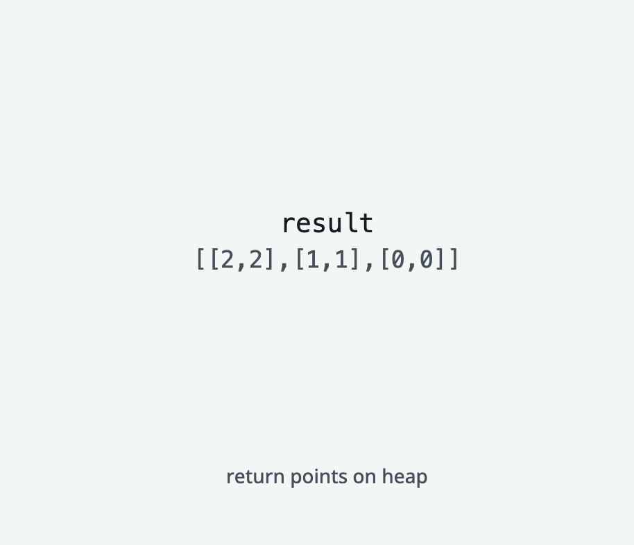

#### Complexity Analysis

##### Time Complexity: O(n log k)

Where n is the number of points in the array and k is the input parameter. We iterate over
all points, and in the worst case, we both push and pop each point from the heap, which takes O(log k) time per point.

##### Space Complexity: O(k)

Where k is the input parameter. The space is used by the heap to store the k closest points to the origin.
