# Top-K Largest Elements in an Array

Given an integer array nums, return the 3 largest elements in the array in any order.

## Example

```text
Input: nums = [9, 3, 7, 1, -2, 6, 8]
Output: [8, 7, 9]
# or [7, 9, 8] or [9, 7, 8] ...
```

## Solution

Here's how we can solve this problem using a min-heap:

- Create a min-heap that stores the first 3 elements of the array. These represent the 3 largest elements we have seen so 
  far, with the smallest of the 3 at the root of the heap.
  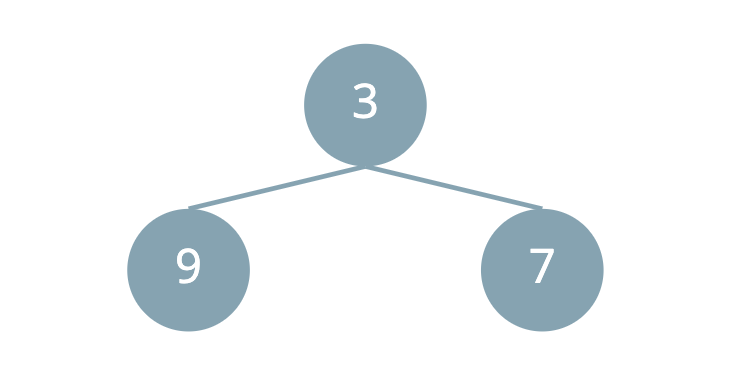

- Iterate through the remaining elements in the array.
  - If the current element is larger than the root of the heap, pop the root and push the current element into the heap.
  - Otherwise, continue to the next element.
  
  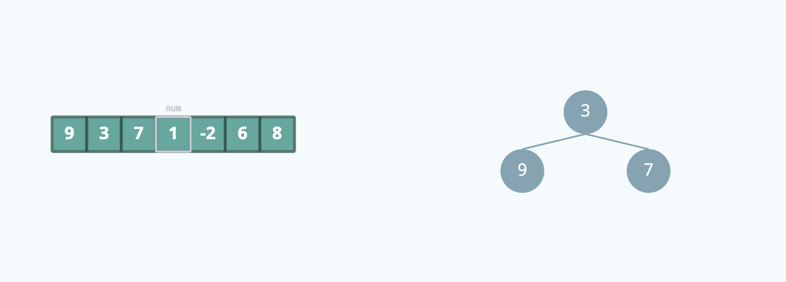
  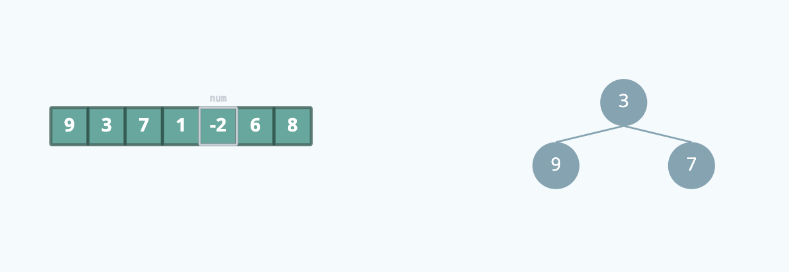
  
  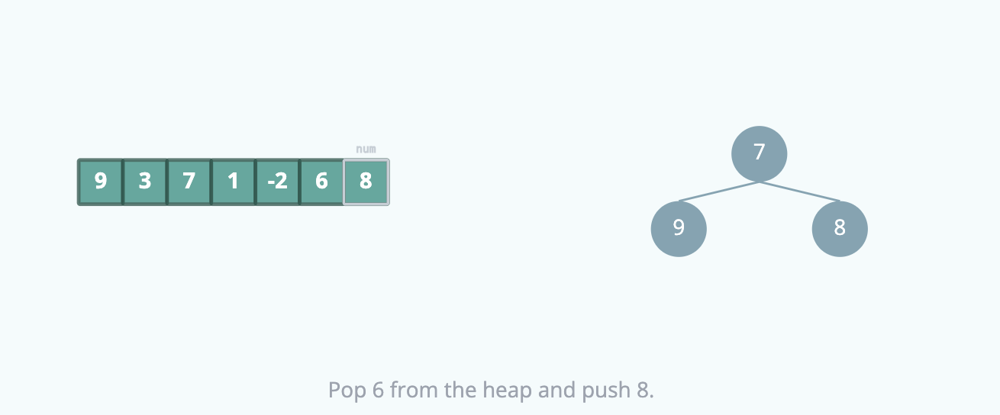

After iterating through all the elements, the heap contains the 3 largest elements in the array.

### Complexity Analysis

#### Time Complexity Breakdown

- The heapify function takes O(3) = O(1) time
- We iterate through all elements in the array once: O(n) time
- The heappop and heappush operations take O(log 3) = O(1) time each

#### Space Complexity

- We use a heap of size 3 to store the 3 largest elements: O(3) = O(1) space 
- The algorithm uses constant space regardless of input size

Note: The time and space complexity become more interesting when 3 is a variable number k.

---

# Kth Largest Element in an Array

Write a function that takes an array of unsorted integers nums and an integer k, and returns the kth largest element in
the array. This function should run in O(n log k) time, where n is the length of the array.

## Examples

```text
Input:
nums = [5, 3, 2, 1, 4]
k = 2

Output: 4
```

## Solutions

- [Approach 1](#approach-1-sorting)
- [Approach 2](#approach-2-min-heap)

### Approach 1: Sorting

The simplest approach is to sort the array in descending order and return the kth element. This approach has a time 
complexity of O(n log n) where n is the number of elements in the array, and a space complexity of O(1).

### Approach 2: Min Heap

By using a min-heap, we can reduce the time complexity to O(n log k), where n is the number of elements in the array and
k is the value of k.
The idea behind this solution is to iterate over the elements in the array while storing the k largest elements we've
seen so far in a min-heap. At each element, we check if it is greater than the smallest element (the root) of the heap.
If it is, we pop the smallest element from the heap and push the current element into the heap. This way, the heap will
always contain the k largest elements we've seen so far.
After iterating over all the elements, the root of the heap will be the kth largest element in the array.

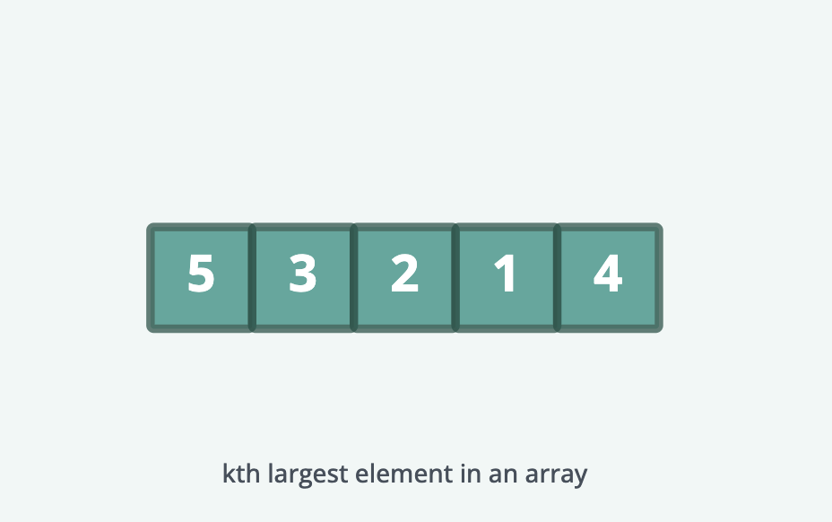
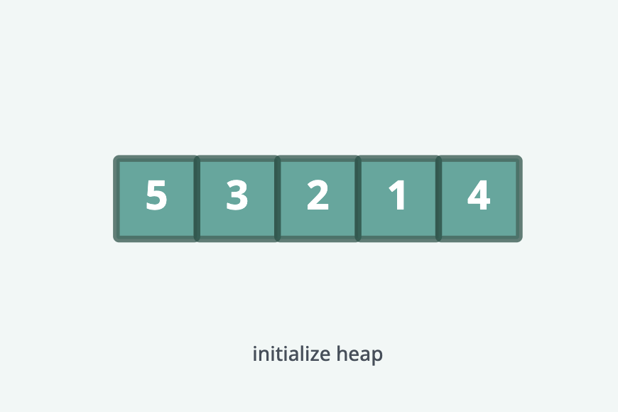
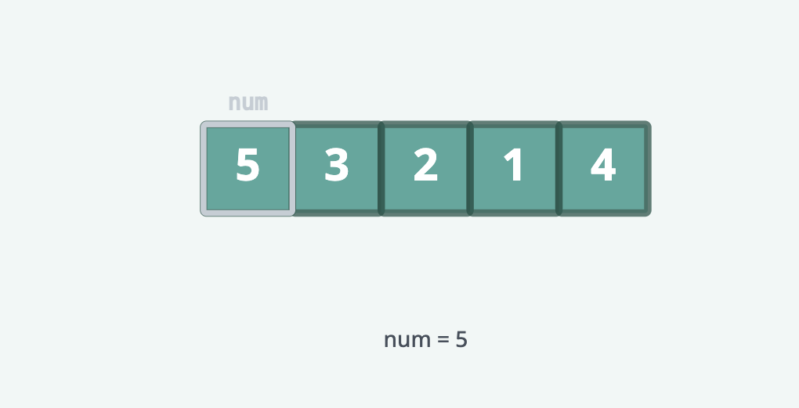
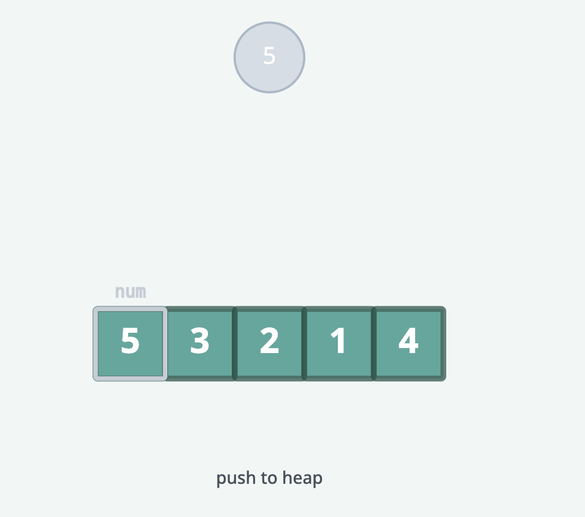
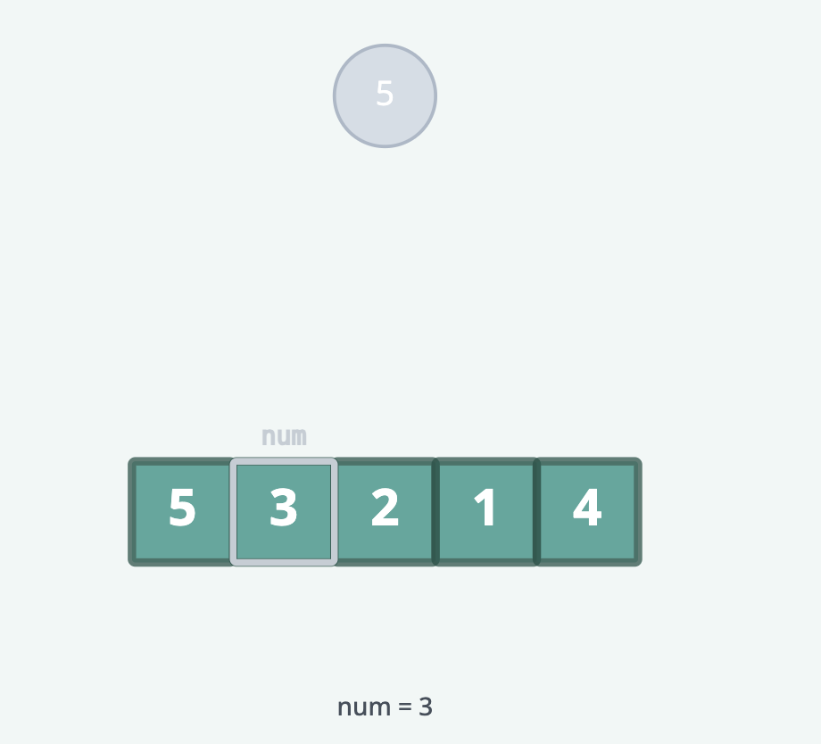
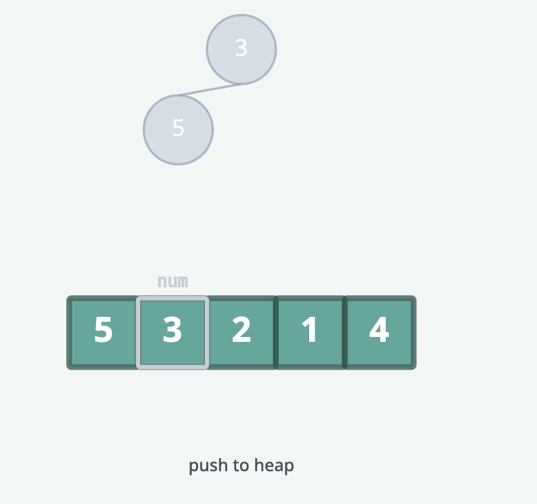
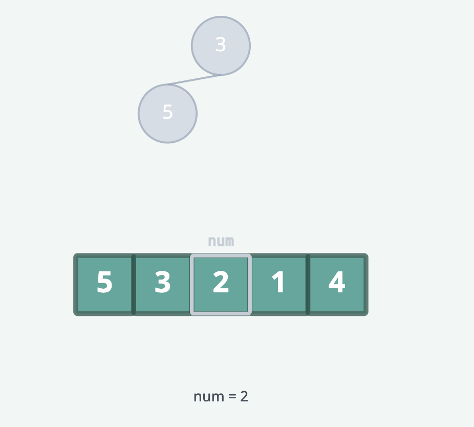
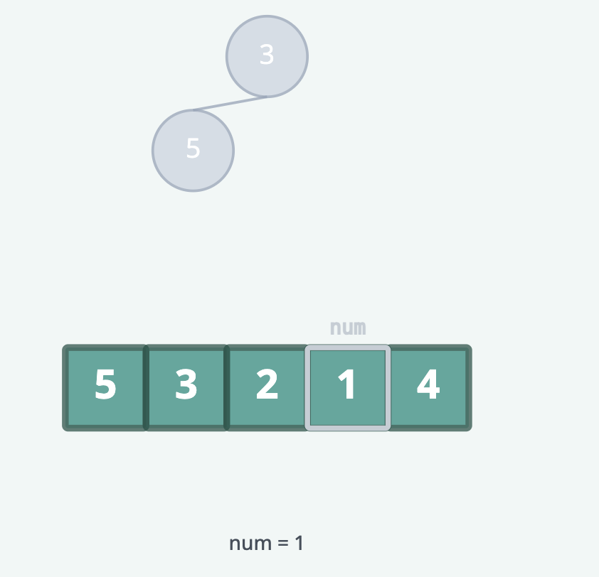
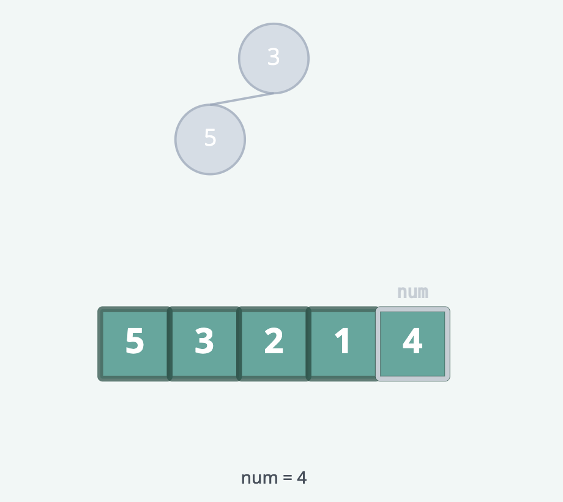
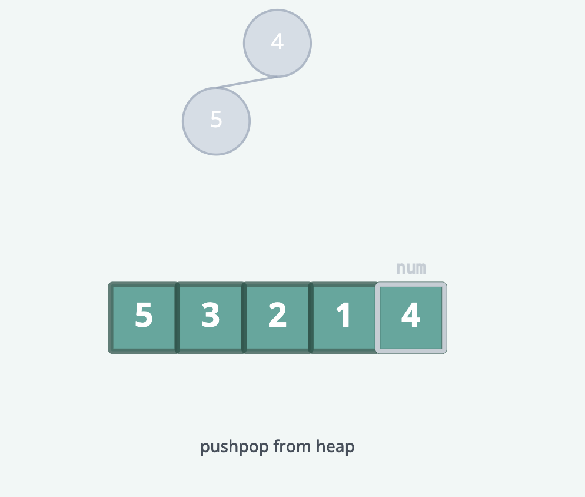
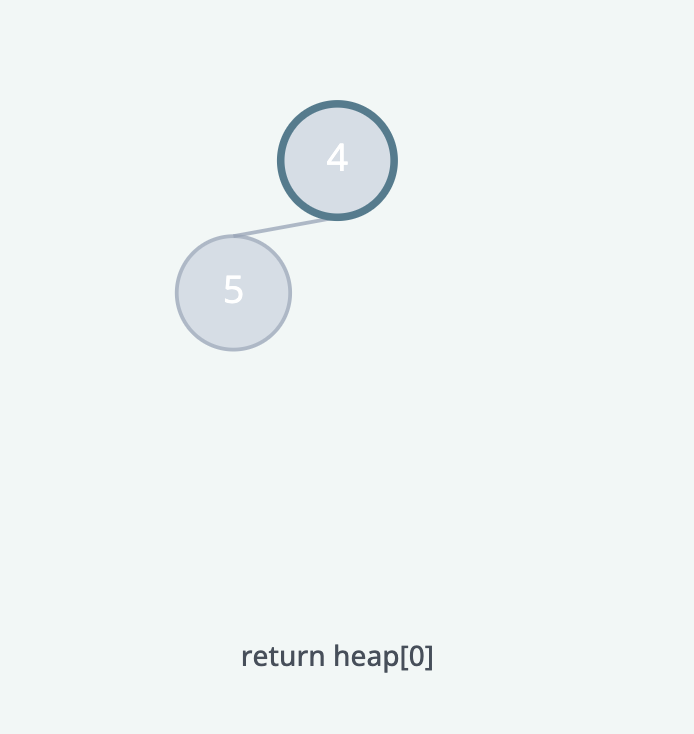

#### Complexity Analysis

##### Time Complexity: O(n log k)

Where n is the number of elements in the array and k is the input parameter. We iterate over
all elements, and in the worst case, we both push and pop each element from the heap, which takes O(log k) time per
element.

##### Space Complexity: O(k)

Where k is the input parameter. The space is used by the heap to store the k largest elements.
