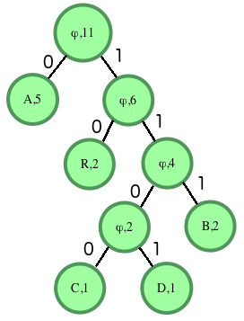

Huffman coding assigns variable length codewords to fixed length input characters based on their frequencies. More
frequent characters are assigned shorter codewords and less frequent characters are assigned longer codewords. All edges
along the path to a character contain a code digit. If they are on the left side of the tree, they will be a 0 (zero).
If on the right, they'll be a 1 (one). Only the leaves will contain a letter and its frequency count. All other nodes
will contain a null instead of a character, and the count of the frequency of all of it and its descendant characters.

For instance, consider the string ABRACADABRA. There are a total of 11 characters in the string. This number should
match the count in the ultimately determined root of the tree. Our frequencies are A=5, B = 2, R = 2, C = 1 and D = 1.
The two smallest frequencies are for C and D, both equal to 1, so we'll create a tree with them. The root node will
contain the sum of the counts of its descendants, in this case 1+1 = 2. The left node will be the first character
encountered, C, and the right will contain D. Next we have 3 items with a character count of 2: the tree we just
created, the character B and the character R. The tree came first, so it will go on the left of our new root node. B
will go on the right. Repeat until the tree is complete, then fill in the 1's and 0's for the edges. The finished graph
looks like:

Input characters are only present in the leaves. Internal nodes have a character value of ϕ (NULL). We can determine
that our values for characters are:

A - 0 B - 111 C - 1100 D - 1101 R - 10 Our Huffman encoded string is:

A B R A C A D A B R A 0 111 10 0 1100 0 1101 0 111 10 0 or 01111001100011010111100 To avoid ambiguity, Huffman encoding
is a prefix free encoding technique. No codeword appears as a prefix of any other codeword.

To decode the encoded string, follow the zeros and ones to a leaf and return the character there.

You are given pointer to the root of the Huffman tree and a binary coded string to decode. You need to print the decoded
string.