# Car Pooling

You are given a car with a fixed number of seats, denoted by an integer capacity. The car only travels in one direction 
— eastward — and does not make any U-turns.

You are also provided with an array, trips, where each element trips[i]= [numPassengersi, fromi, toi] represents a group of 
numPassengersi that must be picked up at location fromi and dropped off at location toi . All locations are measured in 
kilometers east of the starting point.

Your task is to determine whether it is possible to complete all the trips without exceeding the car’s capacity at any
point in time.

Return TRUE if all trips can be completed successfully, or FALSE otherwise.

## Constraints

- 1 <= `trips.length` <= 1000
- `trips[i].length` == 3
- 1 <= `numPassengers` <= 1000
- 0 <= fromi < toi <= 1000
- 1 <= `capacity` <= 10^5

## Examples

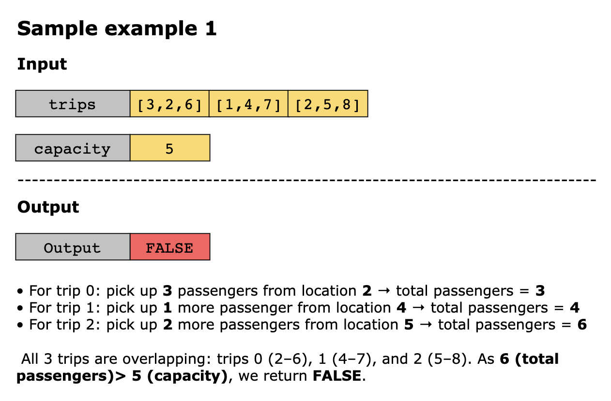
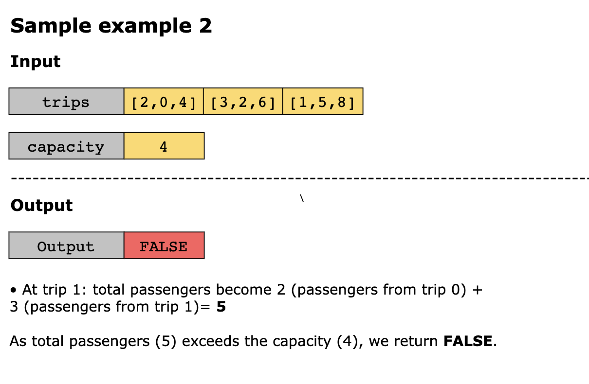
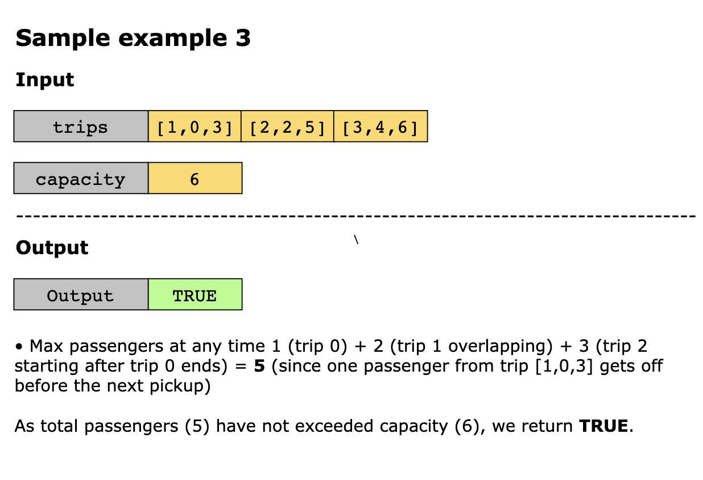

## Solution

The core intuition behind this solution is to simulate the journey of the car using a timeline, tracking when passengers
get in and get out. This approach aligns with the merge intervals pattern, where we focus on events happening at specific
points in time, rather than handling each trip separately in isolation. The idea is to accumulate and monitor the number
of passengers in the car at any moment using a difference array (also known as a prefix sum technique).

In the context of this problem, each trip defines a passenger change over a specific interval — passengers are picked up
at from and dropped off at to. Instead of iterating over the entire interval (which is inefficient), we can track just
the start and end of the interval using a fixed-size timeline array.

This strategy is built on two key observations:

1. Each trip contributes a net passenger change at exactly two locations:
   - Increase at the pickup location (from)
   - Decrease at the drop-off location (to)

2. The car’s capacity must never be exceeded at any point on the journey, so we monitor the cumulative passenger count
   as we move forward in time.

This strategy leverages the difference array pattern, which is a version of merge intervals. Rather than merging 
overlapping intervals explicitly, it simulates all trips together via a timeline of passenger changes.

Let’s break down the steps:

1. A list timestamp of size 1001 (based on constraints) is created to track changes in passenger counts at each kilometer
   point.
2. For each trip `[numPassengersi ,fromi, toi]` in trips:
   - Add numPassengers at `timestamp[fromi]`
   - Subtract numPassengers at `timestamp[toi]`

   This marks the start and end of each passenger interval without iterating over the full range.

3. To simulate the trip and track capacity, initialize a variable used_capacity = 0. 
4. Iterate through the timestamp list, adding the passenger changes at each point. If at any point used_capacity > capacity,
   return FALSE immediately— the car is overloaded. 
5. If the full timeline is processed without exceeding capacity, return TRUE, indicating that all trips can be accommodated.

Let’s look at the following illustration to get a better understanding of the solution:

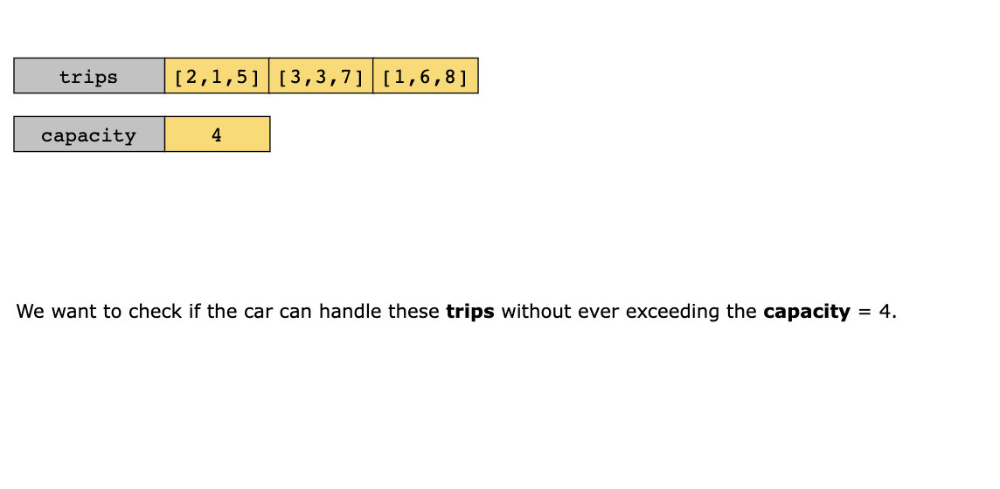
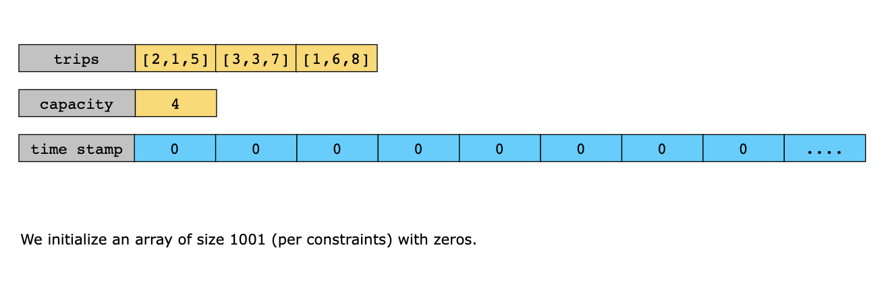
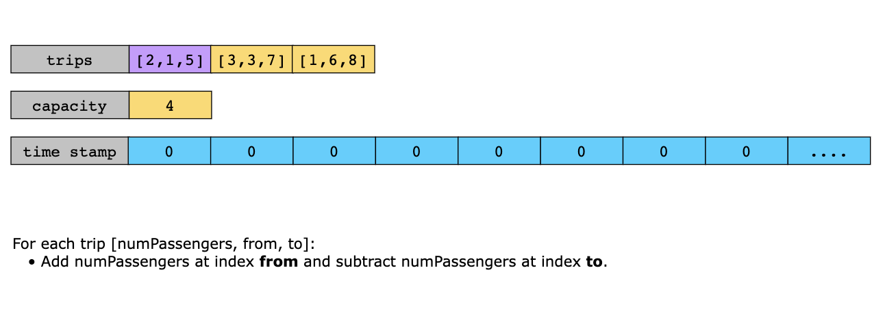
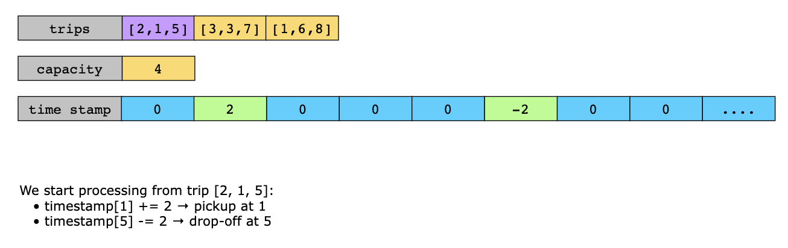
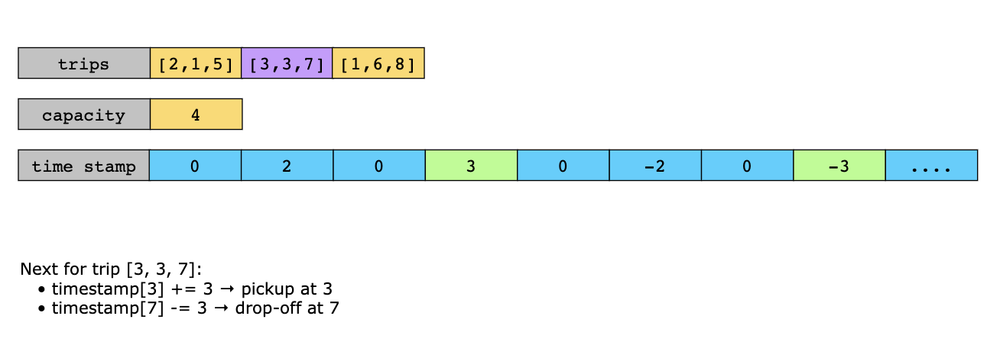
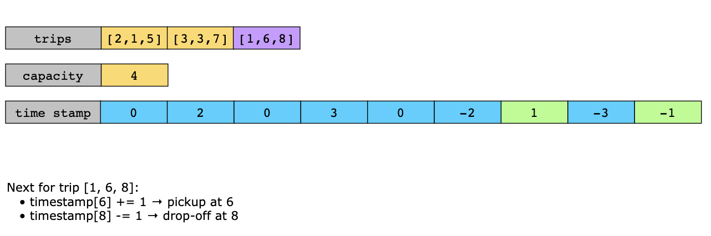
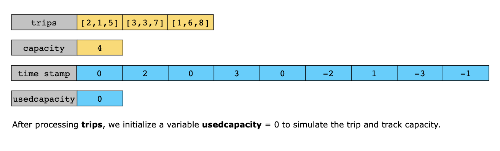

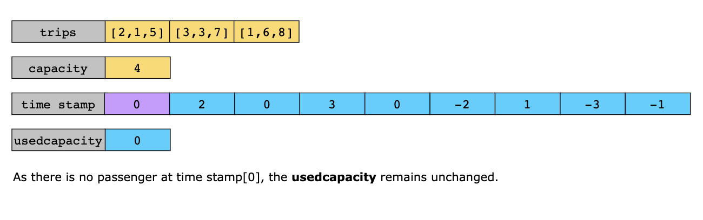
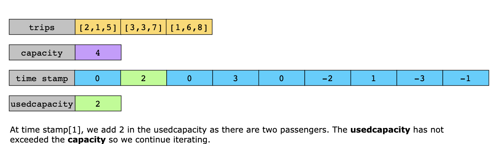
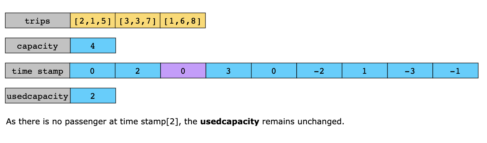
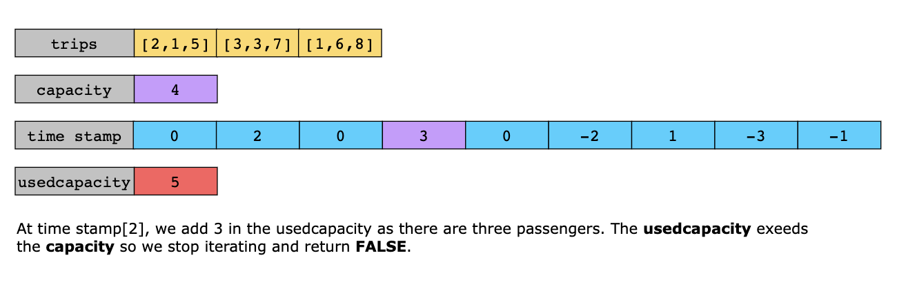

### Time Complexity

The overall time complexity of the solution is O(n) because:

- The trips list is scanned once to record passenger changes at pickup and drop-off points.
- Each trip results in two constant-time operations: one increment and one decrement in the timeline array. 
- The timestamp array (of fixed length 1001) is traversed once to simulate the journey and check capacity constraints.

As the length of timestamp is constant and independent of input size, it contributes O(1) time. So, the total operations 
scale linearly with the number of trips.

### Space Complexity

The space complexity of the solution is O(1) because a fixed-size array timestamp of length 1001 is used regardless of 
the input size.
