# Count Days Without Meetings

You are given a positive integer, `days`, which represents the total number of days an employee is available for work, 
starting from day 1. You are also given a 2D array, `meetings`, where each entry meetings[i] = [starti, endi] indicates 
that a meeting is scheduled from day starti to day endi (both inclusive).

Your task is to count the days when the employee is available for work but has no scheduled meetings.

> Note: The meetings may overlap.

## Constraints

- 1 <= days <= 10^5
- 1 <= meetings.length <= 10^3
- meetings[i].length == 2
- 1 <= `meetings[i][0]` <= `meetings[i][1]` <= days

## Examples

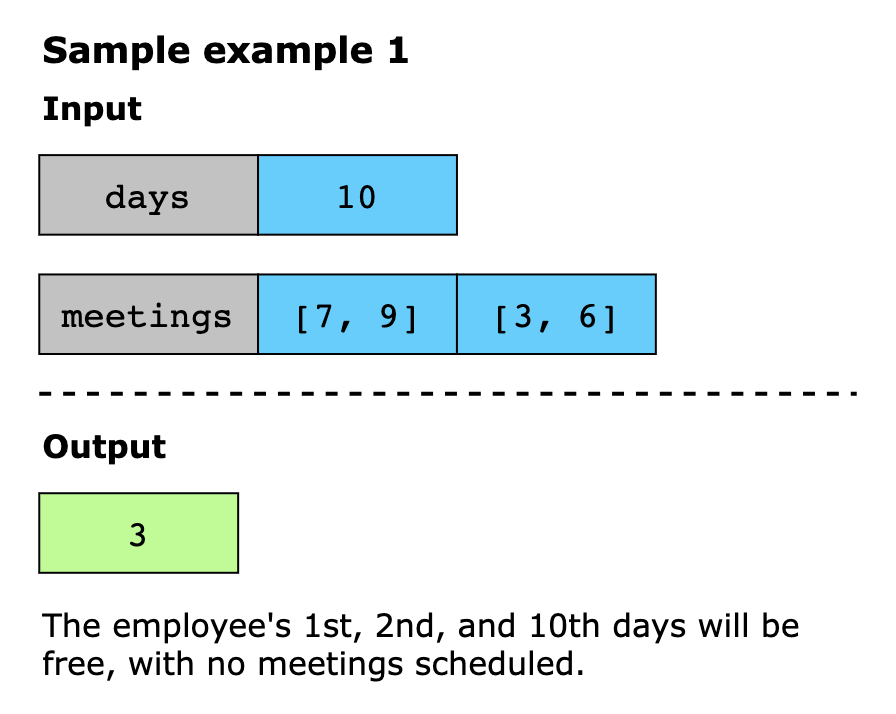
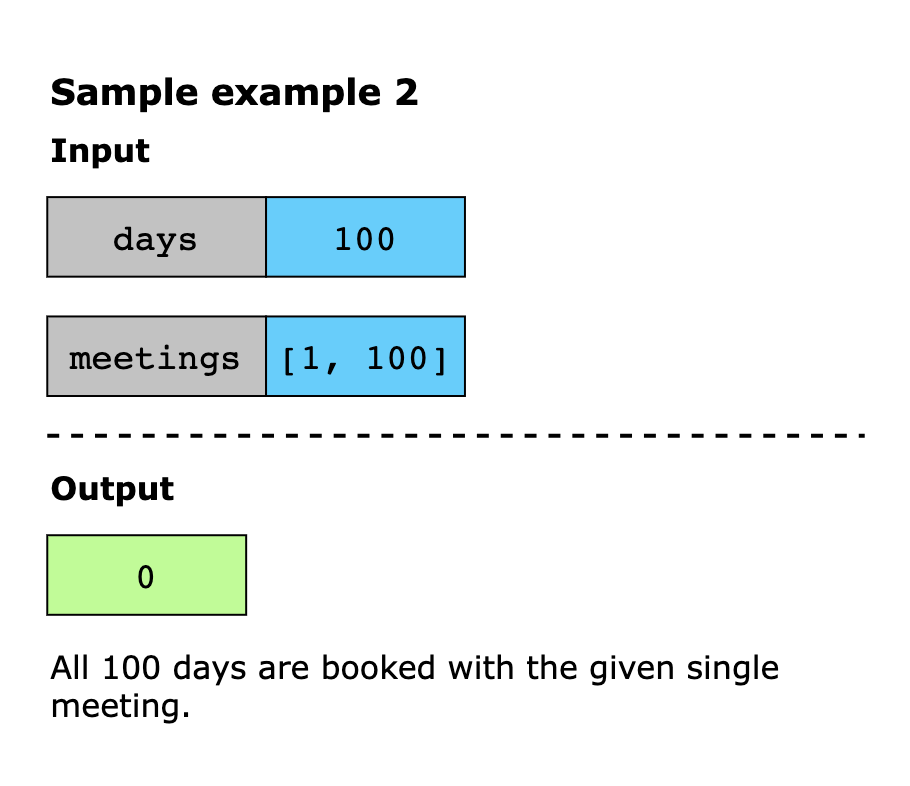
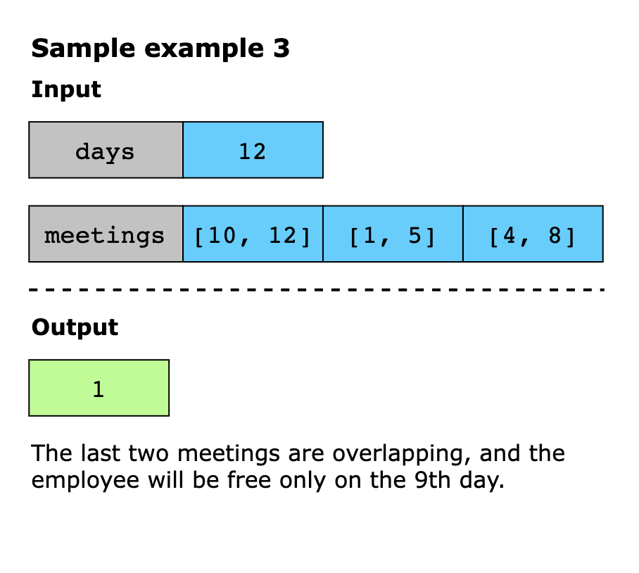

## Solution

The core idea of this solution is to merge overlapping meetings into continuous intervals to efficiently track the 
occupied days. We begin by sorting the meetings to process them sequentially. As we iterate, we merge overlapping 
meetings while counting the occupied days whenever gaps appear. Finally, subtracting the total occupied days from the 
available days gives the number of free days.

Using the intuition above, we implement the algorithm as follows:

1. First, sort the meetings based on their start time to process them in order.
2. Initialize a variable, occupied, with 0 to count the days when the employee has scheduled meetings.
3. Initialize two variables, start and end, with the first meeting’s start and end times. These variables define the 
   beginning and end of the merged meeting interval to efficiently track continuously occupied periods.
4. Iterate through the remaining meetings:
   - If a meeting overlaps with the current merged meeting, extend the end time to merge it into the existing interval.
   - Otherwise, add the days of the merged meeting to occupied as `occupied = occupied + (end - start + 1)`. Then, update
     the start and end for the next interval.
5. After the loop, add the days of the last merged interval to occupied.
6. Return the difference between days and occupied (`days−occupied`), representing the number of days when the employee 
   is available for work but has no scheduled meetings.

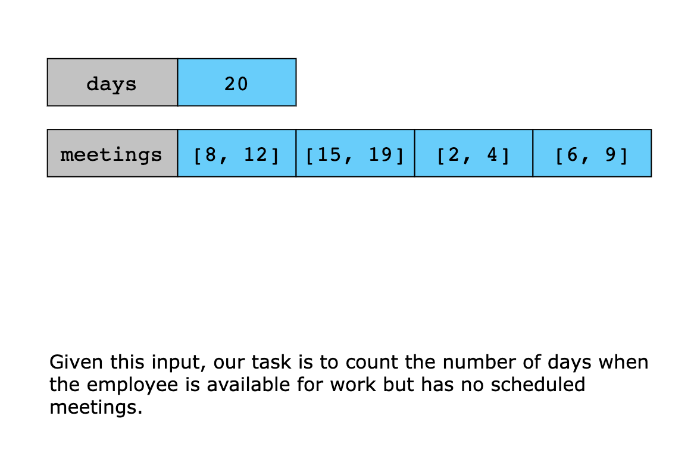
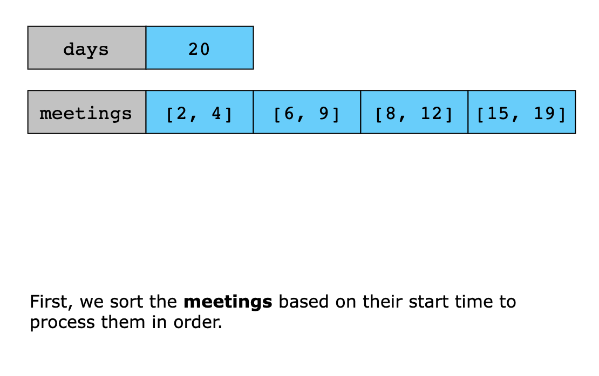
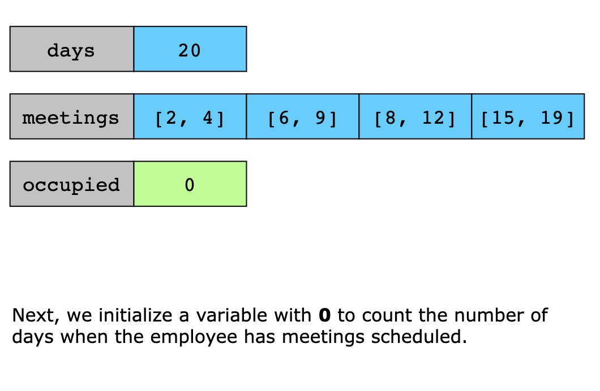
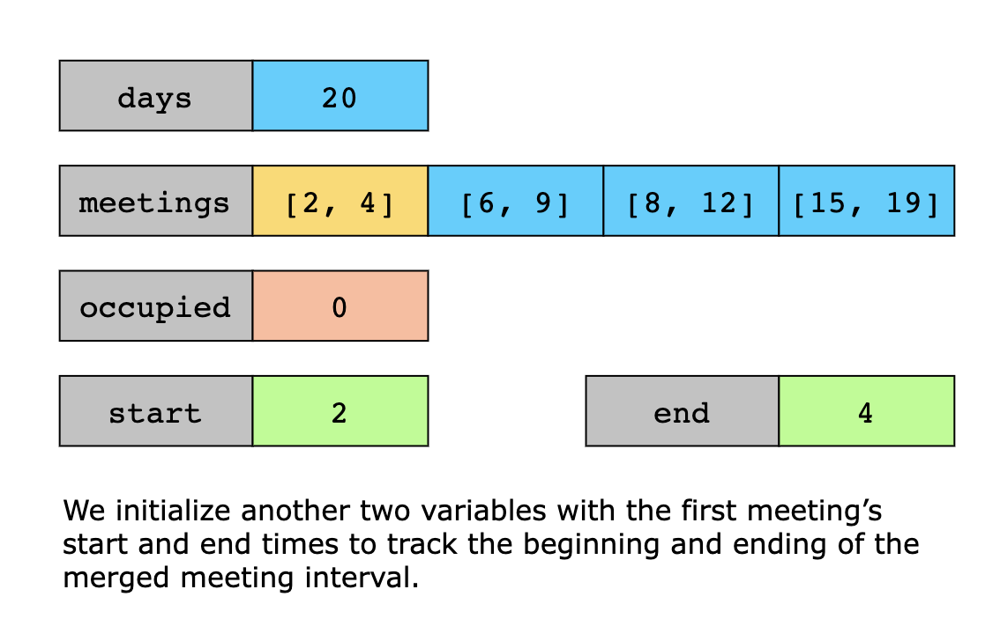
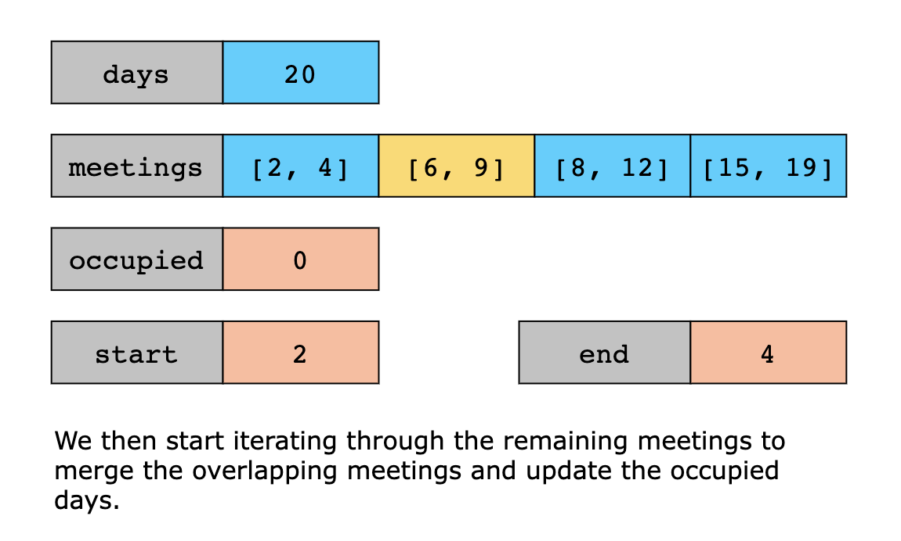
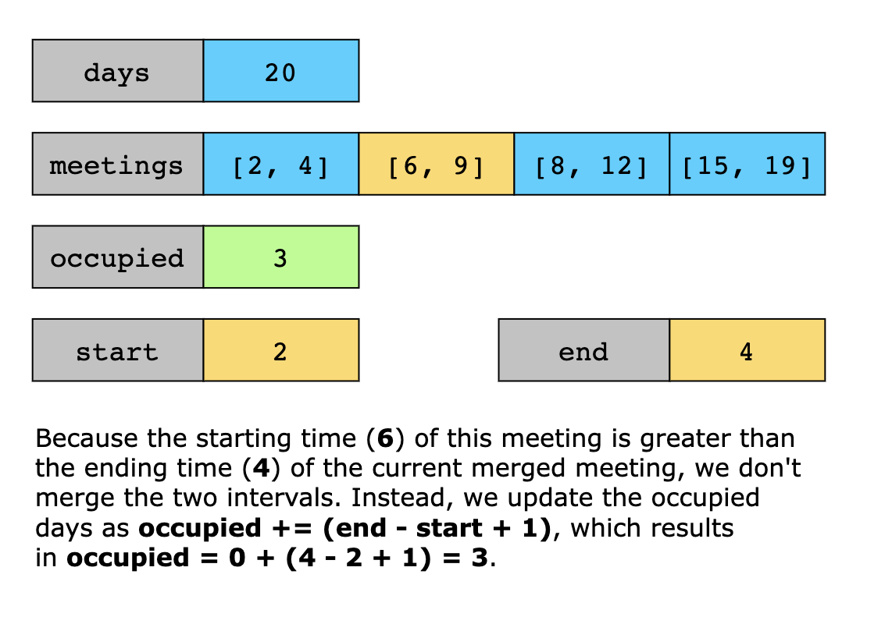
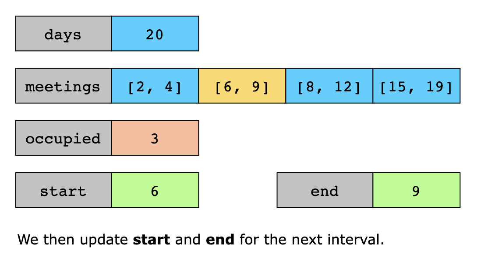
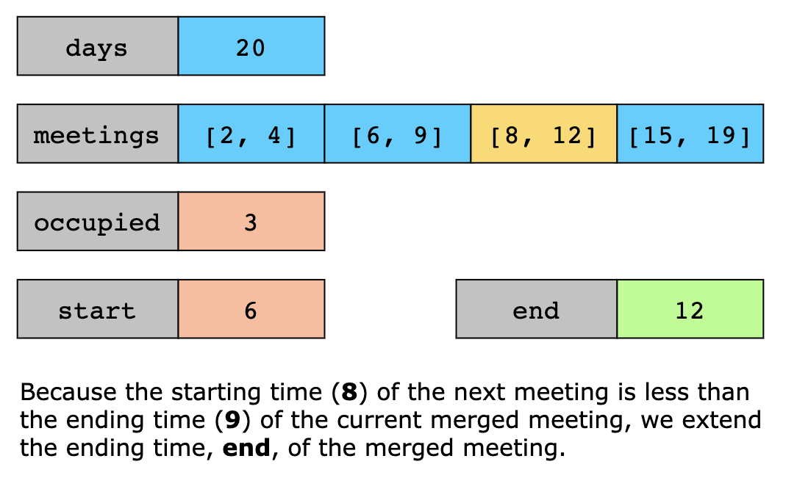
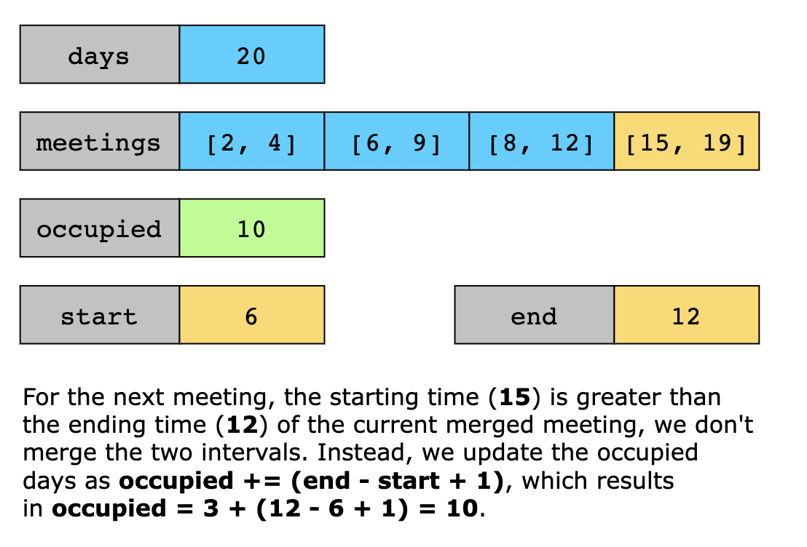
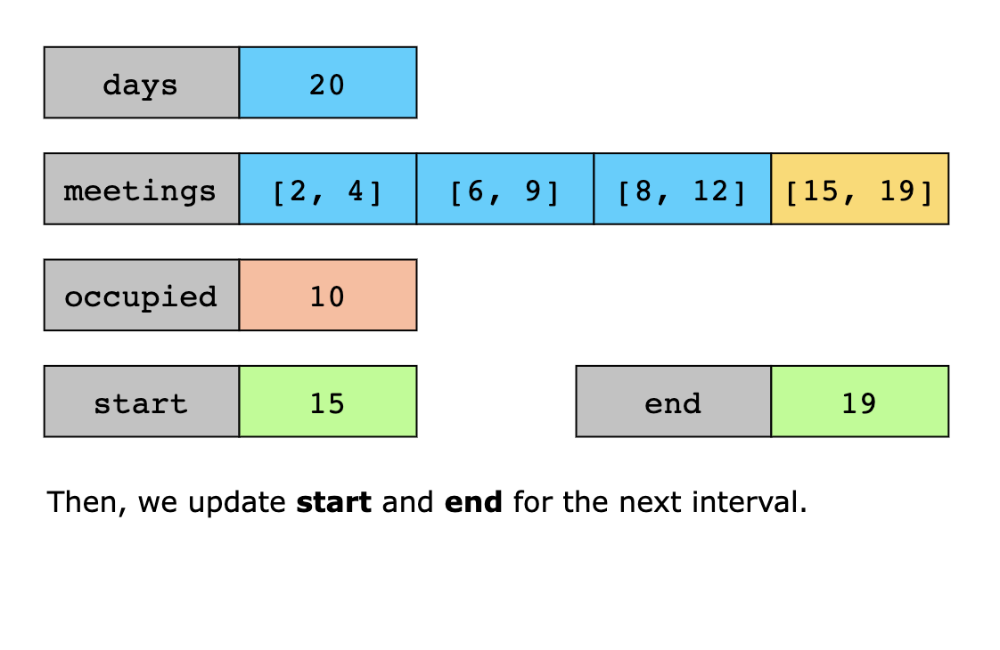
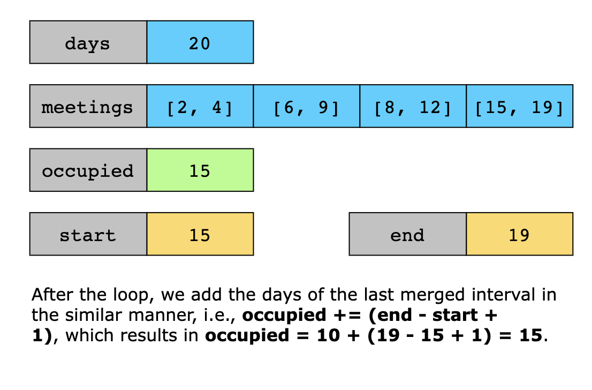

### Time Complexity

The algorithm’s time complexity is O(nlogn), where n is the size of the meetings array. This is due to the sorting step, 
which dominates the overall complexity while merging the intervals runs in O(n).

### Space Complexity

The algorithm’s space complexity is constant, O(1).
