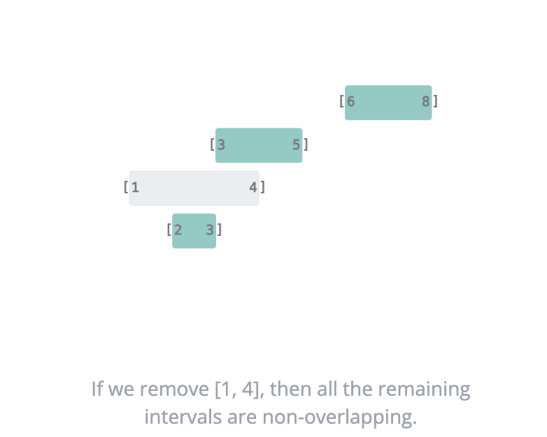
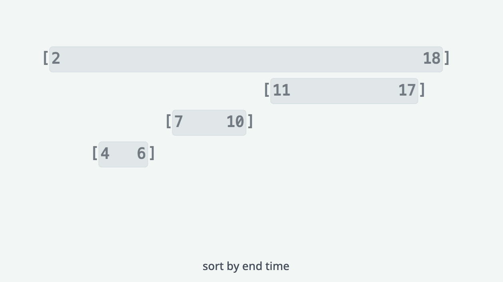
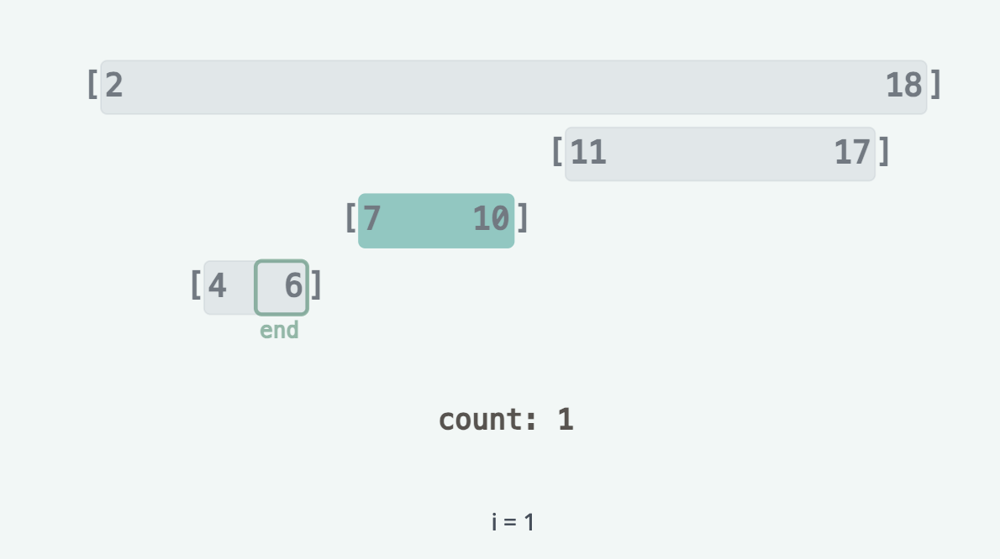
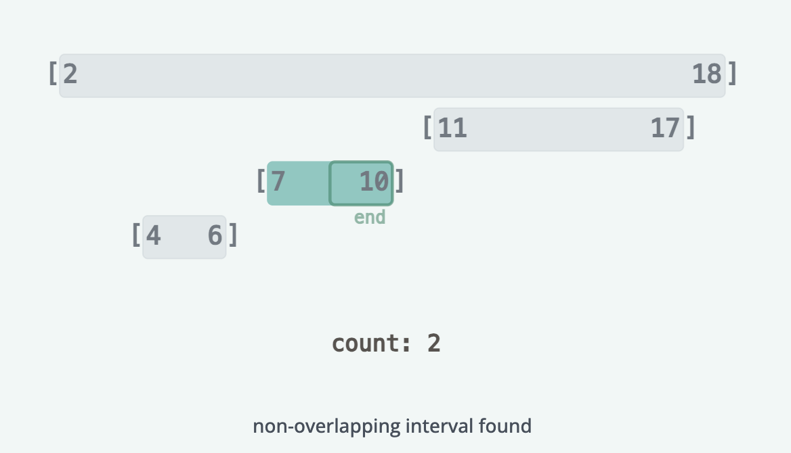
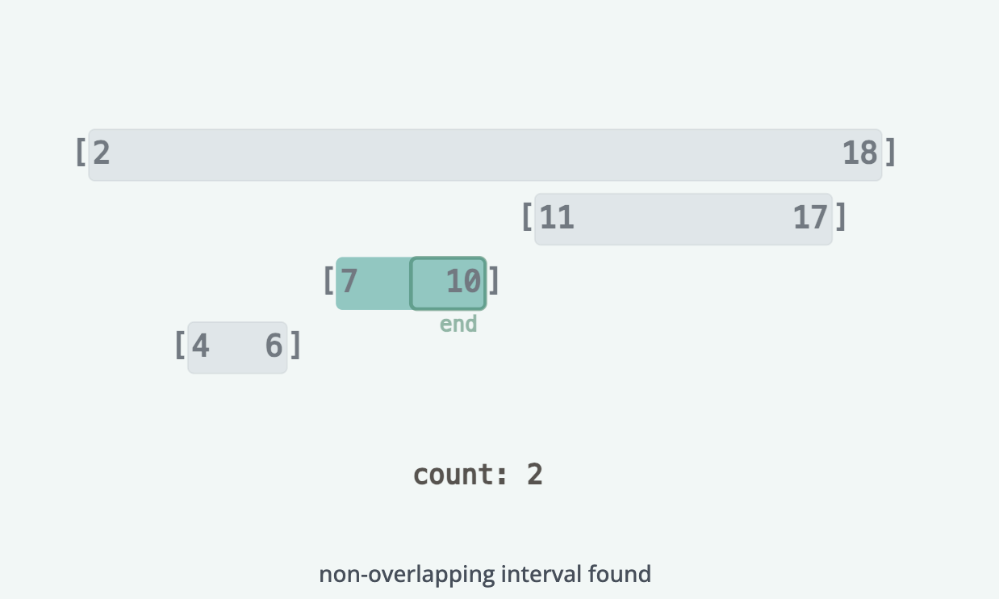
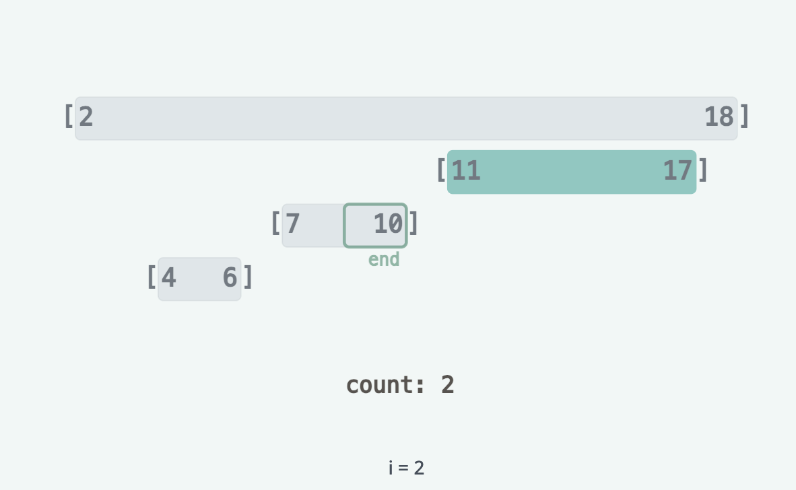
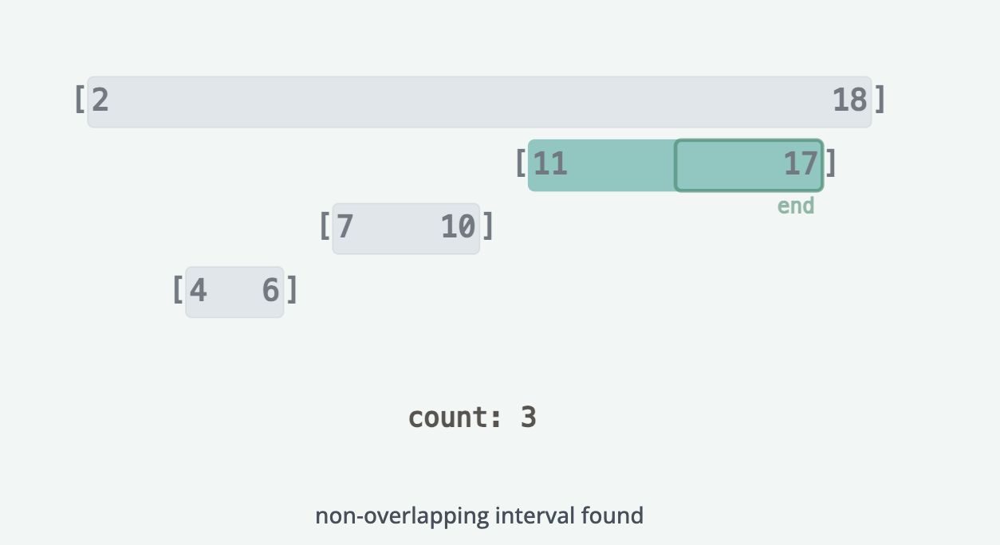
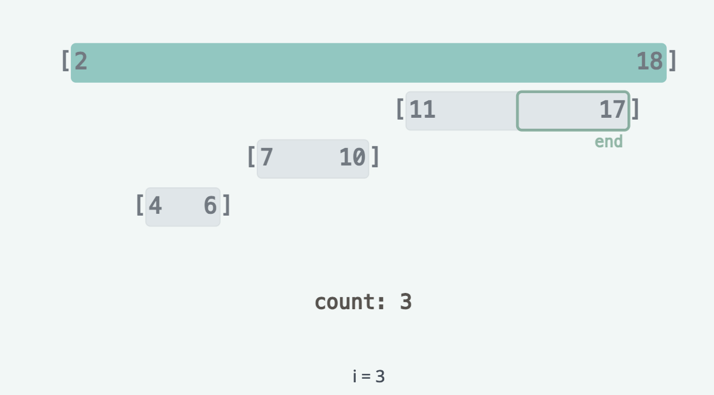

# Non-Overlapping Intervals

Write a function to return the minimum number of intervals that must be removed from a given array intervals, where
intervals[i] consists of a starting point starti and an ending point endi, to ensure that the remaining intervals do not
overlap.

Example:

```text
intervals = [[1,3],[5,8],[4,10],[11,13]]
1

Explanation: Removing the interval [4,10] leaves all other intervals non-overlapping.
```

## Solution

This question reduces to finding the maximum number of non-overlapping intervals. Once we know that value, then we can 
subtract it from the total number of intervals to get the minimum number of intervals that need to be removed.



To find the maximum number of non-overlapping intervals, we can sort the intervals by their end time. We then use a
greedy approach: we iterate over each sorted interval, and repeatedly try to add that interval to the set of
non-overlapping intervals. Sorting by the end time allows us to choose the intervals that end the earliest first, which
frees up more time for intervals to be included later.
We start by keeping track of a variable end which represents the end time of the latest interval in our set of
non-overlapping intervals, as well as a variable count which represents the number of non-overlapping intervals we have
found so far.




We then iterate over each interval starting from the second interval in the list (the first interval is always 
non-overlapping). For each interval, we compare the start time of the interval to end. If it is less than end, then we
cannot add the interval to our set of non-overlapping intervals, so we move onto the next interval without updating end or
count.




If it is greater than or equal to end, then we can add the interval to our set of non-overlapping intervals by updating 
count. We then update the value of end to be the end time of the current interval.







### Complexity Analysis

#### Time Complexity

O(n * logn) where n is the number of intervals. The time complexity is dominated by the sorting step.

#### Space Complexity

We only initialize two extra variables regardless of the input size.

