# Data Stream as Disjoint Intervals

You are given a stream of non-negative integers a1, a2,... ,an . At any point, you need to summarize all numbers seen so
far as a list of disjoint intervals.

Your task is to implement the Summary Ranges class, where:

1. Constructor: Initializes the Summary Ranges object with an empty stream. 
2. Add Num(int value): Adds the integer value to the stream. 
3. Get Intervals(): Returns the current summary of numbers as a list of disjoint intervals [start_i, end_i], sorted by start_i.

> Note: Each number belongs to exactly one interval. Intervals must merge whenever new numbers connect or extend existing 
> ones, and duplicate insertions should not affect the summary. 

## Constraints

- 0 <= value <= 10^4
- At most 3*10^4 calls will be made to addNum and getIntervals.
- At most 10^2 calls will be made to getIntervals.

## Examples

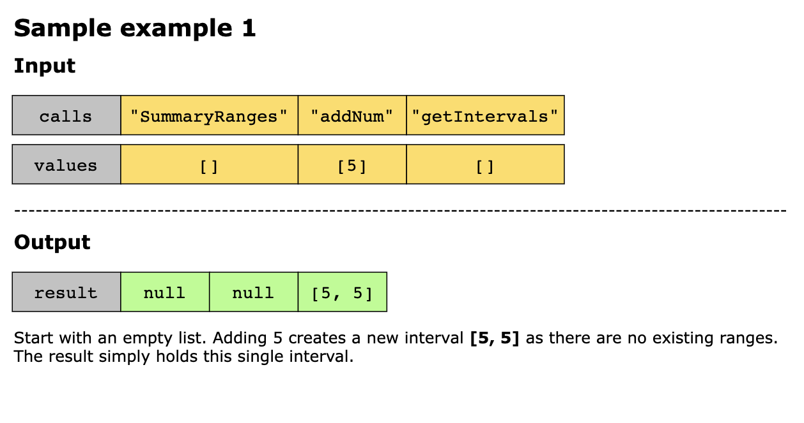
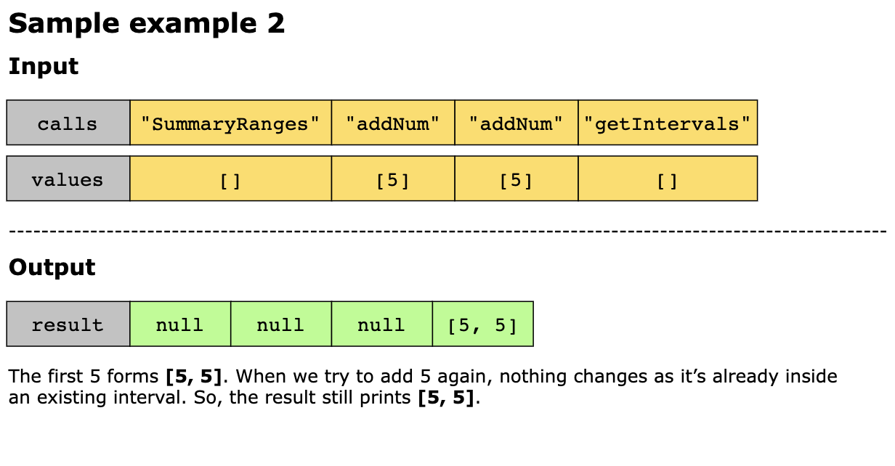
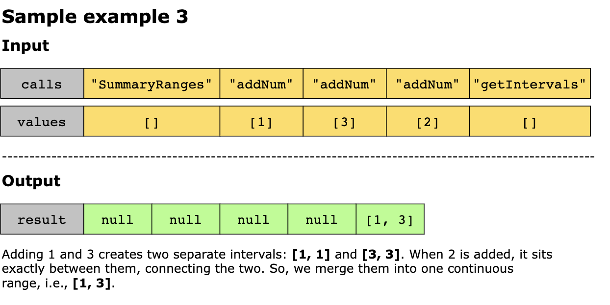
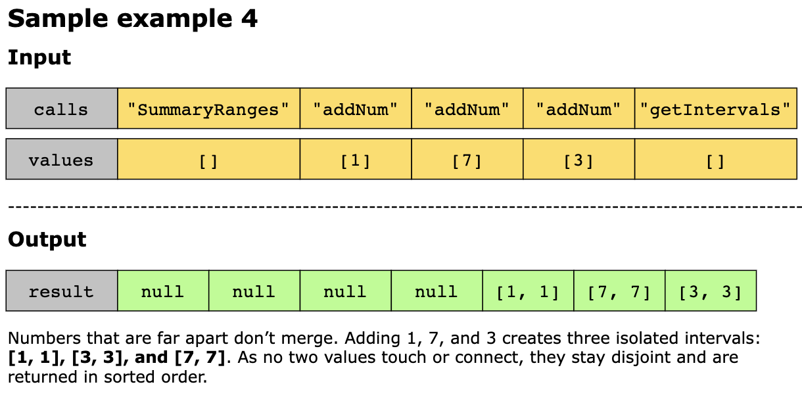

## Solution

When numbers arrive one after another in a stream, it’s easy to imagine them as scattered pebbles landing on a number 
line. If we keep them as-is, the picture quickly becomes messy. Instead, we want to summarize what we’ve seen into clean
stretches of consecutive values, i.e., intervals. The challenge is that every new number can behave differently:
- It may fall inside an existing interval.
- It may extend an interval by one. 
- It may even act like a missing puzzle piece that connects two intervals into one larger block.

This constant merging and organizing is why the “intervals” pattern is the right fit. Rather than storing every number, 
we maintain only the boundaries of disjoint intervals and carefully update them when new values arrive. This way, our 
summary stays compact, sorted, and easy to return.

We start by keeping a sorted collection of intervals instead of recording every number one by one. Each new value starts
as a small single-point interval, and then we look at the ranges around it to decide how it fits.

- If an existing range already covers the value, we simply ignore it.
- If the value lies just beyond the end of a range, we extend that range to include it.
- If the value lies just before the start of a range, we merge it with that range.
- If the value sits exactly between two ranges, we merge them into one larger range.

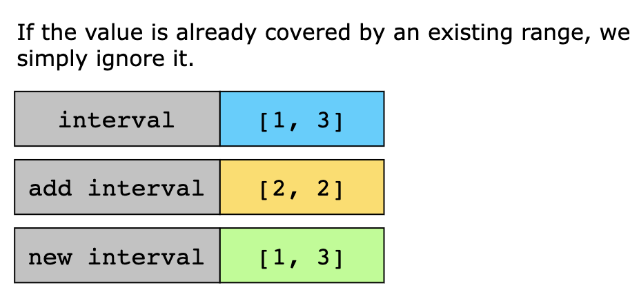
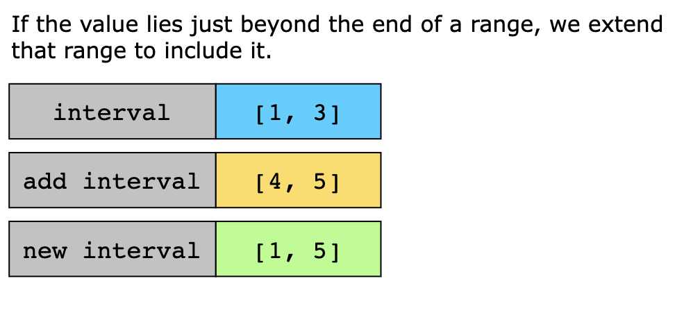

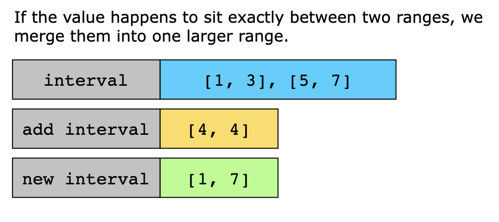

If none of the above cases apply, the number remains in a new interval. The stored intervals are sorted and disjointed 
at any time, so generating the summary is as simple as listing them in order.

The following steps can be performed to implement the algorithm above:

1. We keep the data as a sorted map called intervals, where in this map, the key is the start of an interval and the 
   value is the end of that interval. This ensures intervals are always ordered by their start and remain disjoint.
2. Constructor: We initialize intervals as an empty map in the constructor.
3. Add Num(int value): Adding a number to the stream.
   - We treat the new number value as a small interval by setting newStart = value and newEnd = value. This will be our 
     candidate interval that may expand or merge.
   - Then, we work on finding the two neighbors around this number:
     - nextInterval, which is the first interval whose start is greater than value.
     - prevInterval, which is the interval immediately before nextInterval, if one exists.
   - Check the previous interval:
     - If prevInterval->end (the end of the previous interval) is greater than or equal to the value, then the number 
       is already covered inside that range. In this case, we simply return without any changes.
     - If prevInterval->second equals value - 1, then the new number touches the end of the previous interval.
       - In this case, we extend the candidate’s start (newStart) to prevInterval->first so that the candidate also 
         includes the previous interval.
   - Check the next interval:
     - If nextInterval->start (the start of the next interval) equals value + 1, then the new number touches the start 
       of the next interval.
       - We extend the candidate’s end (newEnd) to nextInterval->second and remove nextInterval from the map, since it 
         will be merged.
   - If the previous and next conditions apply, the candidate bridges them into one larger interval.
   - Finally, we insert the merged interval into the map as intervals[newStart] = newEnd.
     - This overwrites the previous interval if it was extended.
     - It replaces the next interval if it was merged.
     - Or it creates a new single-point interval if no merges happened.
4. Get Intervals(): Getting all intervals.
   - We create an empty result list.
   - Then we iterate through all the entries in intervals, where each interval is interval.first as the start and 
     interval.second as the end.
     - For each entry, we push [interval.first, interval.second] into the result list.
   - Finally, we return the result list, and as intervals is always maintained, sorted, and disjointed, the result 
     requires no further processing.

Let’s look at the following illustration to get a better understanding of the solution:

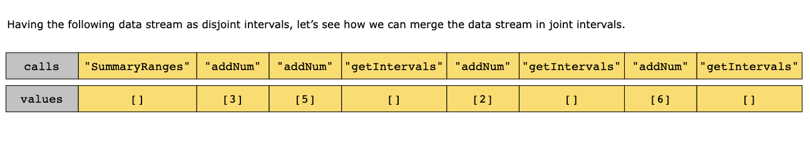
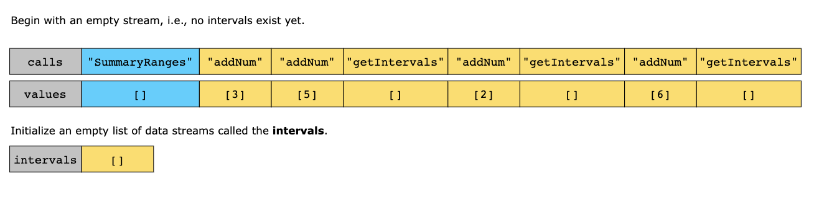
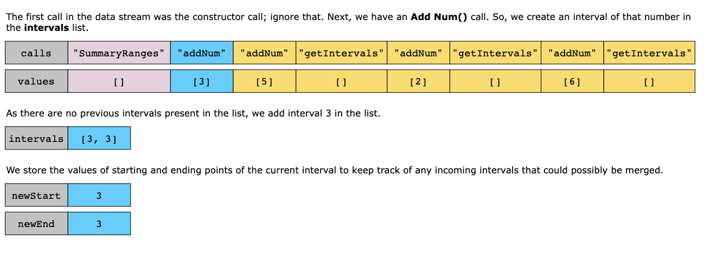
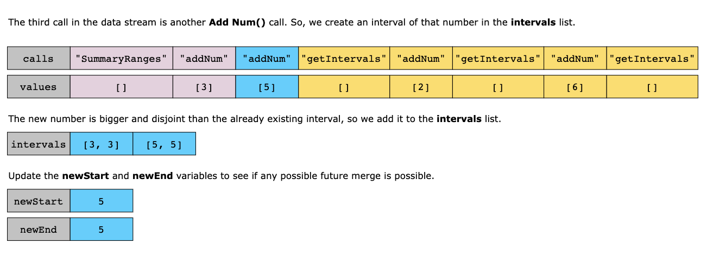
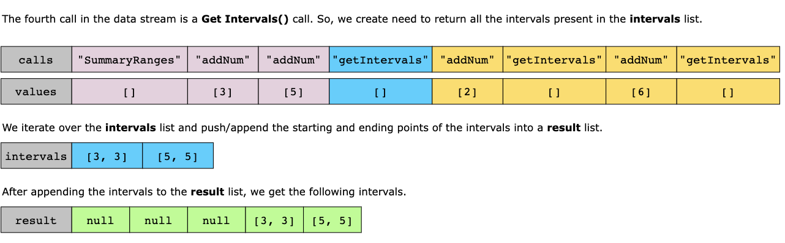
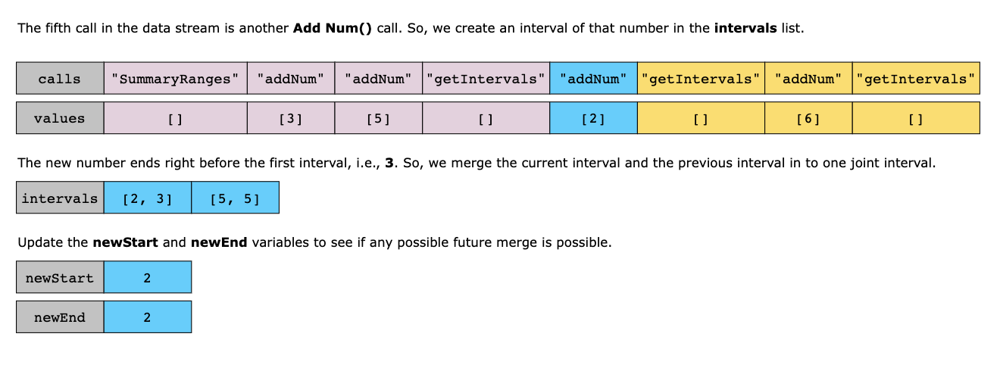
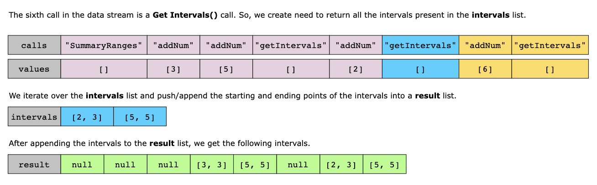
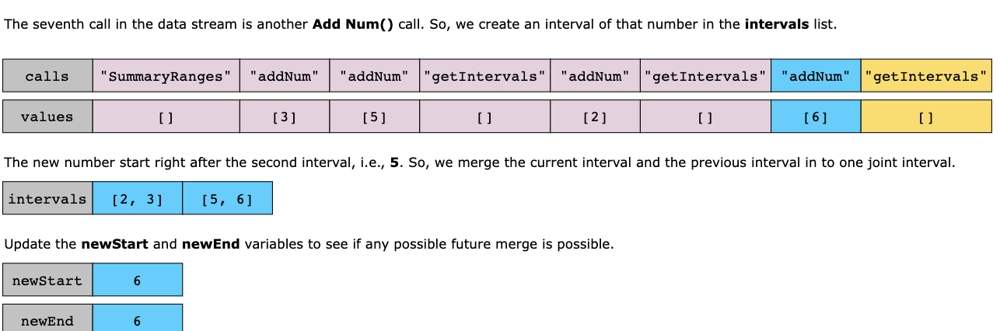

### Time Complexity

Let k be the current number of disjoint intervals stored in the intervals map.

- Add Num(int value): `O(log(k))`:
  - One upper bound `O(log(k))`, at most one predecessor check `O(1)`, and up to one erase (of the next interval) plus
    one insert/update (each `O(log(k))`).

- Get Intervals(): `O(k)`
  - We iterate over every stored interval once to build the output.

- Worst-case relation to n: If there are n Add Num(int value) calls and nothing ever merges, then k=`O(n)`, giving 
  Add Num(int value) `O(log(n))` and Get Intervals() `O(n)`.

### Space Complexity

As we store only interval boundaries (start → end) rather than every number seen, the space complexity is `O(k)`. In the 
worst case with no merges, k=`O(n)`, so space becomes `O(n)`.
