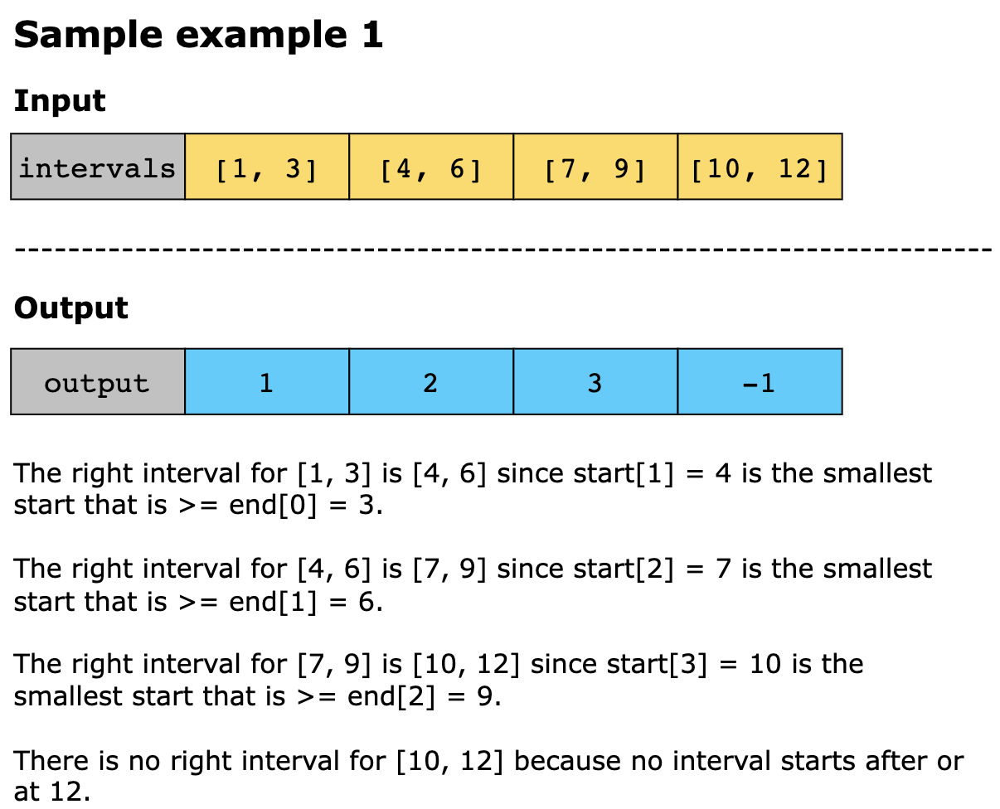
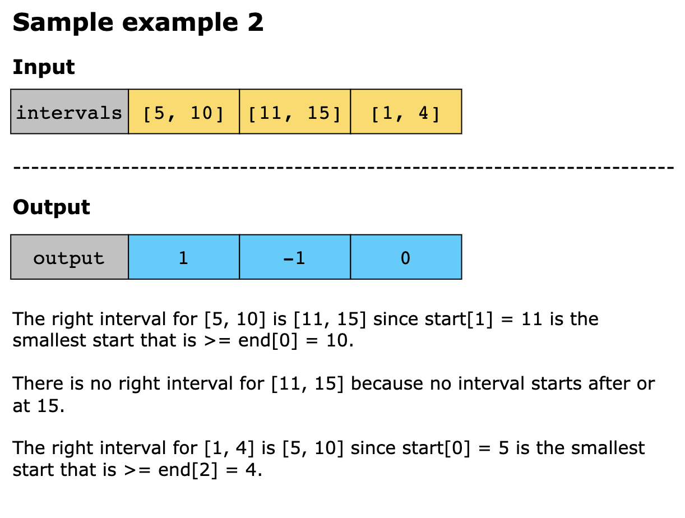
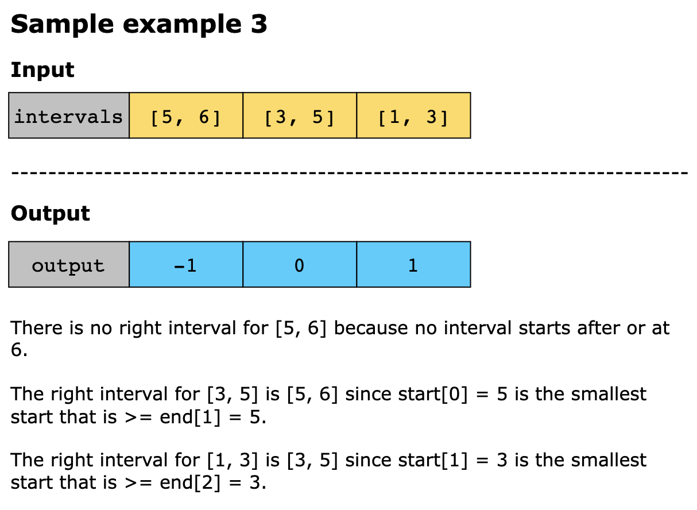
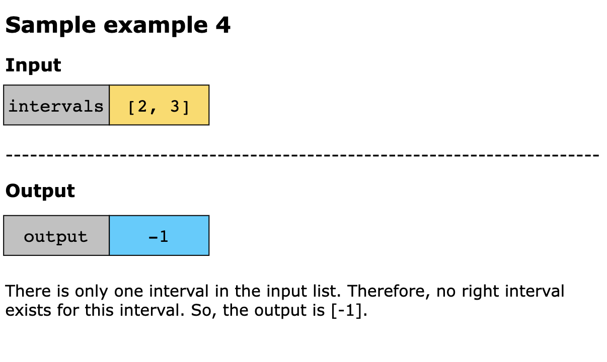

# Find Right Interval

You are given an array of intervals where each interval is represented by a pair [starti, endi]. The `starti` values are
unique, meaning no two intervals begin at the same time. 

The task is to find the right interval for each interval in the list. The right interval for an `intervali` is an
`intervalj` such that `startj >= endi` and `startj` is minimized (i.e., it is the smallest start time among all valid
intervals that is greater than or equal to `endi`). Note that `i` may equal `j`.

Return an array of right interval indexes for each interval `i`. If no right interval exists for `intervali`, then put 
−1 at index i.

## Constraints

- 1 ≤ intervals.length ≤ 1000
- intervals[i].length == 2
- −10^6 ≤ `starti` ≤ `endi` ≤ 10^6
- The start times are guaranteed to be unique.

## Examples

## Topics

- Array
- Binary Search
- Sorting

## Solution(s)

### Sorting + Binary Search

We can store the start point and index of each interval into an array arr, and sort it by the start point. Then we
iterate through the interval array, for each interval [_, ed], we can use binary search to find the first interval whose
start point is greater than or equal to ed, which is its right-side interval. If found, we store its index into the
answer array, otherwise, we store -1.

The time complexity is `O(n × log(n))`, and the space complexity is O(n). Where n is the length of the intervals.

### Two Heaps

We use two heaps to find the right interval for each given interval. One heap keeps track of the intervals' end times,
allowing us to process them in the order they finish. The other heap stores the start times, helping us quickly identify
the smallest valid start time that can serve as the right interval. By processing intervals based on their end times, we
remove all start times from the start heap that are smaller than the current end time. This way, we ensure that any
remaining start times in the heap are candidates for the right interval. Once we have removed all smaller elements from
the start min heap, if the heap is not empty, the top element (smallest valid start time) represents the right interval.
This approach optimizes the search process, avoiding unnecessary comparisons and reducing the overall complexity.

The steps of the algorithm are given below:

1. Initializing a result array with -1 for each interval, representing cases where no right interval is found.
2. Initialize two min heaps:
   - A start_heap stores tuples of (start, index), where start is the interval's start time and index is its original
     position in the input list.
   - An end_heap stores tuples of (end, index), where end is the interval's end time and index is its original position.
3. Iterate over the intervals, pushing start times into start_heap and end times into end_heap.
4. For each interval, pop the smallest end time from end_heap and remove any start times in start_heap that are smaller
   than the current end time. This ensures that we only consider start times that could be valid right intervals.
5. After the invalid start times are removed, if start_heap is not empty, the top element (smallest valid start time)
   represents the right interval. We then update the result array with the corresponding index of this right interval.
6. Once all intervals are processed, the result array contains the indexes of the smallest right intervals or -1 if no
   valid interval exists.

#### Time Complexity

We insert all intervals into start_heap and end_heap, each taking `O(log(n))` leading to a total time complexity `O(n log(n))`
for heap construction. Processing each interval in end_heap also takes `O(n log(n))`  in the worst case. Thus, the
overall time complexity is `O(n log(n))`

#### Space Complexity

Both start_heap and end_heap store all intervals. Each heap stores `n` elements, where n is the number of intervals.
Therefore, both heaps together take `O(n)` space. Thus, the overall space complexity is `O(n)`.
