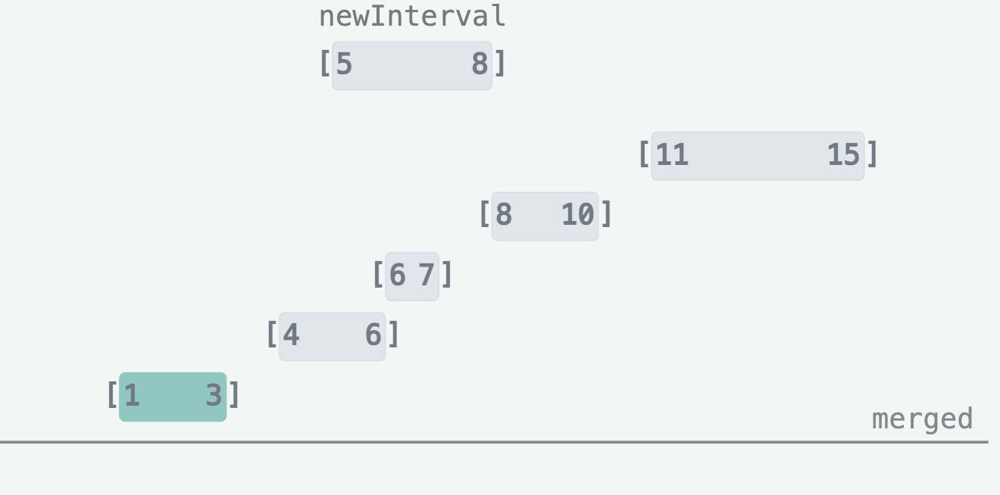
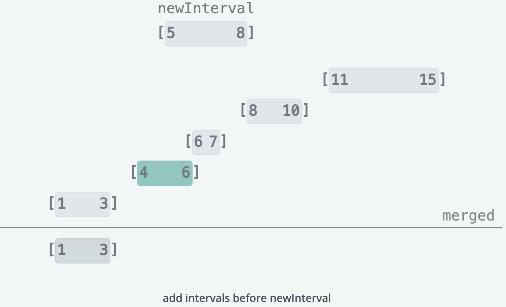
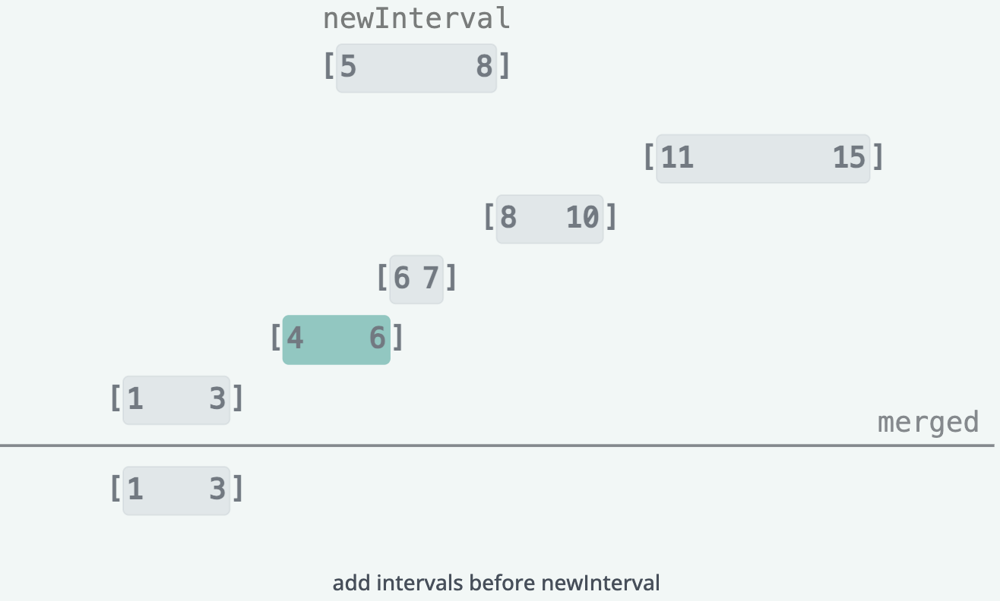
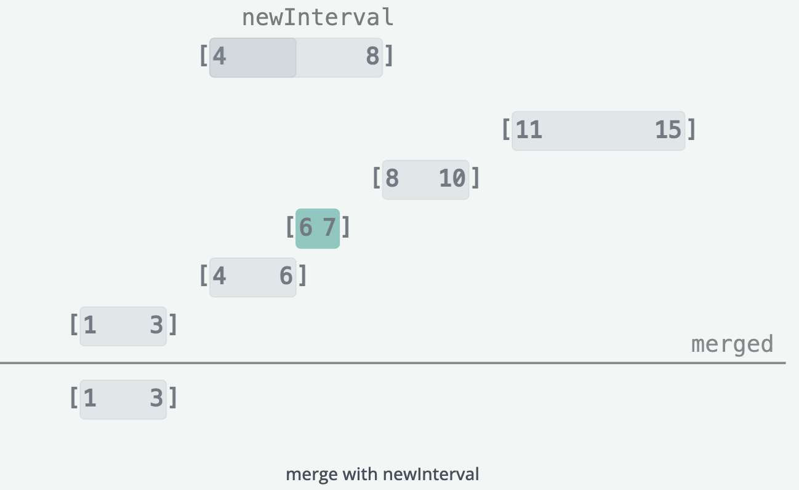
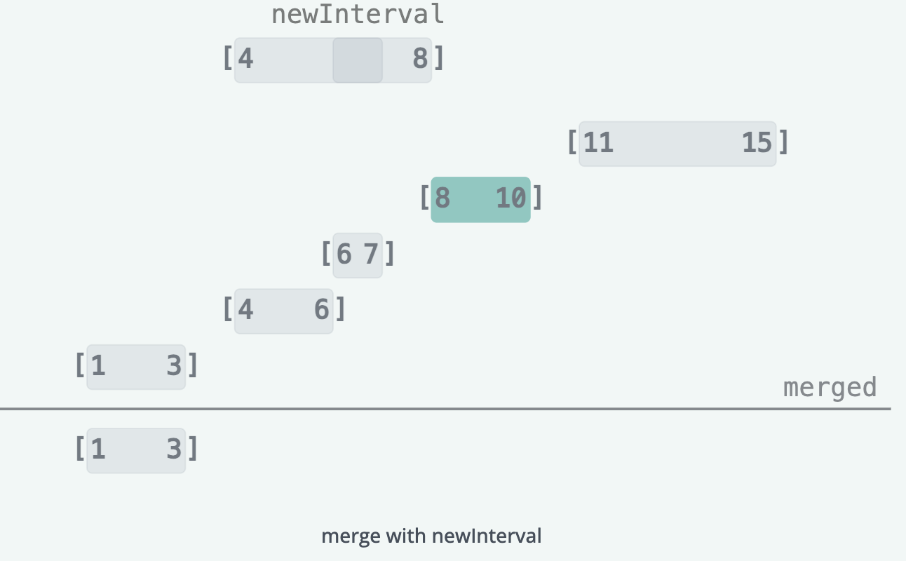
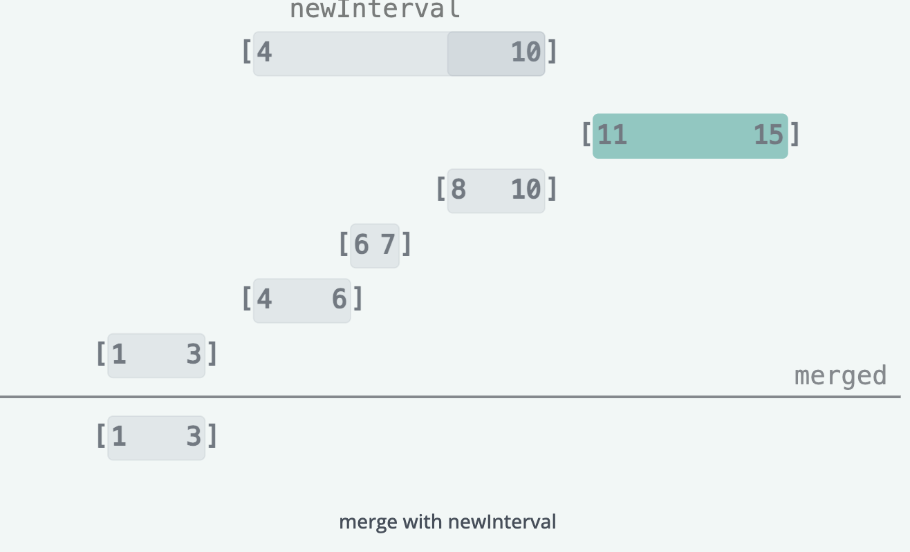
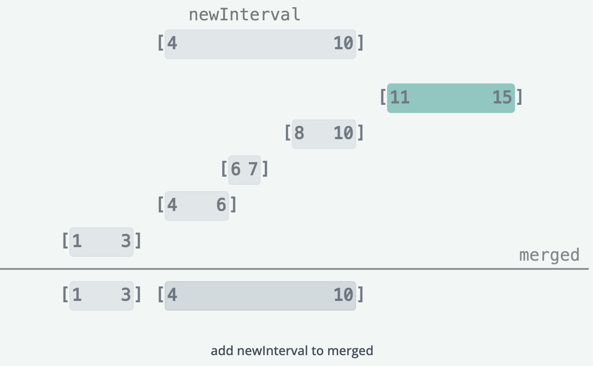
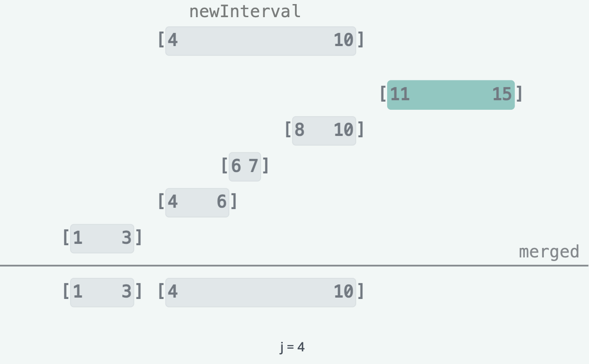
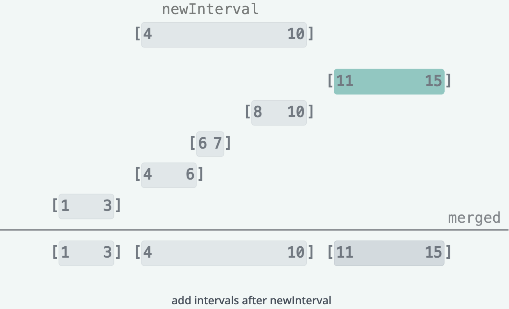
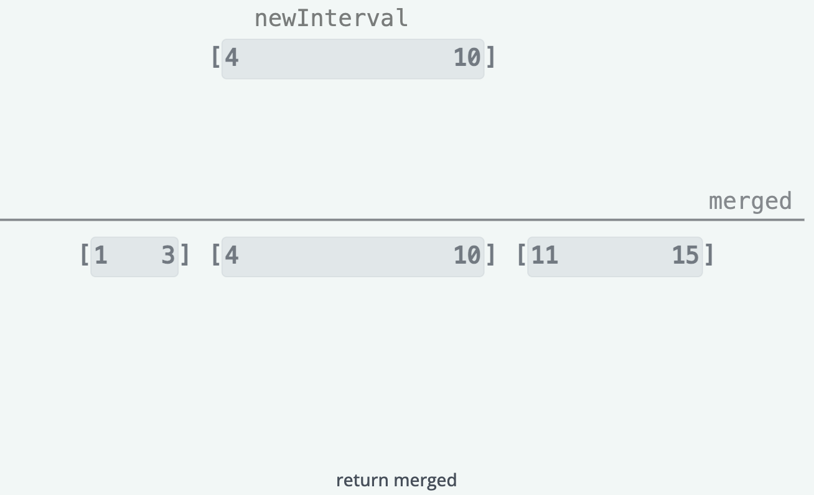

# Insert Interval

You are given a list of non-overlapping intervals, intervals, where each interval is represented as [starti, endi] and 
the list is sorted in ascending order by the start of each interval (starti). You are also given another interval, 
new_interval = [start, end].

Your task is to insert new_interval into the list of intervals such that the list remains sorted by starting times and 
still contains no overlapping intervals. If any intervals overlap after the insertion, merge them accordingly.

Return the updated list of intervals.

> Note You don’t need to modify intervals in place. You can make a new array and return it.

## Constraints

- 0 ≤ `intervals.length` ≤ 10^4
- `intervals[i].length`, `new_interval.length` == 2
- 0 ≤ `starti` < `endi` ≤ 10^4
- The list of intervals is sorted in ascending order based on the start time

## Examples

## Solution

We first want to create a new list `merged` to store the merged intervals we will return at the end.

This solution operates in 3 phases:
1. Add all the intervals ending before `newInterval` starts to `merged`.
2. Merge all overlapping intervals with `newInterval` and add that merged interval to `merged`.
3. Add all the intervals starting after `newInterval` to `merged`.

### Phase 1

In this phase, we add all the intervals that end before `newInterval` starts to `merged`. This involves iterating through the
`intervals` list until the current interval no longer ends before `newInterval` starts (i.e. `intervals[i][1] >= newInterval[0]`).

### Phase 2

In this phase, we merge all the intervals that overlap with newInterval together into a single interval by updating 
`newInterval` to be the minimum start and maximum end of all the overlapping intervals. This involves iterating through 
the intervals list until the current interval starts after `newInterval` ends (i.e. `intervals[i][0] > newInterval[1]`).
When that condition is met, we add `newInterval` to merged and move onto phase 3.

### Phase 3

Phase 3 involves adding all the intervals starting after newInterval to merged. This involves iterating through the 
intervals list until the end of the list, and adding each interval to merged.

After completing these 3 phases, we return merged as the final result.

### Complexity Analysis

#### Time Complexity

O(n) where n is the number of intervals. We iterate through all intervals once to merge them.

#### Space Complexity

O(n) where n is the number of intervals. We need space for the merged output array.
