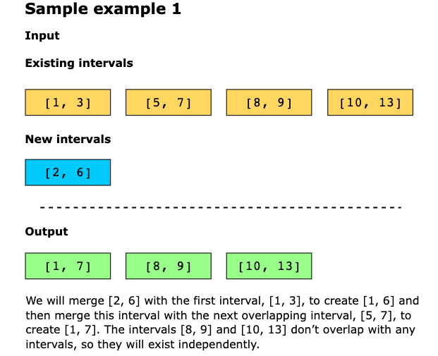
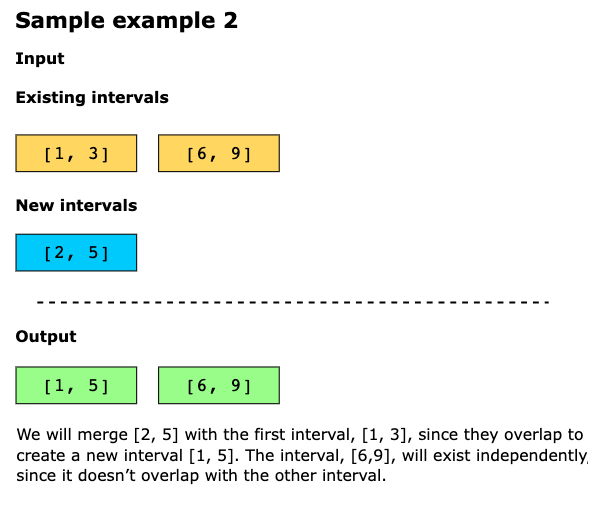

# Insert Interval

You are given a list of non-overlapping intervals, intervals, where each interval is represented as [starti, endi] and 
the list is sorted in ascending order by the start of each interval (starti). You are also given another interval, 
new_interval = [start, end].

Your task is to insert new_interval into the list of intervals such that the list remains sorted by starting times and 
still contains no overlapping intervals. If any intervals overlap after the insertion, merge them accordingly.

Return the updated list of intervals.

> Note You don’t need to modify intervals in place. You can make a new array and return it.

## Constraints

- 0 ≤ `intervals.length` ≤ 10^4
- `intervals[i].length`, `new_interval.length` == 2
- 0 ≤ `starti` < `endi` ≤ 10^4
- The list of intervals is sorted in ascending order based on the start time

## Examples

