# Interval List Intersections

Given two lists of closed intervals, interval_list_a and interval_list_b, return the intersection of the two interval 
lists.

> A closed interval [start, end] (with start <= end) includes all real numbers x such that start <= x <= end.

Each interval in the lists has its own start and end time and is represented as [start, end]. Specifically:

- interval_list_a[i] = [starti, endi]
- interval_list_b[j] = [startj, endj]

The intersection of two closed intervals i and j is either:
- An empty set, if they do not overlap, or
- A closed interval [max(starti, startj), min(endi, endj)] if they do overlap.

Also, each list of intervals is pairwise disjoint(intervals within a list don't overlap) and in sorted order.

## Constraints

- 0 <= `interval_list_a.length`, `interval_list_b.length` <= 1000
- `interval_list_a.length` + `interval_list_b.length` >= 1
- 0 <= `starti`  < `endi` <= 10^9
- `endi`  < `start(i+1)`
- 0 <= `startj`  < `endj` <= 10^9
- `endj`  < `start(j+1)`

## Examples

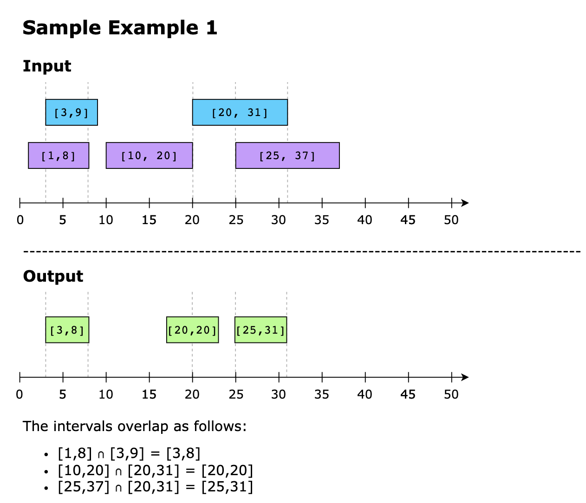
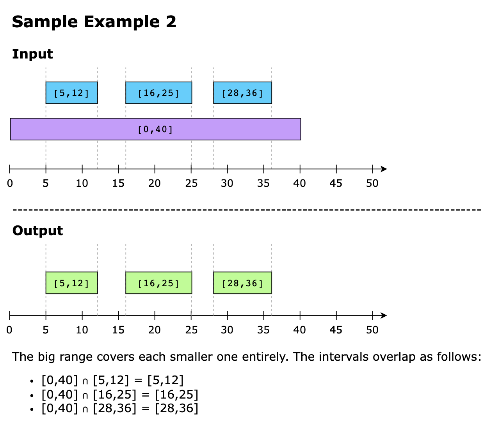
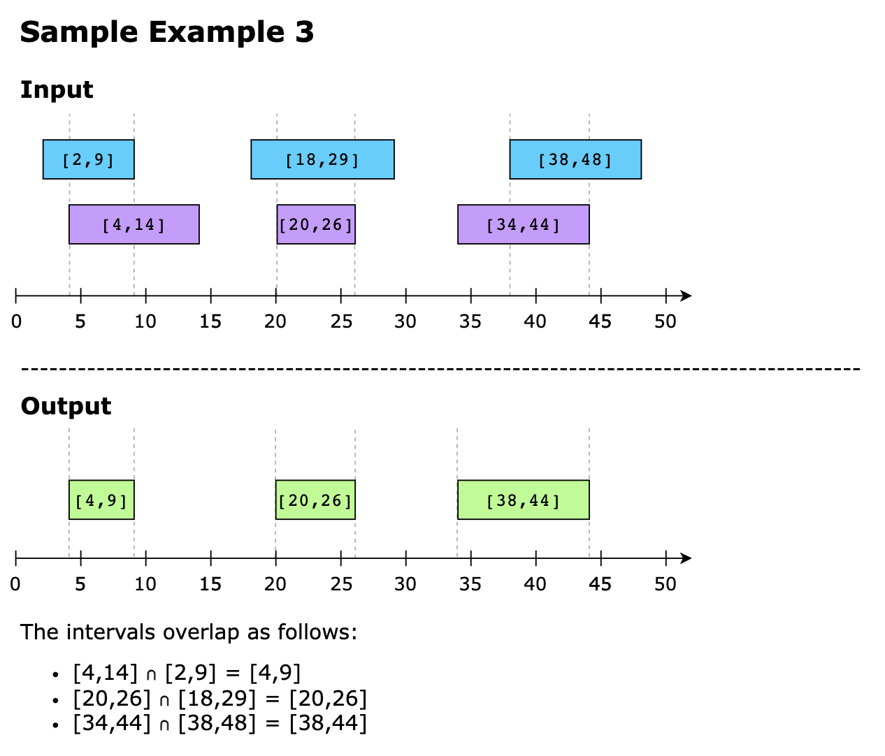
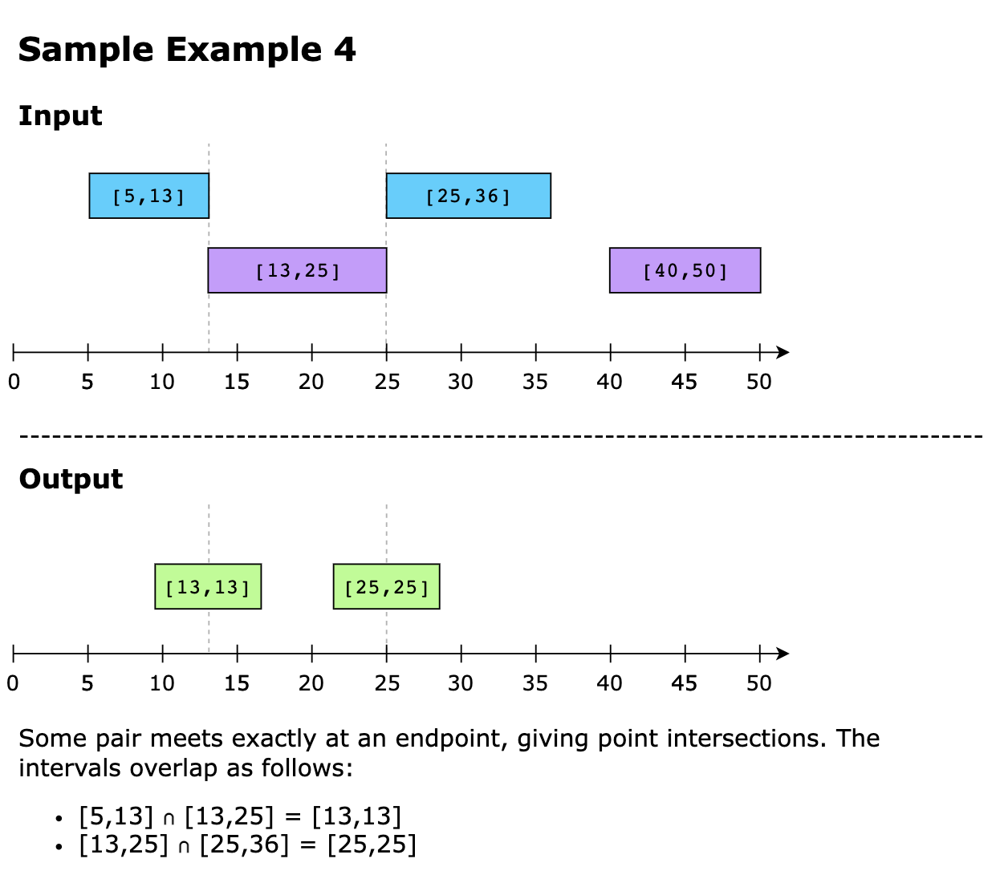
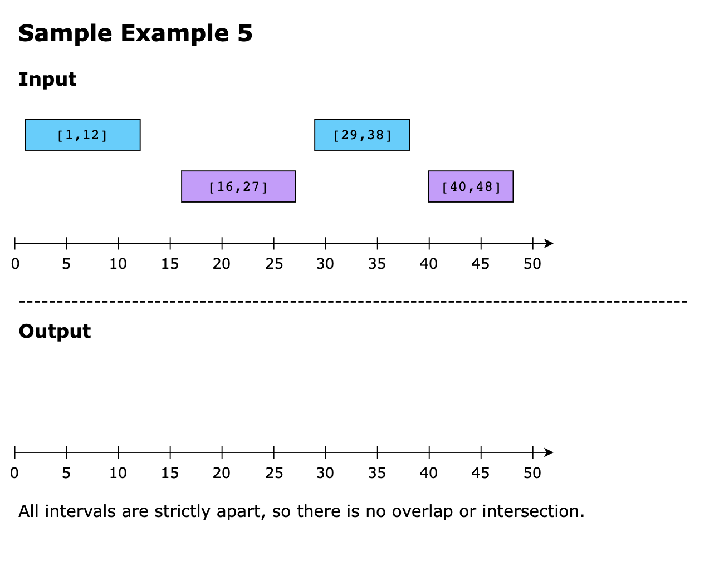

## Topics

- Two pointers
- Intervals

## Solutions

1. [Naive Approach](#naive-approach)
1. [Using Intervals](#optimized-approach-using-intervals)

### Naive Approach

The naive approach for this problem is to use a nested loop for finding intersecting intervals.

The outer loop will iterate for every interval in interval_list_a and the inner loop will search for any intersecting 
interval in the interval_list_b.

If such an interval exists, we add it to the intersections list.

Since we are using nested loops, the time complexity for this naive approach will be O(n*m), where n is the length of 
intervalsA and m is the length of intervalsB.

### Optimized approach using intervals

The essence of this approach is to leverage two key advantages: first, the lists of intervals are sorted, and second, 
the result requires comparing intervals to check for overlap. The algorithm works by iterating through both sorted lists
of intervals simultaneously, identifying intersections between intervals from the two lists. At each step, it compares 
the current intervals from both lists and determines whether there is an intersection by examining the endpoints of the 
intervals. It adds the intersecting interval to the result list if an intersection exists. To efficiently navigate 
through the intervals, the algorithm adjusts pointers based on the positions of the intervals’ endpoints, ensuring that 
it covers all possible intersections. The algorithm accurately computes the interval list intersection by systematically
traversing the lists, identifying intersections, and adding them to the results list, the algorithm accurately computes 
the interval list intersection.

The algorithm to solve this problem is as follows:

- We’ll use two indexes, i and j, to iterate through the intervals in both lists, `interval_list_a` and `interval_list_b`, 
  respectively.
- To check whether there’s any intersecting point among the given intervals:
  - Take the starting times of the first pair of intervals from both lists and check which occurs later, storing it in 
    a variable, say start. 
  - Also, compare the ending times of the same pair of intervals from both lists and store the minimum end time in 
    another variable, say, end.

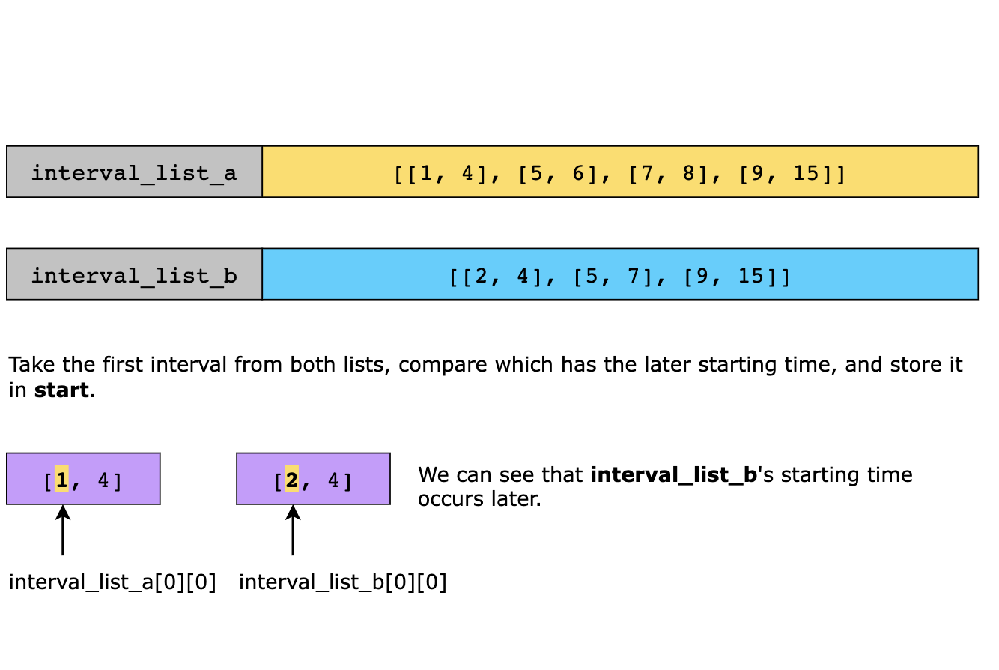
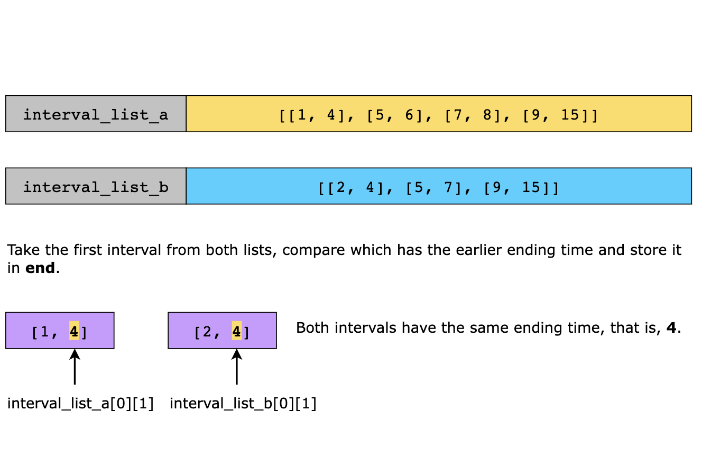

- Next, we will check if `interval_list_a[i]` and `interval_list_b[j]` overlap by comparing the start and end times.
  - If the times overlap, then the intersecting time interval will be added to the resultant list, that is, intersections. 
  - After the comparison, we need to move forward in one of the two input lists. The decision is taken based on which 
    of the two intervals being compared ends earlier. If the interval that ends first is in `interval_list_a`, we move 
    forward in that list, else, we move forward in `interval_list_b`.

The illustrations below show the key steps of the solution.

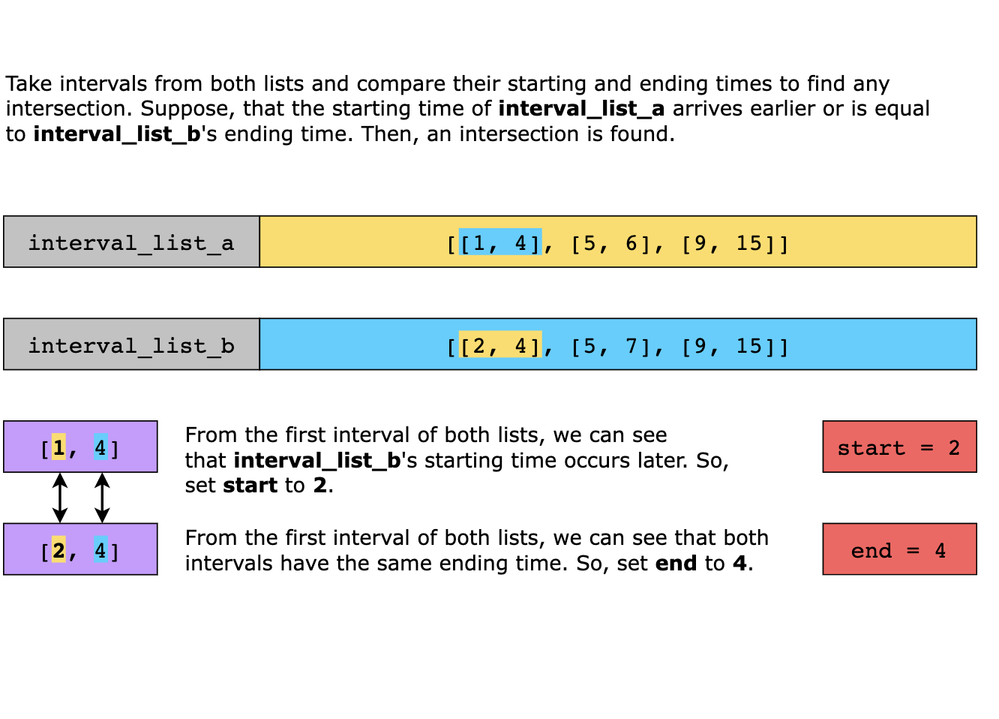
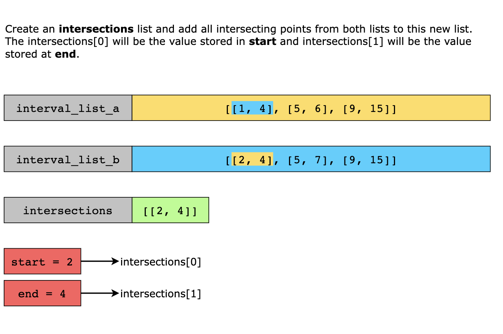
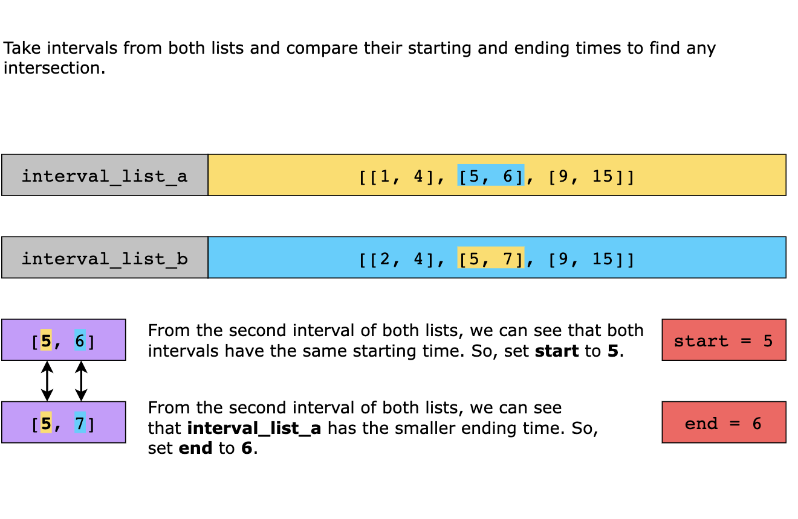
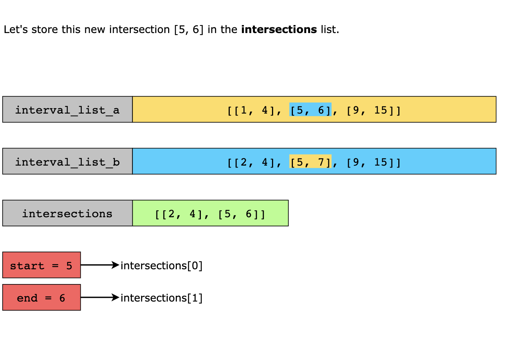
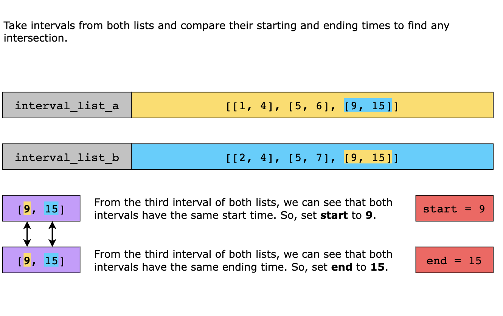
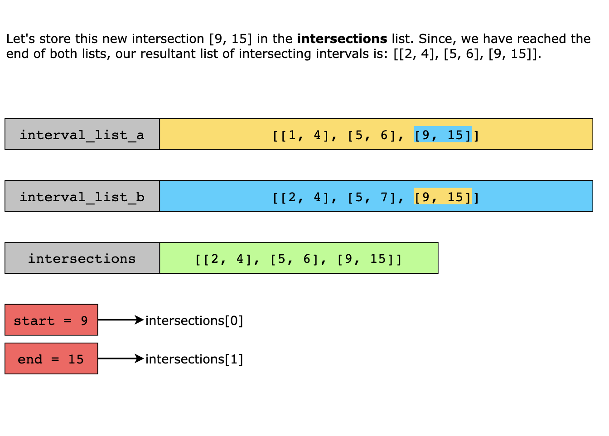

#### Solution summary

Let’s briefly discuss the approach that we have used to solve the above mentioned problem:

- Set two pointers, i and j, at the beginning of both lists, respectively, for their iteration. 
- While iterating, find the latest starting time and the earliest ending time for each pair of intervals 
  `interval_list_a[i]` and `interval_list_b[j]`.
- If the latest starting time is less than or equal to the earliest ending time, store it as an intersection.
- Increment the pointer (i or j) of the list having the smaller end time of the current interval. 
- Keep iterating until either list is fully traversed. 
- Return the list of intersections.

#### Time Complexity

The time complexity is `O(n+m)`, where n and m are the number of meetings in `interval_list_a` and `interval_list_b`, 
respectively.

#### Space Complexity

The space complexity is `O(1)` as only a fixed amount of memory is consumed by a few temporary variables for computations 
performed by the algorithm.
