# Meeting Rooms

Given an 2D integer array A of size N x 2 denoting time intervals of different meetings.

Where:

A[i][0] = start time of the ith meeting.
A[i][1] = end time of the ith meeting.

Find the minimum number of conference rooms required so that all meetings can be done.

> Note :- If a meeting ends at time t, another meeting starting at time t can use the same conference room

```plain
Input Format
The only argument given is the matrix A.
```

```plain
Output Format
Return the minimum number of conference rooms required so that all meetings can be done.
```

```plain
Example Input
Input 1:

A = [      [0, 30]
[5, 10]
[15, 20]
]

Input 2:

A =  [     [1, 18]
[18, 23]
[15, 29]
[4, 15]
[2, 11]
[5, 13]
]

Example Output
Output 1:

2
Output 2:

4
```

```plain
Example Explanation
Explanation 1:

Meeting one can be done in conference room 1 form 0 - 30.
Meeting two can be done in conference room 2 form 5 - 10.
Meeting three can be done in conference room 2 form 15 - 20 as it is free in this interval.
Explanation 2:

Meeting one can be done in conference room 1 from 1 - 18.
Meeting five can be done in conference room 2 from 2 - 11.
Meeting four can be done in conference room 3 from 4 - 15.
Meeting six can be done in conference room 4 from 5 - 13.
Meeting three can be done in conference room 2 from 15 - 29 as it is free in this interval.
Meeting two can be done in conference room 4 from 18 - 23 as it is free in this interval.
```

## Examples

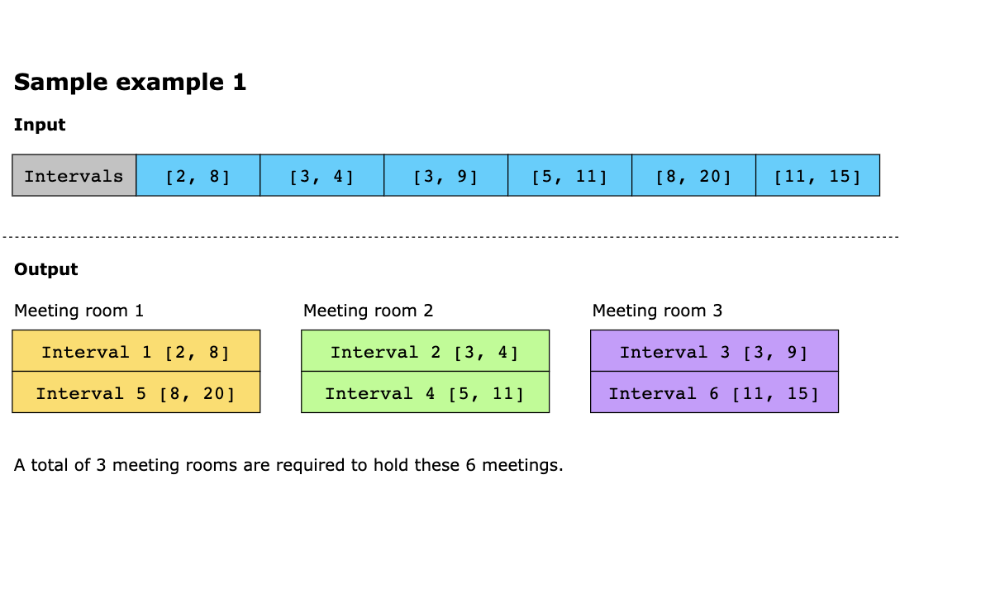
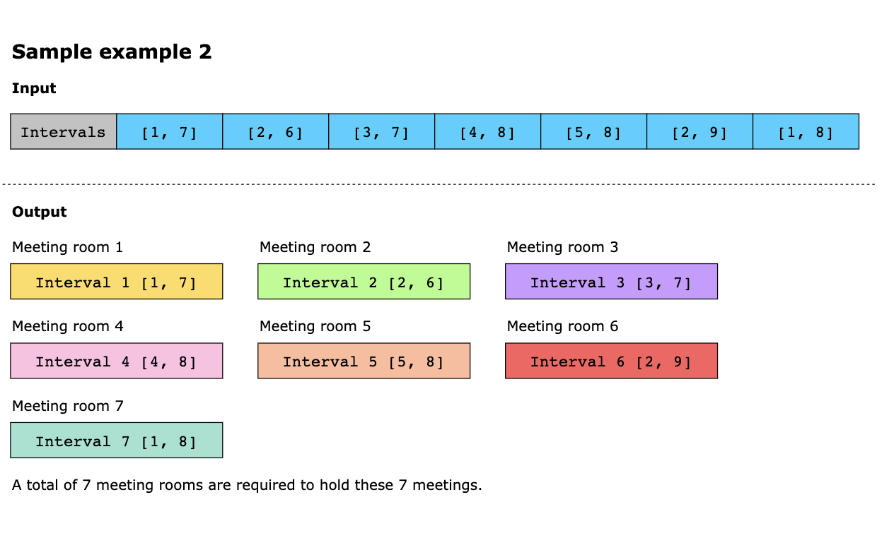
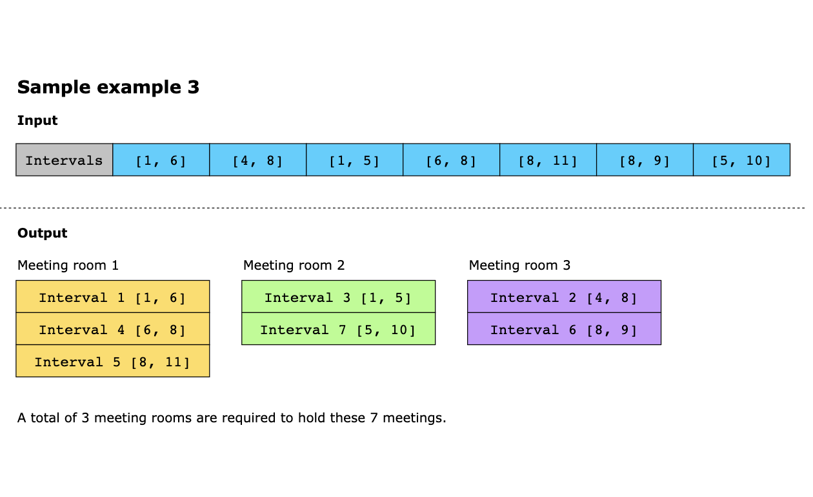

## Solution

### Naive Approach

The naive approach to solve this problem is to check each meeting’s interval with every other meeting’s interval to 
determine if a room is available or a new room needs to be allocated. Though this approach is easy, it becomes 
inefficient when there are a large number of meetings and their time intervals overlap. In the worst-case scenario, we 
would need to allocate a new room for each meeting, resulting in a time complexity of O(n^2), where n is the number of 
meetings. Therefore, while this approach can work for small inputs, it is not scalable and becomes impractical for 
larger inputs. So, let’s devise an optimized approach to solve this problem.

### Solution summary

To recap, the solution to this problem can be divided into the following four parts:

1. We sort the meeting intervals based on their start times. 
2. We maintain a min-heap and insert the end time of the first meeting. 
3. For each meeting, we check the following:
   - If the minimum end time is less than or equal to the start time of a new meeting, then a room is available.
   - If a meeting room is unavailable, a new room is allocated for the meeting.
4. The size of the heap after all meetings have been processed is equal to the minimum number of rooms required to 
   accommodate all meetings.

#### Time Complexity

Since we are sorting the intervals and also maintaining the heap, we have to take the time taken by these two processes 
into account. The sorting of the meeting intervals according to the start time takes `O(n × log(n))`. Now, for the heap, 
we know that we add the end time of a meeting if there is no room available for the meeting. Since the cost of adding an 
element to a heap is `O(log(size of heap))` in the worst case, the cost of adding to the heap grows in the following way:

log(1) + log(2) + log(3) + ... + log(n) = log(n!) = O(n log(n))

According to `Stirling’s approximation`, the sum of the above equation is O(n * log(n)). So, the total time complexity 
becomes O(n log(n)) + O(n log(n)) = O(n log(n)).

> Stirling's approximation is a mathematical formula that provides an approximate value for the factorial of a large 
> positive integer

#### Space Complexity

The space complexity of this solution is O(n). This is because we are building a min-heap that, in the worst case, 
can have all the input elements. Therefore, the space required to compute this solution would be O(n).

---
# Meeting Rooms III

Given an integer, rooms, which represents the total number of rooms, where each room is numbered from 0 to rooms - 1.
Additionally, you are given a 2D integer array called meetings, where each element meetings[i] = 
[starti, endi] indicates that a meeting will be held in the half-closed interval [starti, endi). Each starti is unique.

Meetings are allocated to rooms in the following manner:

1. Each meeting will take place in the unused room with the lowest number.
2. If there are no available rooms, the meeting will be delayed until a room becomes free. The delayed meeting should
   have the same duration as the original meeting.
3. When a room is vacated, the meeting with the earliest original start time is given priority for that room.

Your task is to determine the room number that hosted the most meetings. If there are multiple rooms, return the room
with the lowest number.

> Note: A half-closed interval [a, b) is the interval between a and b, including a and not including b.

## Constraints

- 1 ≤ rooms ≤ 100
- 1 ≤ meetings.length ≤ 1000
- meetings[i].length == 2
- 0 ≤ starti < endi ≤ 10000
- All the values of `starti` are unique

## Examples

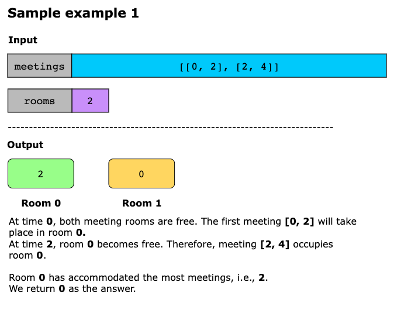
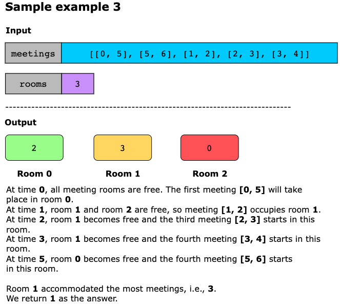

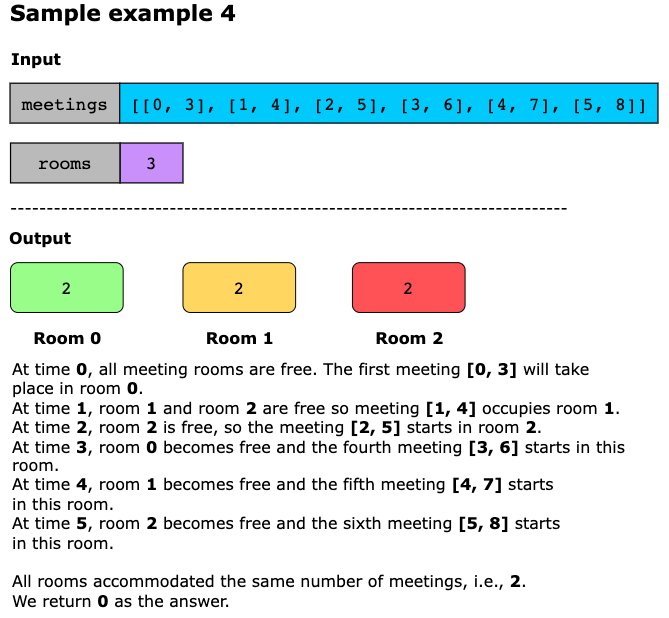

Example 5:
```text
Input: n = 2, meetings = [[0,10],[1,5],[2,7],[3,4]]
Output: 0
Explanation:
- At time 0, both rooms are not being used. The first meeting starts in room 0.
- At time 1, only room 1 is not being used. The second meeting starts in room 1.
- At time 2, both rooms are being used. The third meeting is delayed.
- At time 3, both rooms are being used. The fourth meeting is delayed.
- At time 5, the meeting in room 1 finishes. The third meeting starts in room 1 for the time period [5,10).
- At time 10, the meetings in both rooms finish. The fourth meeting starts in room 0 for the time period [10,11).
Both rooms 0 and 1 held 2 meetings, so we return 0. 
```

Example 6:
```text
Input: n = 3, meetings = [[1,20],[2,10],[3,5],[4,9],[6,8]]
Output: 1
Explanation:
- At time 1, all three rooms are not being used. The first meeting starts in room 0.
- At time 2, rooms 1 and 2 are not being used. The second meeting starts in room 1.
- At time 3, only room 2 is not being used. The third meeting starts in room 2.
- At time 4, all three rooms are being used. The fourth meeting is delayed.
- At time 5, the meeting in room 2 finishes. The fourth meeting starts in room 2 for the time period [5,10).
- At time 6, all three rooms are being used. The fifth meeting is delayed.
- At time 10, the meetings in rooms 1 and 2 finish. The fifth meeting starts in room 1 for the time period [10,12).
Room 0 held 1 meeting while rooms 1 and 2 each held 2 meetings, so we return 1. 
```

## Topics

- Array
- Hash Table
- Sorting
- Heap (Priority Queue)
- Simulation

## Hints

- Sort meetings based on start times.
- Use two min heaps, the first one keeps track of the numbers of all the rooms that are free. The second heap keeps
  track of the end times of all the meetings that are happening and the room that they are in.
- Keep track of the number of times each room is used in an array.
- With each meeting, check if there are any free rooms. If there are, then use the room with the smallest number.
  Otherwise, assign the meeting to the room whose meeting will end the soonest.

## Solution

We use a two-heap approach for optimal scheduling to determine which room hosts the most meetings. One min heap keeps
track of available rooms, ordered by room number, while the other tracks rooms currently in use, ordered by their next
availability (i.e., meeting end time). This setup ensures we always have quick access to the room that becomes free the
earliest or the lowest-numbered available room.

As all meeting start times are unique, we sort the meetings by their start time to process them chronologically. For
each meeting:

- **Freeing up rooms**: Before scheduling the current meeting, we remove entries from the in-use heap whose end times
  are less than or equal to the current meeting’s start time. Each freed room is pushed back into the available heap.
- **Assigning a room**:
  - If the available heap is not empty, we pop the room with the lowest number and assign the meeting to it. 
  - If no room is available, we pop the room from the in-use heap with the earliest end time. We delay the meeting to
    start at the room’s available time, then reassign it back into the in-use heap with the new end time.
- **Tracking usage**: Each time a room is assigned, we increment its usage counter.

After processing all meetings, we scan the counters and return the room with the highest count. The room with the lowest
number is selected in case of a tie.

The steps of the algorithm are as follows:
1. Initialize a count array of size equal to the number of rooms to track the number of meetings held by each room.
2. Create two min heaps:
   - `available`: Contains free room numbers. 
   - `used_rooms`: Contains pairs of (end time, room number) for rooms currently in use.
3. Populate the `available` min heap with all room numbers [0, 1, 2, ..., rooms-1].
4. Sort the `meetings` list by their `start_time` to process them in chronological order.
5. For each meeting interval `(start_time, end_time)`:
   - Free up rooms: While the top room in `used_rooms` has an `end_time` ≤ `start_time`, remove it from `used_rooms` and
     add the room back to available.
   - If no rooms are available, pop the room that will be free soonest from `used_rooms`. As the meeting must be delayed,
     calculate its new `end_time` by extending the duration starting from the previous room’s `end_time`.
   - Allocate the smallest available room (pop from `available`) and push its new (`end_time`, `room`) into `used_rooms`.
   - Increment that room’s meeting count in the `count` array.
6. After all meetings are processed, return the room’s index with the maximum meeting count. In case of a tie, return
   the smallest index.

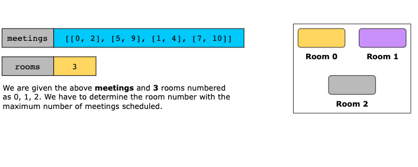
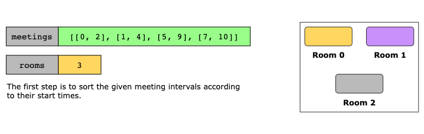
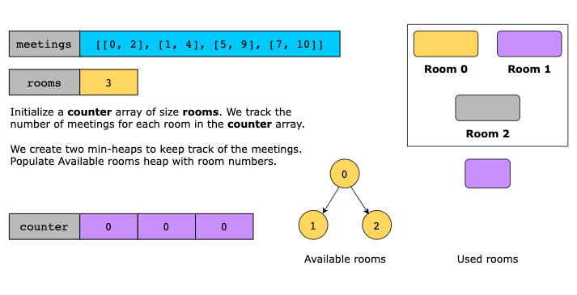
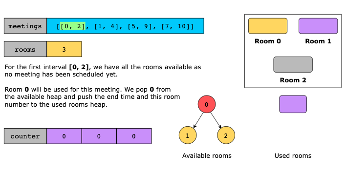
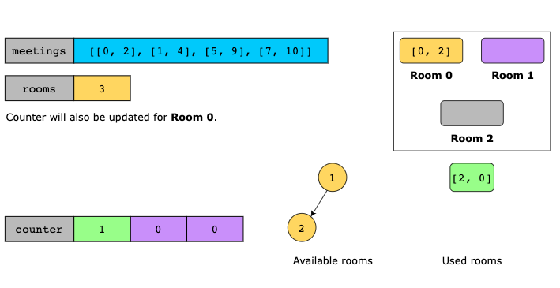
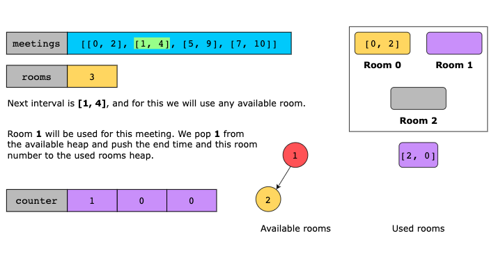
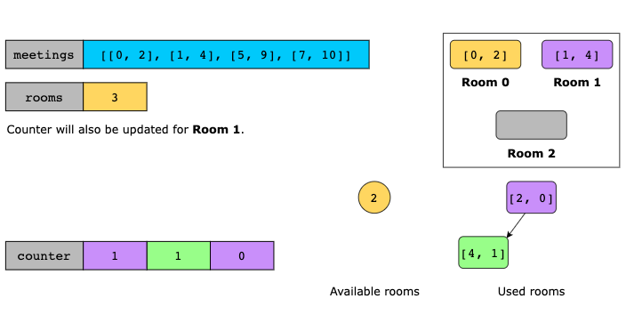
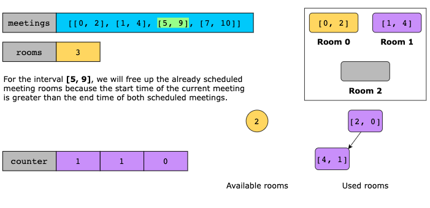
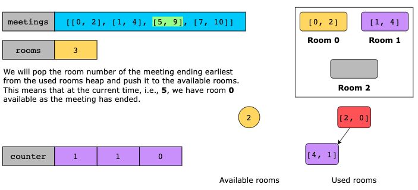
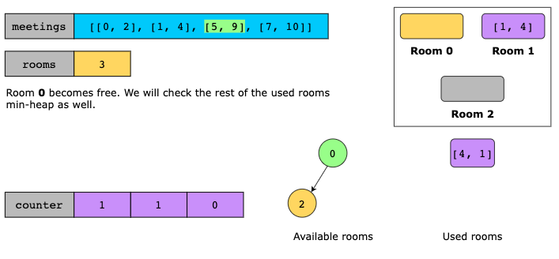

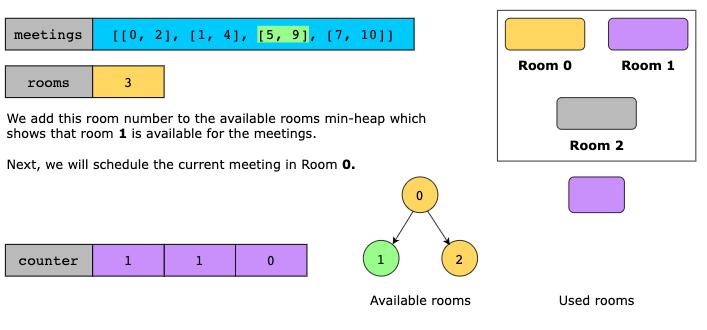
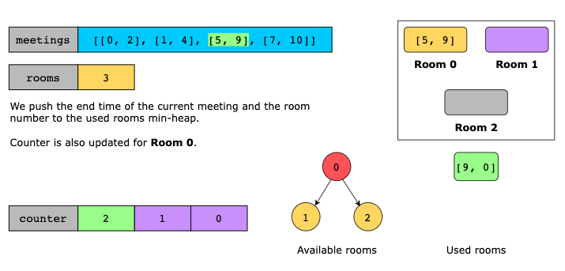
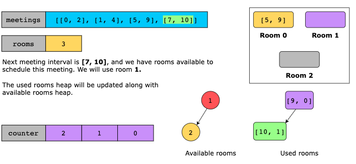
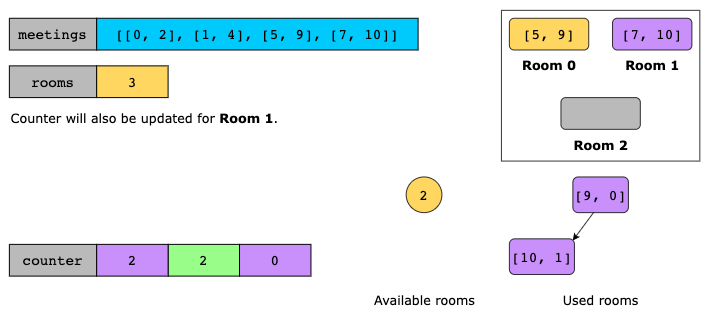
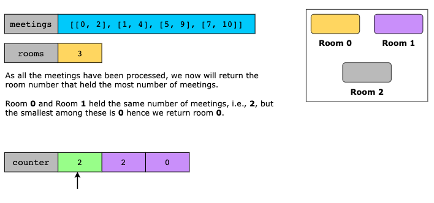

### Time Complexity

There are mainly two factors contributing toward the time complexity of a problem:

- **Sorting**: The sorting of the given intervals takes `O(m log(m))` where m is the number of meetings or intervals.
- **Heap operations**: We perform multiple push and pop operations for each room. Therefore, we have `O(log n)` time
  complexity for each operation where n is the number of rooms. As the heap operations are done for all the given
  meetings, the time complexity leads to `O(m log(n))`.

Hence, the total complexity becomes `O(m log(m) + m log(n))`.

### Space Complexity

The space complexity of this solution will mainly be contributed by the `counter` array, i.e., O(n) where 
n is the number of rooms, and the two min-heaps `used_rooms` and `available` i.e., O(n+n)
as in the worst-case scenario, either of these two heaps can have n elements. Hence, the overall space complexity will
lead up to `O(n+n+n)`, which is `O(n)`.
