# Minimum Interval to Include Each Query

You are given a 2D integer array intervals, where intervals[i] = [lefti, righti] describes the ith interval starting at
lefti and ending at righti (inclusive). The size of an interval is defined as the number of integers it contains, or
more formally righti - lefti + 1.

You are also given an integer array queries. The answer to the jth query is the size of the smallest interval i such
that lefti <= queries[j] <= righti. If no such interval exists, the answer is -1.

- If at least one interval contains the query, return the minimum interval size among those intervals.
- If no interval contains the query, return -1 for that query.

Return an array containing the answers to the queries.

## Examples

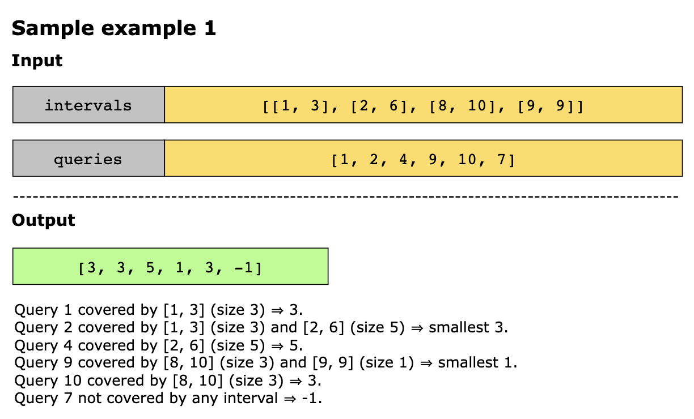
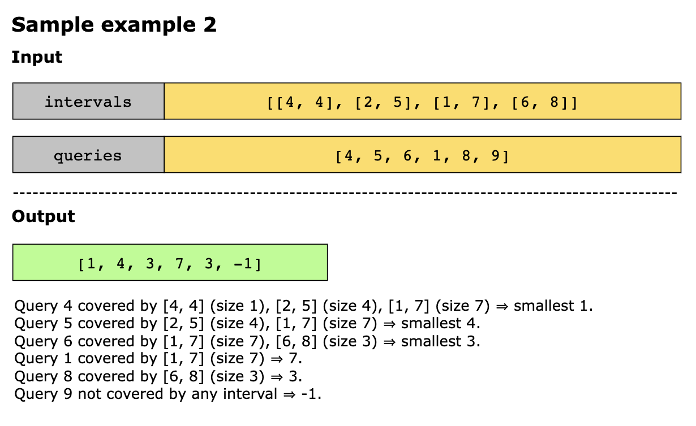
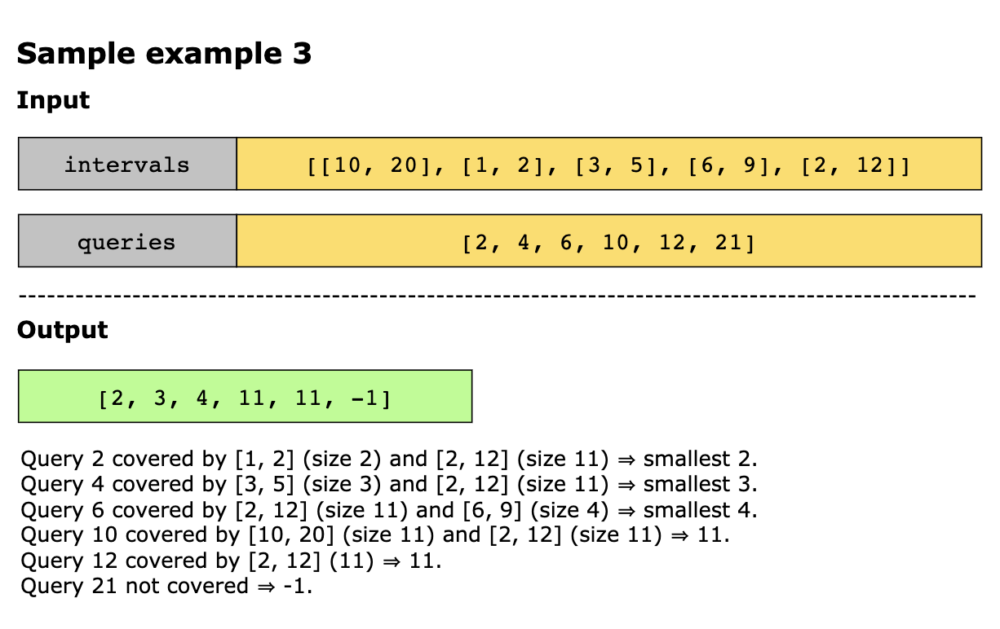

Example 4

```text
Input: intervals = [[1,4],[2,4],[3,6],[4,4]], queries = [2,3,4,5]
Output: [3,3,1,4]
Explanation: The queries are processed as follows:
- Query = 2: The interval [2,4] is the smallest interval containing 2. The answer is 4 - 2 + 1 = 3.
- Query = 3: The interval [2,4] is the smallest interval containing 3. The answer is 4 - 2 + 1 = 3.
- Query = 4: The interval [4,4] is the smallest interval containing 4. The answer is 4 - 4 + 1 = 1.
- Query = 5: The interval [3,6] is the smallest interval containing 5. The answer is 6 - 3 + 1 = 4.
```

Example 5
```text
Input: intervals = [[2,3],[2,5],[1,8],[20,25]], queries = [2,19,5,22]
Output: [2,-1,4,6]
Explanation: The queries are processed as follows:
- Query = 2: The interval [2,3] is the smallest interval containing 2. The answer is 3 - 2 + 1 = 2.
- Query = 19: None of the intervals contain 19. The answer is -1.
- Query = 5: The interval [2,5] is the smallest interval containing 5. The answer is 5 - 2 + 1 = 4.
- Query = 22: The interval [20,25] is the smallest interval containing 22. The answer is 25 - 20 + 1 = 6.
```

## Constraints

- 1 <= intervals.length <= 10^5
- 1 <= queries.length <= 10^5
- intervals[i].length == 2
- 1 <= lefti <= righti <= 10^7
- 1 <= queries[j] <= 10^7

## Topics

- Array
- Binary Search
- Sweep Line
- Sorting
- Heap (Priority Queue)

## Hints

- Is there a way to order the intervals and queries such that it takes less time to query?
- Is there a way to add and remove intervals by going from the smallest query to the largest query to find the minimum
  size?

## Solution

The core idea is to process the queries from smallest to largest, while continuously keeping track of which intervals
are active candidates for the current query. As we move forward through increasing query values, more intervals become
eligible because their left endpoint is now less than equal to the current query, so we add them to a min heap. At the
same time, some previously added intervals may stop being useful because their right endpoints are now less than the
query, meaning they can no longer cover the query (or any future larger query), so we remove them. The heap is ordered
by interval size (smallest first), and we store each interval’s right endpoint alongside its size; this lets us quickly
discard expired intervals and ensures that after cleanup, the heap’s top element always represents the smallest-size
interval that still covers the current query. This gives an efficient way to answer each query without scanning all
intervals repeatedly.

The steps of the algorithm are as follows:

1. Sort intervals by starting point (`left`) so we can add them in the correct order as queries increase.
2. Attach original indexes to queries as (`queryValue`, `originalIndex`), then sort queries by `queryValue` so we
   process them from smallest to largest.
3. Initialize the `ans` array filled with -1
4. Initialize a min heap, `heap`, that stores interval size and right endpoint as tuples `(size, right)`.
5. Initialize a pointer i = 0 to walk through the sorted intervals
6. For each query q in sorted order:
   - **Add all intervals starting at or before q**: While intervals[i].left <= q, push (size, right) into the heap and
     increment i.
   - **Remove invalid intervals**: While heap top has `right < q`, pop it (it cannot cover `q` anymore).
   - Answer the query:
     - If the heap is non-empty, the top element’s `size` is the smallest interval covering `q`, so store it in the `ans`
       array at the query’s original index.
     - Otherwise, leave `ans` as -1.
7. Return ans in the original query order.

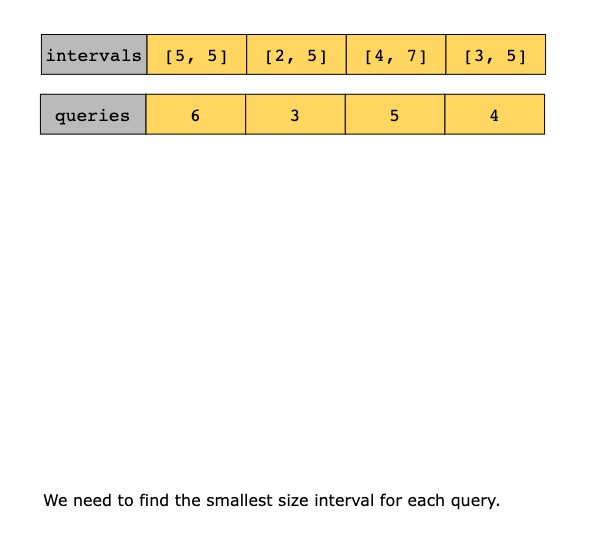
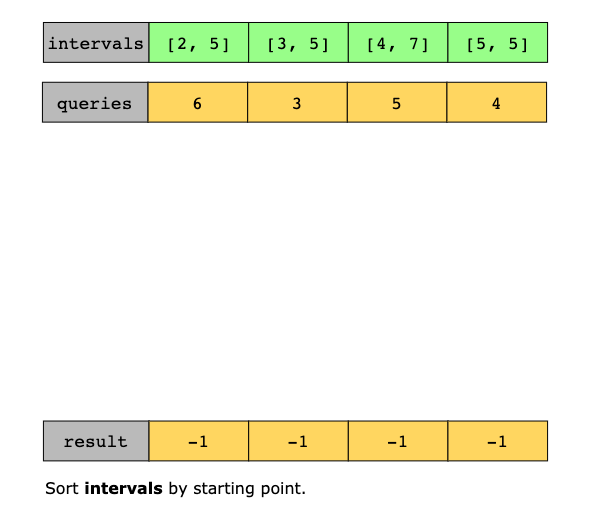
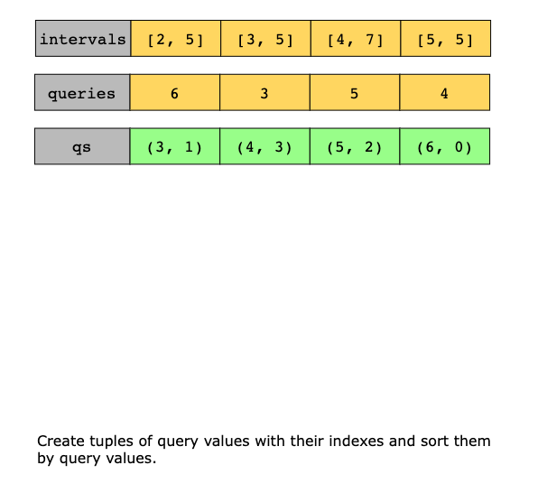
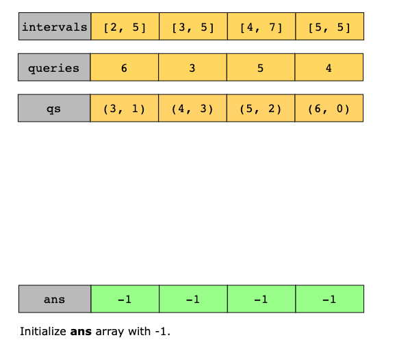
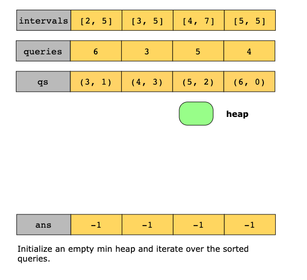
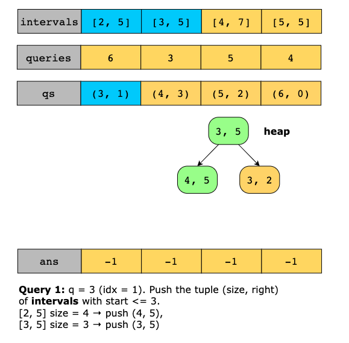
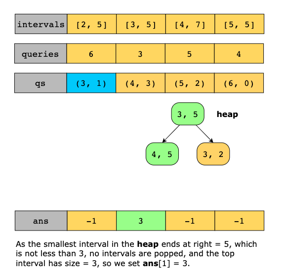
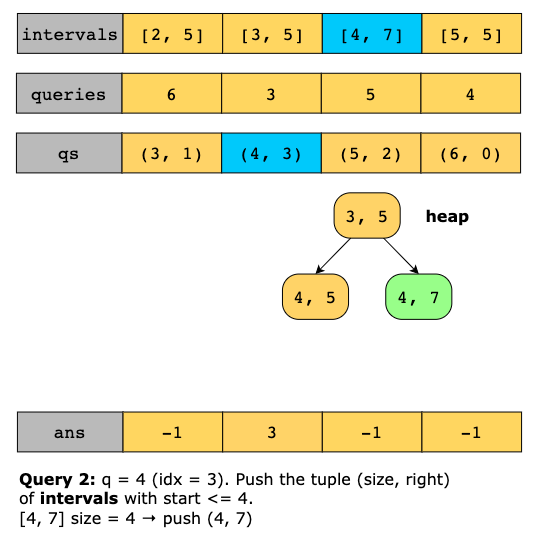
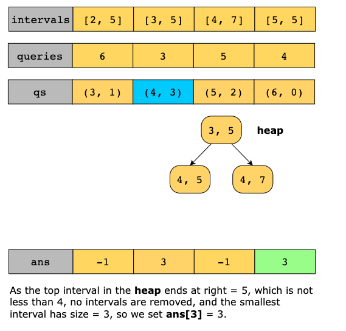
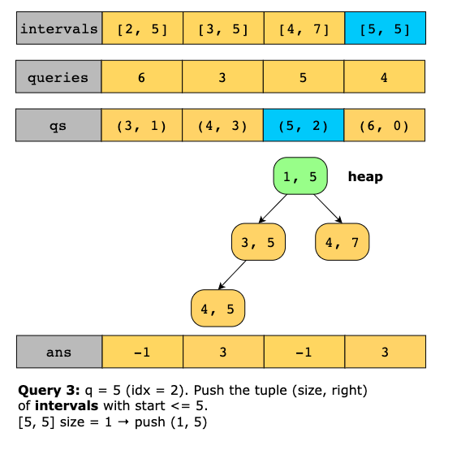
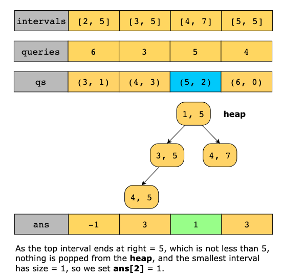
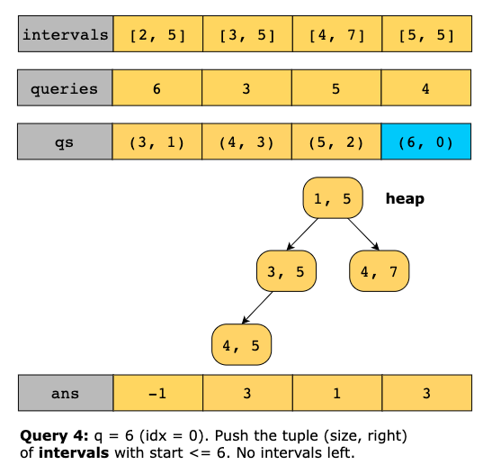
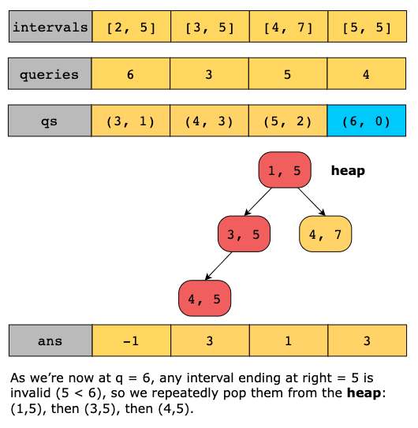
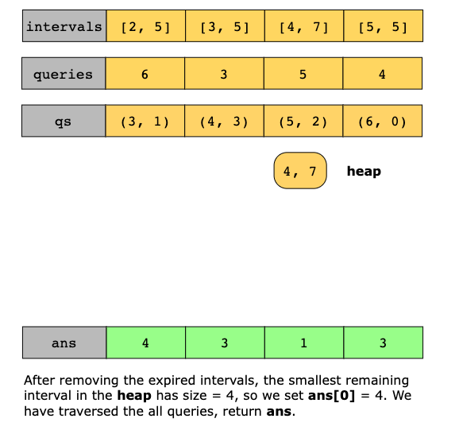

## Complexity Analysis

### Time Complexity

The algorithm's time complexity is dominated by sorting and heap operations. Sorting the `intervals` array takes 
`O(nlog(n))`, where `n` is the number of intervals, and sorting the queries (after pairing each query with its original
index) takes `O(mlog(m))`, where `m` is the number of queries.

During the sweep through the sorted queries, each interval is pushed into the min heap at most once, and popped at most
once, and each heap operation costs `O(log(n))`, giving a total heap cost of `O(nlog(n))`.

Altogether, the overall time complexity is `O(n log(n) + m log(m) + n log(n))`, which is commonly simplified to 
`O((n+m) log(n))` (or equivalently O(n log (n) + m log(m))).

### Space Complexity

The space complexity is `O(n+m)` because, in the worst case, the heap can hold up to `n` intervals, and we also store
the sorted query list and the answer array, each of size `m`.
