# Remove Covered Intervals

Given an array of intervals, where each interval is represented as intervals[i]=[li,ri) (indicating the range from 
li to ri, inclusive of li and exclusive of ri), remove all intervals that are completely covered by another interval in 
the list. Return the count of intervals that remain after removing the covered ones.

> Note An interval [a, b) is considered covered by another interval [c,d) if and only if c ⇐ a and b ⇐ d.

## Constraints

- 1 <= intervals.length <= 10^4
- intervals[i].length == 2
- 0 <= li < ri <= 10^5
- All the give intervals are unique

## Examples

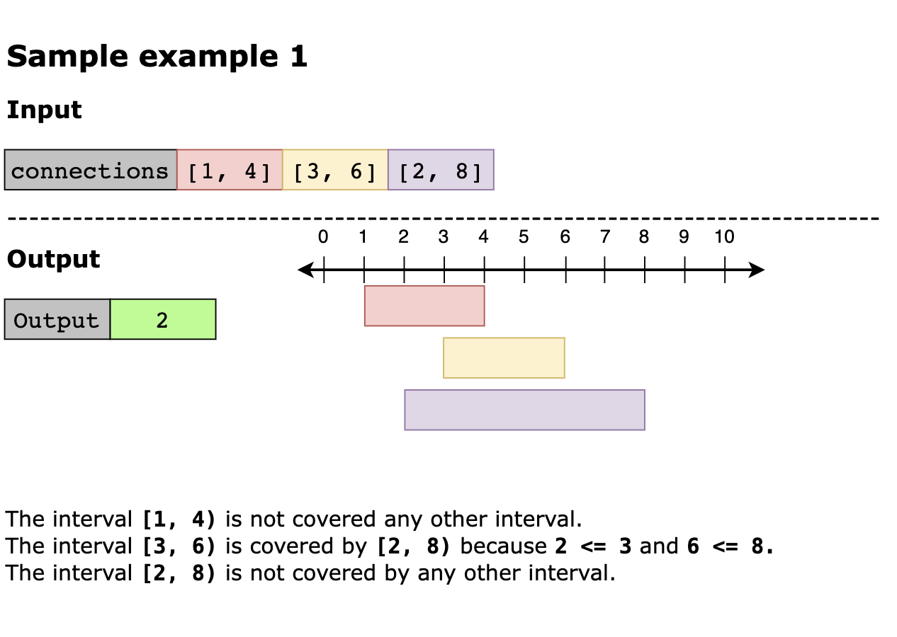
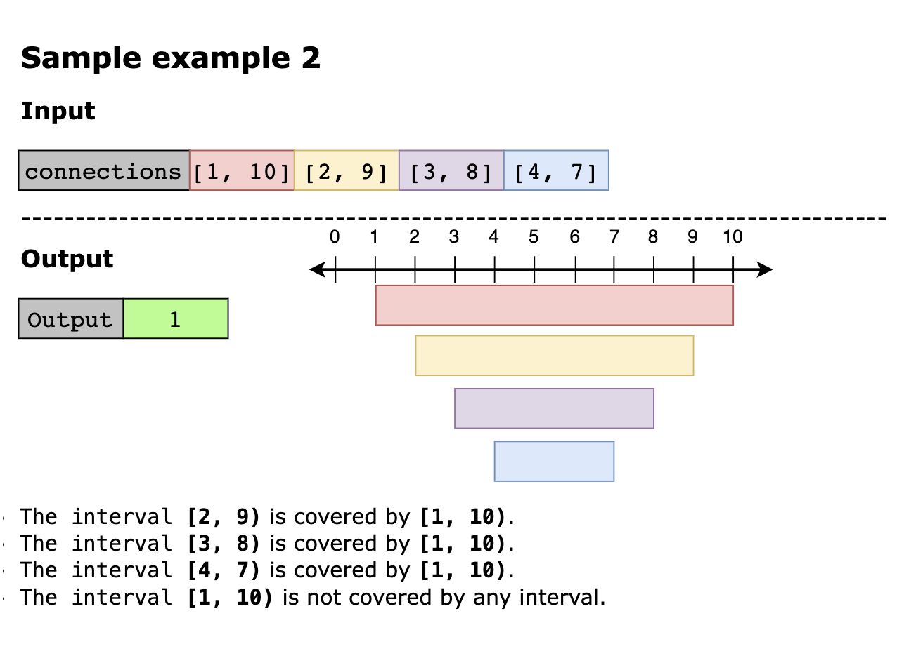
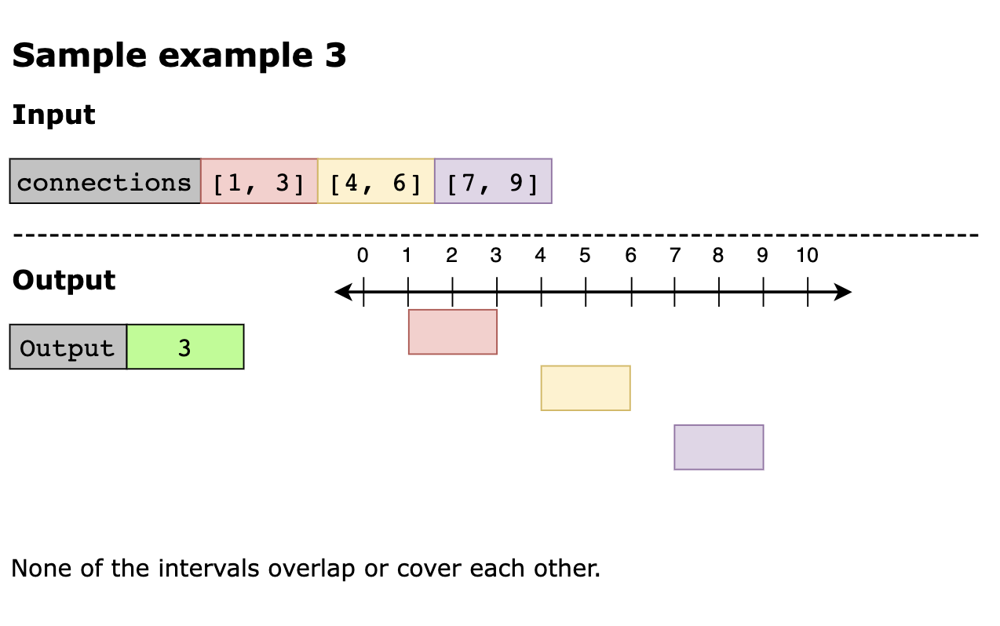
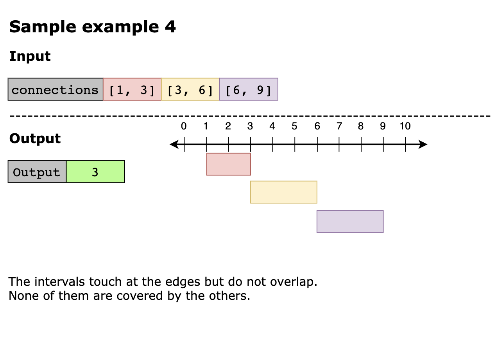
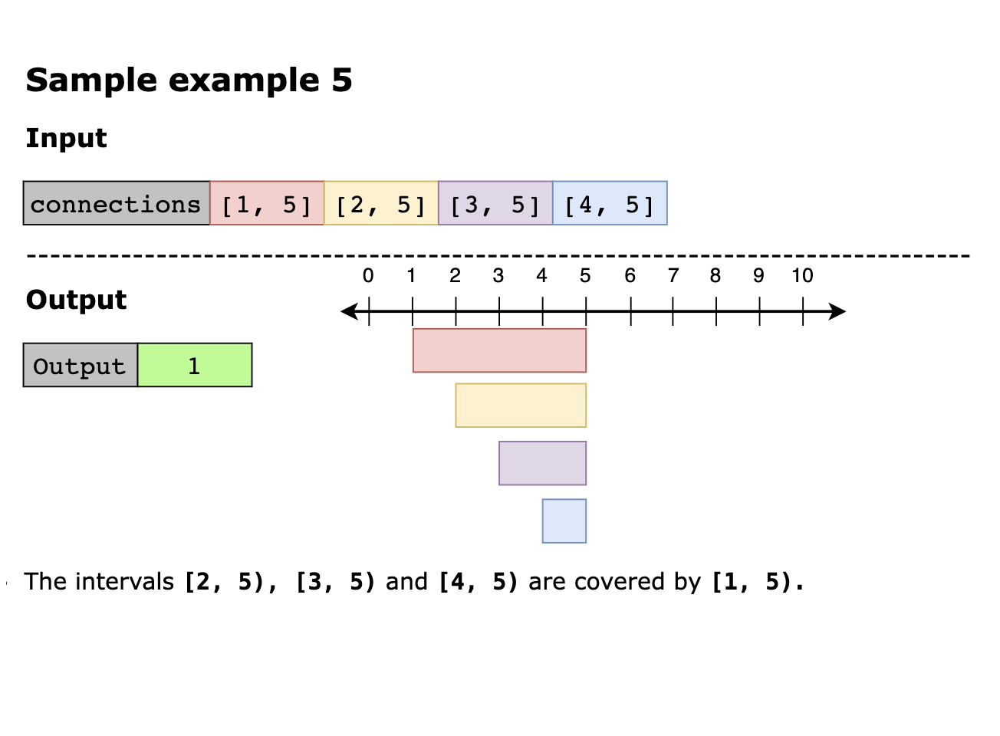

## Solution

The first step is to simplify the process by sorting the intervals. Sorting by the start point in ascending order is 
straightforward and simplifies the iteration process. However, an important edge case arises when two intervals share 
the same start point. In such scenarios, sorting solely by the start point would fail to correctly identify covered 
intervals. To handle this, we sort intervals with the same start point by their endpoint in descending order, ensuring 
that longer intervals come first. This sorting strategy guarantees that if one interval covers another, it will be 
positioned earlier in the sorted list. Once the intervals are sorted, we iterate through them while keeping track of the 
maximum endpoint seen so far. If the current interval’s end point exceeds this maximum, it is not covered, so we increment 
the count and update the maximum end. The interval is covered and skipped if the endpoint is less than or equal to the 
maximum. After completing the iteration, the final count reflects the remaining non-covered intervals.

Now, let’s look at the solution steps below:

1. If the start points are the same, sort the intervals by the start point in ascending order, otherwise, sort by the 
   endpoint in descending order to prioritize longer intervals. 
2. Initialize the count with zero to track the remaining (non-covered) intervals. 
3. Initialize prev_end with zero to track the maximum end value we’ve seen.. 
4. Start iterating through intervals for each interval [start, end] in the sorted list:
   - If end > prev_end, any previous interval does not cover the interval. 
     - Increment count by 1 
     - Update prev_end to end. 
   - Else:
     - A previous interval covers the interval, so we skip it.

5. After iterating through all the intervals, the return count is the final value, representing the remaining intervals.

Let’s look at the following illustration to get a better understanding of the solution:

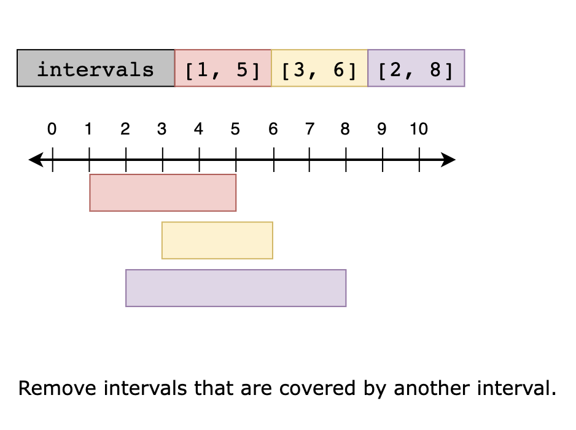
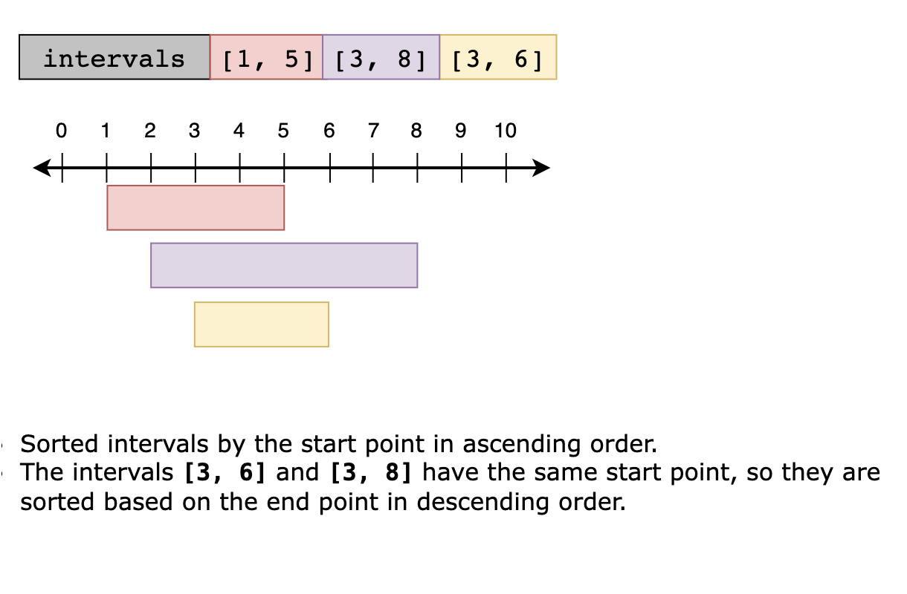
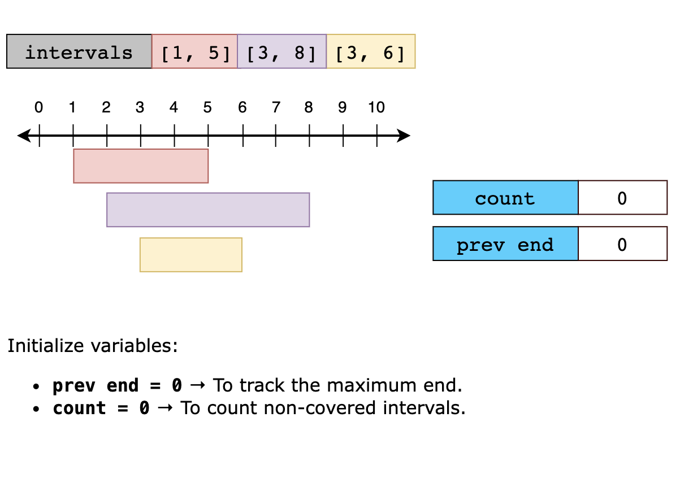
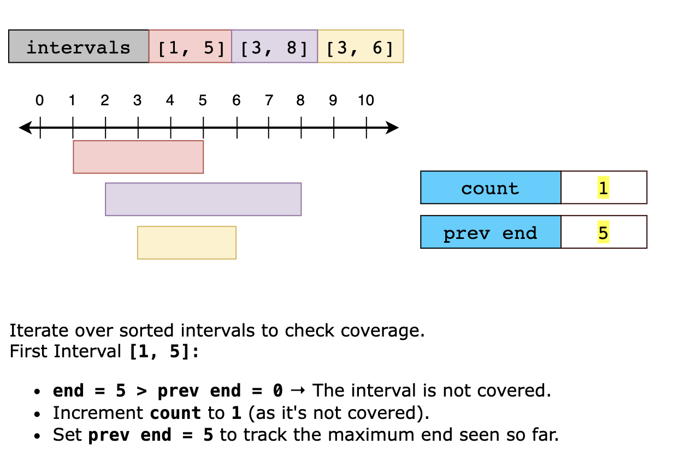
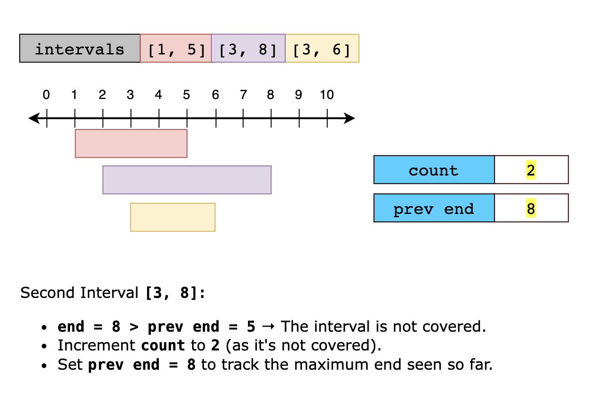
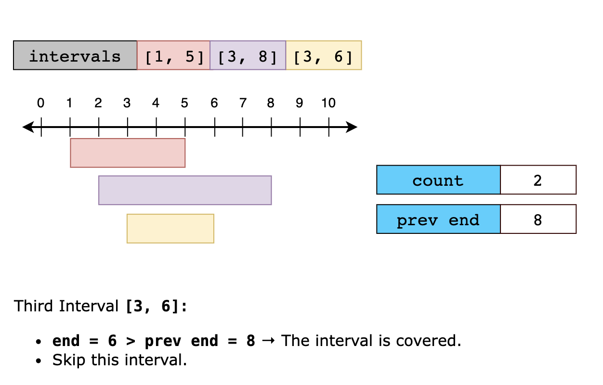
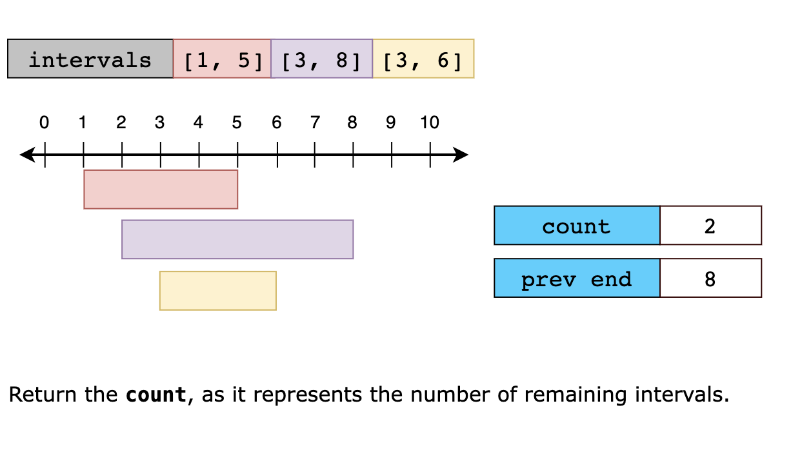

### Time Complexity

The time complexity of the solution is O(n logn), where n is the number of intervals. This is because sorting the 
intervals takes O(n logn) time, and the subsequent iteration through the intervals takes O(n) time. Therefore, the 
overall time complexity is dominated by the sorting step, resulting in O(n logn).

### Space Complexity

The sorting operation has a space complexity of O(n) in the worst case due to additional memory required for temporary 
arrays during the sorting process. Apart from the space used by the built-in sorting algorithm, the algorithm’s space 
complexity is constant, O(1). Therefore, the overall space complexity of the solution is O(n).
