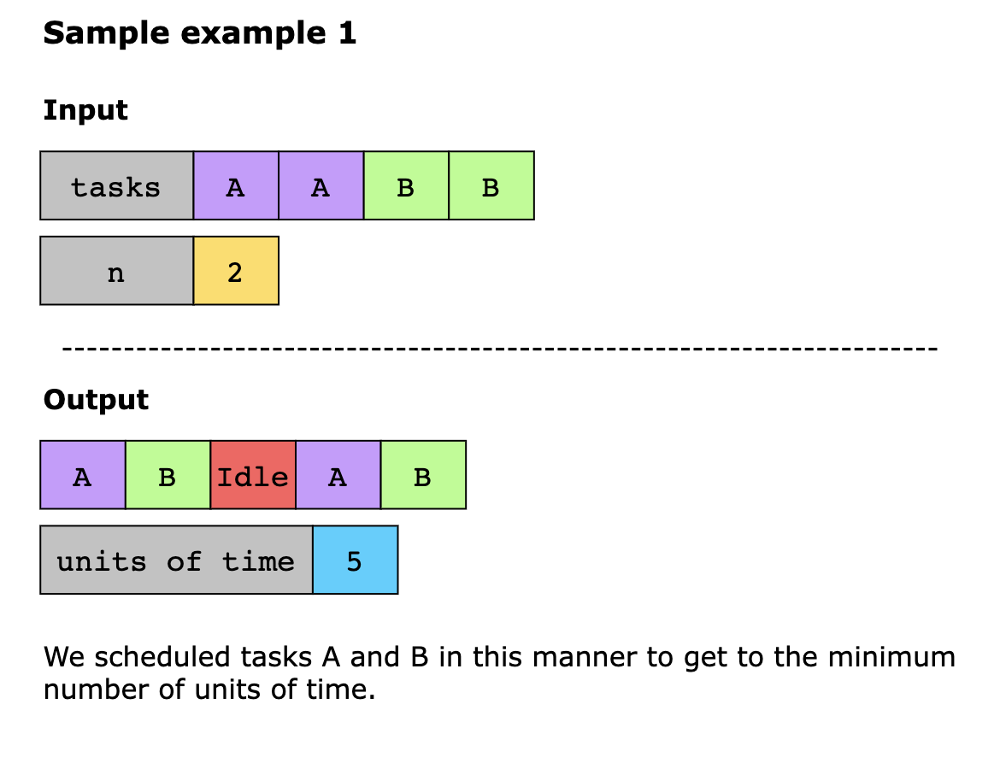
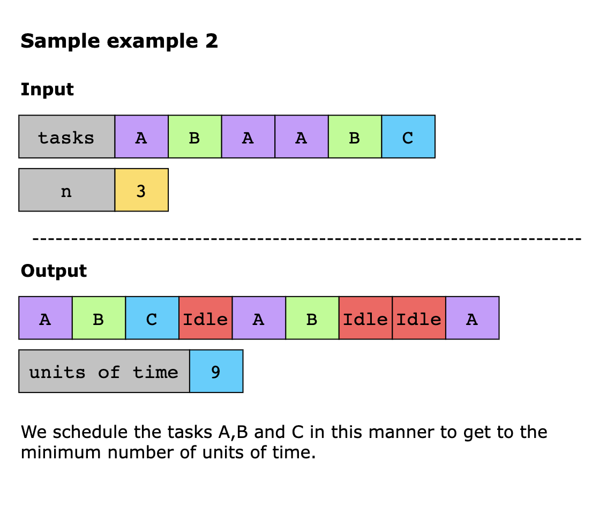
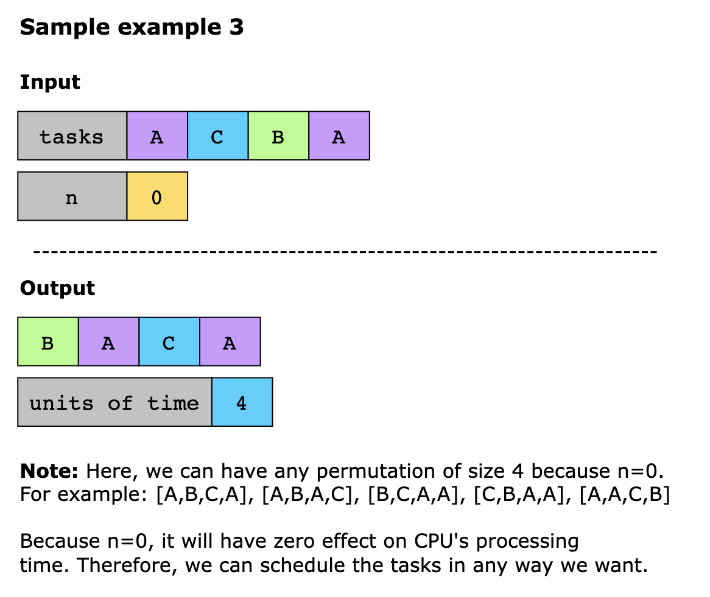

# Task Scheduler

You are given an array of CPU tasks represented by uppercase letters (A to Z) and an integer n, which denotes the 
cooling period required between any two identical tasks. Each task takes exactly one CPU interval to execute. Therefore,
each CPU interval can either perform a task or remain idle. Tasks can be executed in any order, but the same task must 
be separated by at least n intervals.

Determine the minimum number of CPU intervals required to complete all tasks.

**Constraints**

- 1 ≤ `tasks.length` ≤ 1000
- 0 ≤ `n` ≤ 100
- `tasks` consists of uppercase English letters

## Examples

