# Kth Smallest Element in a Sorted Matrix

Given an n x n matrix where each of the rows and columns is sorted in ascending order, return the kth smallest element
in the matrix.

Note that it is the kth smallest element in the sorted order, not the kth distinct element.

You must find a solution with a memory complexity better than O(n^2).

## Examples

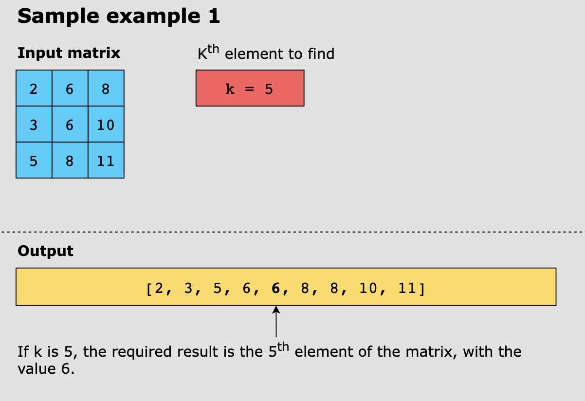
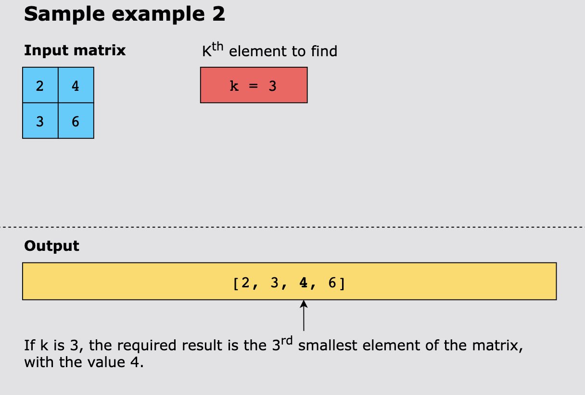
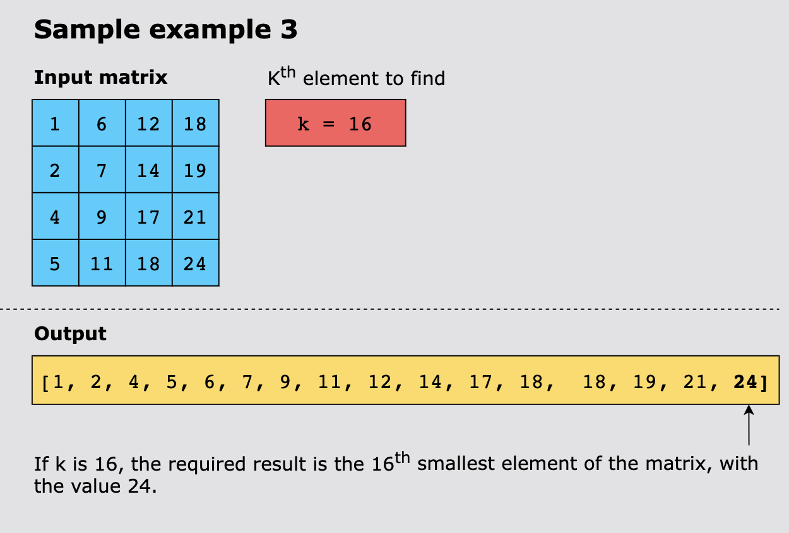

Example 4:

```text
Input: matrix = [[1,5,9],[10,11,13],[12,13,15]], k = 8
Output: 13
Explanation: The elements in the matrix are [1,5,9,10,11,12,13,13,15], and the 8th smallest number is 13
```

Example 5:
```text
Input: matrix = [[-5]], k = 1
Output: -5
```

## Constraints

- n == `matrix.length` == `matrix[i].length`
- 1 <= n <= 300
- -10^9 <= `matrix[i][j]` <= 10^9
- All the rows and columns of matrix are guaranteed to be sorted in non-decreasing order.
- 1 <= k <= n^2

## Topics

- Binary Search
- Sorting
- Heap (Priority Queue)
- Matrix

## Solution

A key observation when tackling this problem is that the matrix is sorted along rows and columns. This means that whether
we look at the matrix as a collection of rows or as a collection of columns, we see a collection of sorted lists.

As we know, the k way merge pattern merges k-sorted arrays into a single sorted array using a heap. Therefore, to find
the `kth` smallest element in the matrix, we will use the same method where we will deal with the rows of the matrix as 
k sorted arrays. So, this approach uses a min-heap and inserts the first element of each matrix row into the min-heap
(along with their respective row and column indexes for tracking). It then removes the top element of the heap(smallest
element) and checks whether the element has any next element in its row. If it has, that element is added to the heap.
This is repeated until k elements have been removed from the heap. The `kth` element removed is the `kth` smallest
element of the entire matrix.

Here’s how we implement our algorithm using a min-heap to find the `kth` smallest element in a sorted matrix:

1. We push the first element of each row of the matrix in the min-heap, storing each element along with its row and
   column index.
2. Remove the top (root) of the min-heap.
3. If the popped element has the next element in its row, push the next element in the heap.
4. Repeat steps 2 and 3 as long as there are elements in the min-heap, and stop as soon as we’ve popped k elements from
   it.
5. The last popped element in this process is the `kth` smallest element in the matrix.

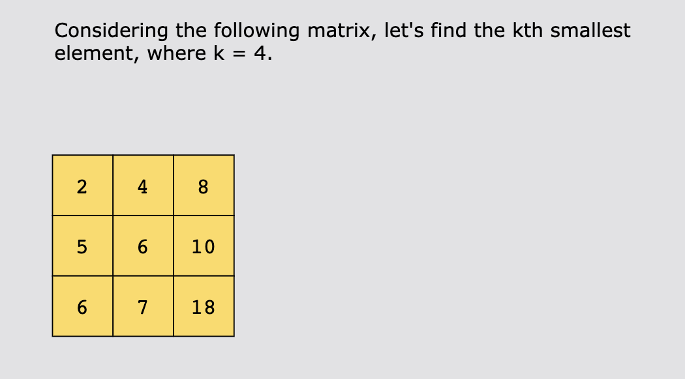
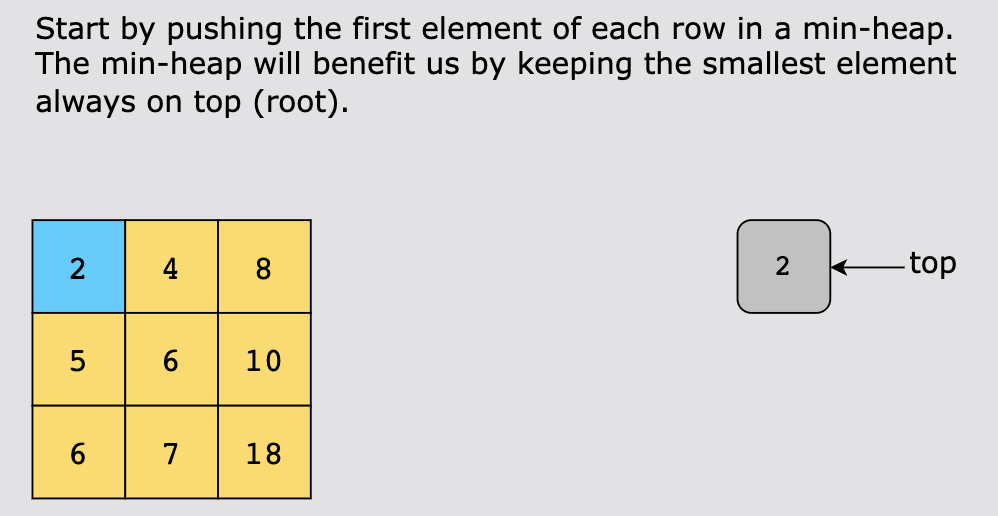
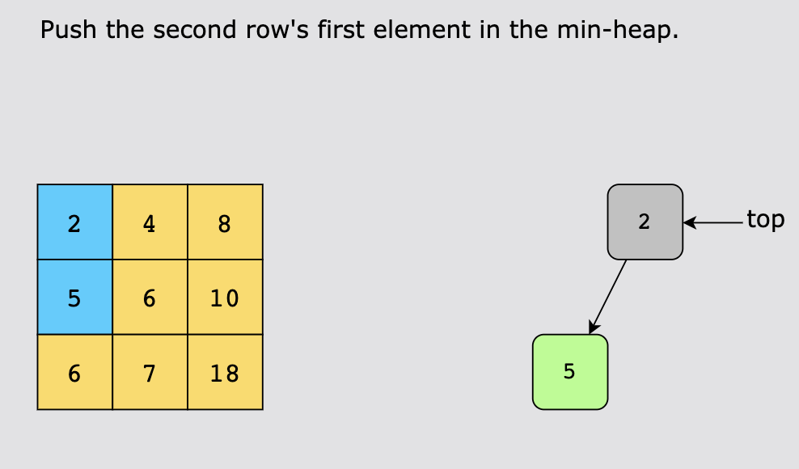
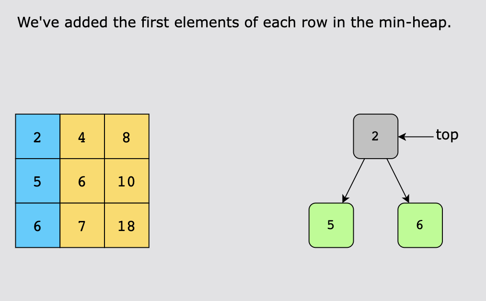
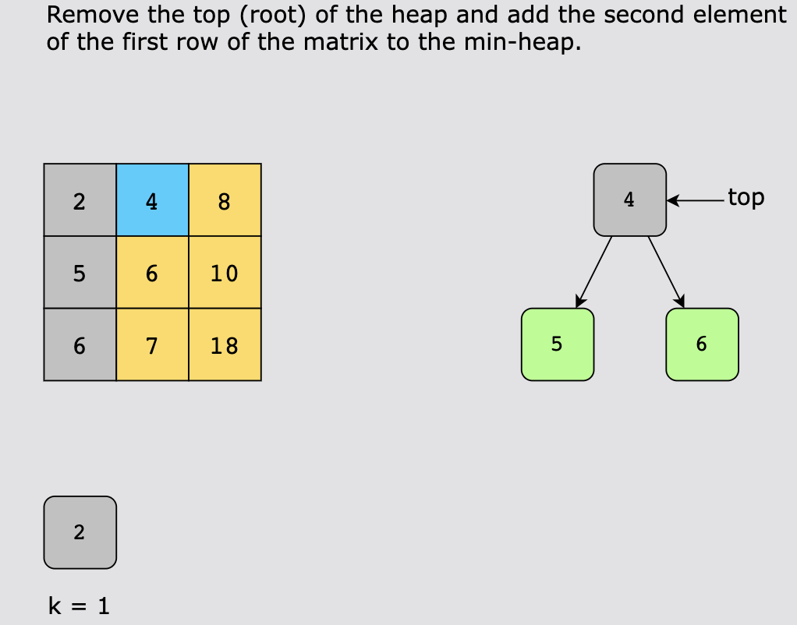
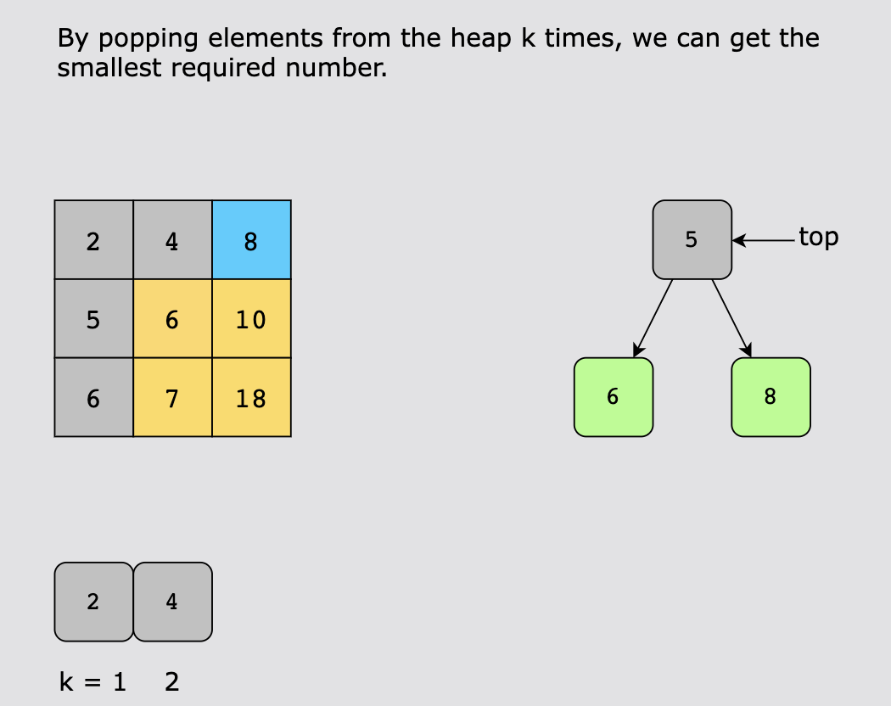
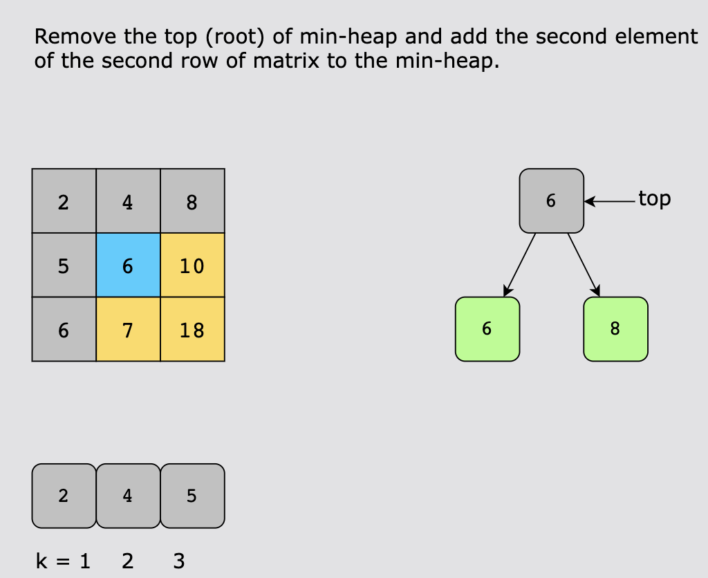
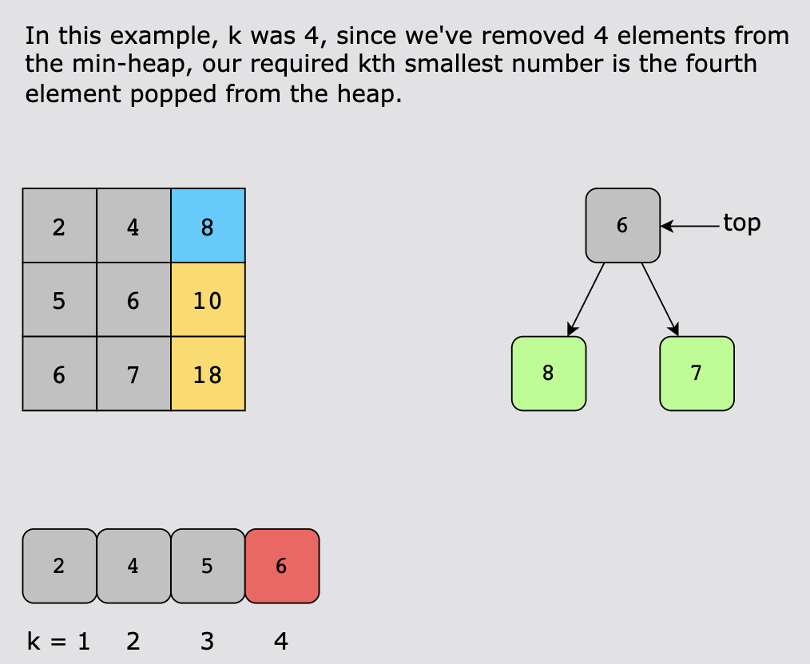

### Time Complexity

The time complexity of the first step is:

- `O(min(n,k))` for iterating over whichever is the minimum of both, where n is the size of the matrix and k is the smallest
  element we need to find.
- The push operation takes `O(log(m))` time, where m is the number of elements currently in the heap. However, since we’re
  adding elements only `min(n,k)` elements, therefore, the time complexity of the first loop is `O(min(n,k)×log(min(n,k)))`
- In the while-loop, we pop and push `m` elements in the heap until we find the `kth` smallest element. In the worst case,
  the heap could have up to `min(n,k)` elements. Therefore, the time complexity of this step is `O(klog(min(n,k)))`

Overall, the total time complexity of this solution is `O((min(n,k)+k)×log(min(n,k)))`

### Space Complexity

The space complexity is O(n), where n is the total number of elements in the min-heap.
