# Best Meeting Point

You are given a 2D grid of size m×n, where each cell contains either a 0 or a 1. A 1 represents the home of a friend,
and a 0 represents an empty space.

Your task is to return the minimum total travel distance to a meeting point. The total travel distance is the sum of the
Manhattan distances between each friend’s home and the meeting point.

The **Manhattan Distance** between two points `(x1, y1)` and `(x2, y2)` is calculated as:
`|x2 - x1| + |y2 - y1|`.

## Constraints

- m == grid.length
- n == grid[i].length
- 1 ≤ m, n ≤ 50
- grid[i][j] is either 0 or 1.
- There will be at least two friends in the grid.

## Examples

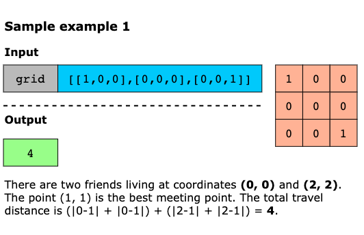
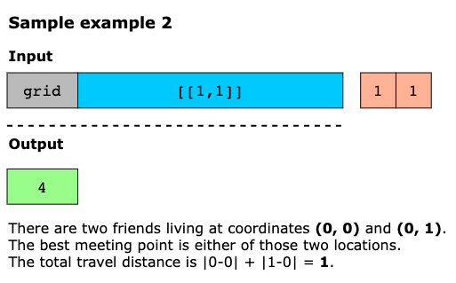
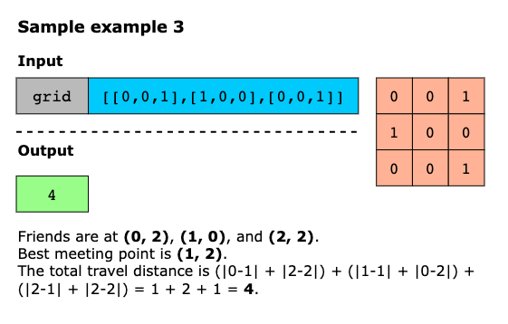

## Solution

The main idea of this algorithm is that the total Manhattan distance is minimized when all friends meet at the median
position, calculated separately for rows and columns. As Manhattan distance can be split into vertical and horizontal
components, we collect all the row indices and column indices of the friends and compute the distance to their respective
medians. As we loop through the grid row-wise and column-wise, the row and column indices are gathered in sorted order
naturally, so no additional sorting is needed. Finally, a two-pointer approach is used to efficiently compute the total
distance by pairing positions from both ends toward the center.

Using the intuition above, we implement the algorithm as follows:

1. Create two vectors, `rows` and `cols`, to store all cells’ row and column indexes where `grid[i][j] == 1`.
2. Iterate through the grid row by row. For each cell that contains a 1, push the row index `i` into the `rows` vector.
3. Iterate through the grid column by column. For each cell that contains a `1`, push the column index j into the `cols` vector.
4. Use the helper function getMinDistance(rows) to calculate the total vertical distance to the optimal row (median).
5. Use the helper function getMinDistance(cols) to calculate the total horizontal distance to the optimal column (median).
6. Return the sum of the two distances as the minimum total travel distance.

The getMinDistance helper function receives a list of positions, points, and returns the total minimum travel distance
to the median. The points list contains either row or column indices of friends. As the Manhattan distance is minimized
at the median, it uses a two-pointer technique as follows:

- Initialize a variable, distance, with 0 to compute the total distance.
- Initialize two pointers, i and j, one at the start and the other at the end.
- Each step adds the difference points[j] - points[i] to the total distance.
- This process continues until the pointers meet.
- Returns the total computed distance.

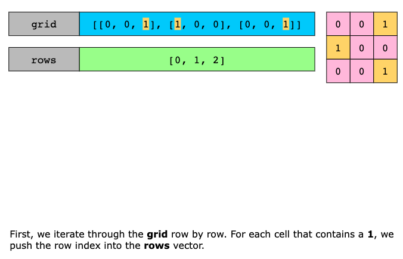
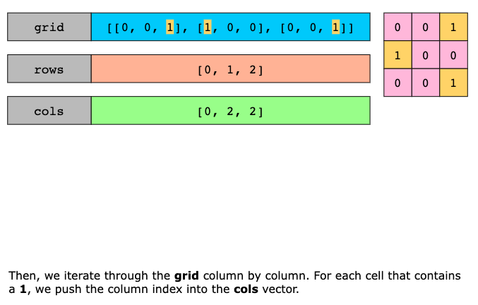

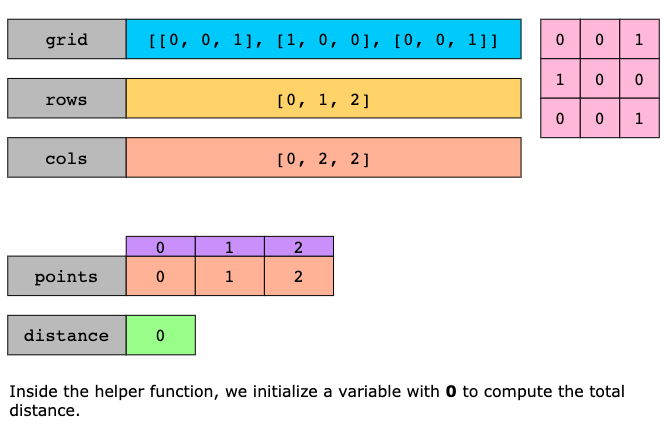
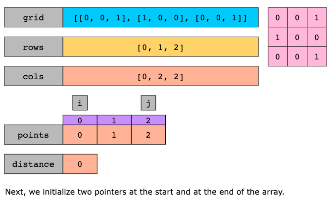
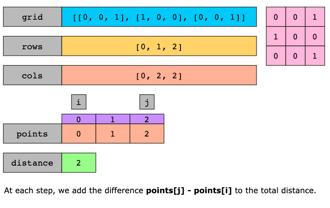
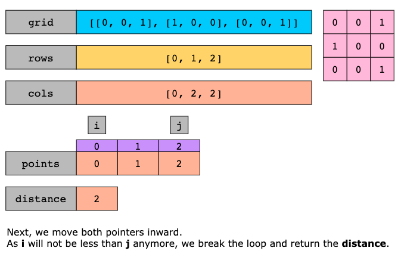
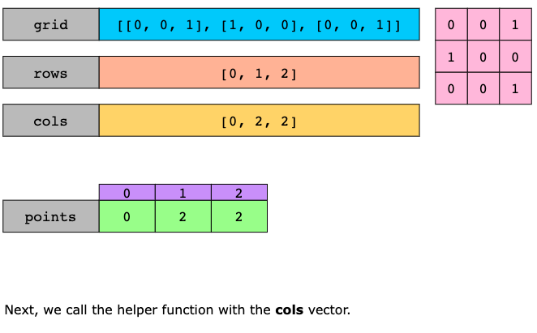
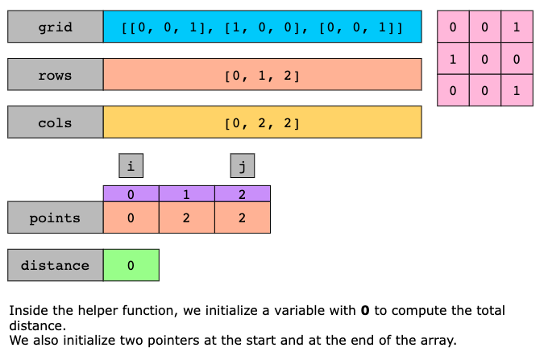
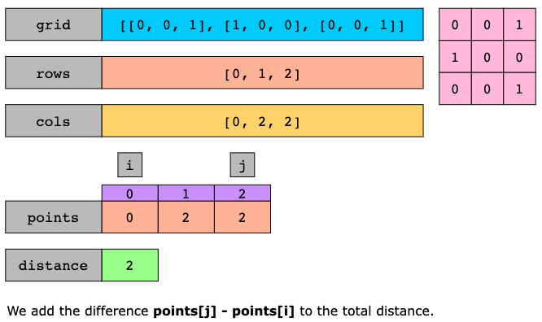
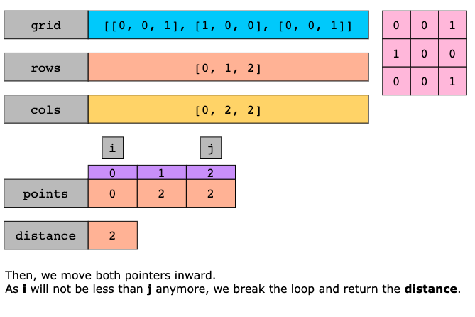
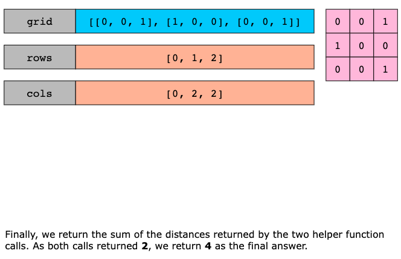

### Time Complexity

The time complexity of the above algorithm is `O(m×n+k)`, where m×n are the dimensions of the grid and k is the number
of friends (number of 1s in the grid). This is because:

- O(m×n) to traverse the entire grid and collect row and column indices. 
- O(k) to compute distances in getMinDistance, where k is the number of friends.

### Space Complexity

The algorithm’s space complexity is `O(k)` because we store up to k row indices and k column indices in two separate
vectors.
