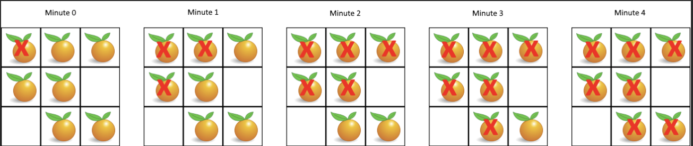

# Rotting Oranges

You are given an m x n grid where each cell can have one of three values:

- 0 representing an empty cell,
- 1 representing a fresh orange, or
- 2 representing a rotten orange.

Every minute, any fresh orange that is 4-directionally adjacent to a rotten orange becomes rotten.

Return the minimum number of minutes that must elapse until no cell has a fresh orange. If this is impossible, return -1.

## Examples



Example 1
```text
Input: grid = [[2,1,1],[1,1,0],[0,1,1]]
Output: 4
```

Example 2:
```text
Input: grid = [[2,1,1],[0,1,1],[1,0,1]]
Output: -1
Explanation: The orange in the bottom left corner (row 2, column 0) is never rotten, because rotting only happens 4-directionally.
```

Example 3:
```text
Input: grid = [[0,2]]
Output: 0
Explanation: Since there are already no fresh oranges at minute 0, the answer is just 0.
```

## Constraints

- m == grid.length
- n == grid[i].length
- 1 <= m, n <= 10
- `grid[i][j]` is 0, 1, or 2.

## Topics

- Array
- Breadth-First Search
- Matrix

## Solution

The algorithm uses BFS (Breadth-First Search) to simulate this minute-by-minute spreading process. It starts by finding
all initially rotten oranges and counting all fresh oranges. Then it processes the rotting in rounds, where each round
represents one minute. In each round, all currently rotten oranges spread the rot to their adjacent fresh oranges
simultaneously. The process continues until either all fresh oranges have rotted (return the number of minutes elapsed)
or no more fresh oranges can be reached (return -1).

The key insight is to think of the rotting process as waves spreading outward from multiple sources simultaneously.
Imagine dropping multiple stones into a pond at the same time - the ripples expand outward from each stone, and where
they meet, they've both reached that point at the same time.

In our problem, the rotten oranges are like those stones, and the rotting process spreads like ripples. Each "wave" or
"ripple" represents one minute of time. All oranges at distance 1 from any rotten orange will rot after 1 minute, all
oranges at distance 2 will rot after 2 minutes, and so on.

This naturally leads us to BFS because:

- BFS processes nodes level by level, which perfectly models the minute-by-minute spreading
- We can start with all initially rotten oranges in our queue (multiple starting points)
- Each level of BFS represents one unit of time

The algorithm maintains a counter fresh_count for fresh oranges. As we process each level:

- We rot all reachable fresh oranges at the current distance
- We decrement fresh_count for each newly rotten orange
- We track how many levels (minutes) we've processed

The beauty of this approach is that BFS guarantees we're always rotting oranges in the optimal order - closest ones first.
When fresh_count reaches 0, we know all fresh oranges have rotted, and the number of levels processed equals the minimum time
needed.

If after BFS completes, fresh_count > 0, it means some fresh oranges were unreachable (isolated), so we return -1.

### Algorithm

- Initial Setup and Counting First, we traverse the entire grid once to:
  - Find all initially rotten oranges (value 2) and add their coordinates (i, j) to a queue `queue`
  - Count all fresh oranges (value 1) and store in variable `fresh_count`
  - This preprocessing helps us know our starting points and when to stop
- BFS Initialization
  - Initialize `minutes_elapsed = 0` to track the number of minutes elapsed
  - Define directions array dirs = (-1, 0, 1, 0, -1) for 4-directional movement
    - Using pairwise(directions) gives us [(-1, 0), (0, 1), (1, 0), (0, -1)] representing up, right, down, left
- Level-by-Level BFS Processing The main BFS loop continues while `queue` is not empty AND `fresh_count` > 0:
  - Increment `minutes_elapsed` at the start of each level (representing one minute passing)
  - Process all oranges at the current level using `for _ in range(len(queue))`:
    - For each rotten orange (i, j), check all 4 adjacent cells
    - Calculate new coordinates: x, y = i + a, j + b
    - If the adjacent cell is within bounds and contains a fresh orange (`grid[x][y]` == 1):
      - Mark it as rotten: `grid[x][y]` = 2
      - Add it to queue for next level: `queue.append((x, y))`
      - Decrement fresh count: `fresh_count -= 1`
      - Early termination: if `fresh_count == 0`, immediately return `minutes_elapsed`
- Final Result After BFS completes:
  - If `fresh_count > 0`: Some fresh oranges couldn't be reached, return -1
  - If `fresh_count == 0`: All fresh oranges have rotted, return 0 (or `minutes_elapsed` if terminated early)

### Complexity Analysis

#### Time Complexity O(m * n)

The algorithm performs a BFS traversal starting from all initially rotten oranges. In the worst case, every cell in the
grid needs to be visited exactly once. The initial scan to find all rotten oranges and count fresh oranges takes O(m × n)
time. The BFS process visits each cell at most once, as each fresh orange becomes rotten exactly once and is added to the
queue once. Therefore, the total time complexity is O(m × n).

#### Space Complexity O(m * n)

The space complexity is determined by the queue used for BFS. In the worst-case scenario, all oranges could be rotten
initially (all cells contain 2), which means the queue would need to store all m × n positions at the start. Even in a
more typical case where oranges rot progressively, the queue could potentially hold O(m × n) elements at any given time
(for example, when a wave of rotting spreads across a large portion of the grid simultaneously). Therefore, the space
complexity is O(m × n).

