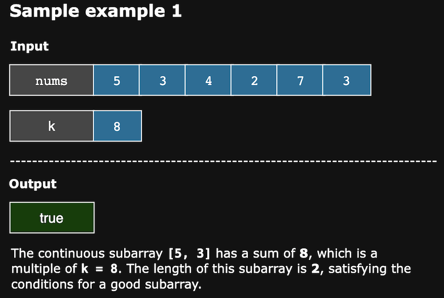

# Continuous Subarray Sum

Given an integer array nums and an integer k, determine if nums contains a good subarray. Return true if such a subarray
exists; otherwise, return false.

A subarray of nums is considered good if:

- Its length is at least 2.
- The sum of its elements is a multiple of k.

> Notes:
> - A subarray is defined as a contiguous sequence of elements within an array.
> - An integer x is a multiple of k if there exists an integer n such that x = n * k. Note that 0 is always considered a 
> multiple of k.

## Constraints

- 1 <= `nums.length` <= 10^4
- 0 <= `nums[i]` <= 10^5
- 0 <= `sum(nums[i])` <= 2^31-1
- 1 <= k <= 2^31-1

## Examples

## Solution

This algorithm’s essence is identifying a subarray in nums whose sum is a multiple of k. We accomplish this by using 
cumulative sums and their remainders when divided by k. A hash map helps us quickly check if a particular remainder has
been encountered before, allowing us to detect subarrays with the desired property.

Here’s why remainders are essential: when we divide a cumulative sum by k, the remainder reveals the part that isn’t 
divisible by k. If two cumulative sums yield the same remainder when divided by k, then the difference between these 
cumulative sums is divisible by k. This indicates that the subarray between these two indices has a sum that’s a multiple
of k.

For instance, if we have cumulative sums at indices i and j where i<j, and the remainder at index i matches the remainder 
at index j, then:

    cumulative_sum[j]−cumulative_sum[i] is divisible by k.

This difference equals the sum of the subarray between i + 1 and j, confirming that the subarray’s sum is a multiple of k.

The steps of the algorithm are as follows:

1. We create a dictionary remainder_map to store remainders of cumulative sums divided by k. This map helps track the 
    first occurrence of each remainder.
2. Initialize remainder_map with {0: -1} to handle cases where a subarray starting from the beginning has a sum multiple
   of k. And initialize cumulative_sum with 0.
3. Calculate a cumulative_sum up to the current index for each element in nums. This cumulative sum represents the sum 
   of elements from the start of the array to the current position.
4. Take the remainder of the cumulative sum divided by k. This remainder tells us if there’s a previously encountered
   subarray whose sum could be a multiple of k.
5. If the remainder is already in remainder_map, it means that two cumulative sums (one at a previous index and one at 
   the current index) have the same remainder when divided by k, which means the difference between these sums is divisible by k.
   This indicates a subarray whose sum is a multiple of k between the previous and current indices.
6. Verify that the length of this subarray is at least 2 by checking if the difference between the current index and the
   stored index of the remainder is greater than 1.
7. Return True immediately if both conditions are met, as we’ve found a qualifying subarray.
8. If the remainder is not in remainder_map, add it with the current index as its value. This ensures that future
   subarrays can reference it if they match this remainder.
9. If the loop completes without finding a qualifying subarray, return False.

### Time Complexity

The time complexity of the algorithm is O(n) because we traverse the array nums once, performing constant time operations
for each element.

### Space Complexity

The space complexity of the algorithm is O(n) because we insert a key-value pair into the hash map in each iteration.
After n iterations, the hash map’s size grows proportionally with the size of the list.
