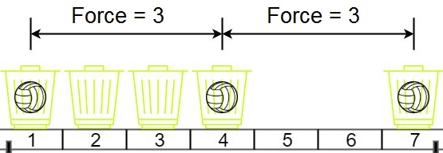
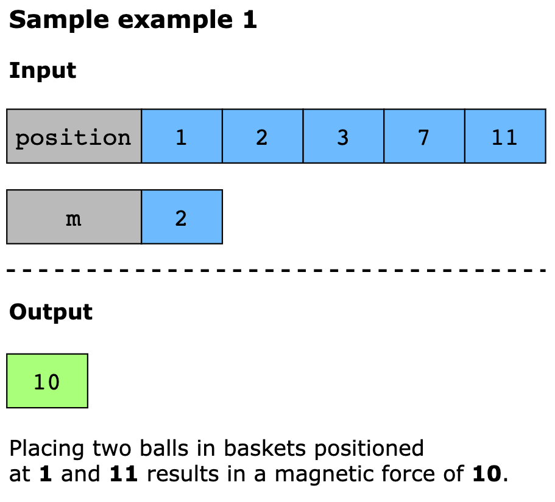
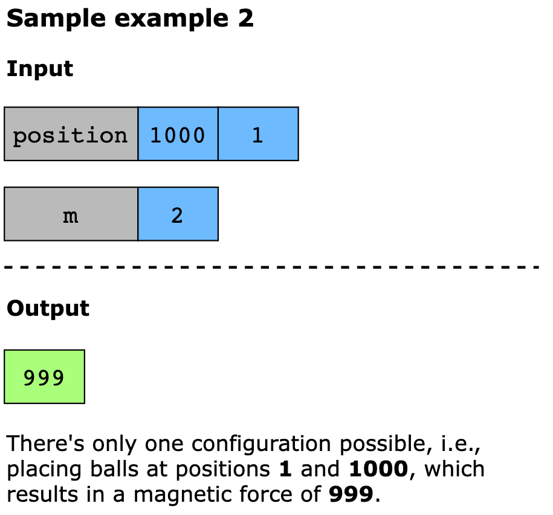
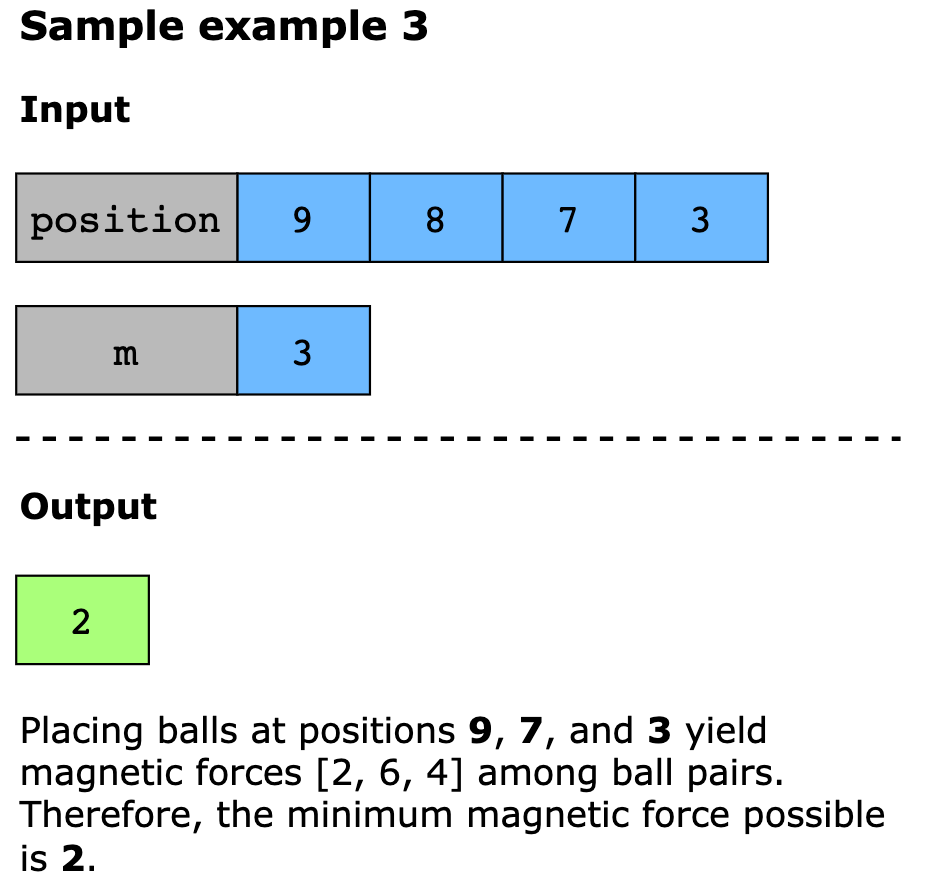

# Magnetic Force Between Two Balls

In the universe Earth C-137, Rick discovered a special form of magnetic force between two balls if they are put in his
new invented basket. Rick has n empty baskets, the ith basket is at position[i], Morty has m balls and needs to distribute
the balls into the baskets such that the minimum magnetic force between any two balls is maximum.

Rick stated that magnetic force between two different balls at positions x and y is |x - y|.

Given the integer array position and the integer m. Return the required force i.e. the maximum possible value of the
minimum magnetic force between any two balls after they have been placed in the baskets.

## Examples

Example:


```text
Input: position = [1,2,3,4,7], m = 3
Output: 3
Explanation: Distributing the 3 balls into baskets 1, 4 and 7 will make the magnetic force between ball pairs [3, 3, 6].
The minimum magnetic force is 3. We cannot achieve a larger minimum magnetic force than 3
```

```text
Input: position = [5,4,3,2,1,1000000000], m = 2
Output: 999999999
Explanation: We can use baskets 1 and 1000000000.
```






## Constraints

- n == `position.length`
- 2 <= n <= 10^5
- 1 <= position[i] <= 10^9
- All integers in `position` are distinct.
- 2 <= `m` <= `position.length`

## Topics

- Array
- Binary Search
- Sorting

## Hints

- If you can place balls such that the answer is x then you can do it for y where y < x.
- Similarly if you cannot place balls such that the answer is x then you cannot do it for y where y > x.
- Binary search on the answer and greedily see if it is possible.
