# Maximum Running Time of N Computers

You are given an integer, n, representing the number of computers, and a 0-indexed integer array, batteries, where 
batteries[i] denotes the number of minutes the ith battery can power a computer.

Your goal is to run all n computers simultaneously for the maximum possible number of minutes using the available 
batteries.

Initially, you may assign at most one battery to each computer. After that, at any moment, you may remove a battery 
from a computer and replace it with another battery—either an unused battery or one taken from another computer. 
This replacement process can be repeated any number of times and takes no time.

Each battery can power any computer multiple times, but only until it is completely drained. Batteries cannot be 
recharged.

Return the maximum number of minutes you can run all n computers simultaneously.

Constraints:

- 1 ≤ `n` ≤ `batteries.length` ≤ 10^5
- 1 ≤ `batteries[i]` ≤ 10^5

## Examples

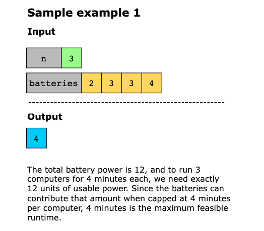
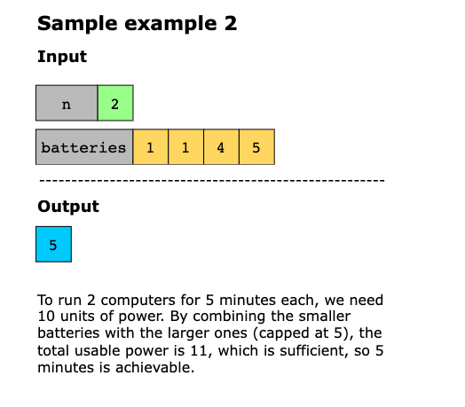
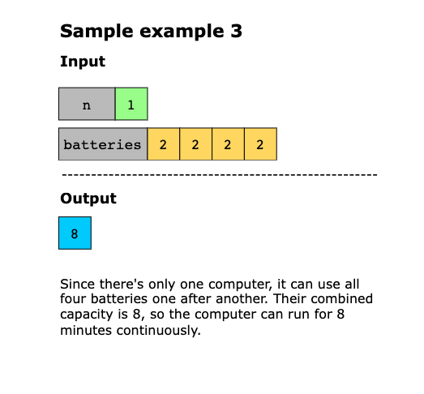

## Solution

This solution aims to find the maximum number of minutes all `n` computers can run simultaneously using a set of batteries. 
We use a modified binary search pattern on the possible runtime values to achieve this. The key observation is that if 
it’s possible to run all n computers for x minutes, it is also possible to run them for any time less than `x`. This 
monotonic property makes binary search applicable. To solve this, we set the search space from 0 to `total_power // n`, 
where `total_power` is the sum of all battery capacities. At each step, we check whether running all computers for mid 
minutes is feasible by verifying that the sum of the available battery contributions (each battery contributing up to 
mid minutes) is at least `n * mid`. This feasibility check helps us efficiently narrow down the maximum achievable runtime.

Now, let’s look at the solution steps below:

1. Set `left=0` and `right=sum(batteries) // n` to define the minimum and maximum possible simultaneous runtime.
2. While `left < right`:
   - Calculate `mid = right - (rught - left) // 2` (biases the midpoint toward the higher end to avoid infinite loops).
   - Initialize `usable=0` to store the sum of usable power
   - For each battery, add `min(b, mid)` to `usable`
   - If `usable >= mid * n`, the target feasible, so set `left=mid` to search for a longer time.
   - Otherwise, set `right = mid-1` to search in the lower half
3. After the loop completes, `left` holds the maximum number of minutes that all `n` computers can run simultaneously.

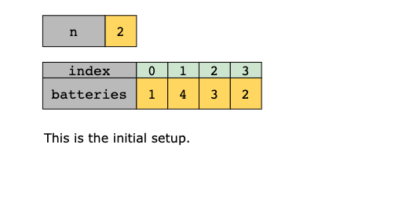
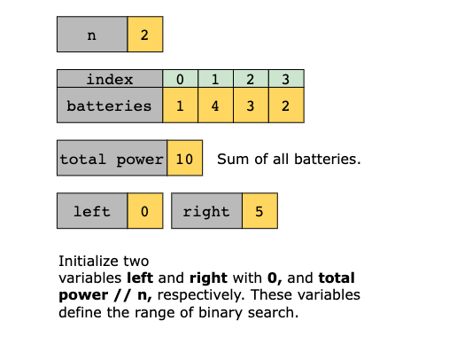
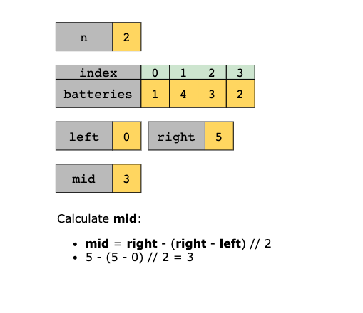
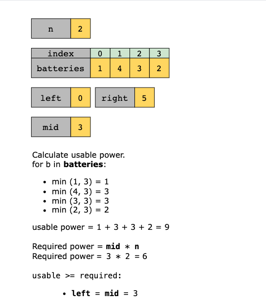
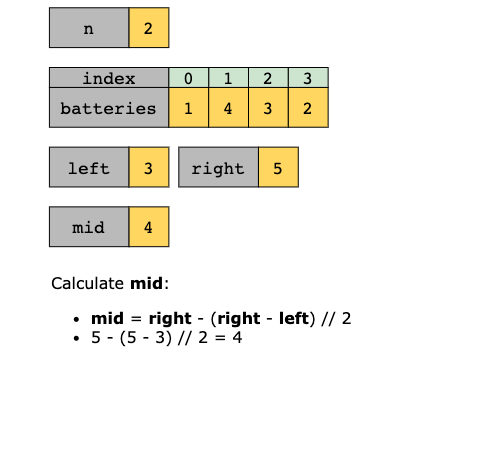
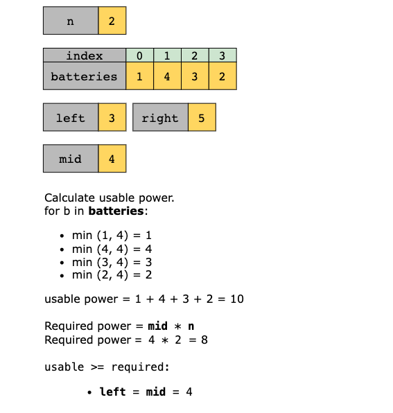
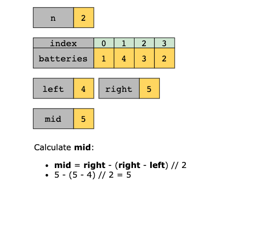
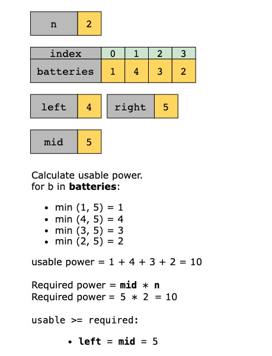
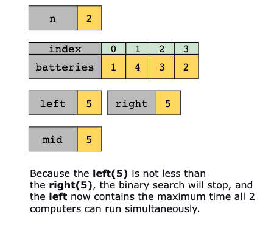

### Time Complexity

The time complexity of the solution is `O(n⋅logT)`), where `n` is the number of batteries and `T` is the total power of 
one computer, `T = sum(batteries) // n)`. This is because binary search runs in `O(logT)` iterations, and in each 
iteration, we compute the usable power by iterating through all `n` batteries, which takes `O(n)` time.

### Space Complexity

The space complexity of the solution os `O(1)` because no extra space is used
