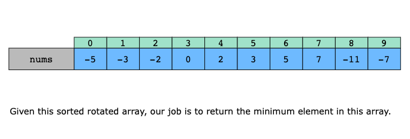
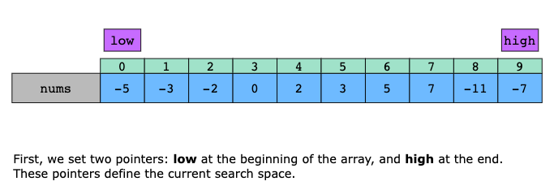
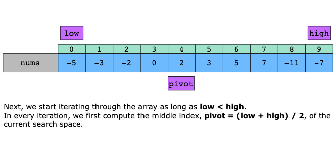
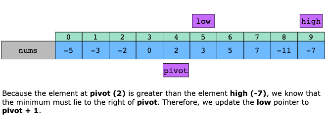
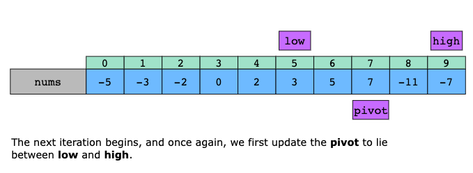
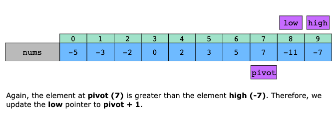
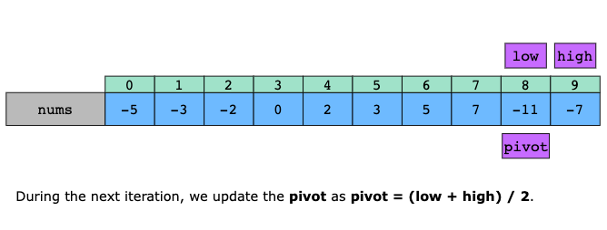
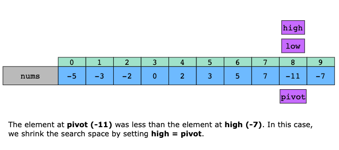
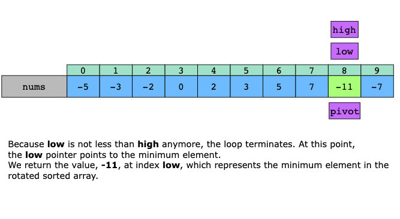

# Find Minimum in Rotated Sorted Array

Suppose an array of length n sorted in ascending order is rotated between 1 and n times. For example, the array
nums = [0,1,2,4,5,6,7] might become:

- `[4,5,6,7,0,1,2]` if it was rotated 4 times.
- `[0,1,2,4,5,6,7]` if it was rotated 7 times.

- Notice that rotating an array [a[0], a[1], a[2], ..., a[n-1]] 1 time results in the array [a[n-1], a[0], a[1],
a[2], ..., a[n-2]].

Given the sorted rotated array nums of unique elements, return the minimum element of this array.

You must write an algorithm that runs in O(log n) time.

Example 1:

```
Input: nums = [3,4,5,1,2]
Output: 1
Explanation: The original array was [1,2,3,4,5] rotated 3 times.
```

Example 2:
```
Input: nums = [4,5,6,7,0,1,2]
Output: 0
Explanation: The original array was [0,1,2,4,5,6,7] and it was rotated 4 times.
```

Example 3:

```
Input: nums = [11,13,15,17]
Output: 11
Explanation: The original array was [11,13,15,17] and it was rotated 4 times. 
```

---

# Find Minimum in Rotated Sorted Array II 

Suppose an array of length n sorted in ascending order is rotated between 1 and n times. For example, the array nums = 
[0,1,4,4,5,6,7] might become:

[4,5,6,7,0,1,4] if it was rotated 4 times.
[0,1,4,4,5,6,7] if it was rotated 7 times.
Notice that rotating an array [a[0], a[1], a[2], ..., a[n-1]] 1 time results in the array [a[n-1], a[0], a[1], a[2], ..., 
a[n-2]].

Given the sorted rotated array nums that may contain duplicates, return the minimum element of this array.

You must decrease the overall operation steps as much as possible.

## Examples

Example 1:
```text
Input: nums = [1,3,5]
Output: 1
```

Example 2:
```text
Input: nums = [2,2,2,0,1]
Output: 0
```

## Constraints

- n == nums.length
- 1 <= n <= 5000
- -5000 <= nums[i] <= 5000
- nums is sorted and rotated between 1 and n times.

> Follow up: This problem is similar to Find Minimum in Rotated Sorted Array, but nums may contain duplicates. Would this
affect the runtime complexity? How and why?

## Topics

- Array
- Binary Search

## Solution

The solution’s essence lies in leveraging a modified binary search to efficiently locate the minimum element in a rotated
sorted array, even in the presence of duplicates. The algorithm defines a search boundary using low and high pointers,
representing the current range where the minimum element could exist. A third pivot pointer is calculated to point to the
middle element of the current search space.

By comparing the element at pivot with the element at high, the algorithm determines whether the minimum lies in the left
or right half of the current search space and updates the boundaries accordingly. Specifically, it handles the following
three cases:

- Case 1 (nums[pivot] < nums[high]): The pivot element lies in the same half as the upper bound. This means the minimum
  is to the left of or at the pivot. Therefore, we move high to pivot.
- Case 2 (nums[pivot] > nums[high]): The pivot element lies in a different half from the upper bound. Hence, the minimum
  must lie to the right of pivot, and we move low next to pivot.
- Case 3 (nums[pivot] == nums[high]): It’s ambiguous which half contains the minimum. To avoid skipping the minimum or
  falling into an infinite loop, we safely reduce the upper bound (high) by one. This step ensures progress and
  correctness without eliminating any possible minimum.

Using the intuition above, we implement the algorithm as follows:

1. Set two pointers: low at the beginning of the array and high at the end. These pointers define the current search
   space.
2. Iterate through the array as long as low < high:
   - Compute the middle index, pivot, of the current search space.
   - If the element at pivot is less than the element at high, the minimum could be at pivot or anywhere to the left, so
     shrink the search space by setting high = pivot.
   - On the other hand, if the element at pivot is greater than the element at high, the minimum must lie to the right of
     pivot. Therefore, update the low pointer to pivot + 1.
   - Finally, if both values are equal, we can’t determine which side the minimum is on (due to duplicates). Safely
     reduce the search space by reducing high by one.
3. When the loop terminates, low points to the minimum element. Return the value at index low, representing the minimum
   element in the rotated sorted array.











### Time Complexity

The time complexity of the above algorithm, in the best and average cases, is O(logn), where n is the length of the nums
array. This is because the algorithm typically reduces the search space by half in each iteration.

However, in the worst case—when many duplicate elements exist (especially when nums[pivot] == nums[high] happens
frequently, for example when all elements are the same)—the algorithm may need to shrink the search space one step at a
time, leading to a time complexity of O(n).

### Space Complexity

The algorithm’s space complexity is O(1).
