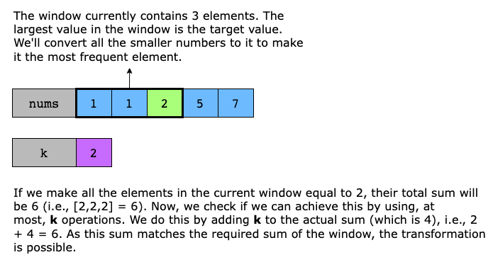

# Frequency of the Most Frequent Element

The frequency of an element is the number of times it occurs in an array.

You are given an integer array nums and an integer k. In one operation, you can choose an index of nums and increment the
element at that index by 1.

Return the maximum possible frequency of an element after performing at most k operations.

## Example

Example 1:

```text
Input: nums = [1,2,4], k = 5
Output: 3
Explanation: Increment the first element three times and the second element two times to make nums = [4,4,4].
4 has a frequency of 3.
```

Example 2:
```text
Input: nums = [1,4,8,13], k = 5
Output: 2
Explanation: There are multiple optimal solutions:
- Increment the first element three times to make nums = [4,4,8,13]. 4 has a frequency of 2.
- Increment the second element four times to make nums = [1,8,8,13]. 8 has a frequency of 2.
- Increment the third element five times to make nums = [1,4,13,13]. 13 has a frequency of 2.
```

Example 3:

```text
Input: nums = [3,9,6], k = 2
Output: 1
```

## Constraints

- 1 <= nums.length <= 10^5
- 1 <= nums[i] <= 10^5
- 1 <= k <= 10^5

## Topics

- Array
- Binary Search
- Greedy
- Sliding Window
- Sorting
- Prefix Sum

## Solution

The best way to solve this problem is to conver the smaller numbers into the largest possible number while using the least
number of operations. To achieve this, we use the sliding window technique, which maintains a group of numbers that can
be adjusted to match a target value (the largest number in the window). THe window size is increased or decreased dynamically
based on the sum of its elements, allowing us to quickly determine whether we can increase all numbers in the window to
match the target value within the allowed `k` operations. The largest window wehre this condition holds gives use the 
maximum possible frequency.

We first sort `nums` so that we always transform smaller numbers first, which requires fewer operations than modifying
larger ones. This makes it easier to maintain a valid window where all elements can equal to the rightmost(largest) element.

For any particular window, we decided to expand it further or shrink it based on the following condition:

> window size * target value <= window sum + k

This means that for a window to be valid, the total sum (if all elements were target) should not exceed the actual sum
of elements in the current window plus `k` allowed operations.

- If the condition is true and the window is valid, we add the next element of `nums` to the current window.
- Otherwise, if the condition is false, we shrink the window.

This process continues until we find the largest valid window within which all numbers can be equal. The illustration below
helps us understand the concept better.



Now, let's look at the algorithm steps:

- Sort the array `nums`
- Initialize the following:
  - The left pointer of the sliding window is `left = 0`. The `right` pointer will be initialized later because `right`
    expands with window dynamically as we iterate over `nums`
  - A variable `max_freq = 0` that stores the maximum frequency found so far.
  - A variable `window_sum = 0`, which keeps track of the sum of elements within the current window
- Iterate through `nums` using a sliding window (the `right` pointer is initialized here):
  - Calculate the `target` value, which is the rightmost element in the current window, `target = nums[right]`.
  - Expand the window by adding `nums[right]` to `window_sum`
  - Check if the current window gives us the maximum frequency we are looking for using the condition 
    `(right - left + 1) * target > window_sum + k`. If it is true, it means we need more than `k` operations to make all
    elements equal to the `target`, so we must shrink the window as follows:
    - Substrcting `nums[left]` from `window_sum`
    - Incrementing `left` to move the left boundary forward
  - After adjusting the window, update `max_freq`
- Once we have traversed the `nums` completely, return the maximum frequency found

### Complexity Analysis

#### Time Complexity

- Soring the array takes `O(n log(n))` where `n` is the length of `nums`
- The sliding window traversal takes `O(n)` time because the right pointer moves 0 to `n-1`
- During the sliding window traversal, the `left` pointer only moves forward when needed, ensuring each element is processed
  at most once. In the worst case, `left` moves n times across all iterations

If we sum these up, the overall time complexity simplifies to:

`O(n) + O(n log(n)) = O(n log(n))`

#### Space Complexity

Depending on the language used, the sorting may incur additional space complexity. In Java, `sort()` method typically 
requires `O(log(n))` space. Additionally, a few variables using constant space are used. 
The overall space complexity is `O(log(n))`. 

In Python, the sorting method has the worst-case space complexity of `O(n)`.