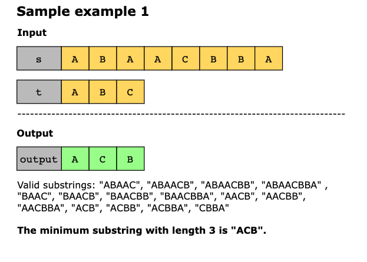
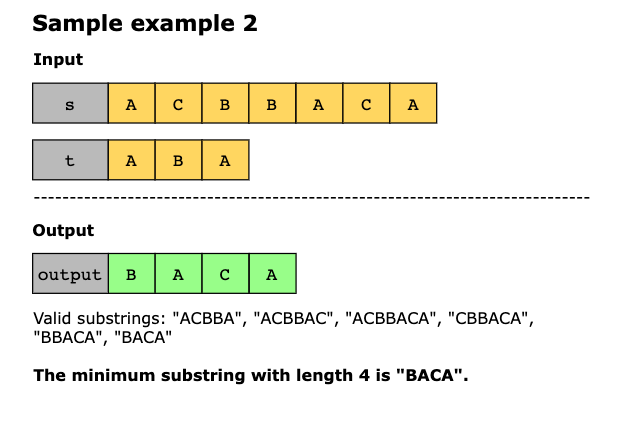

# Minimum Window Substring

Given two strings `s` and `t` of lengths `m` and `n` respectively, return the minimum window substring of `s` such that
every character in `t` (including duplicates) is included in the window. If there is no such substring, return the empty
string "".

The minimum window substring in `s` should have the following properties:

- It is the shortest substring of s that includes all of the characters present in t.
- It must contain at least the same frequency of each character as in t.
- The order of the characters does not matter here.

The testcases will be generated such that the answer is unique.

> Note: If there are multiple valid minimum window substrings, return any one of them.

## Constraints

- Strings `s` and `t` consist of uppercase and lowercase English characters.
- 1 ≤ `s.length`, `t.length` ≤ 10^3

## Examples





Example 1:

```
Input: s = "ADOBECODEBANC", t = "ABC"
Output: "BANC"
Explanation: The minimum window substring "BANC" includes 'A', 'B', and 'C' from string t.
```

Example 2:

```
Input: s = "a", t = "a"
Output: "a"
Explanation: The entire string s is the minimum window.
```

Example 3:

```
Input: s = "a", t = "aa"
Output: ""
Explanation: Both 'a's from t must be included in the window.
Since the largest window of s only has one 'a', return empty string.
```
