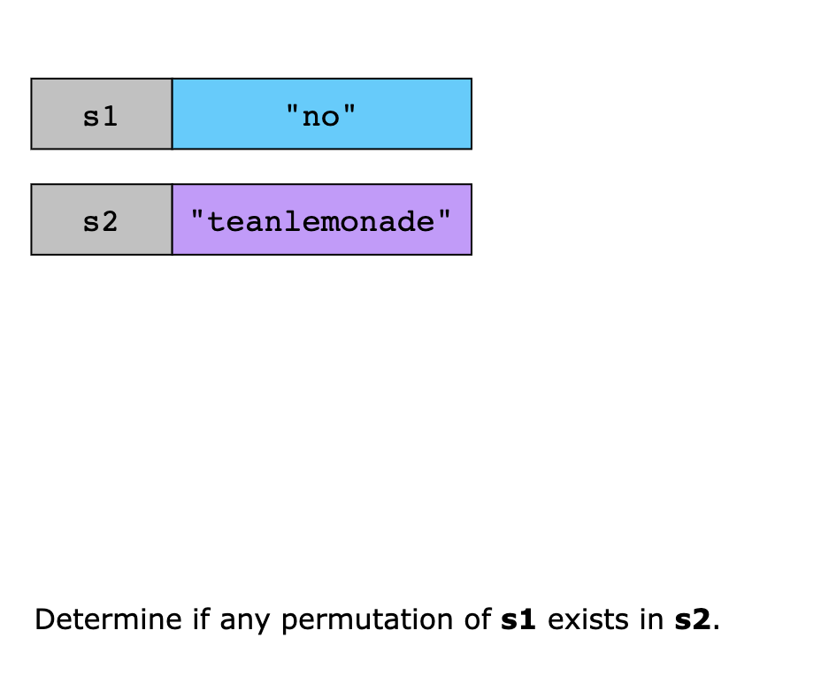
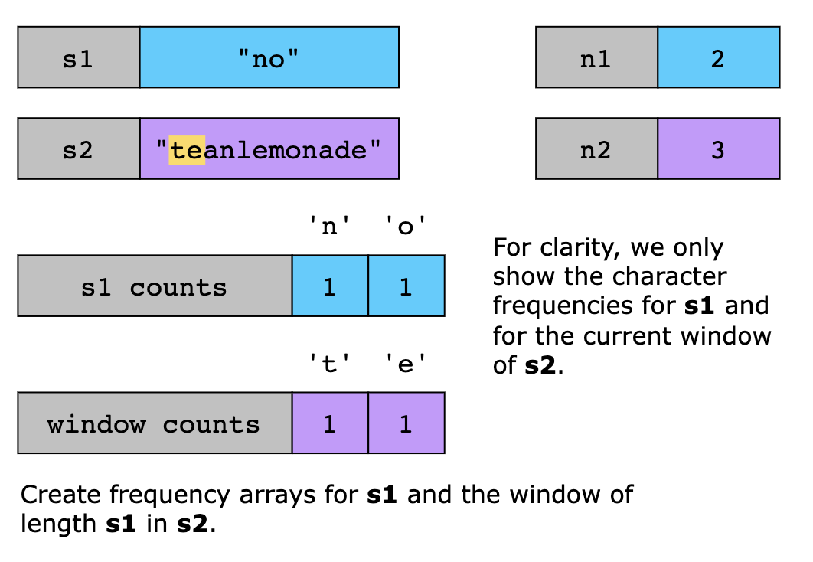
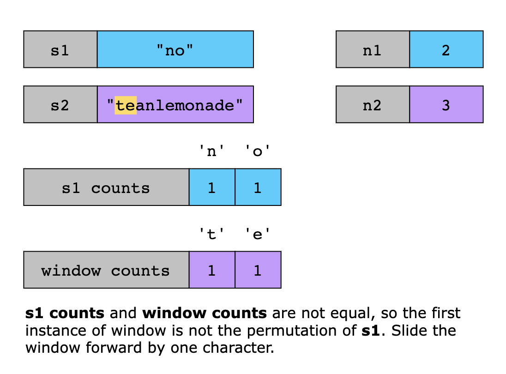
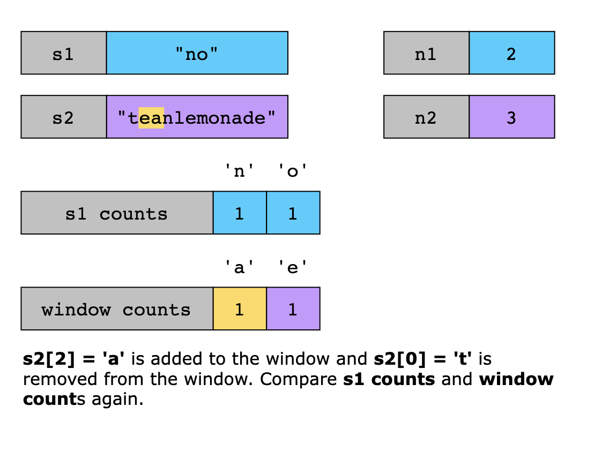
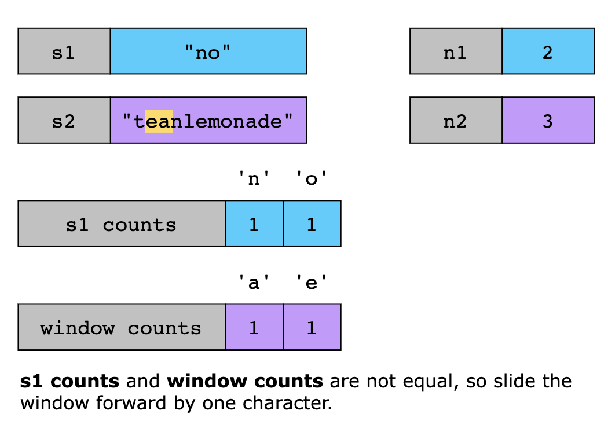
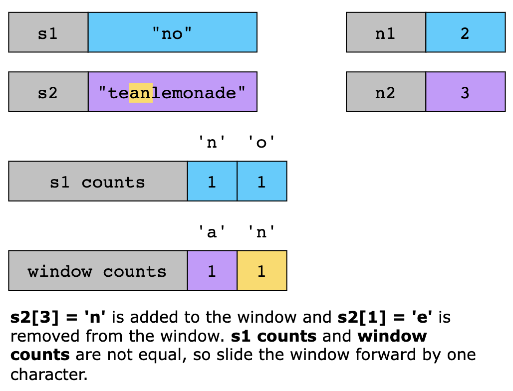
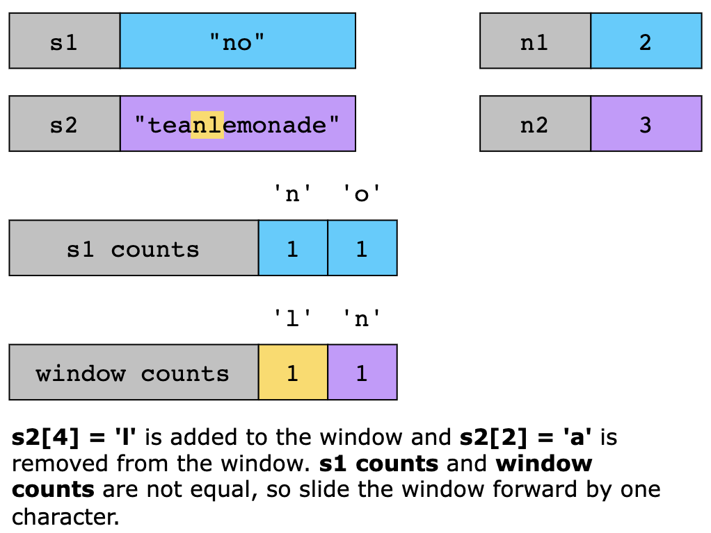
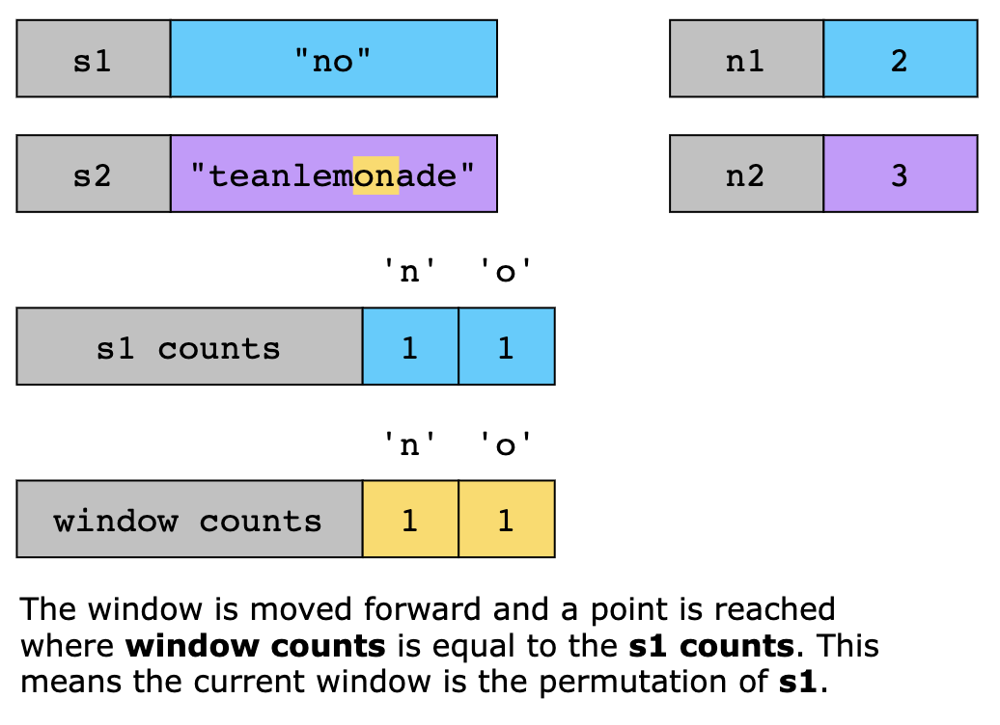
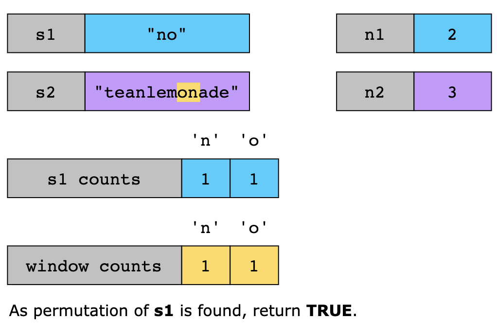

# Permutation in String

Given two strings s1 and s2, return true if s2 contains a permutation of s1, or false otherwise.

In other words, return true if one of s1's permutations is the substring of s2.
 
## Examples

Example 1:

```text
Input: s1 = "ab", s2 = "eidbaooo"
Output: true
Explanation: s2 contains one permutation of s1 ("ba").
```

Example 2:
```text
Input: s1 = "ab", s2 = "eidboaoo"
Output: false
```

## Constraints

- 1 <= s1.length, s2.length <= 10^4
- s1 and s2 consist of lowercase English letters.

## Topics

- Hash Table
- Two Pointers
- String
- Sliding Window

## Hints

- Obviously, brute force will result in TLE. Think of something else.
- How will you check whether one string is a permutation of another string?
- One way is to sort the string and then compare. But, Is there a better way?
- If one string is a permutation of another string then they must have one common metric. What is that?
- Both strings must have same character frequencies, if one is permutation of another. Which data structure should be
  used to store frequencies?
- What about hash table? An array of size 26?

## Solution(s)

1. [Sliding Window](#sliding-window)
2. [Optimized Sliding Window](#optimized-sliding-window)

### Sliding Window

A naive approach would be to generate all possible rearrangements of s1 and check whether any appear in s2. But that 
would quickly become inefficient for longer strings, because the number of permutations grows extremely fast. For a
three-letter string like "abc", there are already six permutations; for "abcdef", there are hundreds. So, instead of
trying to rearrange s1, we look for an efficient alternative.

Two strings are permutations of each other if and only if they contain the same characters the same number of times. For
example, "abc" and "bca" are permutations because both have one a, one b, and one c. This means that if we find any
substring of s2 that is the same length as s1 and has the same character counts, then that substring must be a
permutation of s1.

> Quick recall 
> A substring is a contiguous sequence of characters within a larger string. So, if s1 = "ab" and s2 = "acb", even
> though both strings contain the same counts of letters a and b, there’s no two-letter block in s2 that contains both
> together so that the result would be FALSE.

The same idea is used in this solution, keeping track of the character counts of s1 inside s2. To do this efficiently,
the algorithm uses a sliding window over s2. At any given moment, this window represents a substring of s2 that’s the
same length as s1 and could potentially be one of its permutations. To check that, compare the frequency of each
character in s1 with the frequency of the characters inside this window.

If the counts match, it means the current window contains the same letters as s1, just possibly in a different order,
so a valid permutation is found. In that case, return TRUE. If the counts don’t match, and there are still characters
left to examine in s2, slide the window forward by one character. That means one new character from the right side of
s2 is added to the window, and one old character from the left side is removed. This is important because the window
must always stay the same length as s1. Keep doing this until either a match is found or the end of s2 is reached. If
all possible windows have been checked and none match the character frequencies of s1, then return FALSE.

Let's look at the algorithm steps:

1. Store the lengths of s1 and s2 in n1 and n2.
2. If n1 > n2, return FALSE, as a longer string can’t fit as a substring in some other string. 
3. Create two arrays, s1Counts and windowCounts, of length 26. The former stores the frequencies of characters in s1,
   and the latter stores the frequencies in the current window of s2. 
4. If the two frequency arrays are identical at this point, s1Counts == windowCounts, the function returns TRUE because
   the first window is already a permutation of s1. 
5. If they do not match, the window begins sliding across s2 one character at a time. For each position i from n1 to
   n2-1 in s2:
   - Add the count of characters at the right end of s2 (s2[i]) in the current window. 
   - Remove the count of characters at the right end of s2 (s2[i - n1]) from the current window. 
   - If s1Counts == windowCounts, return TRUE.
6. Once the window has moved across the entire s2, and no match is found, return FALSE.












#### Complexity Analysis

##### Time Complexity

The function runs in linear time because it builds character-frequency counts once, then slides a fixed-size window
across s2 while doing only constant work per step. Each step contributes to the time complexity as follows:

- Counting frequencies in s1 takes O(n1) time (one pass over s1). 
- Building the first window in s2 (size of s1.length) takes O(n1) time.
- Sliding the window across s2 takes O(n2). This is because each slide:
  - Adds one character and removes one character (O(1) updates). 
  - Compares two frequency arrays of size 26 (O(1), as 26 is constant).

This makes the total time complexity O(n1 + n2). As the length of s2 is greater than or equal to that of s1 in all valid
cases, the overall time complexity is dominated by the length of s2, with a special O(1) case when s1 is longer than s2.
Therefore, the final time complexity is O(n2).

##### Space Complexity

The space complexity of this solution is O(1), meaning it uses constant extra memory. This is because it only maintains
two fixed-size arrays (of size 26) to store letter frequencies and a few simple integer variables.

### Optimized Sliding Window

The last approach can be optimized, if instead of comparing all the elements of the s1arr for every updated s2arr
corresponding to every window of s2 considered, we keep a track of the number of elements which were already matching
in the s1arr and update just the count of matching elements when we shift the window towards the right.

To do so, we maintain a count variable, which stores the number of characters(out of the 26 alphabets), which have the
same frequency of occurence in s1 and the current window in s2. When we slide the window, if the deduction of the last
element and the addition of the new element leads to a new frequency match of any of the characters, we increment the
count by 1. If not, we keep the count intact. But, if a character whose frequency was the same earlier(prior to addition
and removal) is added, it now leads to a frequency mismatch which is taken into account by decrementing the same count
variable. If, after the shifting of the window, the count evaluates to 26, it means all the characters match in frequency
totally. So, we return a True in that case immediately.

#### Complexity Analysis

Let l1 be the length of string s1 and l2 be the length of string s2.

##### Time complexity: O(l1 + (l2 −l1))≈O(l2)

Populating s1arr and s2arr takes O(l1) time since we iterate over the first l1 characters of both strings.

The outer loop runs l2 −l1 times. In each iteration, we update two characters (one entering and one leaving the window)
in constant time O(1), and we maintain a count of matches. This step takes O(l2 −l1).

Checking if count == 26 also happens in O(1), since it's a constant comparison.

Thus, the total time complexity is: O(l1 +(l2 −l1))≈O(l2)

##### Space complexity: O(1)

Two fixed-size arrays (s1arr and s2arr) of size 26 are used for counting character frequencies. No additional space that
grows with the input size is used.
