# Repeated DNA Sequences

A DNA sequence consists of nucleotides represented by the letters ‘A’, ‘C’, ‘G’, and ‘T’ only. For example, “ACGAATTCCG” 
is a valid DNA sequence.

Given a string, s, that represents a DNA sequence, return all the 10-letter-long sequences (continuous substrings of 
exactly 10 characters) that appear more than once in s. You can return the output in any order.

Constraints:
- 1  ≤ s.length  ≤ 10^3 
- s[i] is either 'A', 'C', 'G', or 'T'.

Examples:

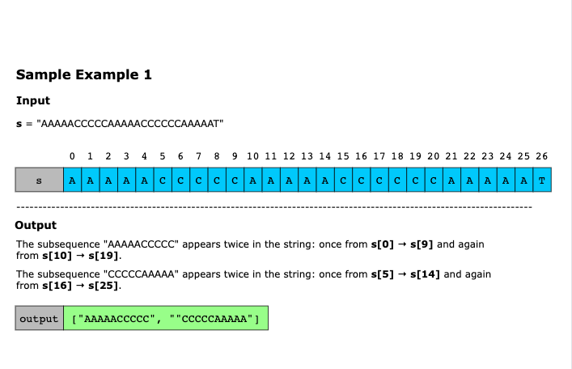
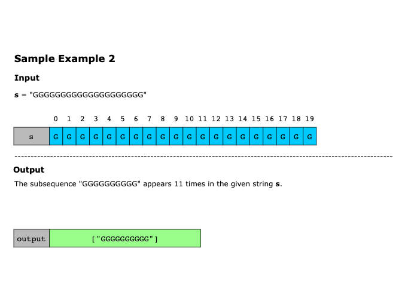
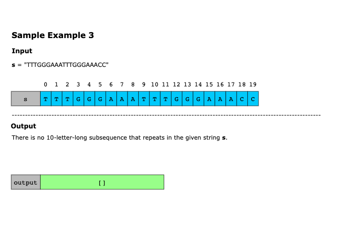

---

## Solution

### Naive Approach
The naive approach to solving this problem would be to use a nested loop to check all possible 10-letter-long substrings 
in the given DNA sequence. Using a set, we would extract every possible substring of length 10 and compare it with all 
previously seen substrings. If a substring appears more than once, we add it to the result.

Specifically, we start by iterating through the string and extracting every substring of length 10. For each substring, 
we check if it has already been seen before. We store it in a separate set to track repeated sequences if it has. If 
not, we add it to the set of seen substrings. Finally, we return all repeated sequences as a list. This method is 
simple to understand but inefficient because checking each substring against previously seen ones takes much time, 
making it slow for large inputs.

We extract all k-length (where k = 10) substrings from the given string s, which has length n. This means we extract 
(n−k+1) substrings. Each substring extraction takes O(k) time. Checking whether a substring is in a set (average case) 
takes O(1), but in the worst case (hash collisions), it takes O(n−k+1) comparisons. Inserting a new substring into the 
set takes O(1) on average, but worst case O(n−k+1). Therefore, the overall time complexity becomes O((n−k)×k).

The space complexity of this approach is O((n−k)×k) because, in the worst case, our set can contain (n−k+1) elements, 
and at each iteration of the traversal, we are allocating memory to generate a new k - length substring.

### Optimized approach using sliding window
As we only need to check consecutive 10-letter substrings, we can slide over the string and update our hash efficiently 
instead of creating new substrings every time. To optimize it further, instead of computing a hash from scratch for 
each substring, we can update its value as we slide forward on the string. This technique is commonly known as 
rolling hash.

The rolling hash can be divided into three main steps:
- Initial hash calculation: Calculate the hash for the main string’s first window (substring).
- Slide the window: Move the window one character forward.
- Update the hash: Use the previous hash value to calculate the new hash without rescanning the whole substring.
  - Remove the hash contribution of the outgoing character. 
  - Add the hash contribution of the incoming character.

This optimized solution revolves around the rolling hash technique. First, we convert the characters 'A', 'C', 'G', and 
'T' into numerical values 0, 1, 2, and 3, respectively. Then, compute the rolling hash for the first 10-letter substring. 
As we slide the window forward one character at a time, remove the old character from the left and add the new character 
on the right. Update the hash efficiently to reflect this change. We use a set to track previously seen hash values. 
At each step, check if the computed hash has been seen before. If a hash appears again, store the corresponding 
substring in the result.

Let’s look at the following illustration to get a better understanding of the solution:

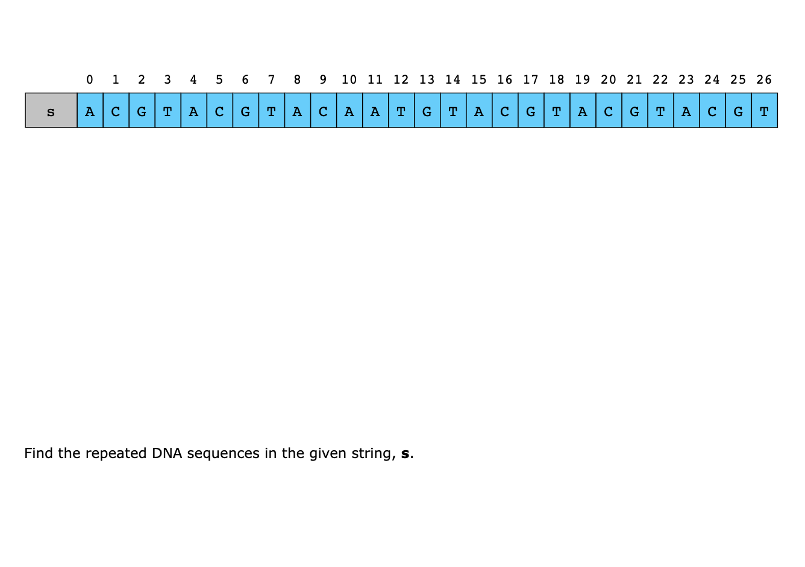
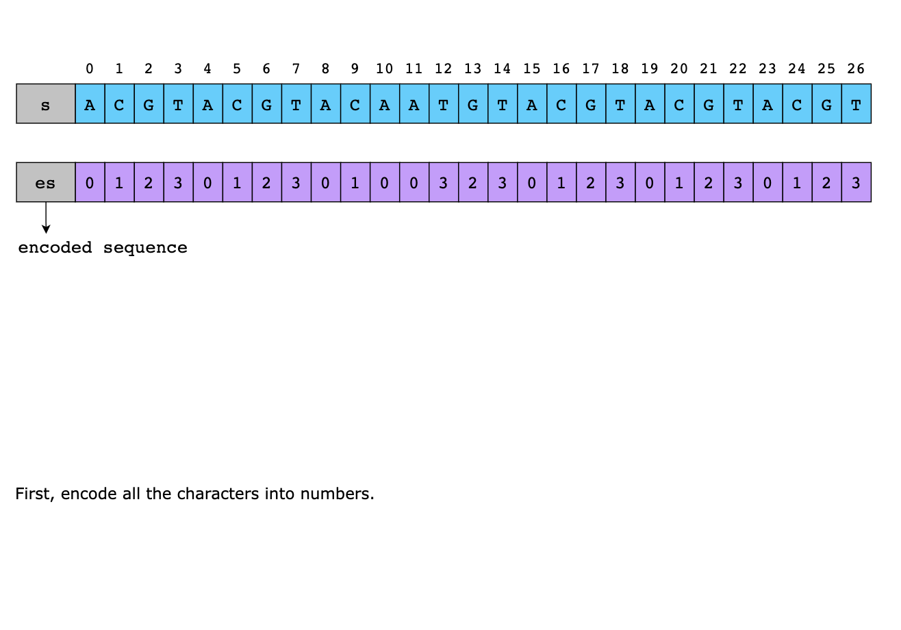

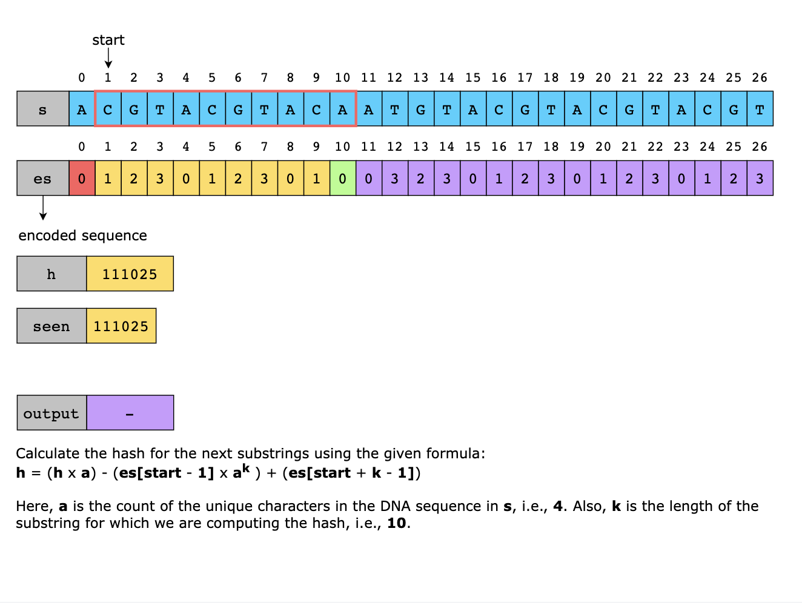
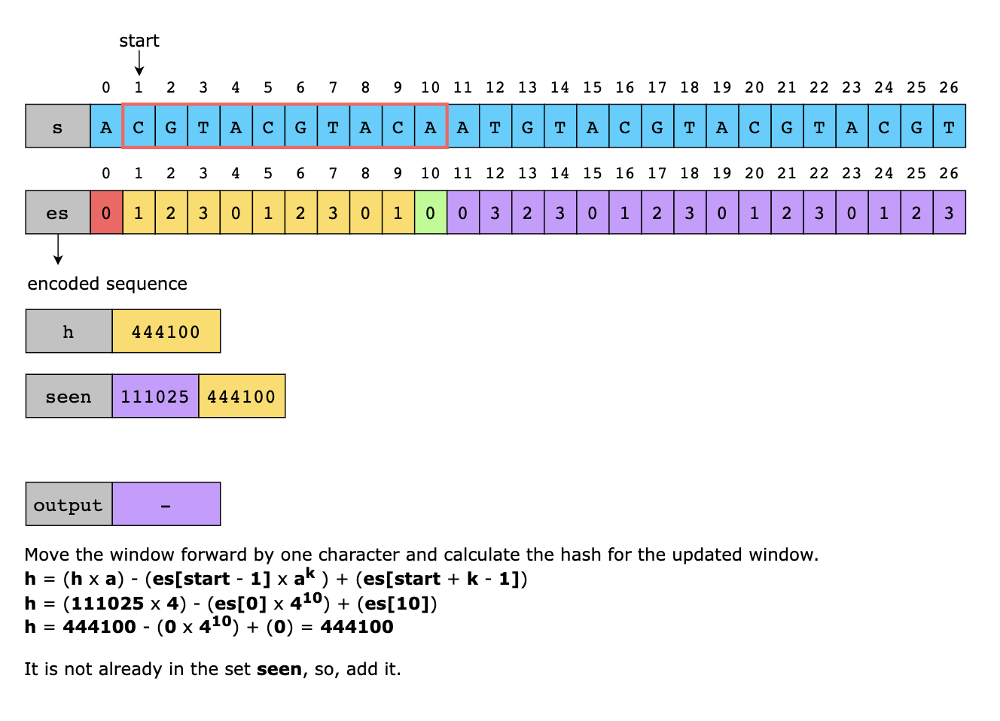

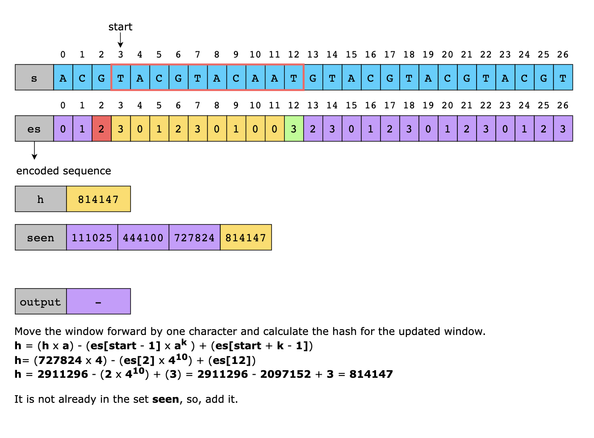
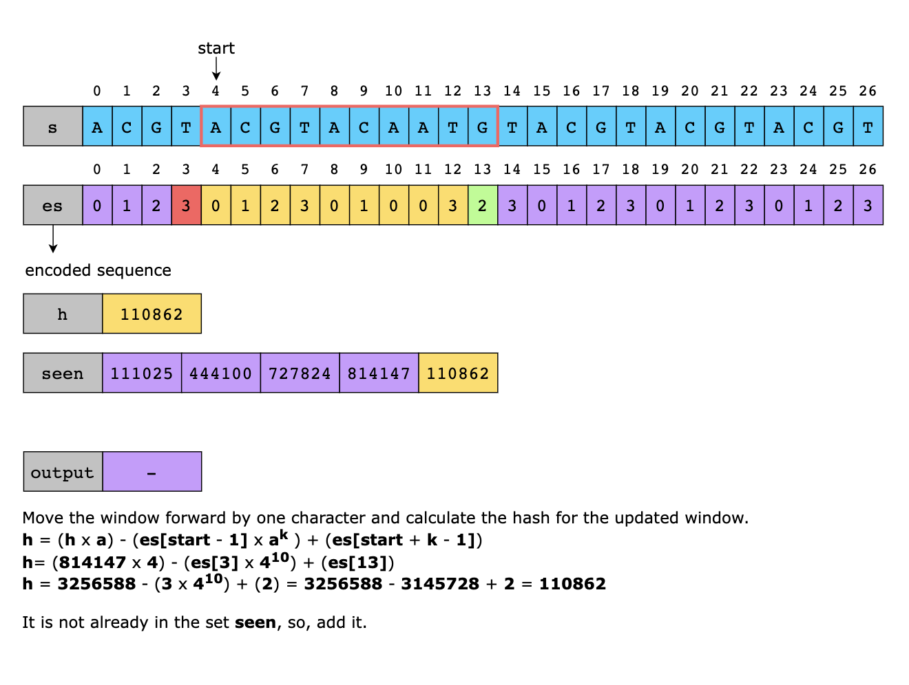
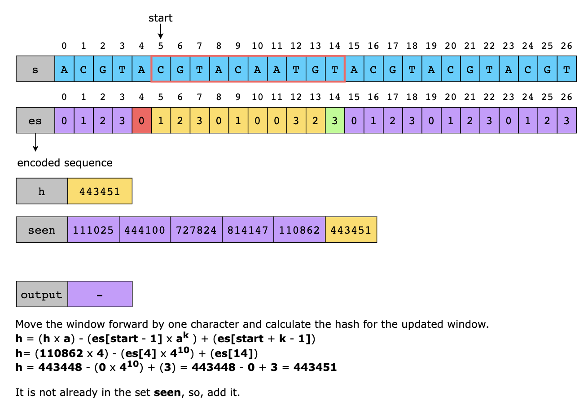
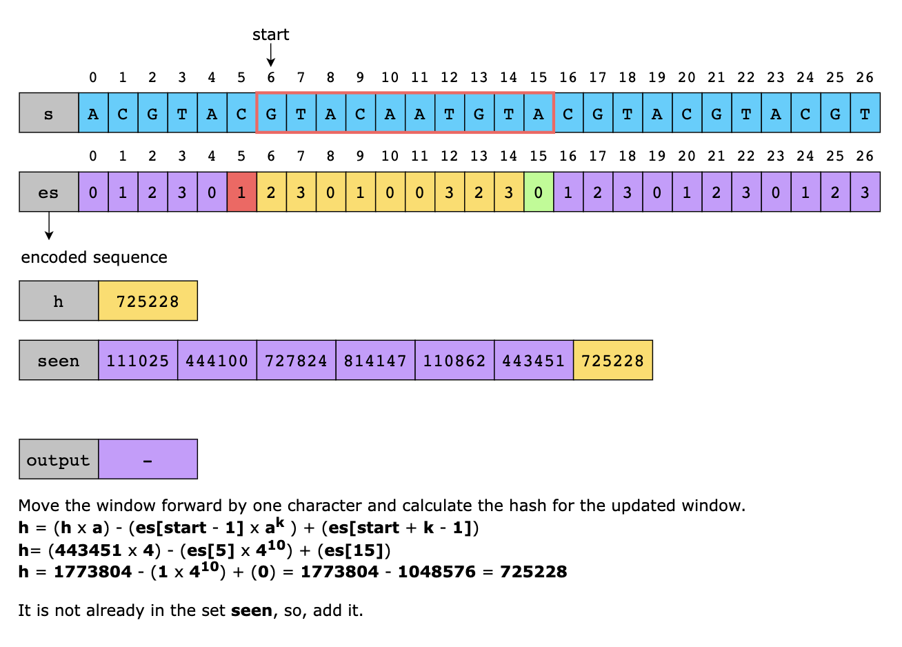
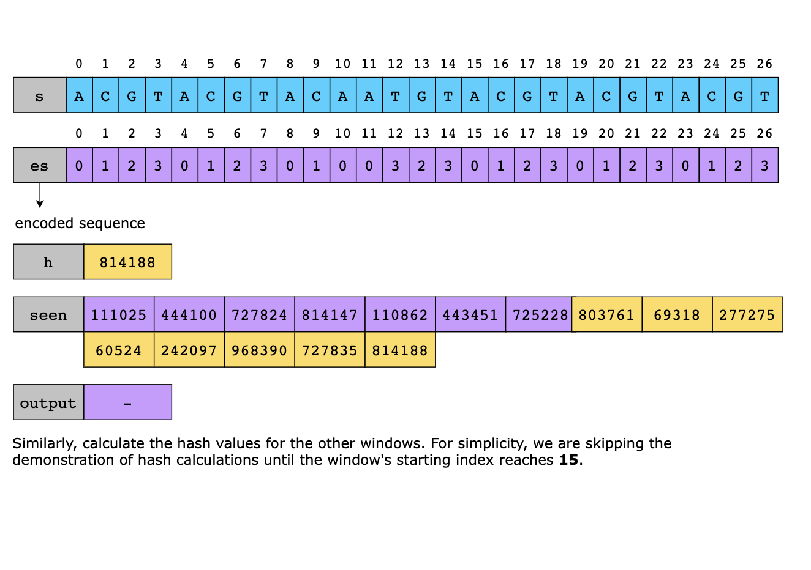
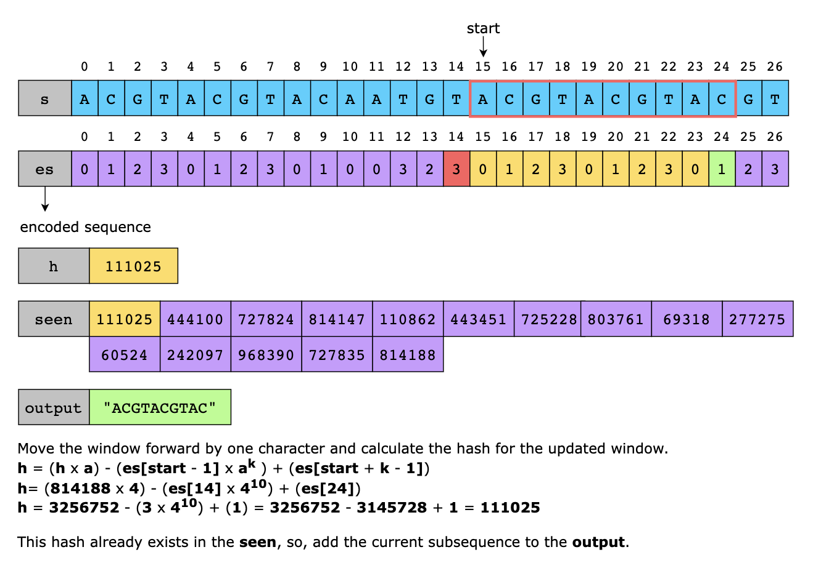
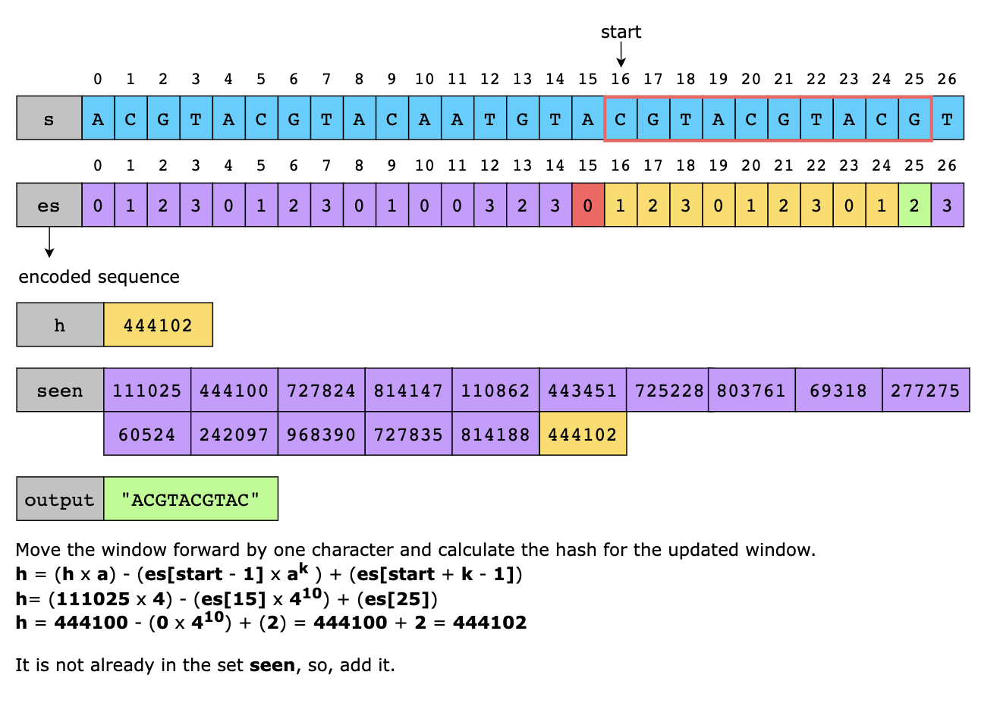
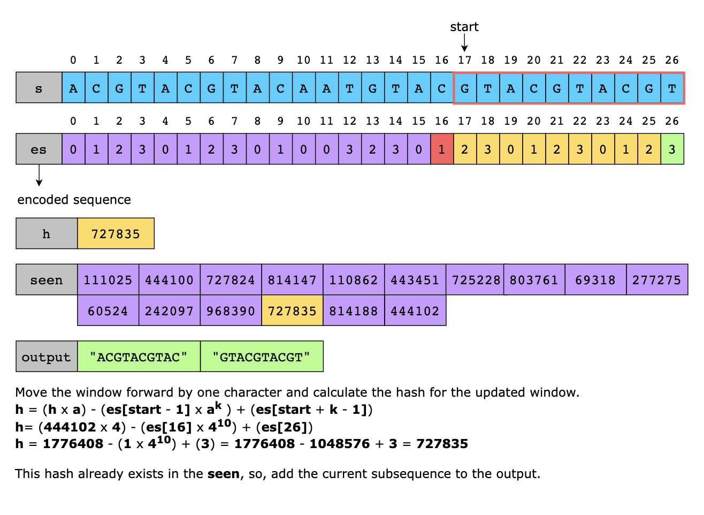
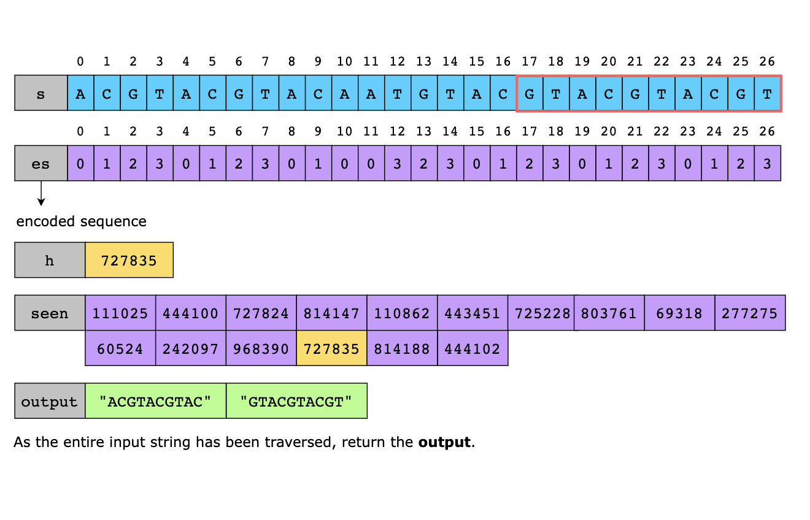

### A step-by-step solution construction

#### Step 1: Encode characters into numbers

Before processing DNA sequences in s, we must convert the characters 'A', 'C', 'G', and 'T' into numerical values. 
This allows us to perform mathematical operations, like computing hashes, more efficiently. We assign 0 → 'A', 1 → 
'C', 2 → 'G', and 3 → 'T
We’ll define this mapping in a dictionary to_int. Then, we’ll convert each character in s into its corresponding numeric 
value and store it in a list encoded_sequence. Let’s look at the code for this step:

```python
from typing import List


def find_repeated_dna_sequences(dna_sequence: str) -> List[str]:
    # Define a mapping of DNA characters to numerical values
    to_int = {"A": 0, "C": 1, "G": 2, "T": 3}

    # Convert each character in the input string to its corresponding number
    encoded_sequence = [to_int[c] for c in dna_sequence]

    # Return the encoded list of numbers
    return encoded_sequence
```

#### Step 2: Compute the first hash (rolling hash)

Now that we have the numerical form of the DNA sequence in s, we can compute a rolling hash for the first 10-letter 
substring. Hashing allows us to efficiently compare substrings without repeatedly checking each character.

For hashing, we’ll use the polynomial rolling hash:

`hash = (c1 × a^(k-1)) + (c2 × a ^(k-2)) + ... + (ck × a^0)`

Here, ci represents each character in s, a is the size of our alphabet, i.e., 4 for the DNA sequence in s, and 
k is the length of the substring for which we are computing the hash, i.e., 10 in our case.

By plugging in the values, we’ll compute the initial hash as follows:

`h0 = (c1 × 4^9)+(c2 × 4^8)+ . . . + (c10 × 4^0)`

Here, each character ci contributes to the hash using base-4 multiplication. This uniquely represents the sequence we 
can update as we slide through the DNA string.

> Note: This hash is derived from the polynomial hash. If you want to dive deeper into how we mapped the general 
polynomial hash to our case,here is more information:
> For a sequence of numbers {n1,n2,n3,..., nk}, where each ni represents a character converted into a number, the 
> polynomial hash function in base-a: `hash=(n1×a^(k-1))+(n2×a^(k-2))+ . . . + (nk × a^0)`. In the equation above, k is 
> the length of the substring for which we are computing the hash, and a is the size of our alphabet, i.e., 4 for the 
> DNA sequence in s. This formula treats the sequence as a number in base-a notation, similar to how we represent 
> numbers in base-10 or base-2. If we apply it to our case, k=10 as we are working with 10-letter substrings, and a=4 as
> we have 4 possible characters (A, C, G, T). So, plugging in the values: `hash=(n1×4^9)+(n2×4^8)+ . . . + (n10 × 4^0)` 
> This formula gives a unique number (most of the time) for each 10-letter DNA sequence.


In the code implementation, we’ll define and initialize some variables to store each equation component above. We’ll 
define the constants k = 10 and a = 4. We’ll use the variable h to store the rolling hash value and a_k to compute 4^k. 
Then, we’ll use a loop to process the first 10 letters of s for computing the first hash. This loop will do the following:
- Builds a unique number (hash) for the first 10 letters iteratively.
- Prepares a multiplier (a_k) for future hash updates.

Let’s look at the code for this step:

```python
from typing import List


def find_repeated_dna_sequences(dna_sequence: str) -> List[str]:
    # Define a mapping of DNA characters to numerical values
    to_int = {"A": 0, "C": 1, "G": 2, "T": 3}

    # Convert each character in the input string to its corresponding number
    encoded_sequence = [to_int[c] for c in dna_sequence]
    dna_sequence_length = 10  # Length of DNA sequence to check
    base_a_encoding = 4   # Base-4 encoding
    
    rolling_hash_value = 0
    a_k = 1  # Stores a^k for hash updates

    # Compute the initial hash using base-4 multiplication
    for i in range(dna_sequence_length):
        rolling_hash_value = rolling_hash_value * base_a_encoding + encoded_sequence[i]
        a_k *= base_a_encoding  # Precompute a^k for later use in rolling hash updates

    return rolling_hash_value
```

#### Step 3: Update the hash and use a set to track seen substrings

After computing the initial hash, we slide a window through the string, efficiently updating the hash. Instead of 
recomputing the hash from scratch at every step, we adjust it by:

- Removing the old character from the left.
- Adding the new character on the right.

Using a rolling hash, the update formula becomes:

new hash =(old hash × 4) − (leftmost digit × 4^10) + new digit

In the code implementation, we’ll use a loop to slide over s and update the hash value, h, for each new window. As we 
have already computed the hash for the first window, we’ll start our loop from the index 1 of s. The variable start 
will always indicate the starting point of our window, and we’ll get the ending point by adding k to it 
(to be precise in terms of coding, start + k - 1). So, to remove the contribution of the leftmost character and add the 
contribution of the rightmost character in h, we'll update it as follows:

`rolling_hash_value = (rolling_hash_value * base_a_encoding) - (encoded_sequence[start - 1] * a_k) + (encoded_sequence[start + dna_sequence_length - 1])`

We’ll use a set, `seen_hashes`, to track hashes we’ve seen before. If a hash, h, appears again, we add the corresponding 
substring to the result, output. Let’s look at the code for this step:

```python
from typing import List


def find_repeated_dna_sequences(dna_sequence: str) -> List[str]:
    # Define a mapping of DNA characters to numerical values
    to_int = {"A": 0, "C": 1, "G": 2, "T": 3}

    # Convert each character in the input string to its corresponding number
    encoded_sequence = [to_int[c] for c in dna_sequence]
    dna_sequence_substr_length, dna_sequence_length = 10, len(dna_sequence)  # Length of DNA sequence to check
    base_a_encoding = 4   # Base-4 encoding
    
    rolling_hash_value = 0
    a_k = 1  # Stores a^k for hash updates

    # Compute the initial hash using base-4 multiplication
    for i in range(dna_sequence_substr_length):
        rolling_hash_value = rolling_hash_value * base_a_encoding + encoded_sequence[i]
        a_k *= base_a_encoding  # Precompute a^k for later use in rolling hash updates
    
    seen_hashes, output = set(), set()  # Sets to track hashes and repeated sequences
    seen_hashes.add(rolling_hash_value)  # Store the initial hash

    # Sliding window approach to update the hash efficiently
    for start in range(1, dna_sequence_length - dna_sequence_substr_length + 1):
        # Remove the leftmost character and add the new rightmost character
        rolling_hash_value = rolling_hash_value * base_a_encoding - encoded_sequence[start - 1] * a_k + encoded_sequence[start + dna_sequence_substr_length - 1]

        # If this hash has been seen_hashes before, add the corresponding substring to the output
        if rolling_hash_value in seen_hashes:
            output.add(dna_sequence[start : start + dna_sequence_substr_length])
        else:
            seen_hashes.add(rolling_hash_value)

    return list(output)  # Convert set to list before returning
```

### Solution Summary
Let’s get a quick recap of the optimized solution:

Encode DNA sequence in s by converting 'A', 'C', 'G', and 'T' into numbers (0, 1, 2, 3) for easier computation.

Use a set to store seen hashes and detect repeating sequences.

Compute the rolling hash for the first 10-letter substring and store it in the set.

Move the window one step forward and compute the hash of the new window. Store this new hash in the set. Store the 
corresponding substring in the result if the calculated hash appears again.

Once the entire string has been traversed, return the result containing all the repeating 10-letter long sequences.

### Time Complexity
Let’s break down and analyze the time complexity of this solution:

- We go through the input string once to convert characters into numbers, which takes O(n)
- We compute the first rolling hash in O(k) time (where k = 10). As k is a fixed small number, it is treated as O(1)
- Then, we slide through the string once, updating the hash in O(1) time for each step. Overall, it takes O(n−k) time, 
  which can be simplified to O(n) as k is a constant.
- Checking and storing hashes in a set is O(1) on average.

If we sum these up, the overall time complexity simplifies to: `O(n)+O(1)+O(n)+O(1)=O(n)`

### Space Complexity
Let’s break down and analyze the space complexity of this solution:

- We store the encoded sequence as a list of numbers, which takes O(n) space.
- We store hashes in a set that would have, at most, n−k+1 entries. This can be simplified to O(n) space.
- We store repeated sequences in another set that takes, at most, n−k+1 unique sequences. This can be simplified to 
  O(n) space.

If we sum these up, the overall space complexity becomes: `O(n)+O(n)+O(n)=O(n)`

---

## Tags
- Hash Table
- String
- Bit Manipulation
- Sliding Window
- Rolling Hash
- Hash Function
