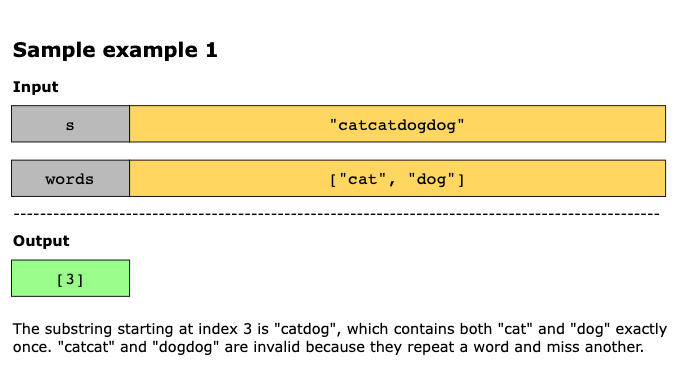
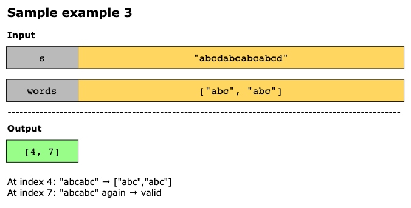
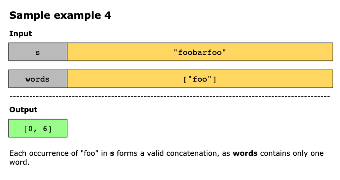
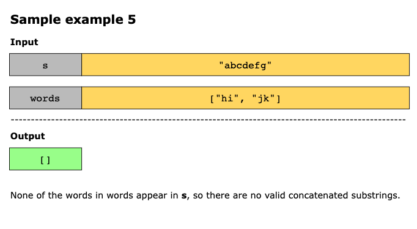
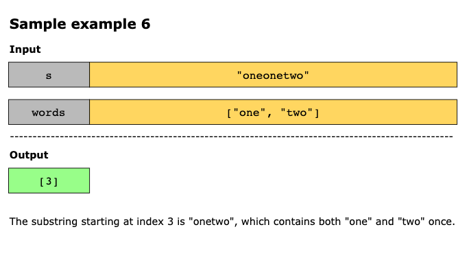

# Substring with Concatenation of All Words

You are given a string, s, and an array of strings, words. All strings in words are of the same length.

A concatenated string is a string that contains all the words in words exactly once, in any order, concatenated together
without any intervening characters.

Formally, a concatenated string is a permutation of all words joined together. For example, if words = ["ab", "cd", "ef"],
then the following are all valid concatenated strings: "abcdef", "abefcd", "cdabef", "cdefab", "efabcd", "efcdab".
However, "acdbef" is not valid because it is not formed by concatenating all the words in any order.

Your task is to return all starting indices of substrings in s that are concatenated strings.

You may return the indices in any order.

## Constraints

- 1 ≤ `s.length` ≤ 10^3
- 1 ≤ `words.length` ≤ 1000
- 1 ≤ `words[i].length` ≤ 30
- `s` and `words[i]` consist of lowercase English letters.

## Examples








Example 1:

```text
Input: s = "barfoothefoobarman", words = ["foo","bar"]

Output: [0,9]

Explanation:

The substring starting at 0 is "barfoo". It is the concatenation of ["bar","foo"] which is a permutation of words.
The substring starting at 9 is "foobar". It is the concatenation of ["foo","bar"] which is a permutation of words.
```

Example 2:

```text
Input: s = "wordgoodgoodgoodbestword", words = ["word","good","best","word"]

Output: []

Explanation:

There is no concatenated substring.
```

Example 3:

```text
Input: s = "barfoofoobarthefoobarman", words = ["bar","foo","the"]

Output: [6,9,12]

Explanation:

The substring starting at 6 is "foobarthe". It is the concatenation of ["foo","bar","the"].
The substring starting at 9 is "barthefoo". It is the concatenation of ["bar","the","foo"].
The substring starting at 12 is "thefoobar". It is the concatenation of ["the","foo","bar"].
```

## Topics

- Hash Table
- String
- Sliding Window

## Solution

The essence of this problem lies in recognizing that all words share the same length. This uniformity allows the
algorithm to traverse the string in consistent, word-sized steps, ensuring that every examined segment corresponds
exactly to a full word rather than arbitrary substrings. Instead of checking every possible substring combination, the
algorithm uses this structure to efficiently locate positions where a sequence of words forms a valid concatenation. The
key idea is to treat the text as a grid of equally sized word blocks and slide through it using a fixed stride.

To achieve this efficiently, the algorithm applies a sliding window strategy. The window moves across the string,
maintaining two frequency maps:
1. Expected word frequencies: How many times should each word appear in a valid combination?
2. Current word frequencies: How many times does each word actually appear in the current window of text?

As the window slides through the string:
- If a word appears more often than allowed, the algorithm moves the left boundary forward to discard the extra
  occurrences.
- If a word doesn’t belong to the given set at all, the window resets immediately.
- Whenever the current window contains exactly all required words with matching counts, the starting index of that
  window is recorded as a valid result.

By dynamically adjusting the window’s boundaries and avoiding redundant checks, this approach achieves near-linear
performance relative to the string’s length.
The steps of the algorithm are as follows:

1. Initialize the following variables:
   - `word_len`: The length of one word
   - `num_words`: The total number of words
   - `total_len`: Total length of all concatenated words `(word_len * num_words)`
   - `word_count`: A frequency map built from the `words` list
2. Iterate over starting offsets in the range `[0, word_len - 1]`. This ensures alignment with word boundaries and
   considers every possible window. Start a sliding window aligned to that offset.
3. For each offset, initialize two pointers, `left` and `right`, and an empty counter seen. While `right + word_len <= len(s)`:
   - Extract the current word: `word = s[right:right + word_len]`.
   - Move `right` forward in steps of `word_len`.
   - If the word exists in `word_count`:
     - Increment its count in `seen`.
     - If its frequency exceeds what’s allowed in `word_count`, move `left` forward (shrinking the window) until counts
       are valid again.
   - If `word` is not in `word_count`:
     - Clear the `seen` counter.
     - Move `left` to `right` to reset the window.
   - Check for valid concatenation:
     - If the current window size equals total_len, record the starting index left in the result list as a valid starting
       index.
4. After processing all offsets, return the `result` list of all valid starting indices.

### Time Complexity

The time complexity of the above solution is O(n×m), where n equals the length of s and m equals the length of each word,
because each character is visited in sliding windows across `word_len` offsets.

### Space Complexity

The space complexity of the above solution is O(k), where k equals the number of unique words, for storing frequency
counts in the Counter objects (word_count and seen).
