# Minimum String Length After Removing Substrings

You are given a string s consisting only of uppercase English letters.

You can apply some operations to this string where, in one operation, you can remove any occurrence of one of the
substrings "AB" or "CD" from s.

Return the minimum possible length of the resulting string that you can obtain.

Note that the string concatenates after removing the substring and could produce new "AB" or "CD" substrings.

## Examples

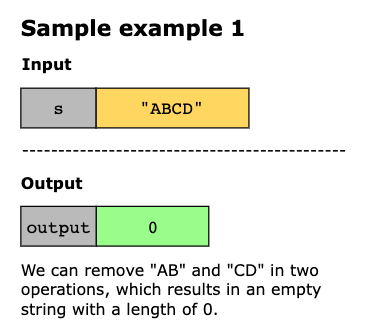
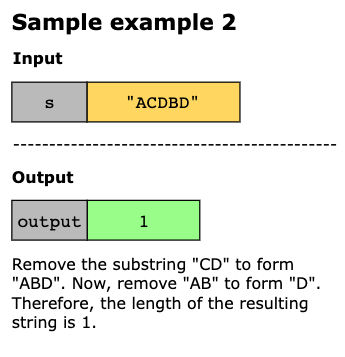
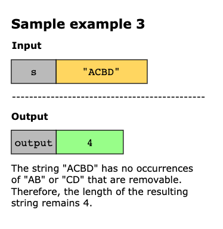

Example 4:

```text
Input: s = "ABFCACDB"
Output: 2
Explanation: We can do the following operations:
- Remove the substring "ABFCACDB", so s = "FCACDB".
- Remove the substring "FCACDB", so s = "FCAB".
- Remove the substring "FCAB", so s = "FC".
So the resulting length of the string is 2.
It can be shown that it is the minimum length that we can obtain.
```

Example 5:

```text
Input: s = "ACBBD"
Output: 5
Explanation: We cannot do any operations on the string so the length remains the same.
```

## Constraints

- 1 ≤ `s.length` ≤ 100
- s consists only of uppercase English letters.

## Topics

- String
- Stack
- Simulation

## Hints

- Can we use brute force to solve the problem?
- Repeatedly traverse the string to find and remove the substrings “AB” and “CD” until no more occurrences exist.
- Can the solution be optimized using a stack?

## Solution(s)

1. [String Replace](#string-replace)
2. [Stack](#stack)
3. [In Place Manipulation](#in-place-manipulation)

### String Replace

The core issue with this problem is the ripple effect of removing substrings. When we delete one occurrence of "AB" or 
"CD", it can create another substring that also needs removal. For example, in "CABD", if we remove "AB", we are left
with "CD", which must also be eliminated to minimize the string length.

A brute force approach will be to continuously check the string for "AB" and "CD" and remove them until none are left.
Once the loop ends, the string will have no remaining "AB" or "CD", and we can return its length. Many programming
languages offer built-in functions for finding and removing substrings, which will be helpful here.

> Note: Some programming practices suggest avoiding direct modifications to input data. If this applies, consider
> making a copy of the input string before you start. It’s a good idea to clarify this with your interviewer before you
> implement the solution.

**Algorithm**

- Enter a loop that continues while s contains either "AB" or "CD". 
  - Check if s contains "AB":
    - If "AB" is present, remove all occurrences of "AB" from s.
  - If "AB" is not present, check if s contains "CD".
    - If "CD" is present, remove all occurrences of "CD" from s.
- After the loop ends, return the length of s.

#### Complexity Analysis

Let `n` be the length of the input string `s`.

##### Time Complexity

The outer while loop can run up to `n/2` times in the worst case. This occurs when we remove two characters in each
iteration (e.g., for a string like "ABABABAB"). Inside the loop, the string methods need to scan the entire string,
which takes O(n) time.

Thus, the overall time complexity of the algorithm is `O(n/2⋅n)=O(n^2)`.

##### Space Complexity

In Python3 and Java, strings are immutable. So, each string operation creates a new string object. However, at any given
time, we only need to store one version of the processed string. So, the space complexity is `O(n)`.

However, in C++, strings are mutable. So, string operations like erase() are performed in place. Thus, the space
complexity in C++ is `O(1)`.

### Stack

In the string removal process, we face two choices for each character:

- Keep the character if it does not form a removable pattern.
- Remove it along with the previous character if it completes a pattern.

Using a stack simplifies this task. We push characters onto the stack as we read them and pop them off when we find a
pattern.

We read the input string from left to right. For each character, we decide to either add it to the stack or remove a
previous character. If the stack is not empty, we compare the current character with the top character on the stack.
If they form "AB" or "CD," we pop the stack. We do not push the current character, thus removing both characters. If
there is no pattern, we push the current character onto the stack.

After processing all characters, the remaining elements in the stack represent the minimum length of the string after
all possible removals.

**Algorithm**

- Initialize a stack to store the characters from the string.
- Iterate over each character in the input string s. For each character currentChar:
  - If the stack is empty, push currentChar onto the stack and continue to the next character.
  - If the current character is 'B' and the top of the stack is 'A', remove the top element from the stack.
  - If the current character is 'D' and the top of the stack is 'C', remove the top element from the stack.
  - If neither of the above conditions is met, push currentChar onto the stack.
- After processing all characters, return the size of the stack.

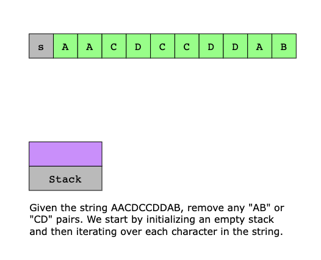
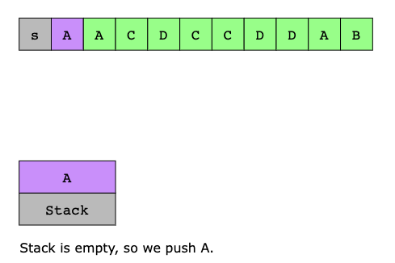


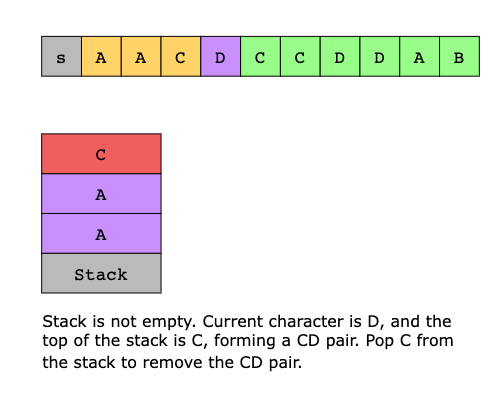
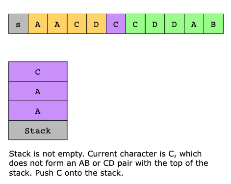
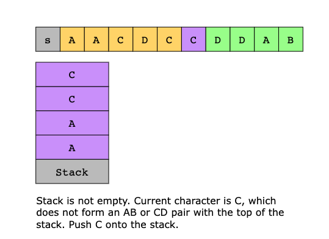
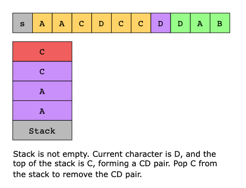
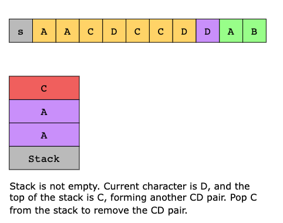
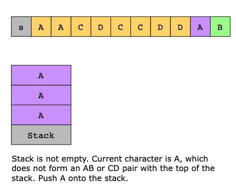
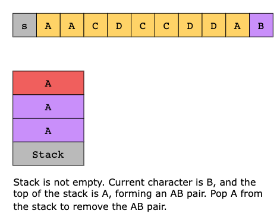
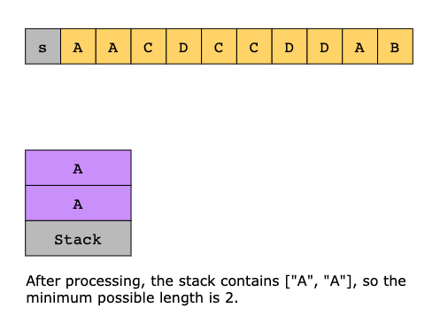

#### Complexity Analysis

Let `n` be the length of the input string `s`.

##### Time Complexity

We iterate over each character of s exactly once. All stack operations inside the loop take constant time. Thus, the
time complexity of the algorithm is `O(n)`.

##### Space Complexity

We use a stack to store characters from the input string. In the worst-case scenario, where no "AB" or "CD" patterns are
found, we would end up storing all n characters in the stack. Thus, the space complexity of the algorithm is `O(n)`.

### In Place Manipulation

To optimize space, we can modify the string in place.

We use two pointers:

- Read Pointer (readPtr): This pointer moves from left to right through the string, checking each character.
- Write Pointer (writePtr): This pointer tracks where to write the next character we want to keep.

We start by setting writePtr to 0. As we move readPtr through the string, we copy the character at readPtr to the
position indicated by writePtr. Next, we check if the last two characters (positions writePtr-1 and writePtr) form a
removable pattern, such as "AB" or "CD". If they do, we decrease writePtr, which means we will overwrite this part in
the next steps.

If the last two characters do not form a removable pattern, we increment writePtr to point to the next position where
we can write a character. This way, we can effectively "remove" unwanted characters by overwriting them.

After processing all characters, the position of writePtr tells us the length of the final string. All the characters
we want to keep are now at the beginning of the array, up to the position of writePtr.

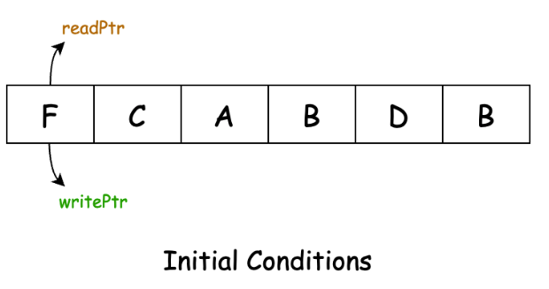

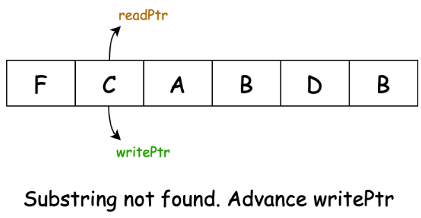
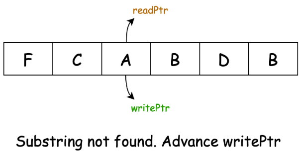
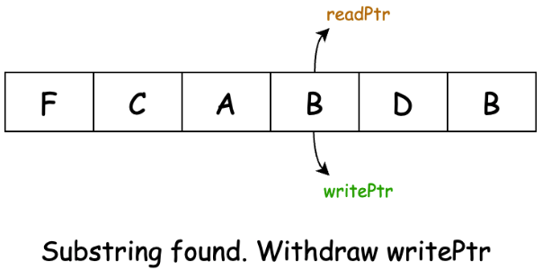
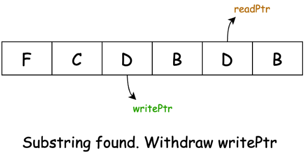
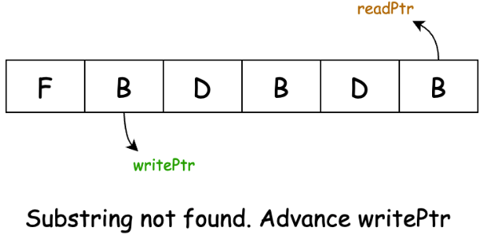
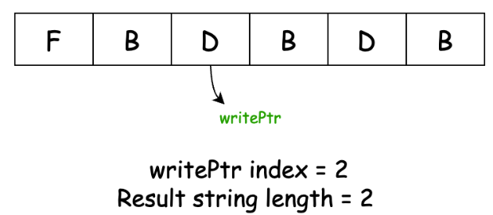

**Algorithm**

- Initialize a variable writePtr to 0, which will keep track of the current write position.
- Iterate over each character in the string using a readPtr:
  - Copy the character at readPtr to the position at writePtr in the string. 
  - Check if the following conditions are met:
    - writePtr is greater than 0 (ensuring there's a previous character).
    - The previous character (at writePtr - 1) is either 'A' or 'C'. 
    - The current character is exactly one ASCII value higher than the previous character.
  - If these conditions are met:
    - Decrement writePtr by 1, effectively removing the pair of characters.
  - Else:
    - Increment writePtr by 1, moving to the next position for writing.
- Return the value of writePtr, which represents the length of the remaining string after all removals.

#### Complexity Analysis

Let `n` be the length of the input string `s`.

##### Time Complexity

We iterate through the input string exactly once. All operations within the loop take constant time. Thus, the overall
time complexity is linear, `O(n)`.

##### Space Complexity

In Java and Python3, strings are immutable. So, the input string needs to be converted to an array or list to perform in
place modifications. Thus, the space complexity remains O(n).

String are mutable in C++. So, all modifications can be done on the input string itself. No additional data structures
are used, so the space complexity is O(1).
