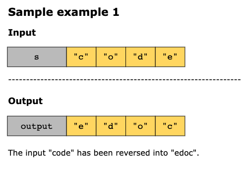
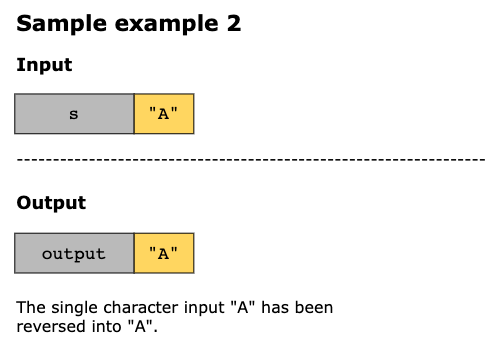
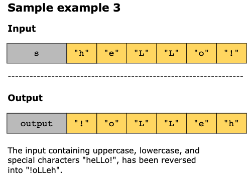

# Reverse String

You are given a character array, s, representing a string. Write a function that reverses the array in-place.

- The reversal must be done by modifying the original array directly.
- You cannot use extra memory beyond a constant amount O(1).

## Constraints 

- 1 <= `s.length` <= 1000
- Each `s[i]` is printable ASCII character

## Examples

## Solution

As the input is given as a character array, the problem can be solved efficiently by reversing the array in place without
using extra space for another array. The key idea is that reversing means swapping the first character with the last, the
second with the second-last, and so on, until all characters are placed in the correct reversed order.

To achieve this, we can use the two pointer technique: one pointer starts at the beginning of the array and the other at
the end. We swap the characters at each step at these two positions, then move the pointers closer toward the center.
This continues until the pointers meet or cross, ensuring all characters are reversed.

The steps of the algorithm are as follows:

1. Initialize two pointers: left at the start, and right at the end of the array.
2. While left < right:
   - Swap the characters at s[left] and s[right]. 
   - Increment left by 1 and decrement right by 1 to move the pointers inward.
3. The process terminates once the left and right pointers meet simultaneously.

### Time Complexity

The solution’s time complexity is O(n), where nnn is the length of the input array, s. Each character in the string is
swapped at most once as the two pointers move toward the center. As every element is visited at most once, the overall
time complexity is O(n).

### Space Complexity

The solution’s space complexity is O(1), as the reversal is done in place using only two pointers (left and right). No
additional data structures are required, regardless of the input size.Thus, the overall space complexity remains O(1).