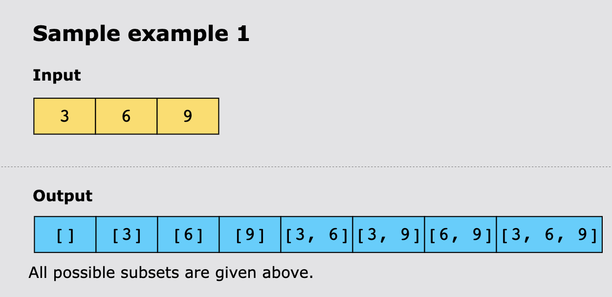
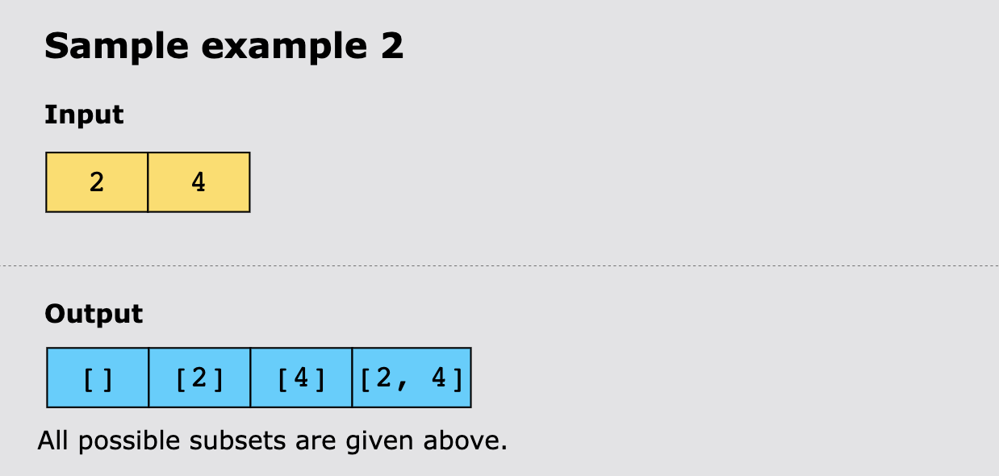
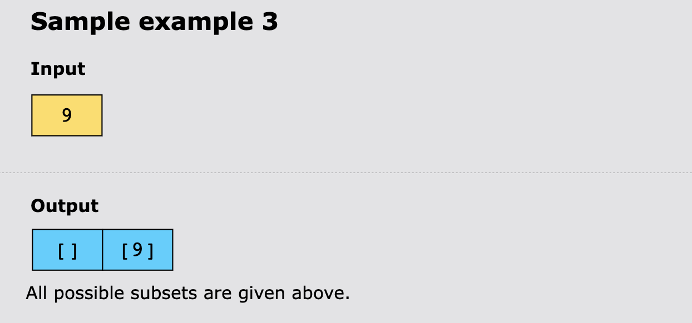

# Subsets

Given an array of integers, nums, find all possible subsets of nums, including the empty set.

> Note: The solution set must not contain duplicate subsets. You can return the solution in any order.

## Constraints

- 1 <= `nums.length` <= 10
- -10 <= `nums[i]` <= 10
- All the numbers in num are unique

## Examples

## Topics

- Bit Manipulation
- Backtracking
- Arrays
