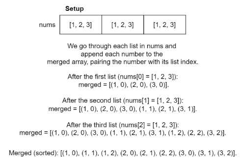
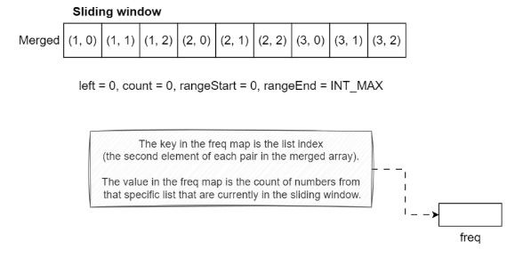
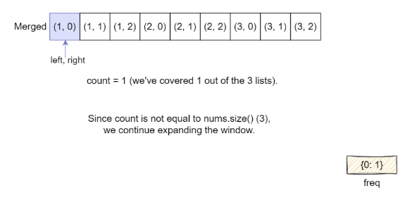
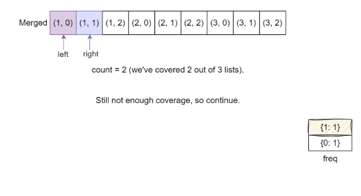
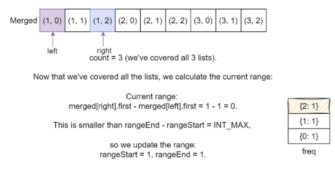
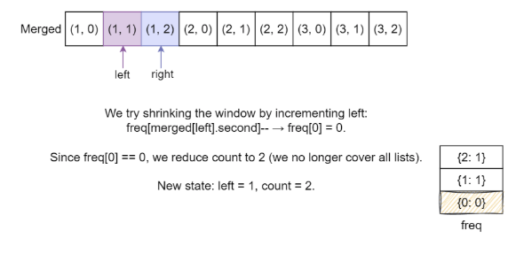
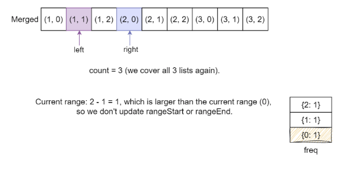
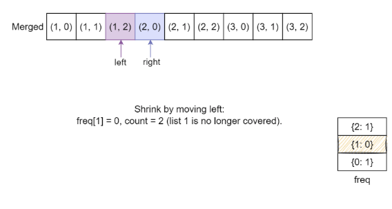
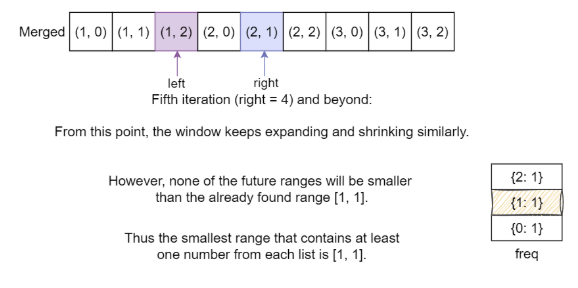

# Smallest Range Covering Elements from K Lists

You are given k sorted lists of integers, nums, where each list in nums is in non-decreasing order. Your task is to find
the smallest range that contains at least one element from each of the k lists.

A range [a,b] is considered smaller than another range [c,d] if `b − a < d − c`, or `a<c` if `b−a==d−c`.

## Constraints

- `nums.length` == `k`
- 1 <= k <= 100
- 1 <= `nums[i].length` <= 50
- -10^3 <= `nums[i][j]` <= 10^3
- `nums[i]` is sorted in a non-decreasing order

## Examples


Example 4:
```text
Input: nums = [[4,10,15,24,26],[0,9,12,20],[5,18,22,30]]
Output: [20,24]
Explanation: 
List 1: [4, 10, 15, 24,26], 24 is in range [20,24].
List 2: [0, 9, 12, 20], 20 is in range [20,24].
List 3: [5, 18, 22, 30], 22 is in range [20,24].
```

Example 5:
```text
Input: nums = [[1,2,3],[1,2,3],[1,2,3]]
Output: [1,1]
```

## Topics

- Principal
- Array
- Hash Table
- Greedy
- Sliding Window
- Sorting
- Heap (Priority Queue)

## Solution(s)

- [Optimal Brute Force](#optimal-brute-force)
- [Heap](#heap-priority-queue)
- [Two Pointer](#two-pointer)

### Optimal Brute Force

We need to find the smallest range that contains at least one number from each of the k sorted lists. At first glance,
a simple brute force solution comes to mind, i.e., checking every combination of elements from the lists to find the
smallest range. However, that would involve too many comparisons and will lead to TLE. Instead, we can refine this
process into something more manageable.

At any moment, we need to select one number from each list. So, to find the smallest range, we need to minimize the
difference between the largest and smallest numbers chosen at each step. The important point here is that, at any time,
our range is defined by the smallest number chosen and the largest number chosen.

So we need to select the smallest number among the current numbers picked from each list and move forward by choosing the
next number from the same list that gave us this smallest number. This makes sense because moving forward in any other
list would only increase the range, which we want to avoid. We repeat this process of updating the smallest number and
checking if the new range is smaller than our previously found range. If it is, we update the range.

We continue this until we reach the end of one of the lists because, at that point, it’s no longer possible to select a
number from each list.

Algorithm steps:

- Initialize k to the number of lists in nums and create an array indices to keep track of the current index of each
  list, initializing all to 0.
- Initialize an array range to store the smallest range, starting with {0, INT_MAX}.
- Enter an infinite loop:
  - Initialize curMin to INT_MAX, curMax to INT_MIN, and minListIndex to 0. 
  - Iterate over each list to find the current minimum and maximum values:
    - For each list i, retrieve the current element using indices[i]. 
    - Update curMin if the current element is less than curMin, and set minListIndex to i. 
    - Update curMax if the current element is greater than curMax. 
  - After checking all lists, if the difference curMax - curMin is smaller than the current range (range[1] - range[0]),
    update range to {curMin, curMax}. 
  - Move to the next element in the list that had the minimum value by incrementing indices[minListIndex]. 
    - If the updated index equals the size of nums[minListIndex], break the loop (all elements have been processed). 
- Return the smallest range stored in range.

> Note: Due to Python's relatively slower execution speed, the optimal brute-force solution will lead to a Time Limit
> Exceeded (TLE) error when using Python3. However, this same solution will perform adequately in other programming
> languages.

#### Complexity Analysis

Let `n` be the total number of elements across all lists and k be the number of lists.

##### Time Complexity

In each iteration of the while (true) loop, we traverse all k lists to find the current minimum and maximum. This
takes O(k) time.

The loop continues until at least one of the lists is fully traversed. In the worst case, every element from every list
is visited, and the total number of elements across all lists is n. Therefore, the loop runs O(n) times.

Overall, the time complexity becomes O(n⋅k).

##### Space Complexity

The space complexity is dominated by the indices and range arrays, both of which have size proportional to k, the number
of lists.

The indices array stores the current index of each list, so it takes O(k) space.

The range array also stores two integers, so it takes O(1) space.

Hence, the overall space complexity is O(k).

### Heap (Priority Queue)

The core idea of this solution is to find the smallest range that includes at least one number from each of the k sorted
lists. Instead of generating all possible ranges across the lists, the solution uses a min heap (priority queue) to
dynamically track the smallest and largest values across currently considered elements. This approach ensures that at
every step, the solution maintains a potential valid range that includes one element from each list, continuously
narrowing it down to the smallest possible.

The process begins by initializing a min heap (priority queue) and pushing the first element from each list into it.
Along with each value, the index of the list it belongs to and its position within it are also stored in the heap.
Additionally, a variable, `max_val`, is maintained to keep track of the current maximum number among the values present in
the heap. This is important because, at any point, the smallest range that covers all lists is defined by the current
smallest and largest elements among the chosen set.

Once the heap is initialized, the solution enters a loop that continues as long as the heap contains one element from
each list (i.e., the length of the heap equals the number of lists). In each iteration, the smallest value is popped from
the heap — this represents the lower bound of the current candidate range. The result is updated accordingly if the
current range `(max_val - min_val)` is smaller than the previously recorded best range.

To maintain the invariant that the heap contains one element from each list, the next element from the list of the popped
value is pushed into the heap. While doing so, `max_val` is updated if the newly pushed element is larger than the current
maximum. This ensures that the next potential range still includes one element from every list and remains as small as
possible.

This process continues until it’s no longer possible to push the next element from one of the lists (i.e., the shortest
list is exhausted). At that point, the smallest valid range is guaranteed to be identified and stored.

Let’s break down the key steps of the solution:

1. We initialize the following:
   - A min heap `min_heap` to store tuples of the form. 
   - `max_val` to track the maximum of the current elements from all lists. 
   - `range_start` and `range_end` to store the current smallest range.
2. We push the first elements of each list to the heap, and max_val is updated to the maximum of all these first elements.
3. We iterate while the heap contains one element from each list:
   - Pop the smallest value (`min_val`) from the heap.
   - If the range formed by `min_val` and `max_val` is smaller than the previous best, update `range_start` and `range_end`.
   - If the next element exists in the list from which `min_val` was popped, push it into the heap, and update `max_val`
     if needed.
4. We stop iterating once one of the lists runs out of elements.
5. The final smallest range covering at least one element from each list is returned as `[range_start, range_end]`.


#### Time Complexity

The solution uses a min heap (priority queue) to track the smallest current elements across the k lists. Let’s break it down:
- We begin by inserting the first element from each of the k lists into the heap. This step takes O(klog(k)) time because
  we perform k push operations, and each one takes O(log(k)) time.
- We repeatedly pop the smallest element from the heap during the iteration and push the next element from the same list
  (if available). In total, we may push and pop up to `n` elements, where n is the total number of elements across all
  lists (as in the worst case, every element could end up in the heap once). Pushing an element from the list into the heap
  incurs a time complexity cost of `O(log(k))` as rebalancing has to happen within the heap.
- Each heap operation (both push and pop) takes `O(log(k))` time because the heap always contains at most k elements.

So the total tim complexity, in the worst case is `O(n log(k))` where n is the total number of elements across all k lists

#### Space Complexity

The heap stores at most k elements at any given time—one from each of the k lists—so the space used by the heap is `O(k)`.
So, the overall space complexity is `O(k)` where `k` is the number of input lists. Additionally, the space for storing
the output range (two integers) is negligible and does not contribute to the overall complexity.

### Two-Pointer

Since we need a range that includes one number from each of the k lists, we can think of this as a subarray problem.
However, the numbers are spread across multiple lists. To simplify, we can combine all the lists into a single sorted
list of numbers. When merging, we also keep track of which list each number came from, since the problem requires at
least one number from each original list in the final range.

Once we have the merged list, the problem becomes finding the smallest range (or subarray) in this list that contains at
least one element from each of the original k lists. This is a common scenario for a sliding window or two-pointer
approach: we want to expand and shrink the window (subarray) dynamically to find the minimum range that meets the criteria.

The right pointer will expand the window by moving forward in the merged list, and the left pointer will shrink the
window once we know the window contains at least one element from each list.

As the right pointer moves through the merged list, we need to ensure that the current subarray includes at least one
number from each list. So we keep track of how many lists are "covered" by the current subarray (i.e., how many of the
k lists have at least one number in the current window).

Once all lists are covered, the window between the left and right pointers represents a valid range. We then check if
this range is the smallest we've found so far.

After finding a valid range, we need to shrink the window (move the left pointer forward) to see if we can make the range
even smaller while still keeping one number from each list in the subarray. As we move the left pointer forward, we check
if we lose coverage from any list. If we do, we stop shrinking and start expanding the window again by moving the right
pointer.

We will continue this until we can no longer expand the window (i.e., the right pointer reaches the end of the merged list).
By this point, we have explored all possible ranges, and the smallest valid range is our final answer.











Algorithm steps:

- Initialize an empty array `merged` to store pairs of numbers and their respective list indices.
- Merge all lists into `merged`:
  - For each list in `nums`, iterate through its numbers and add each number along with its list index to merged.
- Sort the `merged` array to facilitate the two-pointer technique.
- Initialize a frequency map `freq` to keep track of how many times each list is represented in the current window.
- Set the `left` pointer to 0, `count` to 0, and initialize `rangeStart` to 0 and `rangeEnd` to INT_MAX.
- Use a `right` pointer to iterate through the merged array:
  - Increment the count for the list index in `freq` for `merged[right]`.
  - If the count for this list index becomes 1, increment `count` (indicating a new list is represented).
- When all lists are represented (i.e., `count == nums.size()`):
  - Calculate the current range as `curRange = merged[right].first - merged[left].first`.
  - If `curRange` is smaller than the previously found range (`rangeEnd - rangeStart`):
    - Update rangeStart and rangeEnd to the current numbers.
  - Decrement the frequency count for the leftmost number (i.e., `merged[left]`).
  - If this list index's frequency becomes 0, decrement `count` (indicating that a list is no longer represented).
  - Move the `left` pointer to the right to attempt shrinking the window.
- After completing the iteration, return the smallest range as a array containing `rangeStart` and `rangeEnd`.

#### Complexity Analysis

Let `n` be the total number of elements across all lists and `k` be the number of lists.

##### Time Complexity

The first nested loop iterates over `k` lists, and for each list, it iterates through its elements. In the worst case,
this requires `O(n)` time since we are processing all elements once.

After merging, we sort the merged array which contains n elements. Sorting has a time complexity of `O(nlog(n))`.

The two-pointer approach iterates through the merged list once (with the right pointer) and may also move the left
pointer forward multiple times. In total, each pointer will traverse the merged list at most `n` times.

Combining these steps, the overall time complexity is: `O(nlog(n))`

##### Space Complexity

We create a merged array to hold n elements, which requires `O(n)` space.

We use an unordered map (`freq`) that can potentially store `k` elements (one for each list). Thus, this requires `O(k)`
space.

Some extra space is used when we sort an array. The space complexity of the sorting algorithm (S) depends on the
programming language.

- In Python, the sort method sorts a list using the Timsort algorithm which is a combination of Merge Sort and Insertion
  Sort and has a space complexity of `O(n)`.
- In C++, the sort() function is implemented as a hybrid of Quick Sort, Heap Sort, and Insertion Sort, with a worst-case
  space complexity of `O(log(n))`. 
- In Java, Arrays.sort() is implemented using a variant of the Quick Sort algorithm which has a space complexity of `O(log(n))`. 

Combining these, the overall space complexity is: `O(n)`
