# Smallest Range Covering Elements from K Lists

You are given k sorted lists of integers, nums, where each list in nums is in non-decreasing order. Your task is to find
the smallest range that contains at least one element from each of the k lists.

A range [a,b] is considered smaller than another range [c,d] if `b − a < d − c`, or `a<c` if `b−a==d−c`.

## Constraints

- `nums.length` == `k`
- 1 <= k <= 100
- 1 <= `nums[i].length` <= 50
- -10^3 <= `nums[i][j]` <= 10^3
- `nums[i]` is sorted in a non-decreasing order

## Examples


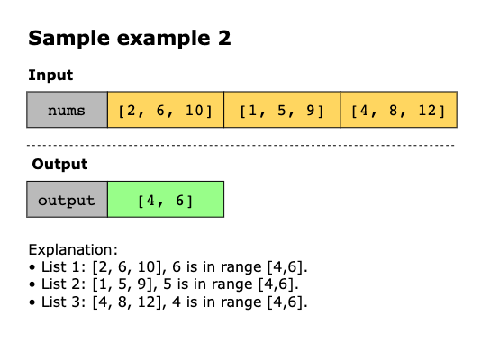
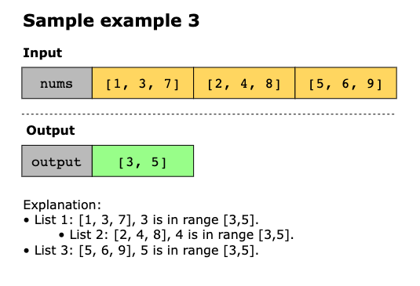

Example 4:
```text
Input: nums = [[4,10,15,24,26],[0,9,12,20],[5,18,22,30]]
Output: [20,24]
Explanation: 
List 1: [4, 10, 15, 24,26], 24 is in range [20,24].
List 2: [0, 9, 12, 20], 20 is in range [20,24].
List 3: [5, 18, 22, 30], 22 is in range [20,24].
```

Example 5:
```text
Input: nums = [[1,2,3],[1,2,3],[1,2,3]]
Output: [1,1]
```

## Topics

- Principal
- Array
- Hash Table
- Greedy
- Sliding Window
- Sorting
- Heap (Priority Queue)

## Solution(s)

- [Optimal Brute Force](#optimal-brute-force)
- [Heap](#heap-priority-queue)
- [Two Pointer](#two-pointer)

### Optimal Brute Force

### Heap (Priority Queue)

The core idea of this solution is to find the smallest range that includes at least one number from each of the k sorted
lists. Instead of generating all possible ranges across the lists, the solution uses a min heap (priority queue) to
dynamically track the smallest and largest values across currently considered elements. This approach ensures that at
every step, the solution maintains a potential valid range that includes one element from each list, continuously
narrowing it down to the smallest possible.

The process begins by initializing a min heap (priority queue) and pushing the first element from each list into it.
Along with each value, the index of the list it belongs to and its position within it are also stored in the heap.
Additionally, a variable, `max_val`, is maintained to keep track of the current maximum number among the values present in
the heap. This is important because, at any point, the smallest range that covers all lists is defined by the current
smallest and largest elements among the chosen set.

Once the heap is initialized, the solution enters a loop that continues as long as the heap contains one element from
each list (i.e., the length of the heap equals the number of lists). In each iteration, the smallest value is popped from
the heap — this represents the lower bound of the current candidate range. The result is updated accordingly if the
current range `(max_val - min_val)` is smaller than the previously recorded best range.

To maintain the invariant that the heap contains one element from each list, the next element from the list of the popped
value is pushed into the heap. While doing so, `max_val` is updated if the newly pushed element is larger than the current
maximum. This ensures that the next potential range still includes one element from every list and remains as small as
possible.

This process continues until it’s no longer possible to push the next element from one of the lists (i.e., the shortest
list is exhausted). At that point, the smallest valid range is guaranteed to be identified and stored.

Let’s break down the key steps of the solution:

1. We initialize the following:
   - A min heap `min_heap` to store tuples of the form. 
   - `max_val` to track the maximum of the current elements from all lists. 
   - `range_start` and `range_end` to store the current smallest range.
2. We push the first elements of each list to the heap, and max_val is updated to the maximum of all these first elements.
3. We iterate while the heap contains one element from each list:
   - Pop the smallest value (`min_val`) from the heap.
   - If the range formed by `min_val` and `max_val` is smaller than the previous best, update `range_start` and `range_end`.
   - If the next element exists in the list from which `min_val` was popped, push it into the heap, and update `max_val`
     if needed.
4. We stop iterating once one of the lists runs out of elements.
5. The final smallest range covering at least one element from each list is returned as `[range_start, range_end]`.

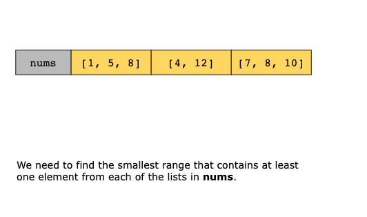
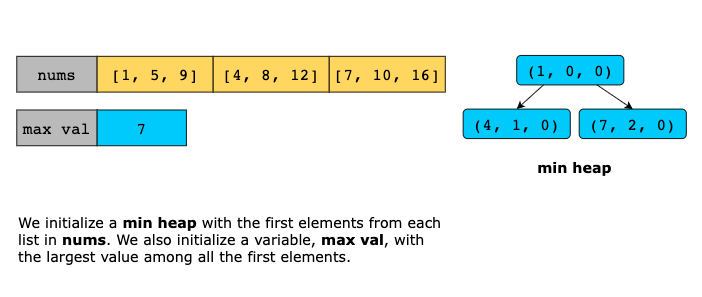

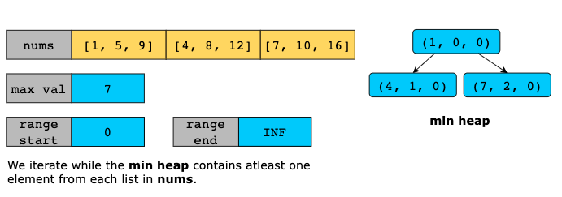
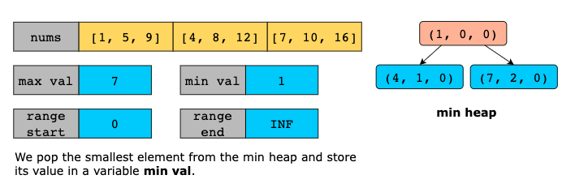
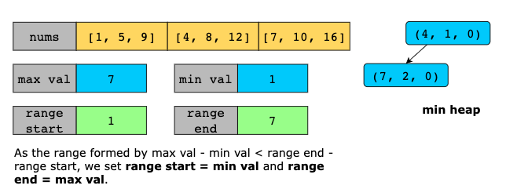
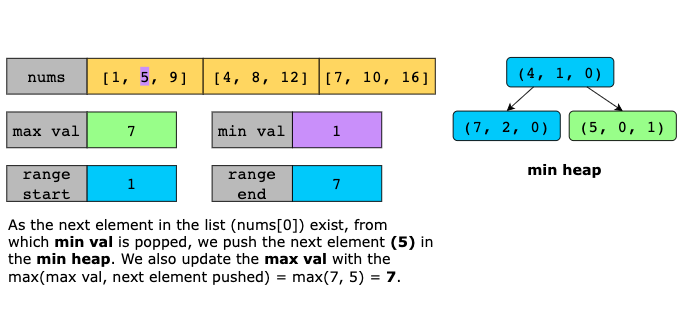
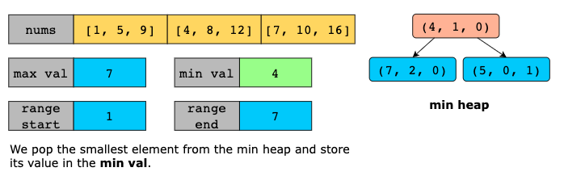
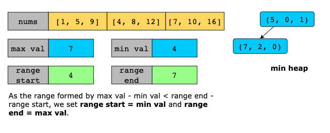
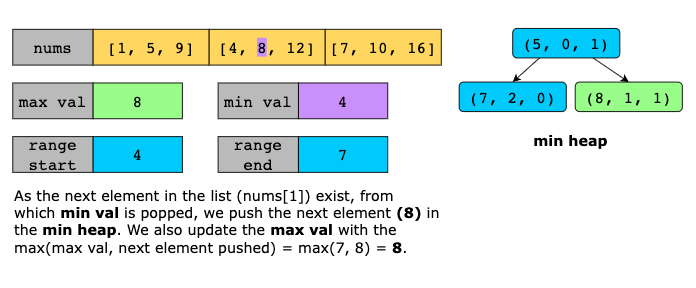
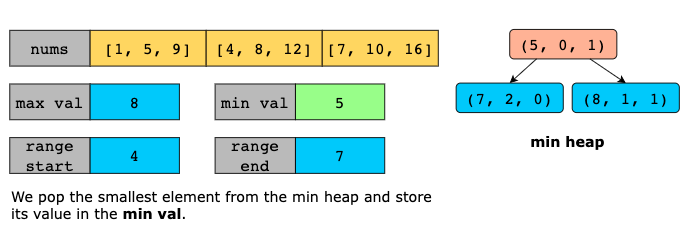
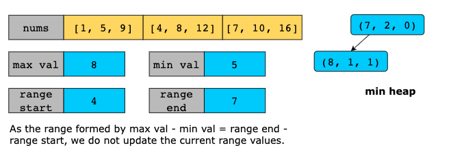
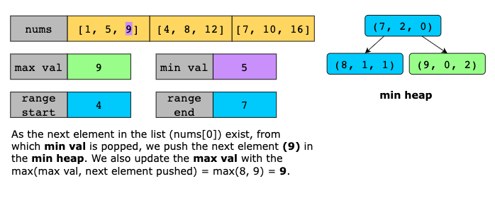
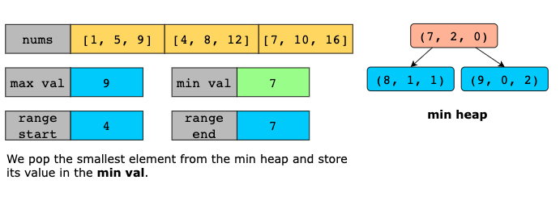
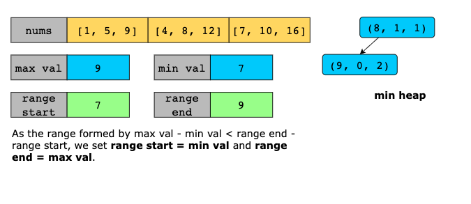
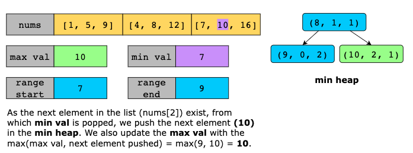
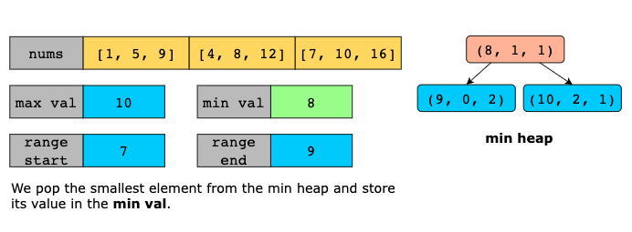
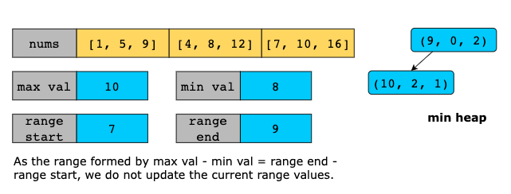
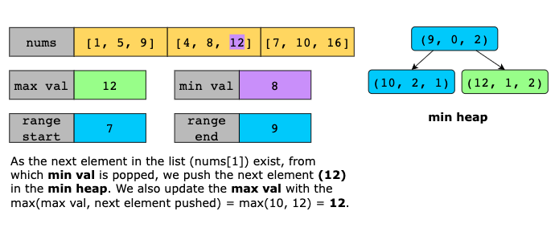
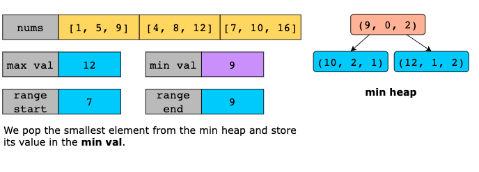
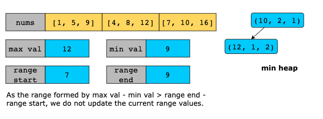
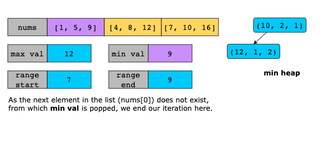
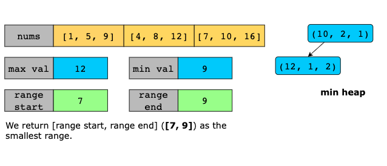

#### Time Complexity

The solution uses a min heap (priority queue) to track the smallest current elements across the k lists. Let’s break it down:
- We begin by inserting the first element from each of the k lists into the heap. This step takes O(klog(k)) time because
  we perform k push operations, and each one takes O(log(k)) time.
- We repeatedly pop the smallest element from the heap during the iteration and push the next element from the same list
  (if available). In total, we may push and pop up to `n` elements, where n is the total number of elements across all
  lists (as in the worst case, every element could end up in the heap once). Pushing an element from the list into the heap
  incurs a time complexity cost of `O(log(k))` as rebalancing has to happen within the heap.
- Each heap operation (both push and pop) takes `O(log(k))` time because the heap always contains at most k elements.

So the total tim complexity, in the worst case is `O(n log(k))` where n is the total number of elements across all k lists

#### Space Complexity

The heap stores at most k elements at any given time—one from each of the k lists—so the space used by the heap is `O(k)`.
So, the overall space complexity is `O(k)` where `k` is the number of input lists. Additionally, the space for storing
the output range (two integers) is negligible and does not contribute to the overall complexity.

### Two-Pointer

