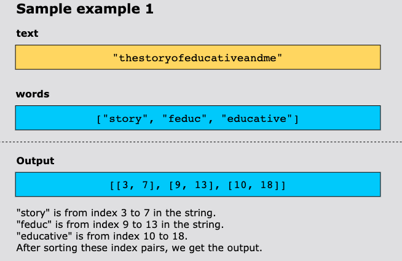
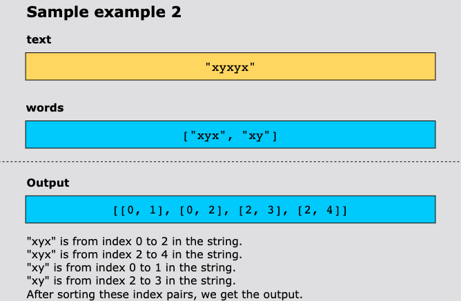
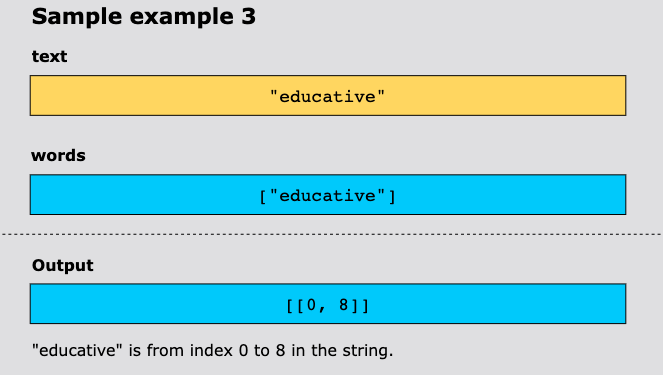

# Index Pairs of a String

Given a string text and an array of strings words, return a list of all index pairs [i, j] such that the substring 
`text[i...j]` is present in words.

Return the pairs [i, j] in a sorted order, first by the value of i, and if two pairs have the same i, by the value of j.

## Constraints

- 1 ≤ text.length ≤ 100
- 1 ≤ words.length ≤ 20
- 1 ≤ words[i].length ≤ 50
- text and words[i] consist of lowercase English letters.
- All the strings of words are unique.

## Examples

## Solution

The algorithm uses a trie to find all pairs of start and end indexes for substrings in a given text that match words
from a list. First, it builds the trie by inserting each word from the list. Then, it iterates over each starting index
in the text to match substrings using the trie. For each character sequence, it checks if the current character exists
in the trie and traverses accordingly. If a word’s end is found (marked by a flag), the start and end indexes of the
matched substring are recorded in the result. This method optimizes substring searching using the trie structure to
avoid redundant checks and efficiently match multiple words in the text.

The algorithm to solve this problem is as follows:

1. Insert each word from the list into the trie. Each character is added as a node, and isEndOfWord is set to mark the
   end of a word.
2. Loop through each character in text (starting at index i). For each starting index, try to find substrings that match
   words in the trie by traversing them.
3. For each character at position i, the algorithm begins traversing the trie from the root node. It then checks whether
   each subsequent character (from index i to j) is a child node in the trie. If the character is found, the traversal
   continues to the next character. A valid match has been found if the current node in the Trie marks the end of a word
   (i.e., isEndOfWord is True). In that case, the index pair [i, j] is recorded, where i is the start index, and j is the
   end index of the matched word.
4. After checking all starting indexes, return the list of index pairs representing matched words’ start and end positions.

### Time Complexity

Inserting n words of average length m into the trie takes O(n∗m). For each index i in text, we perform a search that
takes linear time in the length of the substring. This gives an overall time complexity of O(l∗k), where l is the length
of the text, and k is the average length of a word.

### Space Complexity

The space the trie uses depends on the number of characters in the list words. If there are n words with an average length
of m, the trie can take up to `O(n∗m)` space, assuming no overlapping prefixes among the words. In the worst case, if all
words are unique and have no shared prefixes, each character is stored separately.

The result list stores the index pairs [i, j]. In the worst case, every possible substring of text could be a word in
the list words. This would result in `O(l^2)` pairs, where l is the length of the string text. So, the space complexity
for the result list is `O(l^2)` in the worst case.

Thus, the overall space complexity is `O(n∗m+l^2)`.
