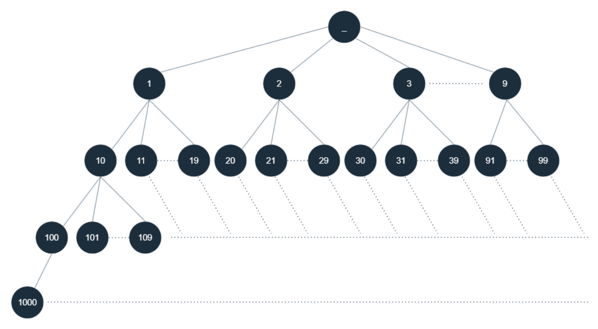

# K-th Smallest in Lexicographical Order

Given two integers n and k, return the kth lexicographically smallest integer in the range [1, n].
 
## Examples

Example 1:
```text
Input: n = 13, k = 2
Output: 10
Explanation: The lexicographical order is [1, 10, 11, 12, 13, 2, 3, 4, 5, 6, 7, 8, 9], so the second smallest number is 10.
```

Example 2:

```text
Input: n = 1, k = 1
Output: 1
```

## Constraints

- 1 <= k <= n <= 10^9

## Topics

- Trie

## Solution

We need to find the K-th smallest number in lexicographical order within the range [1, n]. At first, this might seem
like a simple sorting problem. We could list all the numbers, sort them in lexicographical order, and pick the K-th
number. However, for large values of n, this becomes impractical due to the sheer size of the list we'd need to create.

Instead of generating and sorting all the numbers, we can treat numbers as trees, where each node represents a number
and its children represent numbers with the same prefix. Structuring numbers this way allows us to find the K-th smallest
more efficiently.

For example, the number 1 has children 10, 11, 12, ..., up to 19. Similarly, 2 has children 20, 21, ..., up to 29 and so
on for other numbers. This gives us a prefix tree like structure where each node corresponds to a number and branches out
to other numbers by appending digits. If we traverse this tree in lexicographical order, it’s as if we’re listing all
numbers in their proper order.



### Intuition

We begin by selecting the smallest lexicographical number, which is 1. Since we've already counted 1 as the first number,
we subtract 1 from k to account for that.

Next, we calculate how many numbers exist in the subtree rooted at curr by defining a helper function countSteps, which
counts the numbers between two prefixes [curr and curr + 1). It calculates numbers at each level, expanding the prefix
as we go deeper.

We know the k-th number is not in this subtree if the number of steps (or numbers) under curr is smaller than or equal
to k. Under these circumstances, we skip to the next sibling (curr++) and subtract the number of steps from k because
we've skipped those numbers.

On the other hand, if the number of steps is larger than k, we know the k-th number is in the subtree rooted at curr. In
that case, we move down one level by multiplying curr by 10, effectively moving to the next digit in the lexicographical
tree. We also decrease k by 1 because we've taken one step deeper into the tree.

We repeat this process until k becomes zero, at which point we've found the k-th number, and we return curr.

### Algorithm

- Initialize `curr` to 1 (current prefix) and decrement `k` by 1.
- While `k` is greater than 0:
  - Calculate the number of steps in the subtree rooted at `curr` using `countSteps(n, curr, curr + 1)`.
  - If the number of steps is less than or equal to `k`:
    - Increment `curr` by 1 to move to the next prefix. 
    - Decrement `k` by the number of skipped steps (i.e., `k -= step`). 
  - Otherwise:
    - Multiply `curr` by 10 to move to the next level in the tree (i.e., `curr *= 10`). 
    - Decrement `k` by 1 to account for the current level.
- Return the value of `curr` as the `k`-th smallest number in lexicographical order.
- `countSteps` function:
  - Initialize `steps` to 0 to keep track of the count of numbers in the range. 
  - While `prefix1` is less than or equal to `n`:
    - Add the number of integers between `prefix1` and `prefix2` to `steps` using `steps += Math.min(n + 1, prefix2) - prefix1`. 
      This ensures the count does not exceed `n` by capping `prefix2` at `n + 1` if `prefix2` is larger than `n`. 
    - Multiply `prefix1` and `prefix2` by 10 to move to the next level in the tree.
  - Return the total number of steps counted.

### Complexity Analysis

Let n be the input number.

#### Time complexity: O(log(n)^2)

The outer `while` loop runs as long as `k > 0`. In the worst case, it runs `O(log(n))` times, because at each step, we
either move to the next prefix or move deeper into the tree (multiplying the current prefix by 10).

The `countSteps` function, which calculates the number of steps between two prefixes, runs in `O(log(n))` time, as it
traverses deeper levels of the number range by multiplying the prefixes by 10 in each iteration.

Since the `countSteps` function is called inside the `while` loop, which also runs `O(log(n))` times, the overall time
complexity is `O(log(n)×log(n))=O(log(n)^2)`.

#### Space complexity: O(1)

The space complexity is `O(1)` because we're only using a constant amount of additional space for variables like `curr`,
`k`, `step`, `prefix1`, `prefix2`, etc. We're not using any data structures that grow with the input size.
