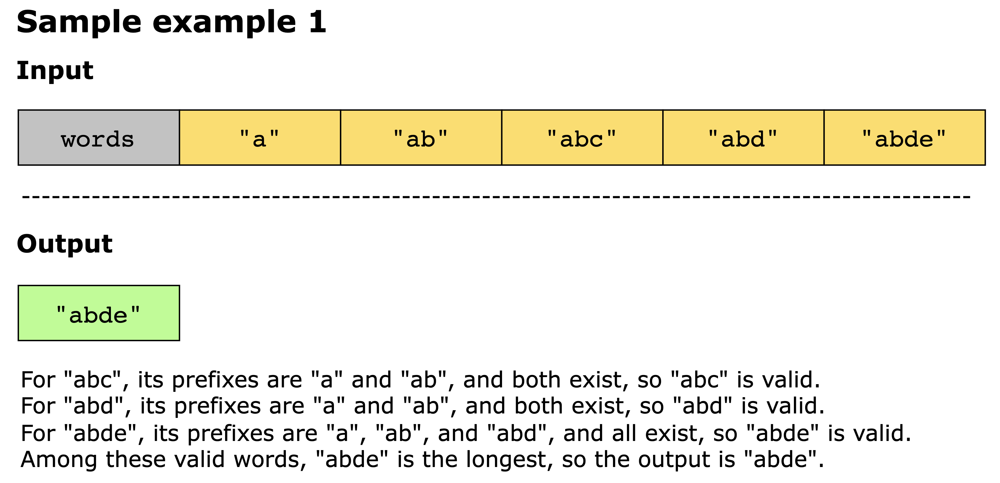
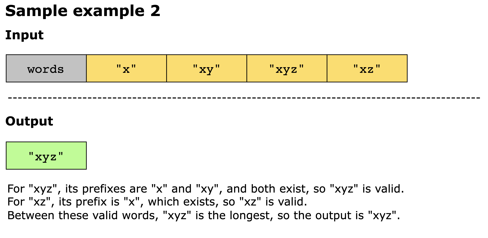
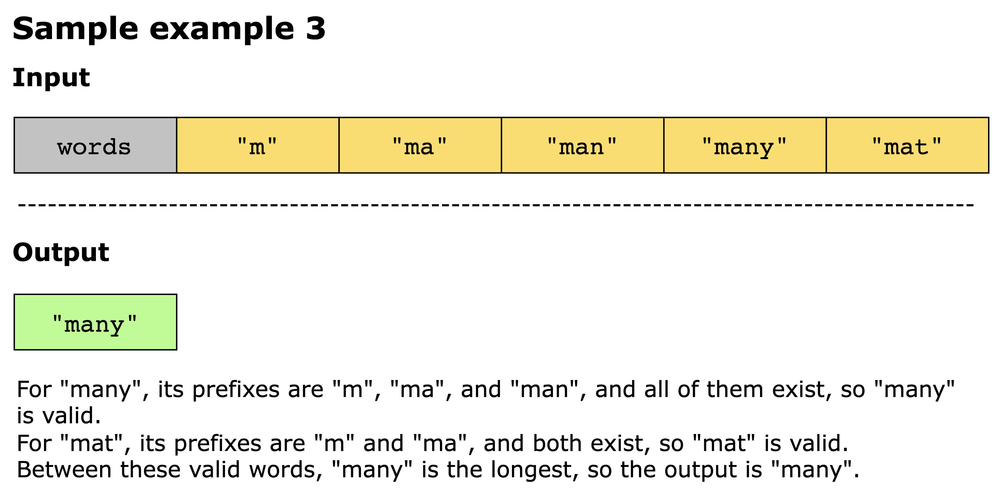
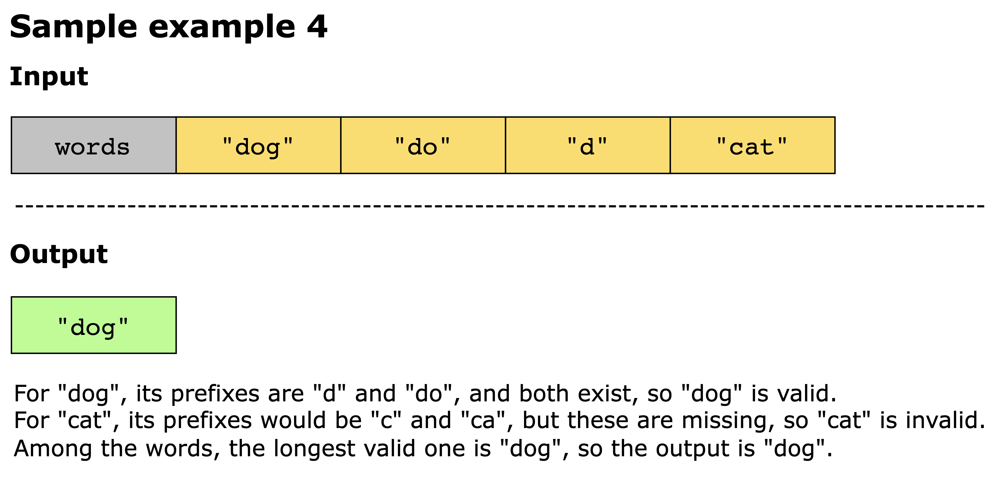
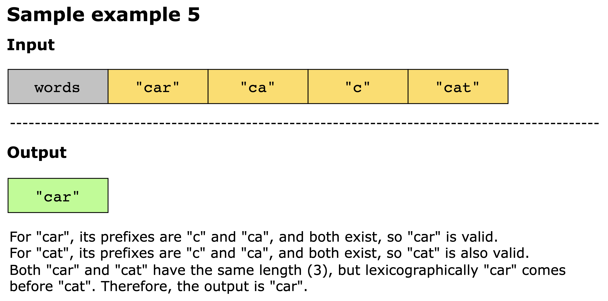

# Longest Word With All Prefixes

You are given an array of strings, words. Your task is to find the longest string in words such that every prefix of
this string is also present in words.

A prefix of a string is any leading substring. For example, the prefixes of "apple" are "a", "ap", "app", and "appl".

1. If multiple valid strings have the same maximum length, return the lexicographically smallest one. 
2. If no such string exists, return an empty string "".

## Constraints:

- 1 ≤ `words.length` ≤ 10^3
- 1 ≤ `words[i].length` ≤ 10^3
- 1 ≤ `sum(words[i].length)` ≤ 10^3
- `words[i]` consists only of lowercase English letters.

## Examples

