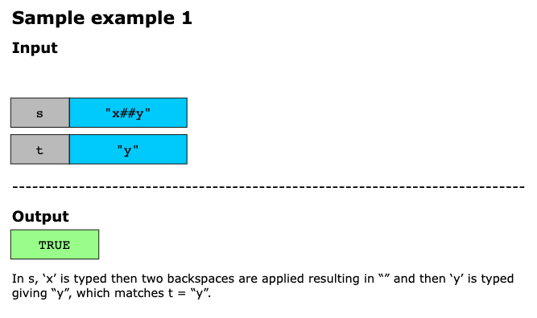
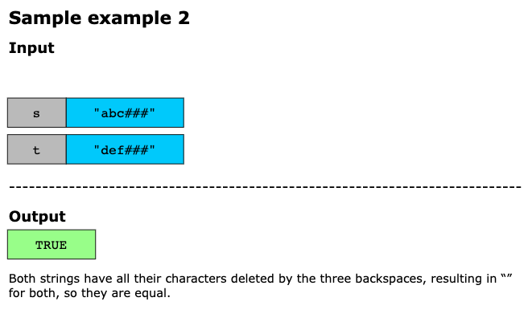
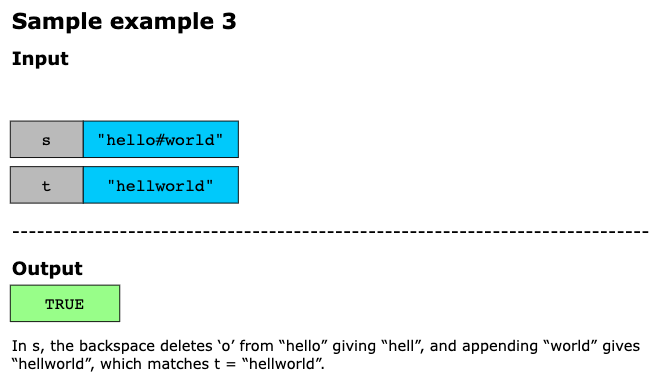
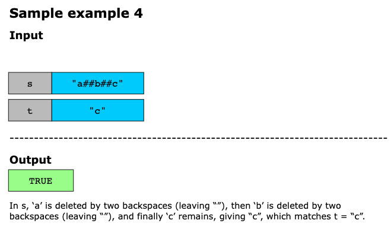

# Backspace String Compare

Given two strings s and t, return true if they are equal when both are typed into empty text editors. '#' means a
backspace character.

Note that after backspacing an empty text, the text will continue empty.

## Examples






Example 5:

```text
Input: s = "ab#c", t = "ad#c"
Output: true
Explanation: Both s and t become "ac".
```

Example 6:

```text
Input: s = "ab##", t = "c#d#"
Output: true
Explanation: Both s and t become "".
```

Example 7:
```text
Input: s = "a#c", t = "b"
Output: false
Explanation: s becomes "c" while t becomes "b".
```

## Constraints

- 1 <= s.length, t.length <= 200
- s and t only contain lowercase letters and '#' characters.

> Follow up: Can you solve it in O(n) time and O(1) space?

## Topics

- Two Pointers
- String
- Stack
- Simulation

## Solution(s)

- [Two Pointers](#two-pointers)
- [Build String](#build-string)

### Two Pointers

When writing a character, it may or may not be part of the final string depending on how many backspace keystrokes occur
in the future.

If instead we iterate through the string in reverse, then we will know how many backspace characters we have seen, and
therefore whether the result includes our character.

The key insight is that backspace characters affect only the characters to their left, which means if we traverse both
strings from right to left, we can determine which characters are truly “visible” (i.e., not cancelled by a '#') and
compare them on the fly without ever building the final strings. We maintain two pointers, one for each string, and a
skip counter for each that tracks how many upcoming characters should be skipped due to pending backspaces. Whenever both
pointers land on a valid character simultaneously, we compare them directly and move on.

#### Algorithm

Iterate through the string in reverse. If we see a backspace character, the next non-backspace character is skipped. If
a character isn't skipped, it is part of the final answer.

#### Complexity Analysis

- **Time Complexity**: O(m + n), where m, n are the lengths of `s` and `t` respectively. Because each character in `s`
  (of length `m`) and each character in `t` of length `n` is visited at most once by its respective pointer, making the
  total work proportional to the combined length of both strings
- **Space Complexity**: O(1). This is because only a fixed number of variables(the pointers) are used regardless of the
  input sizes, with no auxiliary data structures or string reconstruction required.

### Build String

Let's individually build the result of each string (build(S) and build(T)), then compare if they are equal.

Algorithm

To build the result of a string build(S), we'll use a stack based approach, simulating the result of each keystroke.

#### Complexity Analysis

- Time Complexity: O(M+N), where M,N are the lengths of S and T respectively.
- Space Complexity: O(M+N).
