# Count Pairs Whose Sum is Less than Target

You are given a 0-indexed integer array, nums, of length n, and an integer target. Your task is to determine the number
of distinct pairs of indexes (i,j) such that:

- 0≤i<j<n (i.e., i comes before j in the array)
- The sum of the elements of the indexes (i,j), (i.e., nums[i]+nums[j]), is strictly less than the target.

## Constraints

- n == `nums.length`
- 1 <= n <= 50
- -50 <= nums[i], `target` <= 50

## Examples

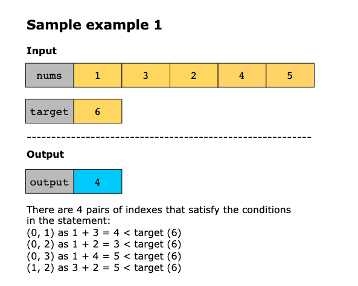
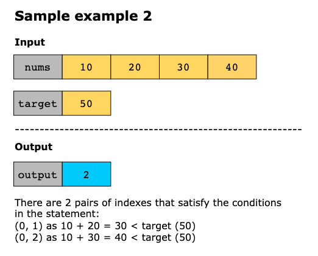

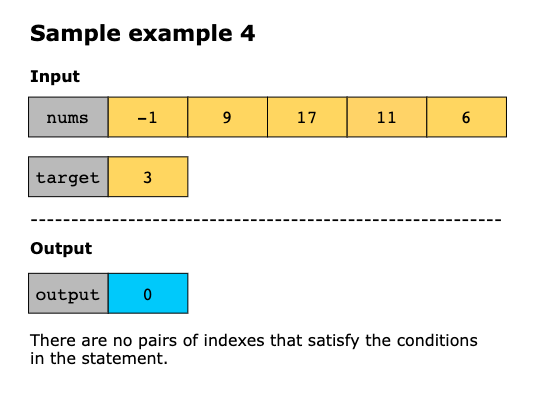

## Topics

- Array
- Two Pointers
- Sorting
- Binary Search

## Solution

The problem requires counting the number of valid pairs in an array where the sum of the pair is less than a given target.
To solve this efficiently, we first sort the array to simplify pair comparisons. After sorting, we initialize two pointers:
one at the beginning of the array and the other at the end. Sorting ensures that any element at a higher index is greater
than or equal to the element at a lower index, allowing us to evaluate pairs in a structured manner. The two pointer
approach leverages this property to efficiently identify valid pairs.

When the sum of the elements at the two positions is smaller than the given target, all pairs formed by fixing the lower
position and combining it with values starting from the higher position down to the lower position are valid. This is
because the sequence is sorted, and any pair created by moving the higher position downward results in a smaller sum,
which is guaranteed to be less than the current sum of the two positions. The total number of such valid pairs is the
difference between the higher and lower positions.

After counting these pairs, the lower position is incremented to check combinations involving larger values, allowing us
to explore pairs with higher sums. If the sum of the elements at the two positions is not smaller than the given target,
the higher position is moved backward to reduce the sum and potentially find valid pairs. This approach ensures efficient
counting of all valid pairs without redundant checks.

The steps of the algorithm are as follows:
1. Sort the input array, `nums`, in an ascending order.
2. Initialize a variable `count` to 0 to keep track of the total number of valid pairs. Also, initialize two pointers, 
   `low` and `high`, with `low` at the beginning of the array and `high` at the end.
3. Use the pointers to traverse the array until `low < high`, and check the sum of `nums[low] + nums[high]`:
   - If the sum is less than the target, all `low` and `high` (inclusive of high) pairs are valid because the array is
     sorted. Add `high - low` to `count`. Increment low to explore additional valid pairs with a larger first element.
   - Otherwise, decrement `high` to reduce the sum.
4. Once the pointers meet or cross, the iteration ends.
5. Return the value of `count` as the total number of valid pairs.

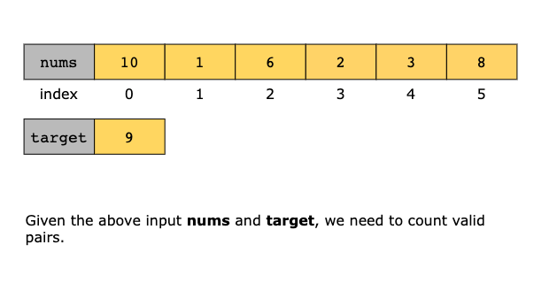
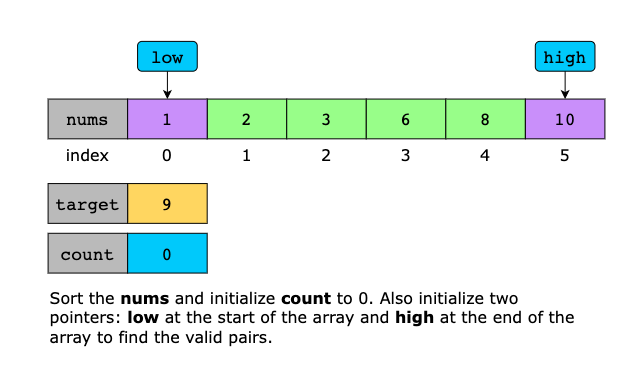
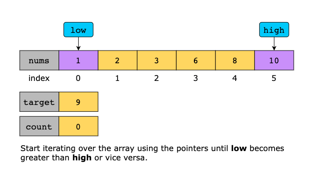
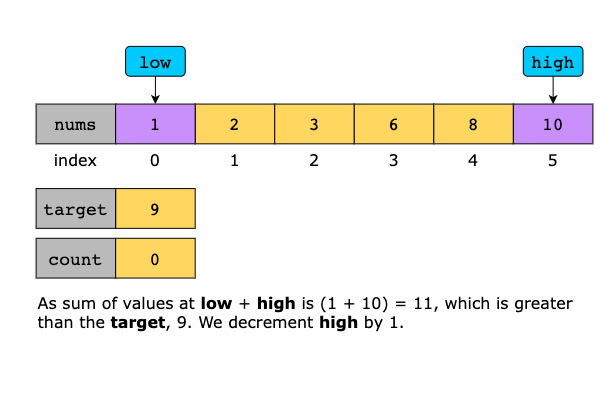
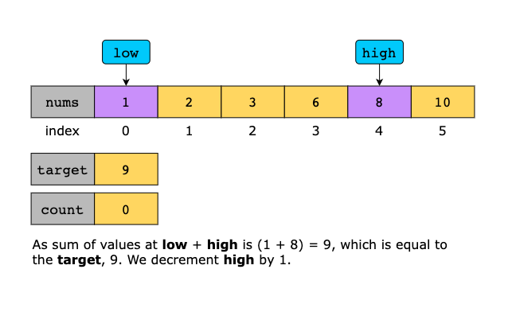
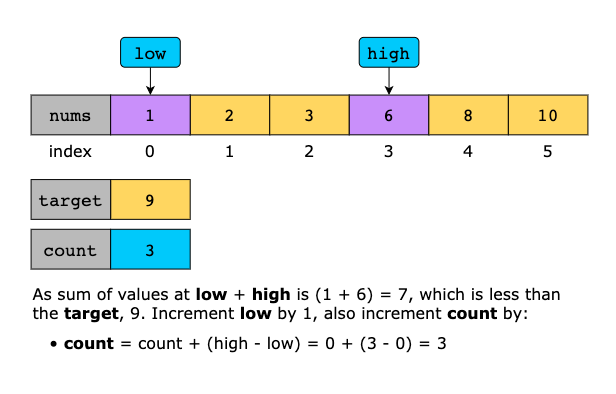
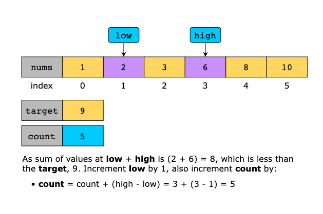
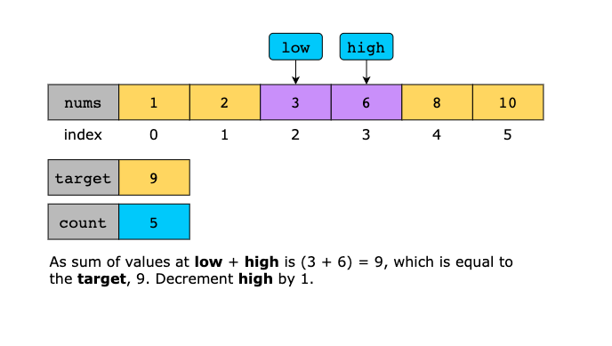
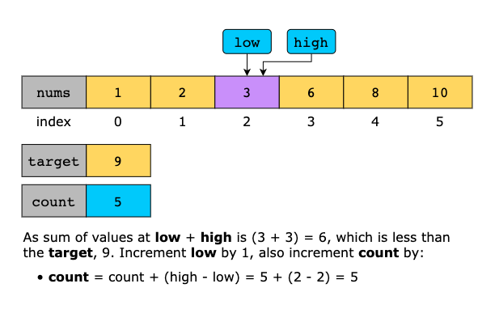
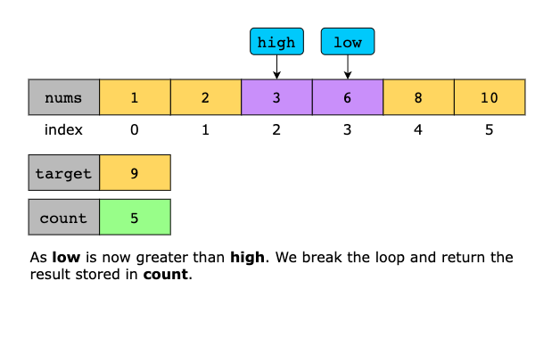

### Time Complexity

The time complexity analysis is as follows:

- **Sorting the array**: The array is sorted at the beginning, which takes `O(n log(n))`, where n is the number of
  elements in the array.

- **Two pointer traversal**: The algorithm uses a single loop for the two pointer approach, which runs in `O(n)`.

Add these complexities together: `O(n log(n)) + O(n) = O(n log(n))`. Thus, the overall time complexity is `O(nlog(n))`.

### Space Complexity

The algorithm’s space complexity is O(n) because it creates a new list to store the sorted elements, while the
two-pointer traversal only requires a constant amount of extra space.
