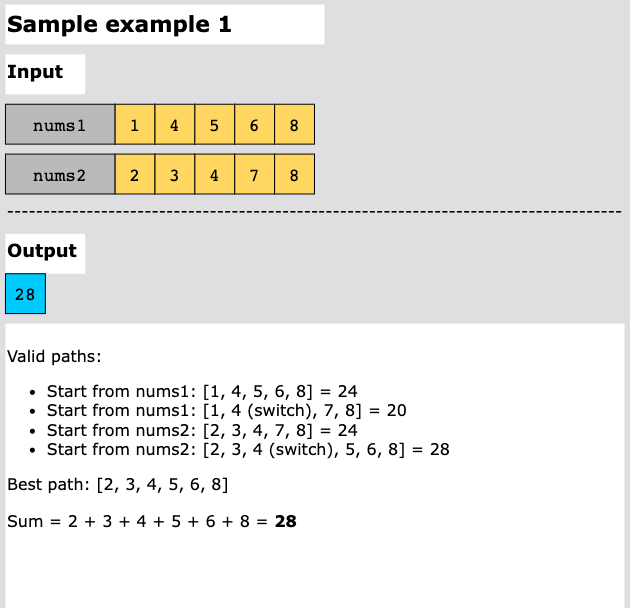
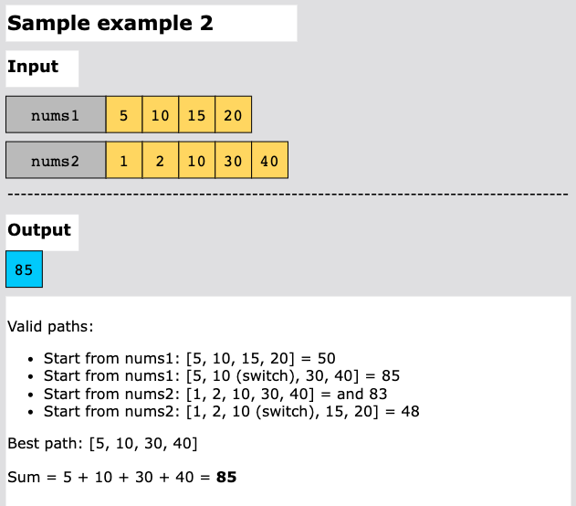
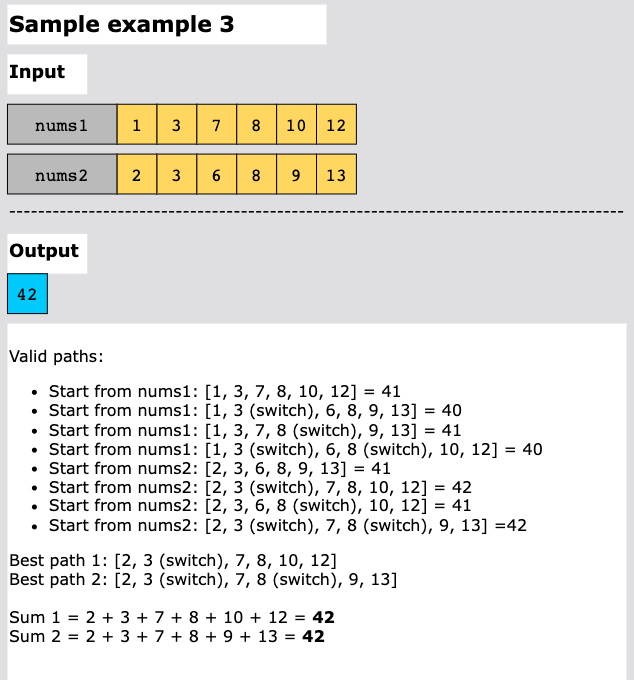
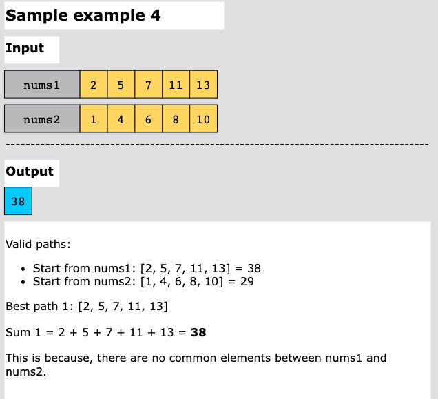

# Get the Maximum Score

You are given two sorted arrays of distinct integers `nums1` and `nums2`.

A valid path is defined as follows:

- Choose array `nums1` or `nums2` to traverse (from index-0).
- Traverse the current array from left to right.
- If you are reading any value that is present in `nums1` and `nums2` you are allowed to change your path to the other
  array. (Only one repeated value is considered in the valid path).

The score is defined as the sum of unique values in a valid path.

Return the maximum score you can obtain of all possible valid paths. Since the answer may be too large, return it modulo
10^9 + 7.

## Examples






Example 5:
```text
Input: nums1 = [2,4,5,8,10], nums2 = [4,6,8,9]
Output: 30
Explanation: Valid paths:
[2,4,5,8,10], [2,4,5,8,9], [2,4,6,8,9], [2,4,6,8,10],  (starting from nums1)
[4,6,8,9], [4,5,8,10], [4,5,8,9], [4,6,8,10]    (starting from nums2)
The maximum is obtained with the path in green [2,4,6,8,10].
```

Example 6:
```text
Input: nums1 = [1,3,5,7,9], nums2 = [3,5,100]
Output: 109
Explanation: Maximum sum is obtained with the path [1,3,5,100].
```

Example 7:
```text
Input: nums1 = [1,2,3,4,5], nums2 = [6,7,8,9,10]
Output: 40
Explanation: There are no common elements between nums1 and nums2.
Maximum sum is obtained with the path [6,7,8,9,10].
```

## Constraints

- 1 <= `nums1.length`, `nums2.length` <= 10^5
- 1 <= nums1[i], nums2[i] <= 10^7
- `nums1` and `nums2` are strictly increasing.

## Topics

- Array
- Two Pointers
- Dynamic Programming
- Greedy

## Hints

- Partition the array by common integers, and choose the path with larger sum with a DP technique.

## Solution

The goal is to collect the maximum score by traversing two sorted arrays where switching between them is only allowed at
common elements. The challenge is to choose when to switch to maximize the cumulative score.

This is done efficiently using the two pointers technique, which allows simultaneous traversal of both arrays in linear
time, without the need to build or store all possible paths. As the arrays are strictly increasing, any prefix sum is
guaranteed to grow as we move forward. At each common element, we are allowed to switch arrays. We decide whether to
switch by comparing the scores accumulated from both paths and choosing the larger one as the new base to continue forward.
This decision ensures that we always continue on the more rewarding path, step by step.

This approach works reliably because, beyond any common element, both arrays are still strictly increasing. So,
regardless of which array we continue from, the score will continue to grow. We guarantee that the optimal path is
preserved by always choosing the higher cumulative score at a common value. 

Let’s take an example to further understand this:

- nums1 = [10, 20, 40, 50, 60]
- nums2 = [1, 2, 40, 10000, 35000]

At the first common element 40, we compare the cumulative sums collected so far:

- From `sum_path1`: 10 + 20 = 30
- From `sum_path2`: 1 + 2 = 3

As 30>3, we take the maximum sum_path1 sum and add the common value 40 to get 70, then assign this to both paths,
sum_path1 and sum_path2. This synchronization means both paths now carry the same score forward, ensuring we don’t miss
high-value segments in either array, like nums2 having 10000 next. The higher-sum path will naturally take the lead. Once
both arrays are fully processed, we simply return the greater of the two running totals. This method avoids generating
every possible path and instead builds the optimal one on-the-fly in linear time, making it both elegant and efficient.

Now, let’s look at the solution steps below:

1. Initialize two pointers, `pointer1` and `pointer2`, to traverse `nums1` and `nums2`, respectively.
2. Initialize two running sums, `sum_path1` and `sum_path2`, to track the current total score on each path.
3. Define a constant `MOD = 10^9 + 7` to apply modulo as required by the problem constraints to prevent overflow.
4. Traverse both arrays simultaneously using the two pointers, continuing until both pointers have reached the end of
   their respective arrays:
   - If `nums1[pointer1]` < `nums2[pointer2]`:
     - Add `nums1[pointer1]` to `sum_path1` and increment `pointer1`.
   - Else if `nums1[pointer1]` > `nums2[pointer2]`:
     - Add `nums2[pointer2]` to `sum_path2` and increment `pointer2`.
   - Else (if `nums1[pointer1]` == `nums2[pointer2`] (common element):
     - Add the common value to the maximum of `sum_path1` and `sum_path2`.
     - Assign this computed sum to both `sum_path1` and `sum_path2` to synchronize paths.
     - Increment both pointers to move past the common value in both arrays.
5. After traversal, take the maximum of `sum_path1` and `sum_path2`.
6. Return the result modulo `10^9 + 7`.

### Complexity

#### Time Complexity

The time complexity of the solution is O(m+n) because each element in nums1 and nums2 is processed at most once using
two pointers. Here, m and n are the lengths of the two arrays.

#### Space Complexity

The solution's space complexity is O(1) as it uses only a constant amount of extra memory for variables like pointers
and running sums, regardless of the input size.
