# Move Zeroes

Given an integer array nums, move all 0's to the end of it while maintaining the relative order of the non-zero
elements.

Note that you must do this in-place without making a copy of the array.

```plain

Example 1:

Input: nums = [0,1,0,3,12]
Output: [1,3,12,0,0]
Example 2:

Input: nums = [0]
Output: [0]
```

## Related Topics

- Array
- Two Pointers

## Solution

We can solve this problem by keeping a pointer i that iterates through the array and another pointer nextNonZero that
points to the position where the next non-zero element should be placed. We can then swap the elements at i and nextNonZero
if the element at i is non-zero. This way, we can maintain the relative order of the non-zero elements while moving all
the zeroes to the end of the array.

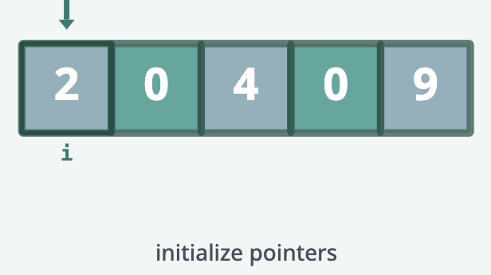
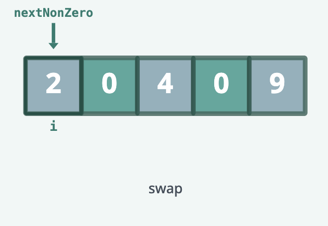
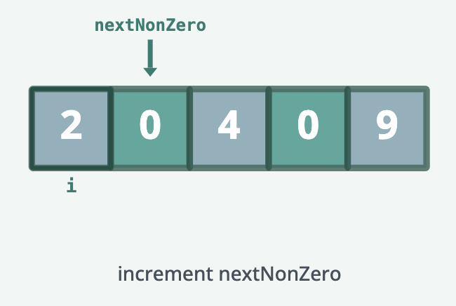
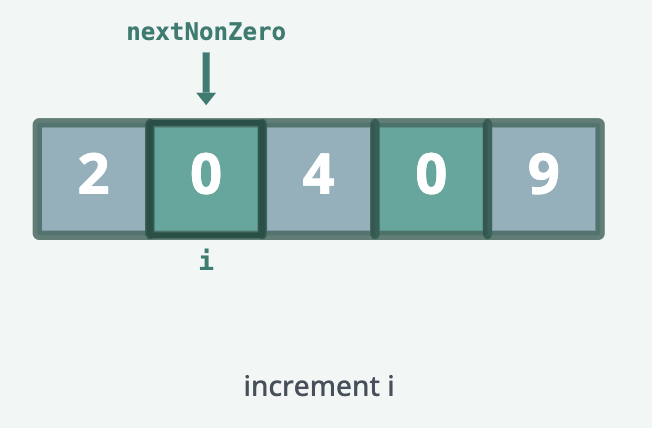
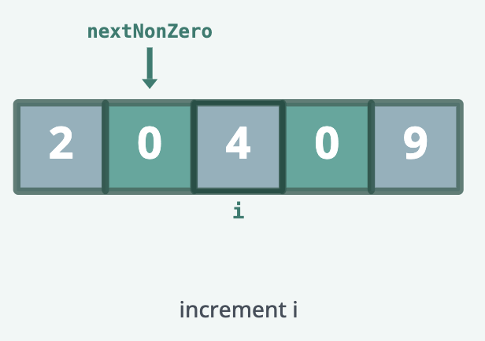
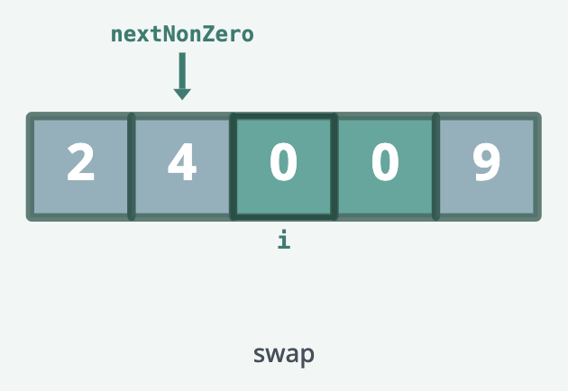

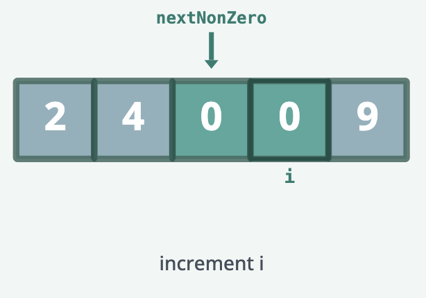
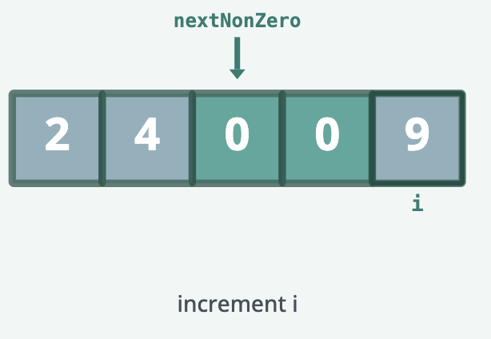
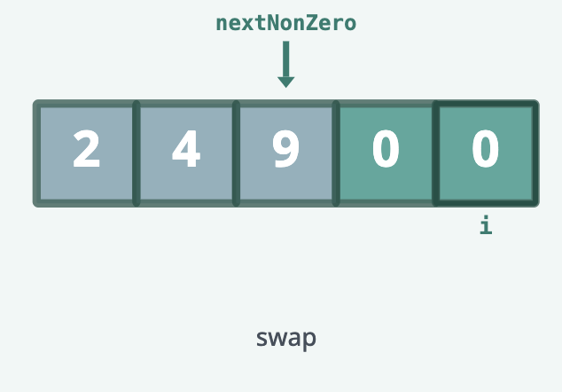

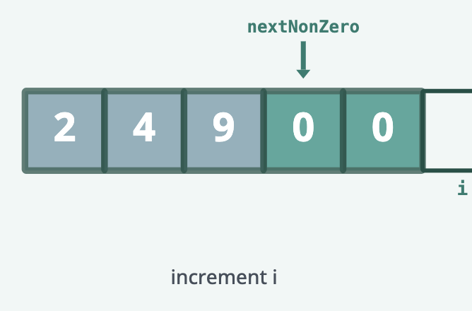
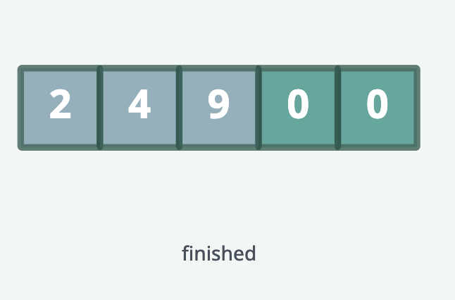
