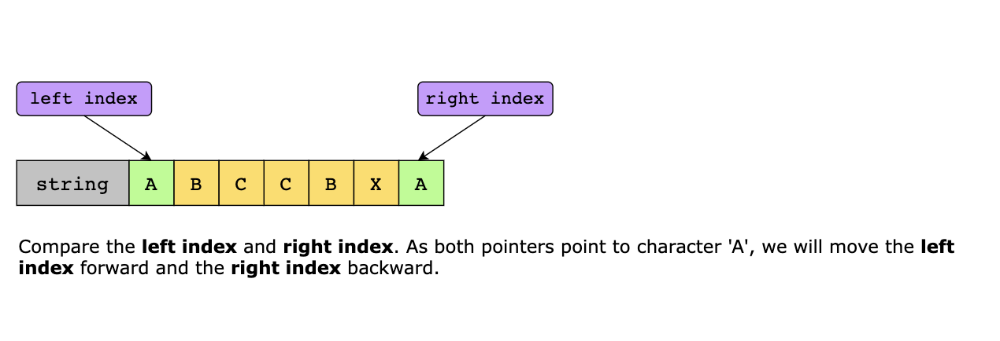
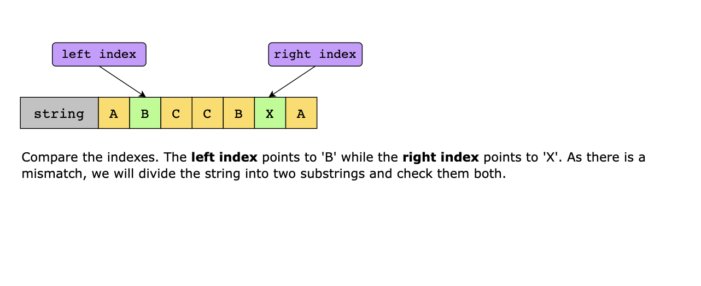
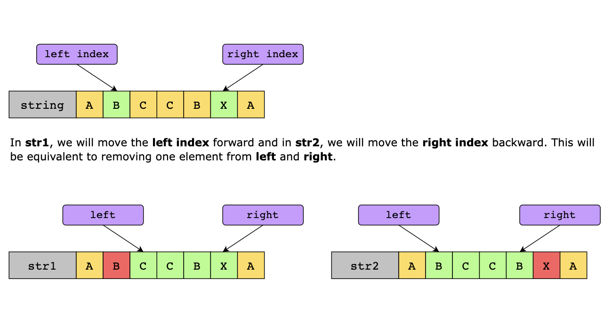
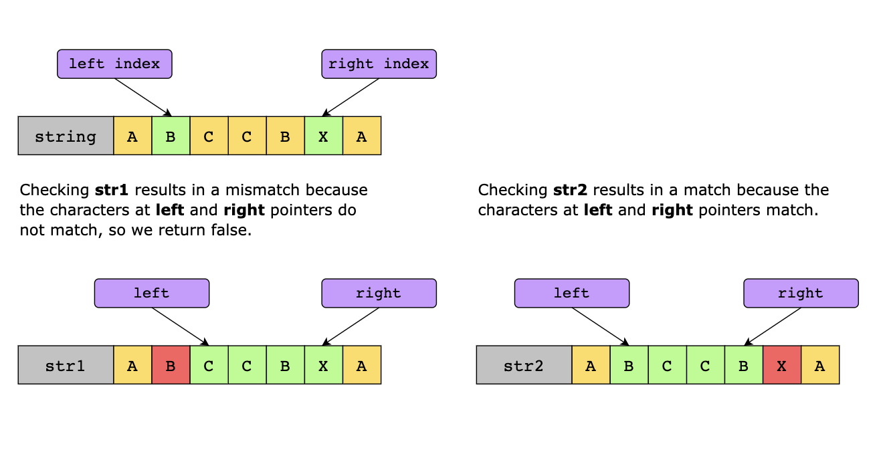
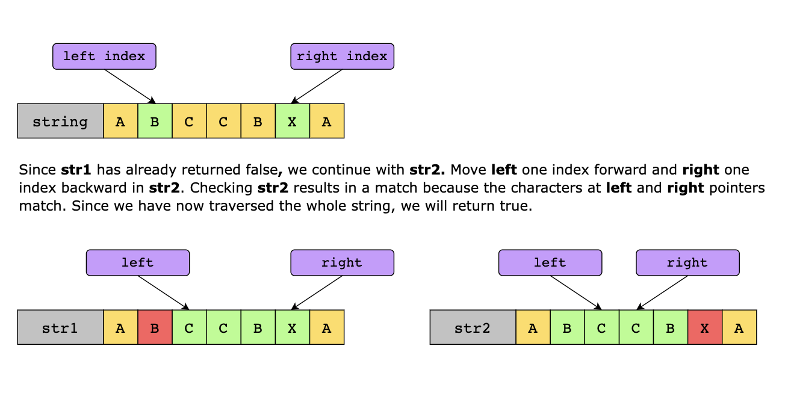
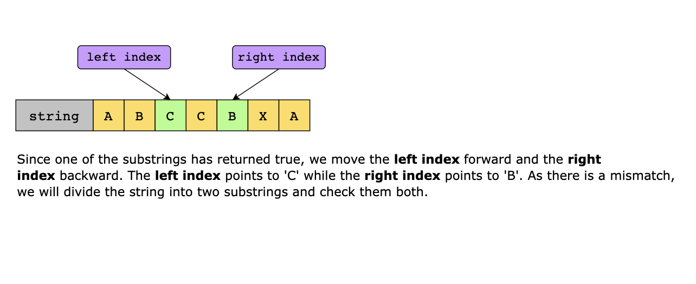
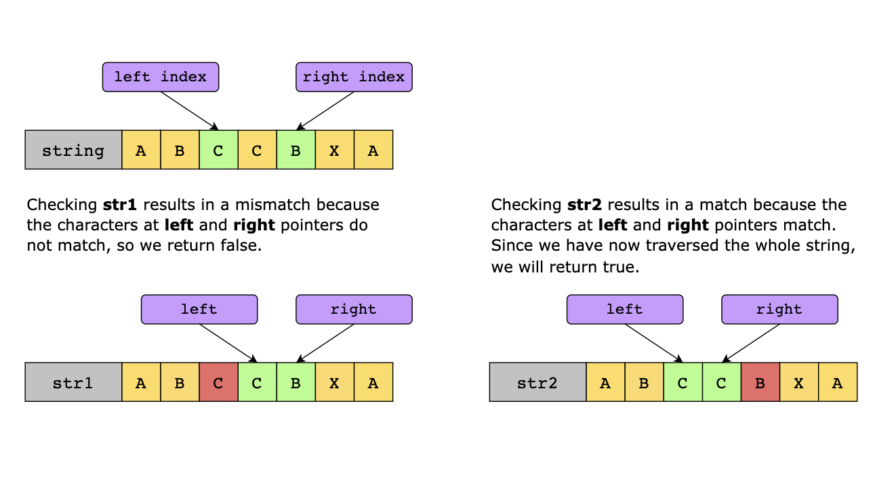
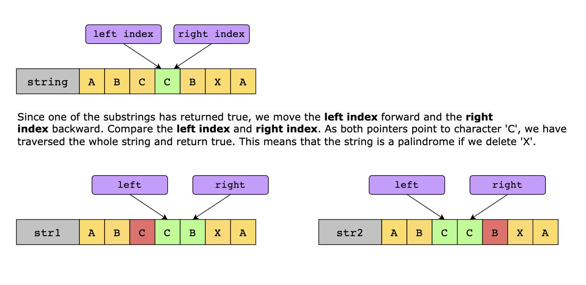

# Palindrome

Find the length of the longest substring in the given string s that is the same in reverse. As an example, if the input
was “I like racecars that go fast”, the substring (racecar) length would be 7. If the length of the input string is 0,
return value must be 0. Example:

"a" -> 1
"aab" -> 2
"abcde" -> 1
"zzbaabcd" -> 4
"" -> 0

## Palindrome Pairs

Given a list of unique words. Find all pairs of distinct indices (i, j) in the given list so that the concatenation of
the two words, i.e. words[i] + words[j] is a palindrome.

Examples:

```plain
["bat", "tab", "cat"]  # [[0, 1], [1, 0]]
["dog", "cow", "tap", "god", "pat"]  # [[0, 3], [2, 4], [3, 0], [4, 2]]
["abcd", "dcba", "lls", "s", "sssll"]  # [[0, 1], [1, 0], [2, 4], [3, 2]]
```

Non-string inputs should be converted to strings.

Return an array of arrays containing pairs of distinct indices that form palindromes. Pairs should be reutrned in the
order they appear in the original list.

## Palindrome Products

Write a program that can detect palindrome products in a given range.

A palindromic number reads the same both ways. The largest palindrome made from the product of two 2-digit numbers is
9009 = 91 x 99.

### Source

Problem 4 at Project Euler [http://projecteuler.net/problem=4](http://projecteuler.net/problem=4)

## Longest Palindrome

Given a string s which consists of lowercase or uppercase letters, return the length of the longest palindrome that can
be built with those letters.

Letters are case sensitive, for example, "Aa" is not considered a palindrome here.

Example 1:

Input: s = "abccccdd"
Output: 7
Explanation: One longest palindrome that can be built is "dccaccd", whose length is 7.
Example 2:

Input: s = "a"
Output: 1
Explanation: The longest palindrome that can be built is "a", whose length is 1.

## Palindrome Index

Given a string of lowercase letters in the range ascii[a-z], determine a character that can be removed to make the
string a palindrome. There may be more than one solution, but any will do. For example, if your string is "bcbc", you
can either remove 'b' at index or 'c' at index . If the word is already a palindrome or there is no solution, return -1.
Otherwise, return the index of a character to remove.

Sample Input:

```plain
aaab
baa
aaa
```

Sample Output:

```plain
3
0
-1
```

Explanation:

```plain
Explanation

Query 1: "aaab"
Removing 'b' at index  results in a palindrome, so we print  on a new line.

Query 2: "baa"
Removing 'b' at index  results in a palindrome, so we print  on a new line.

Query 3: "aaa"
This string is already a palindrome, so we print . Removing any one of the characters would result in a palindrome, but this test comes first.
```

---

## Palindrome Number

Given an integer, x, return TRUE if it is a palindrome; otherwise, FALSE.

> A palindrome integer is one whose digits read the same from left to right and right to left.

### Constraints

- -2^-31 <= x <= 2^31-1

### Solution

One of the first solutions that comes to mind is converting the number to a string and checking if it reads the same 
backward and forward. While that works, it’s not the most efficient way, as it uses extra memory. Instead, we can solve 
this problem mathematically, using only the digits of the number itself.

A palindrome number remains the same when its digits are reversed. For example, 121 or 1221. Before checking deeper logic,
we can immediately rule out two cases where an integer can never be a palindrome:

1. **Negative numbers**: They can’t be palindromes because of the leading minus sign, which doesn’t appear at the end 
    when reversed.
2. **Numbers ending with 0 (except 0 itself)**: A number like 10 or 100 can’t be a palindrome because palindrome integers 
   can’t start with a zero.

For the remaining cases, the natural idea is to reverse the entire number and check whether it matches the original.
However, reversing the whole integer can lead to integer overflow. To avoid this problem, we reverse only half of the
number instead. The process works by repeatedly taking the last digit of x (using x % 10) and attaching it to a new
number that we are building in reverse order. Each time we take a digit from the end, we also shorten x by removing that
digit (using integer division by 10). We continue doing this until the reversed portion becomes at least as long as what’s
left of the original number.

At that stage, the number is naturally divided into two halves:

- The first half is what remains of the original number. 
- The second half is represented by the reversed digits we collected.

If the number has an odd count of digits, the middle digit doesn’t affect whether it’s a palindrome, so we simply ignore
it (using integer division by 10).

Eventually, if the two halves match, then the number reads the same forward and backward, representing a palindrome. If
they don’t match, then it is not.

Let’s look at the algorithm steps:

1. Handle special cases. If x is negative, or ends with 0 but is not 0 itself, it’s not a palindrome. Return FALSE. 
2. Initialize a variable, reversedHalf, to 0. This will store the reversed digits of the last half of the number.
3. While x is greater than reversedHalf:
   - Take the last digit of x using x % 10.
   - Add this digit to reversedHalf as reversedHalf = reversedHalf * 10 + x % 10.
   - Remove the last digit from x using integer division x //= 10.
4. Once we have the last half of the number in reversedHalf, compare the two halves:
   - If the length of the reversedHalf is even, then compare x == reversedHalf. If it’s a valid match, return TRUE.
   - If the length of the reversedHalf is odd, then compare x == reversedHalf // 10 to ignoring the middle digit. If
     it’s a valid match, return TRUE.
5. If neither condition is TRUE, return FALSE.

### Time Complexity

The time complexity of this solution O(log₁₀(n)) because the input is divided by 10 for every iteration.

### Space Complexity

As only a few variables are used, the space complexity of this solution is O(1).

## Related Topics

- String
- Dynamic Programming
- Two Pointers

---

## Valid Palindrome II

Write a function that takes a string as input and checks whether it can be a valid palindrome by removing at most one
character from it.

### Constraints

- 1 <= `s.length` <= 10^5
- The string only consists of English letters

### Examples

Example 1:

```text
Input: s = "aba"
Output: true
```

Example 2:

```text
Input: s = "abca"
Output: true
Explanation: You could delete the character 'c'.
```

Example 3:

```text
Input: s = "abc"
Output: false
```

### Solution

The algorithm uses a two-pointer technique to determine whether a string is a palindrome or can be transformed into it
by removing at most one character, where one pointer starts at the beginning and the other at the end. As the pointers
move toward each other, they compare the corresponding characters. If all pairs match, the string is a palindrome.
However, if a mismatch is detected, the algorithm explores two possibilities: removing the character at either pointer
and checking if the resulting substring forms a palindrome. If either check passes, the function returns TRUE; otherwise,
it returns FALSE.

The algorithm consists of two functions:

- `is_substring_palindrome(left, right)`: This helper function checks if a substring of the input string, defined by 
  `left` and `right` indexes, is a palindrome. It uses a two-pointer approach, comparing characters from both ends
  inward. If any mismatch is found, it returns FALSE; otherwise, it returns TRUE.
- `is_valid_palindrome_with_one_char_removal(string)`: This function checks if the entire string is a palindrome or can
  become one by removing one character. It initializes two pointers, `left_pointer` at the start and `right_pointer` at 
  end of the string:
  - If the characters at the `left_pointer` and `right_pointer` are the same, it moves both pointers inward.
  - If the characters differ, it checks two cases by calling is_substring_palindrome:
    - The substring from `left_pointer + 1` to `right_pointer`
    - The substring from `left_pointer` to `right_pointer - 1`
  - If either case returns TRUE, the function returns TRUE; otherwise, it returns FALSE. 

If the traversal completes without finding a mismatch, the string is a palindrome, and the function returns TRUE.











#### Time Complexity

The time complexity of the solution above is O(n), where n is the length of the string

#### Space Complexity

The space complexity of solution above is O(1).
