# Product of Array Except Self

Given an integer array nums, return an array answer such that answer[i] is equal to the product of all the elements of
nums except nums[i].

The product of any prefix or suffix of nums is guaranteed to fit in a 32-bit integer.

You must write an algorithm that runs in O(n) time and without using the division operation.

Example 1:
```plain
Input: nums = [1,2,3,4]
Output: [24,12,8,6]
```

Example 2:
```text
Input: nums = [-1,1,0,-3,3]
Output: [0,0,9,0,0]
```

Example 3:
```text
Input: nums = [2,4,0,6]
Output: [0,0,48,0]
```

Example 4:
```text
Input: nums = [1, -3, 5, 7, -11]
Output: [1155, -385, 231, 165, -105]
```

## Related Topics

- Array
- Prefix Sum

## Solution

The idea is that we can break down the problem into two parts: the product of elements to the left of each index and the
product of elements to the right of each index. By maintaining two separate running products as we traverse the array
from both ends, we can accumulate the product values to populate the res array. This approach eliminates the need for
repeated multiplications and effectively calculates the product except for the element at the current index. The Two
Pointers pattern is employed here to handle both the left and right products in a single traversal.

Here’s how the algorithm works:

- Initialize the following variables that will assist us in performing the algorithm:
  - res: This array will be used to store the output. It is initialized to 1
  - l, r: These are the pointers used to traverse the array. They are initialized to the left and right ends of the
    array, respectively.
  - `left_product`: This variable stores the product of the elements to the left of the l pointer.
  - `right_product`: This variable stores the product of the elements to the right of the r pointer.
- Traverse the array while the l and r pointers are not out of bounds:
  - Calculate the product to the left of nums[l] and store it in res[l] using the following formula:
    > res[l] = res[l] * left_product
  - Calculate the product to the right of the nums[r] and store it in res[r] using the following formula:
    > res[r] = res[r] * right_product
    - Update left_product to include the current element, nums[l], in the accumulated product for the next iteration.
  - Update right_product to include the current element, nums[r], in the accumulated product for the next iteration.
  - Finally, increment the l pointer and decrement the r pointer to evaluate the next elements.
  - The steps above are repeated until the l and r pointers go out of bounds.

    > - When l == r, both pointers point to the middle element of the array. For this element, both the products to its left
    > and right are being computed one after another and stored in res[l] (or res[r] since l == r in this case). Therefore,
    > for the case of the middle element, the final product of all the elements, excluding it, is computed in one step.
    >   - After the l and r pointers cross each other, the following behavior occurs:
    >     - The l pointer computes the product to the left of nums[l] as expected, but now the product to the right of
    >       nums[l] has already been computed in a previous iteration by the r pointer. Now both the right and left products
    > have been calculated and combined, the resultant product in this entry is the final product of all the elements,
    > excluding the current one.
    >     - The r pointer computes the product to the right of nums[r] as expected, but now the product to the left of nums[r]
    > has already been computed in a previous iteration by the l pointer. Now both the right and left products have been
    > calculated and combined, the resultant product in this entry is the final product of all the elements, excluding
    > the current one.

- Lastly, the res array contains the desired result, so return it.

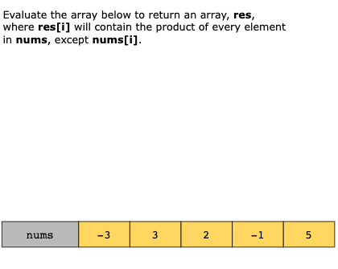
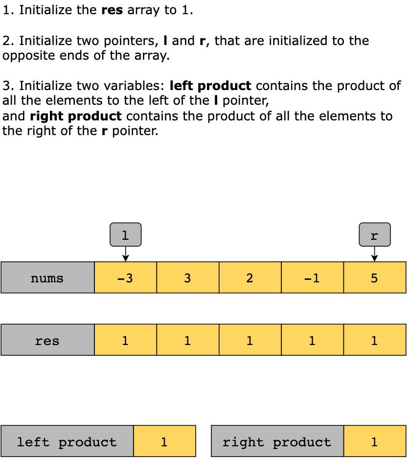
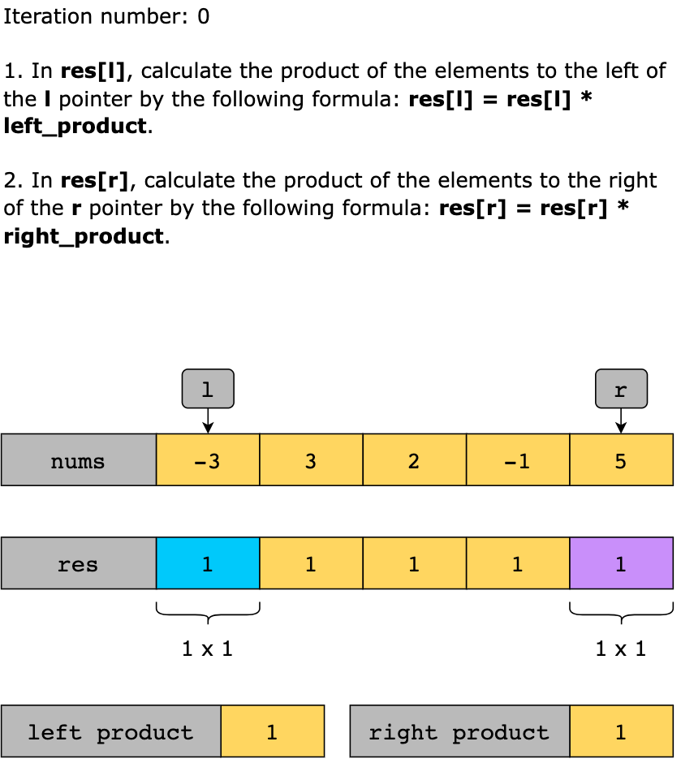
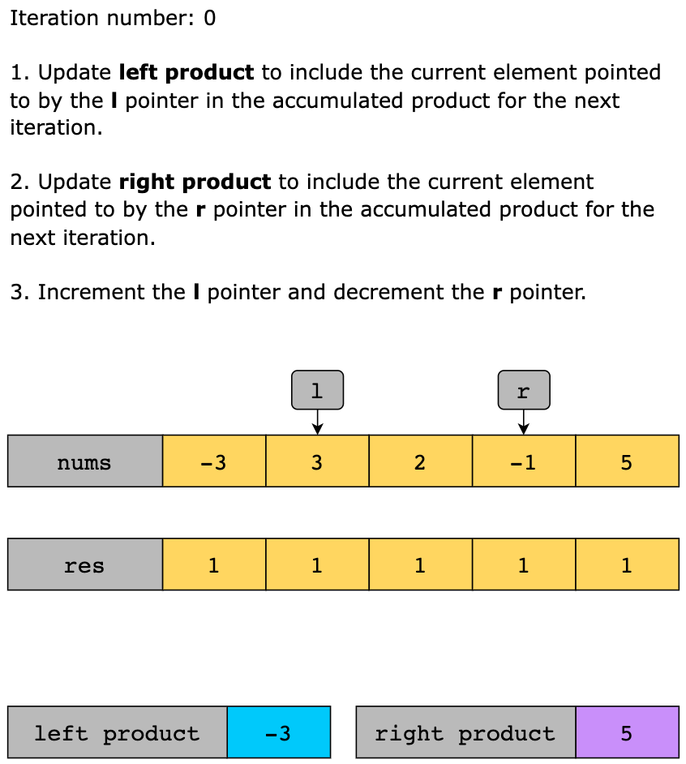
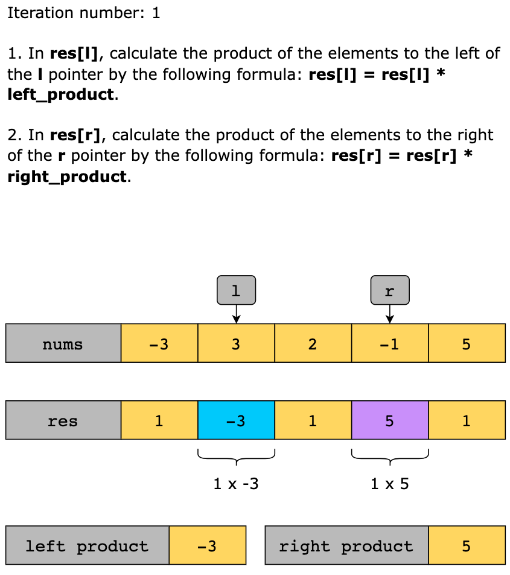
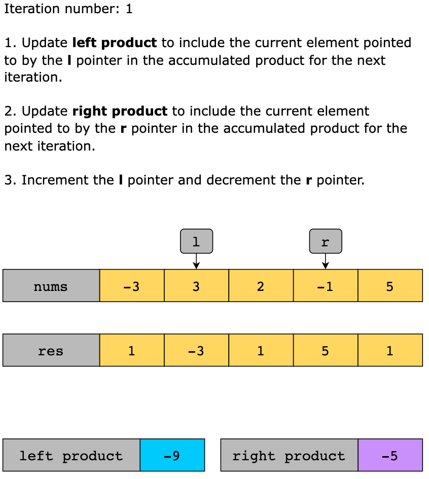
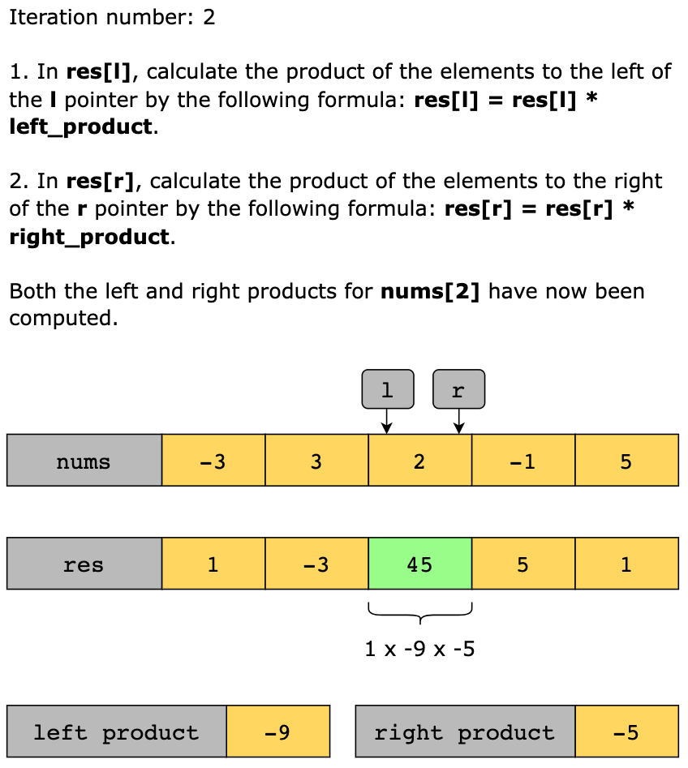
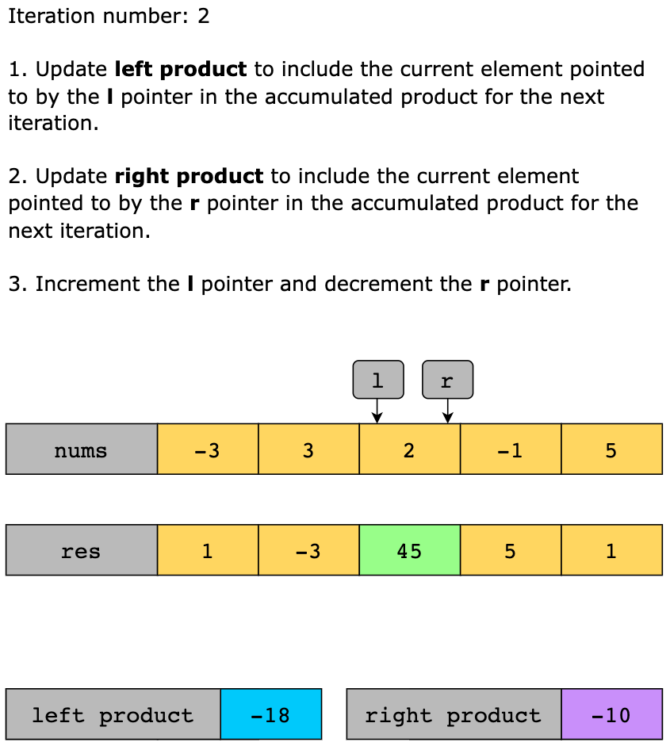
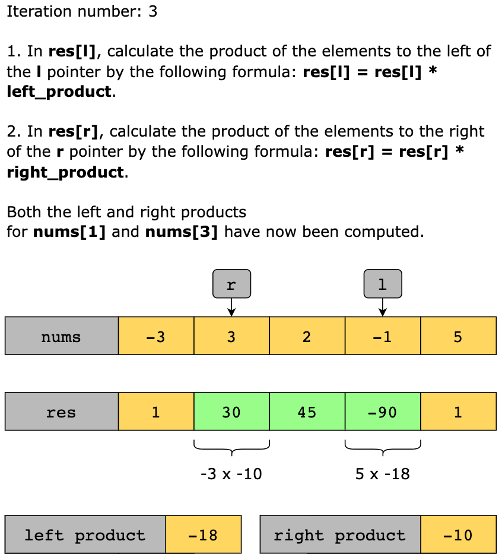
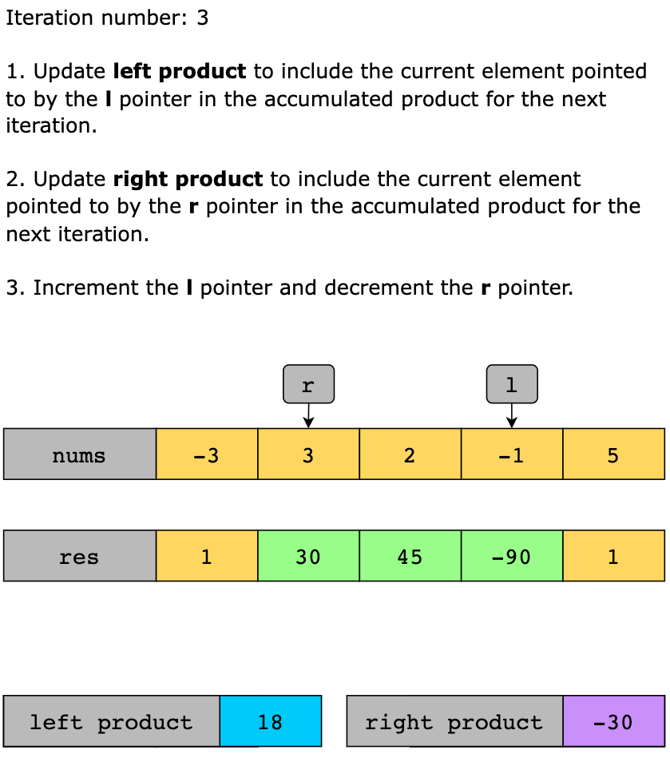
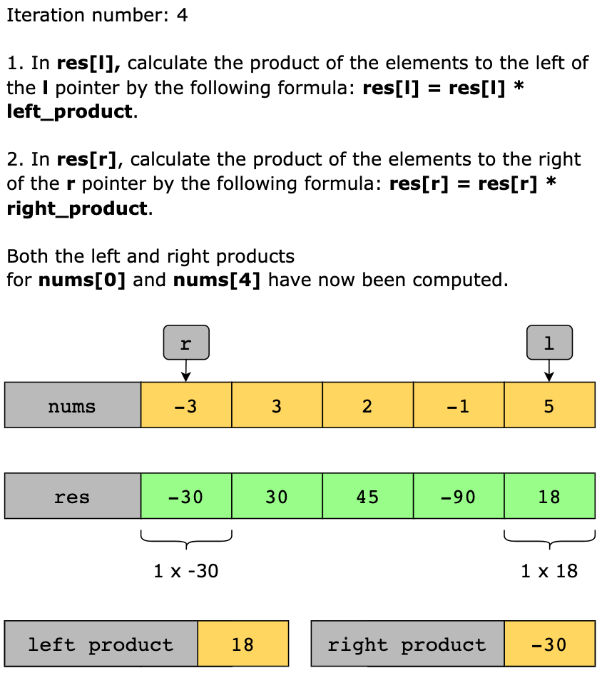
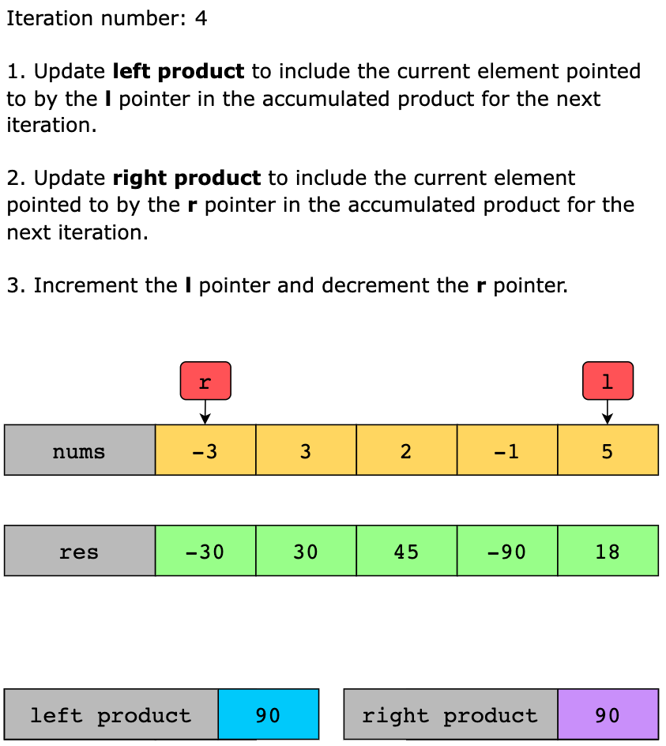
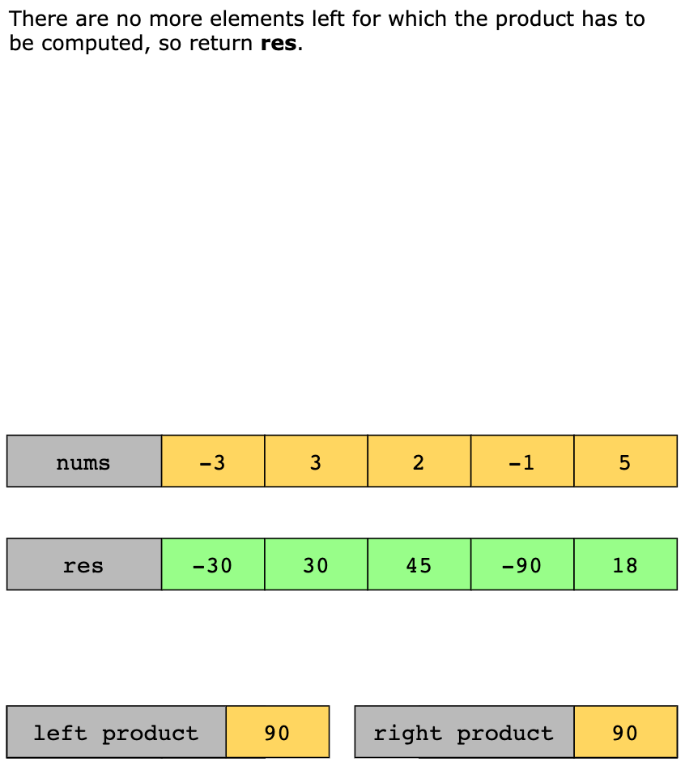

### Solution Summary

The solution can be summarized in the following steps:

- Create a list with the same length as the input list, initialized with 1s.
- Keep track of products on the left and right sides of the current element.
- Use two pointers—one starting from the beginning and the other from the end of the list.
- Multiply and update values in the output array based on accumulated products and current element values.
- Move the pointers toward each other to process the entire list.
- 

### Time Complexity

The time complexity of this solution is O(n), since both the pointers simultaneously traverse the length of the array
once.

### Space Complexity

The space complexity of this solution is O(1), since it doesn’t use any additional array for computations but only
constant additional space.

