# Trapping Rain-Water

Given an integer array A of non-negative integers representing an elevation map where the width of each bar is 1,
compute how much water it is able to trap after raining.

Input Format
The only argument given is integer array A.

Output Format
Return the total water it is able to trap after raining.

```plain
Example Input
Input 1:

A = [0, 1, 0, 2, 1, 0, 1, 3, 2, 1, 2, 1]
Input 2:

A = [1, 2]

Example Output
Output 1:

6
Output 2:

0

Example Explanation
Explanation 1:

In this case, 6 units of rain water (blue section) are being trapped.
Explanation 2:

No water is trapped.
```

## Related Topics

- Array
- Two Pointers
- Dynamic Programming
- Stack
- Monotonic Stack

## Solution

We can use the two-pointer technique to solve this problem in O(n) time and O(1) space.
In order for any index in the array to be able to trap rain water, there must be higher bars on both the left and right 
side of the index. For example, index 2 in the following array has height 1. It can trap water because there are higher
bars to the left and right of it.

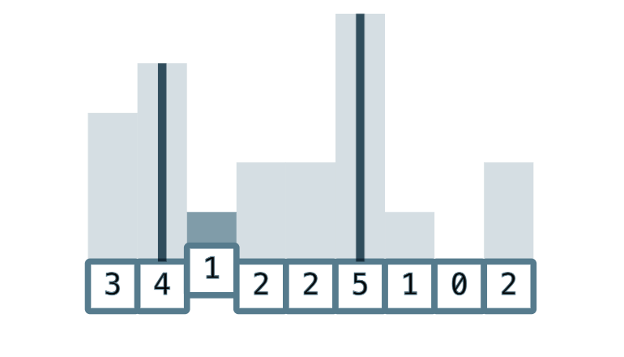

To calculate the exact amount of water that can be trapped at index 2, we first take the minimum height of the highest
bars to the left and right of it, which in this case is 4. We then subtract the height of the bar at index 2, which is 1,

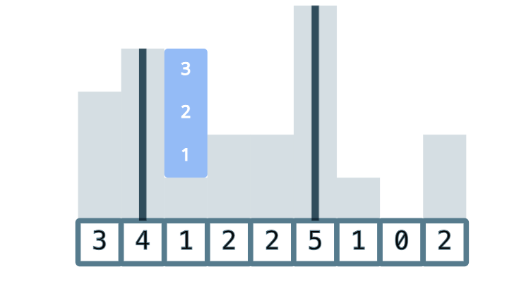

So if we knew the height of the highest bars to the left and right of every index, we could iterate through the array
and calculate the amount of water that can be trapped at each index.
But we don't need to know the exact height of both the highest bars to the left and right of every index. For example,
let's say we know the highest bar to the right of index 7 with height 0 has a height of 2.

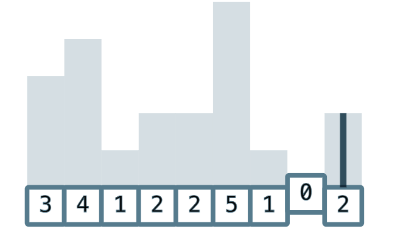

If we also knew that there exists a higher bar than 2 anywhere to the left of index 7, then we also know that the minimum
height of the highest bars to the left and right of index 7 is 2. This means that we have enough information to calculate
the amount of water that can be trapped at index 7, which is 2 - 0 = 2.
This is the insight behind how the two-pointer technique can be used to solve this problem. We initialize two pointers
left and right at opposite ends of the array. We also keep two variables leftMax and rightMax to keep track of the highest
bars each pointer has seen.

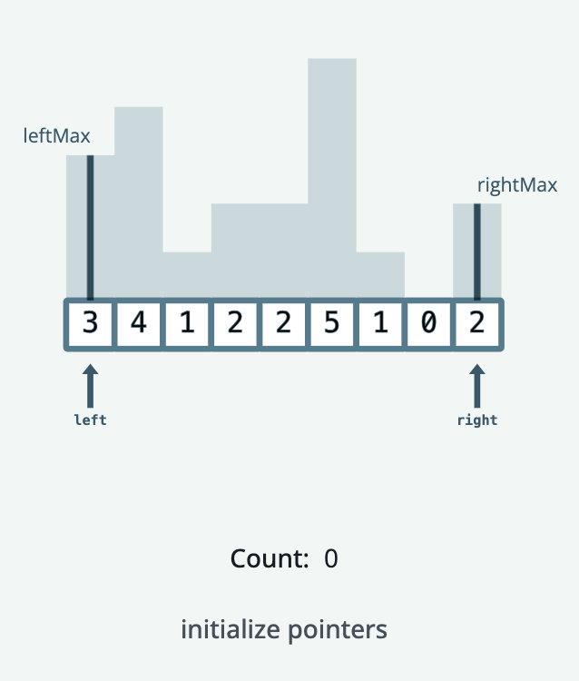

We now use the values of leftMax and rightMax to visit every single index in the array exactly once. We start by 
comparing leftMax and rightMax. In this case, rightMax is smaller than leftMax, so we know that:

1. The maximum height of the highest bar to the right of right - 1 is rightMax
2. There exists a higher bar than rightMax somewhere to the left of right

These two facts mean that we have enough information to calculate the amount of water that can be trapped at index 
right - 1. So first we move the right pointer back by 1:

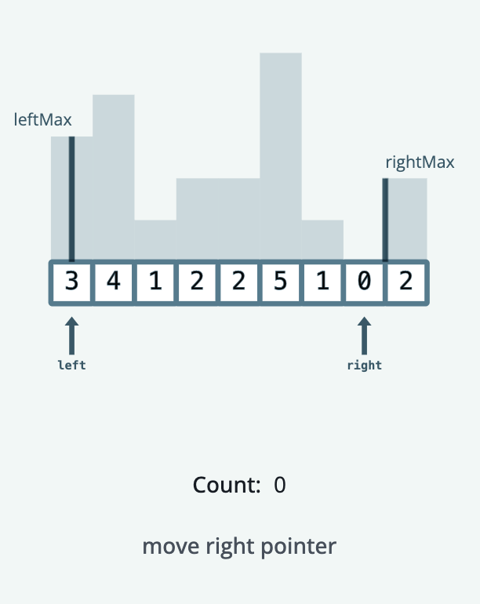

There are two possible cases to consider when calculating the amount of water that can be trapped at the current index
of right:
1. The height of the bar at index right is smaller than rightMax
2. The height of the bar at index right is greater than or equal to rightMax

In our case, the height of the bar at index right is smaller than rightMax, so we know that the amount of water that
can be trapped at index 1 is rightMax - height[right], and we can move to the next iteration, which follows the same logic:

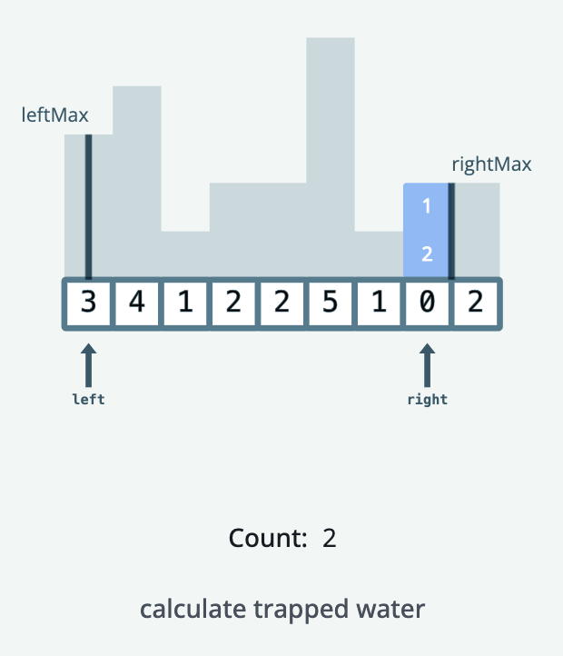
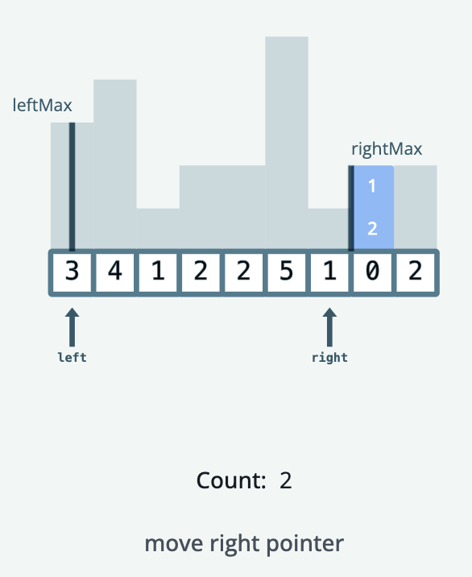
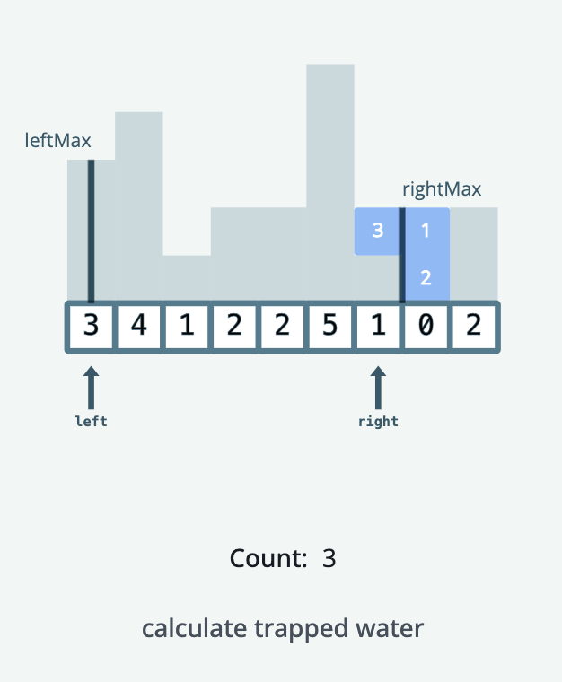
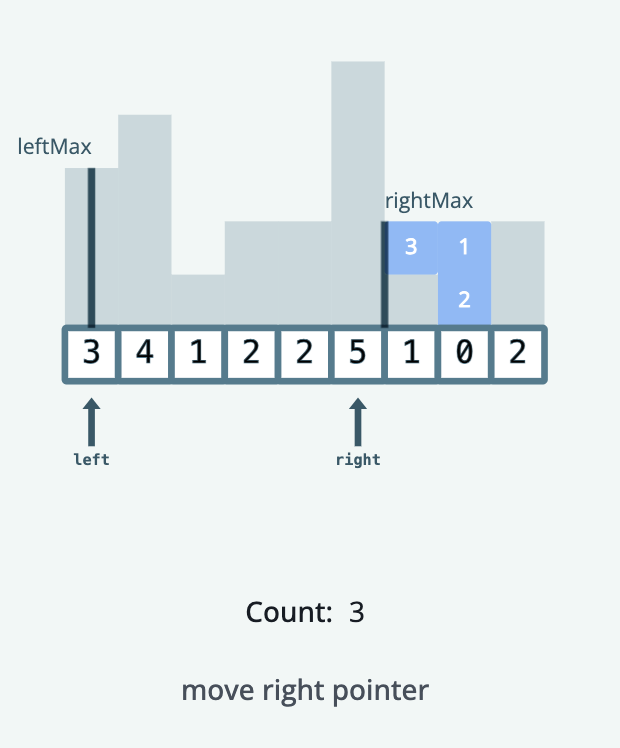

Now, we run into case 2, where height[right] is greater than or equal to rightMax. This means we can't trap any water at
this index, so instead we update rightMax to the height of the bar at index right to prepare for the next iteration.

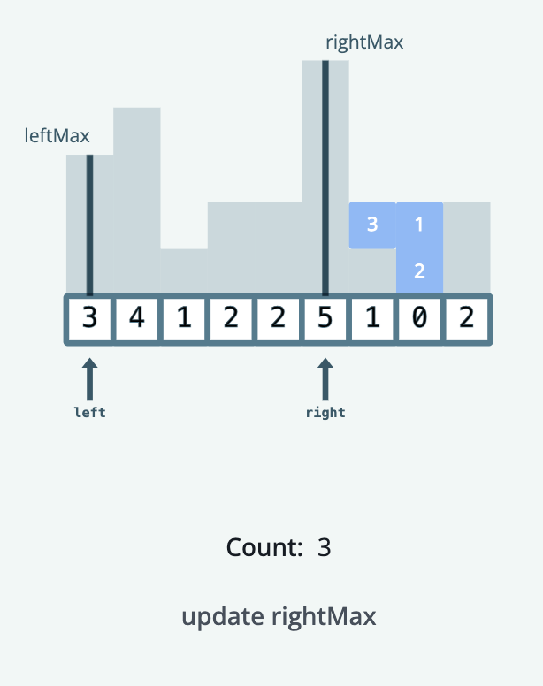
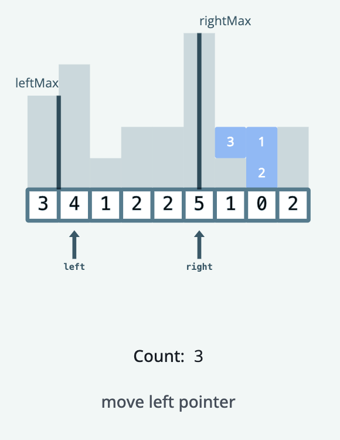

The same logic applies when leftMax is less than rightMax, and this continues until every index has been visited exactly
once, for a total time complexity of O(n) and a space complexity of O(1).
