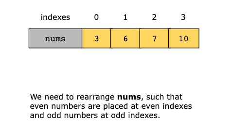
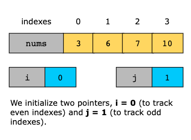
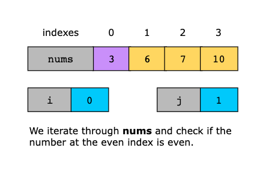
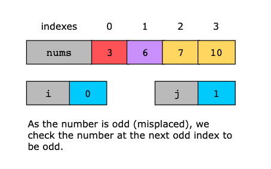
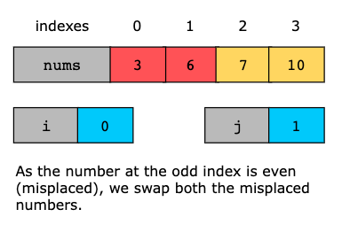
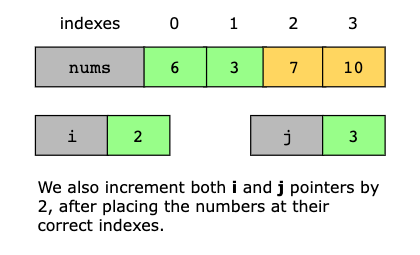
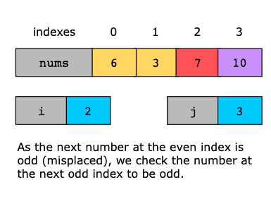
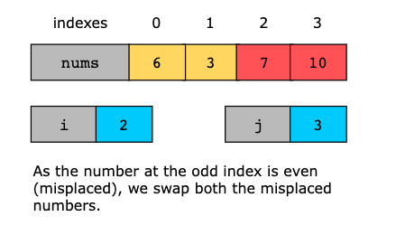
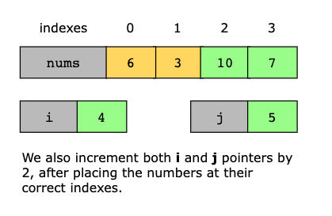
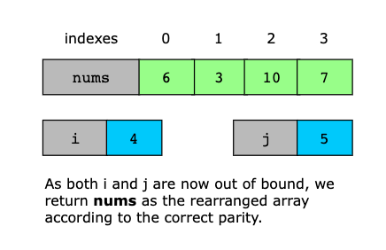

# Sort Array By Parity II

You are given an integer array, nums, where exactly half of the elements are even, and the other half are odd.

Rearrange nums such that:

- All even numbers are placed at even indexes [0,2,4,...]
- All odd numbers are placed at odd indexes [1,3,5,...]

You may return any valid arrangement that satisfies these conditions.

## Constraints:

- 2 ≤ `nums.length` ≤ 10^3
- `nums.length` is even. 
- Half of the integers in `nums` are even.
- 0 ≤ `nums[i]` ≤ 1000

## Examples

Example 1

```text
Input: nums = [4,2,5,7]
Output: [4,5,2,7]
Explanation: [4,7,2,5], [2,5,4,7], [2,7,4,5] would also have been accepted.
```

Example 2

```text
Input: nums = [2,3]
Output: [2,3]
```

## Topics

- Array
- Two Pointers
- Sorting

## Solution

The essence of this solution is to use a modified cyclic sort approach combined with the flavor of two pointers to
rearrange the array such that even numbers are placed at even indexes and odd numbers at odd indexes. The approach uses
two pointers: an even pointer for even indexes and an odd pointer for odd indexes. The even pointer starts at index 0
and moves across even indexes, while the odd pointer starts at index 1 and moves across odd indexes. The algorithm
iterates through the array and checks whether the numbers at these indices are correctly placed. If the number at the
even pointer is even, the pointer moves forward to the next even index. Similarly, if the number at the odd pointer is
odd, it moves forward to the next odd index. However, if the number at the even pointer is odd and the number at the
odd pointer is even, they are misplaced and need to be swapped. After swapping, both pointers continue to their respective
next positions. This process repeats until all elements are correctly placed. The algorithm restores order with minimal
operations by ensuring that misplaced numbers are swapped into their correct positions. Although inspired by the principles
of cyclic sort, where elements are placed in their correct positions, this approach uses a modified cyclic sort approach
that organizes elements based on parity rather than numerical value. It is an in-place approach, making it both simple
and optimal.

Now, let’s look at the steps of the solution:

1. We initialize two pointers, i = 0 and j = 1. i moves through even indexes [0,2,4,...] and j moves through odd indexes
   [1,3,5,...].
2. We iterate through the array until both i and j are within the bounds of nums.
   - If nums[i] is even (correct placement), we move i forward by 2 to check the next even index because it is already 
     at its correct index.
   - If nums[j] is odd (correct placement), we move j forward by 2 to check the next odd index because it is already at
     its correct index.
   - Otherwise, if nums[i] is odd and nums[j] is even, we swap them to fix their positions. This follows a modified
     cyclic sort approach where elements are swapped directly to their rightful places without repeated scanning. After
     swapping, both pointers (i and j) are moved forward by 2.
3. After iterating through the array, we return the modified nums, where all even numbers appear at even indexes, and
   all odd numbers at odd indexes.












### Time Complexity

The time complexity of the solution is O(n) because each element in nums is processed at most once.

### Space Complexity

Sorting is done in place without extra memory usage, so the space complexity of the solution is O(1)
