# Sort Colors

Given an array, colors, which contains a combination of the following three elements:

0 (representing red)
1 (representing white)
2 (representing blue)

Sort the array in place so that the elements of the same color are adjacent, with the colors in the order of red, white, 
and blue. To improve your problem-solving skills, do not utilize the built-in sort function.

```plain
Example 1:

Input: colors = [2,0,2,1,1,0]
Output: [0,0,1,1,2,2]
```

## Solution

- [Sorting 0s](#sorting-os)
- [Sorting 1s](#sorting-1s)
- [Sorting 2s](#sorting-2s)
- [Termination](#termination)

We can understand this algorithm by looking at the invariants which hold true after each iteration:

1. All elements to the left of the left are 0s.
2. All elements between left and i - 1 are 1s.
3. All elements between i and right are unsorted.
4. All elements to the right of right are 2s.

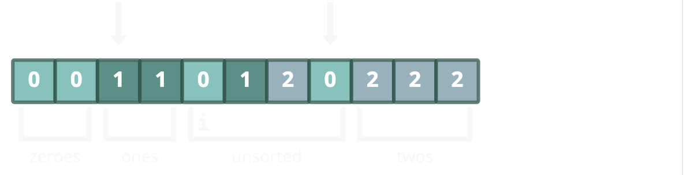
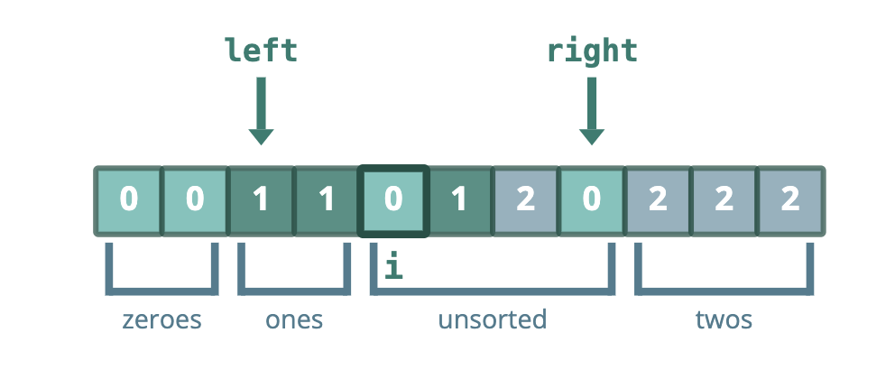

Let's now see how we maintain these invariants as we iterate through the array.

### Sorting Os

When nums[i] is equal to 0, invariant 2 tells us there are two possible values for left: 0 or 1.
Let's consider the case when left == 1 first. We swap i with left. This allows us to increment the left pointer to
maintain invariant 1. Since we know that the new item at i is a 1, we can also increment i to maintain variant 2.

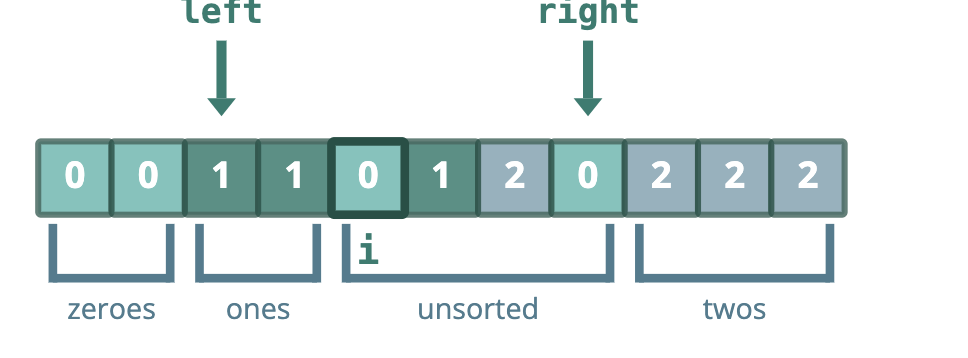
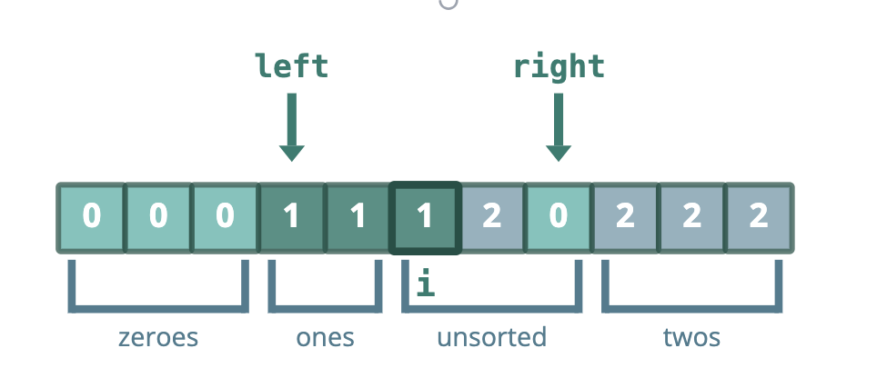

Now let's consider what happens when left == 0, which happens when we haven't encountered any 1s yet and i == left. We
swap i with left (which is itself) and increment left to maintain invariant 1. Since we still haven't encountered any 1s,
we can increment i to maintain invariant 2. In other words, the "ones" region remains empty.

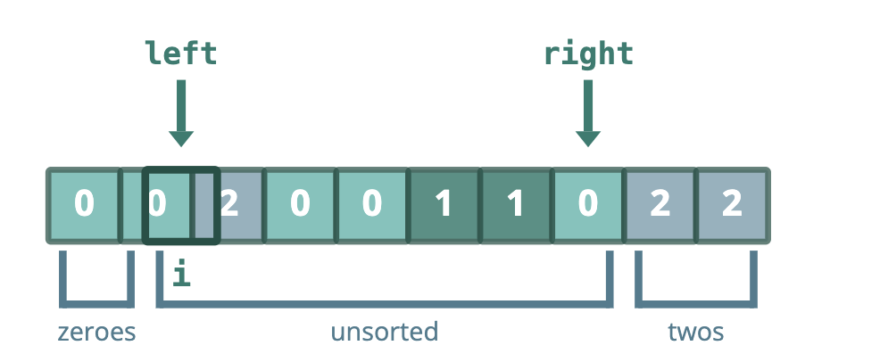
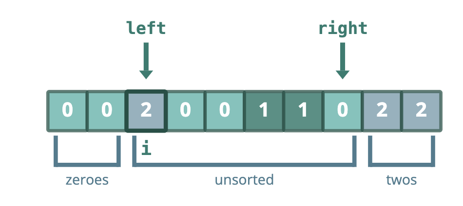

### Sorting 1s

When nums[i] == 1, we can simply increment i to maintain invariant 2.

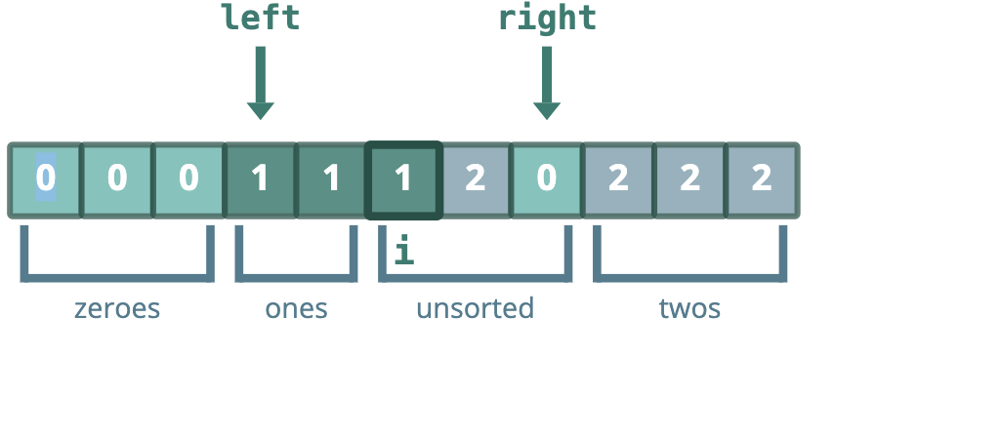
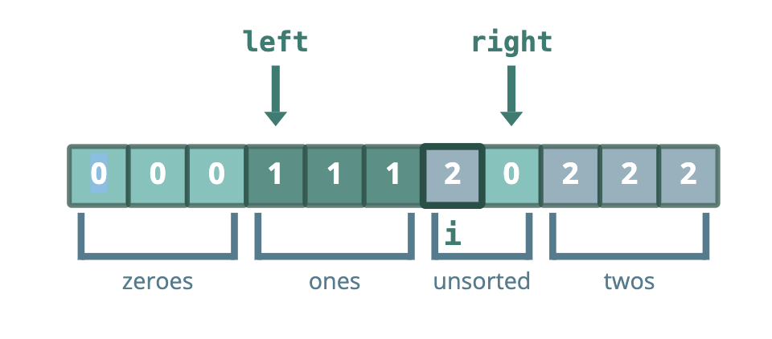

### Sorting 2s

When nums[i] == 2, we swap nums[i] with nums[right]. This allows us to decrement right to maintain invariant 4. But
since the new item at i came from the unsorted region, the new item at i is still unsorted, so we have to go through
another iteration to correctly sort it.

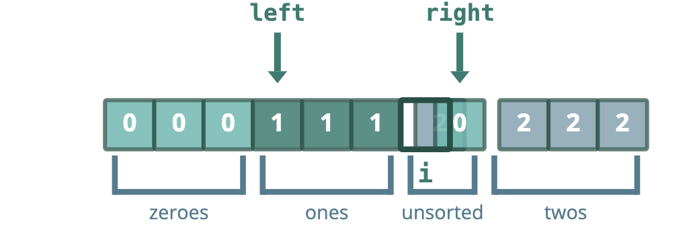
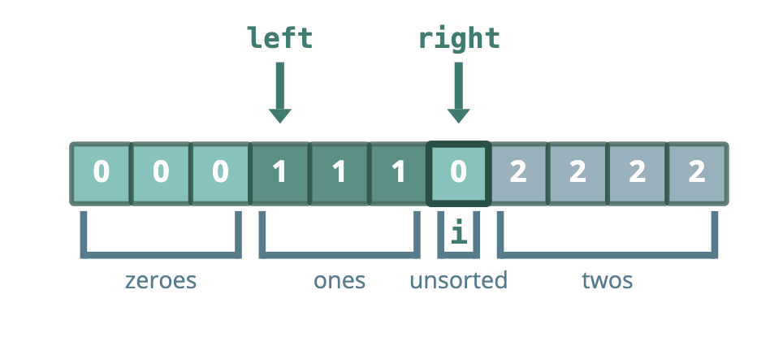

### Termination

When i surpasses right the unsorted region is empty and the entire array is sorted.

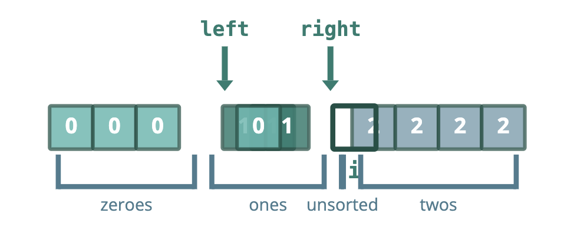
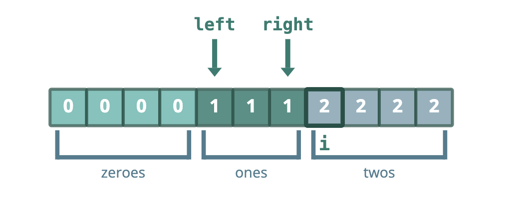
