# Three Sum

Given an integer array nums, return all the triplets [nums[i], nums[j], nums[k]] such that i != j, i != k, and j != k,
and nums[i] + nums[j] + nums[k] == 0.

Notice that the solution set must not contain duplicate triplets.

```plain
Example 1:
Input: nums = [-1,0,1,2,-1,-4]
Output: [[-1,-1,2],[-1,0,1]]
Explanation:
nums[0] + nums[1] + nums[2] = (-1) + 0 + 1 = 0.
nums[1] + nums[2] + nums[4] = 0 + 1 + (-1) = 0.
nums[0] + nums[3] + nums[4] = (-1) + 2 + (-1) = 0.
The distinct triplets are [-1,0,1] and [-1,-1,2].
```
> Notice that the order of the output and the order of the triplets does not matter.

```plain
Example 2:

Input: nums = [0,1,1]
Output: []
Explanation: The only possible triplet does not sum up to 0.
```

```plain
Example 3:

Input: nums = [0,0,0]
Output: [[0,0,0]]
Explanation: The only possible triplet sums up to 0.
```

## Solution

We can leverage the two-pointer technique to solve this problem by first sorting the array. We can then iterate through
each element in the array. The problem then reduces to finding two numbers in the rest of the array that sum to the
negative of the current element, which follows the same logic as the Two Sum (Sorted Array) problem.

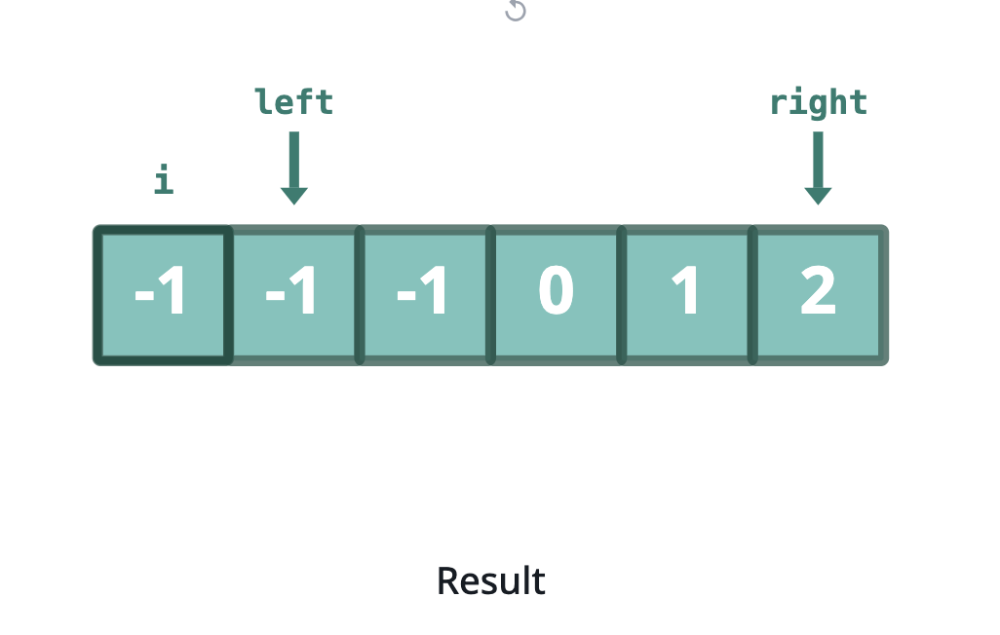

Since our first triplet sums to 0, we can add it to our result set.

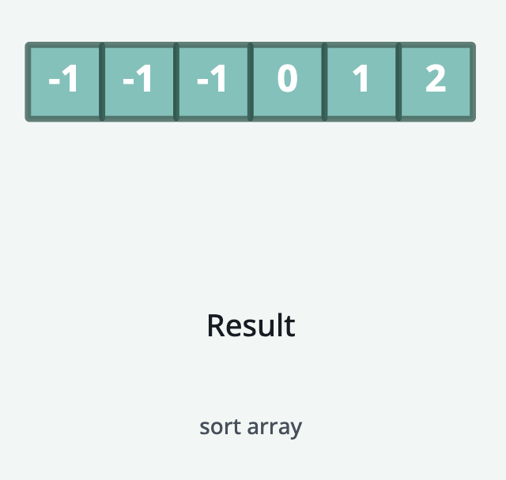
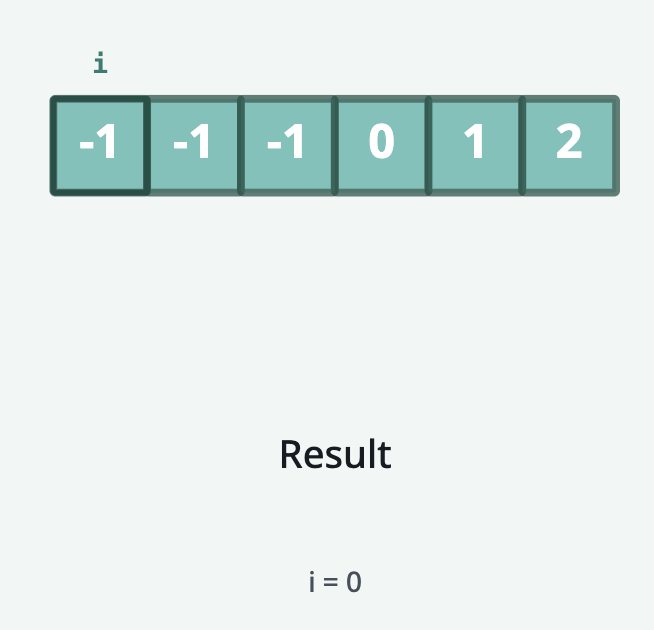
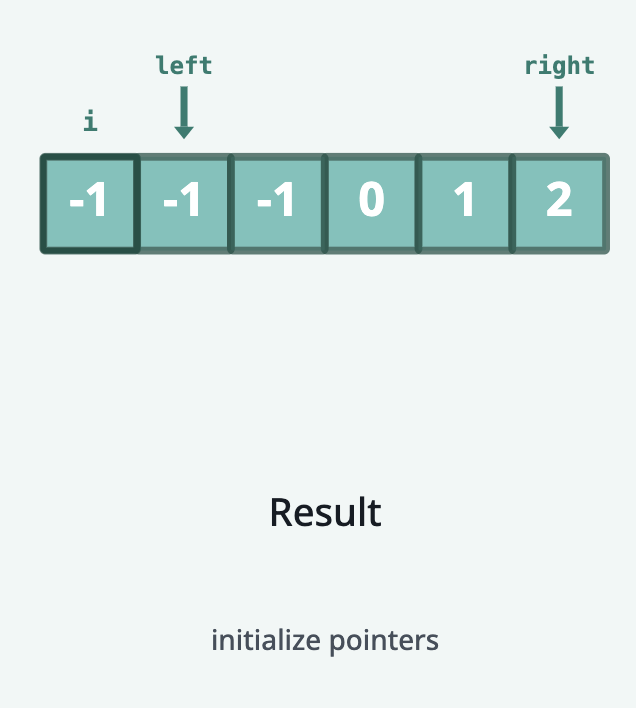
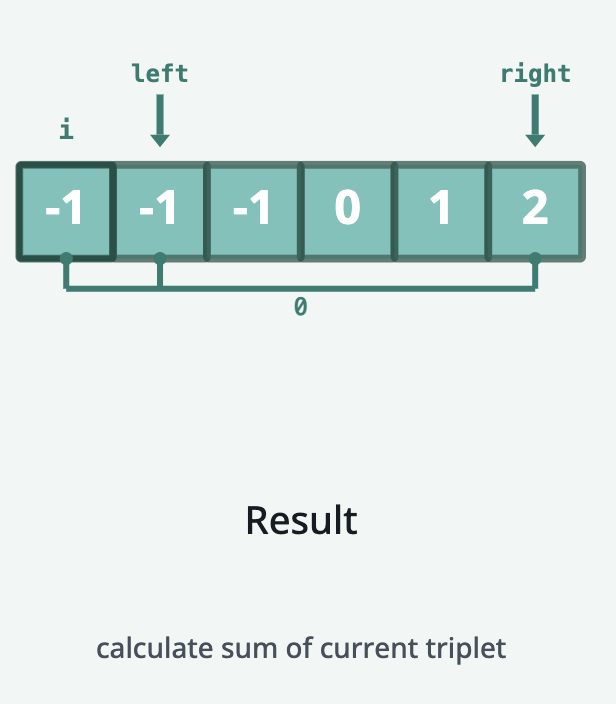
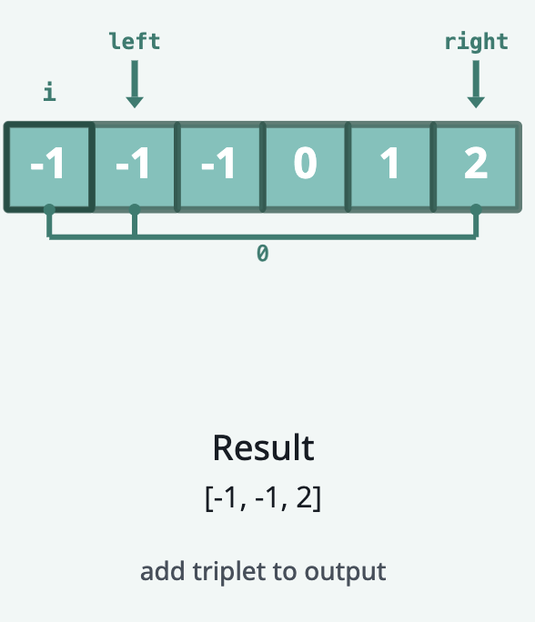

### Avoiding Duplicates

As soon as we find a triplet that sums to 0, we can add it to our result set. We then have to move our left and right
pointers to look for the next triplet while avoiding duplicate triplets. We can do this by moving the left and right
pointers until they point to different numbers than the ones they were pointing to before.
Here we move the left pointer once until it reaches the last -1 in the array. Then, we can move both the left and right
pointers so that they both point to new numbers.

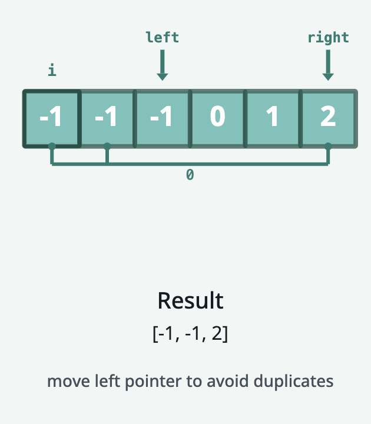
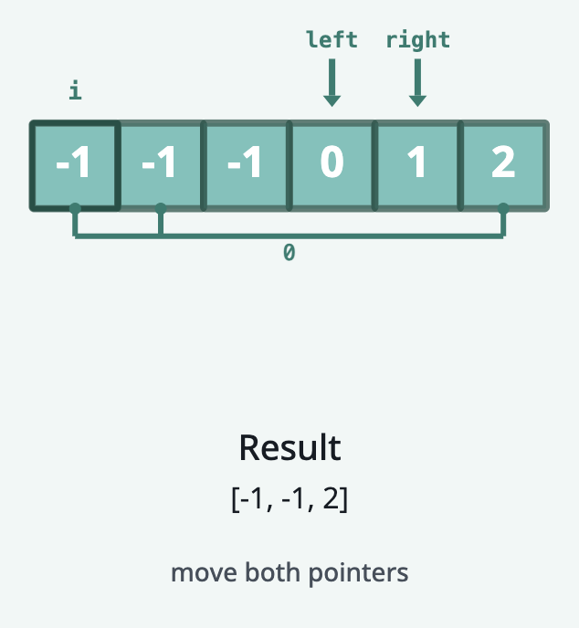

Here we can do another iteration of the Two Sum problem using the new positions of the left and right pointers.

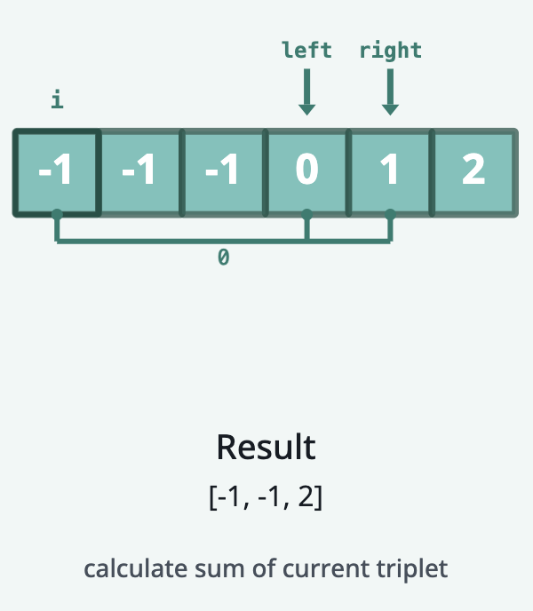
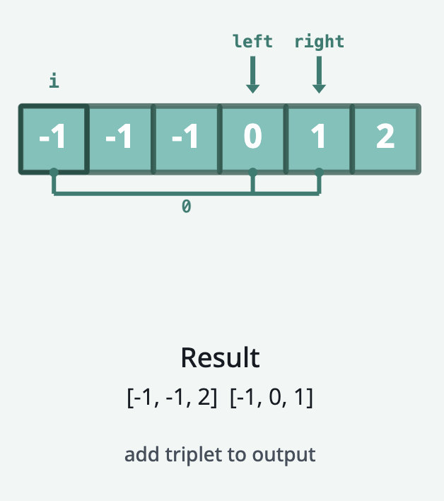
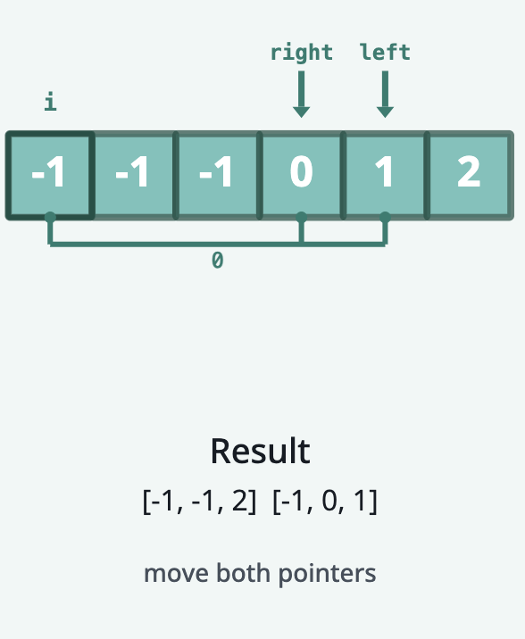

At this point our left and right pointers have crossed, so we can move our iterator to the next number in the array.

### Avoiding Duplicates II

In this case, since the next number in the array is the same as the previous number, we can skip it. We can do this by
moving our iterator until it points to a new number.

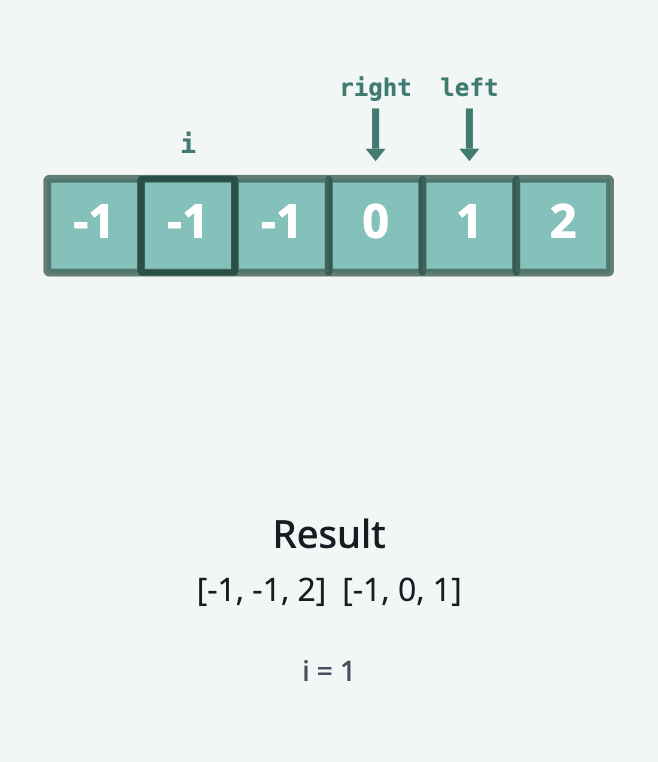
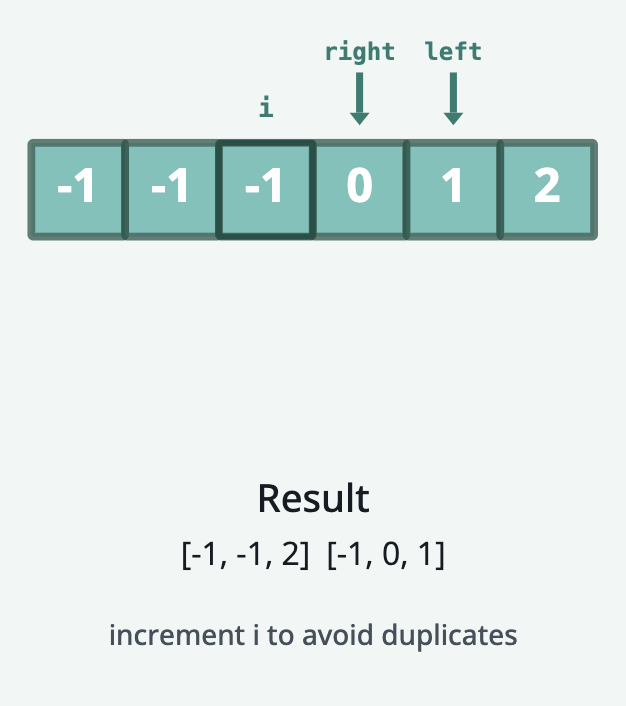
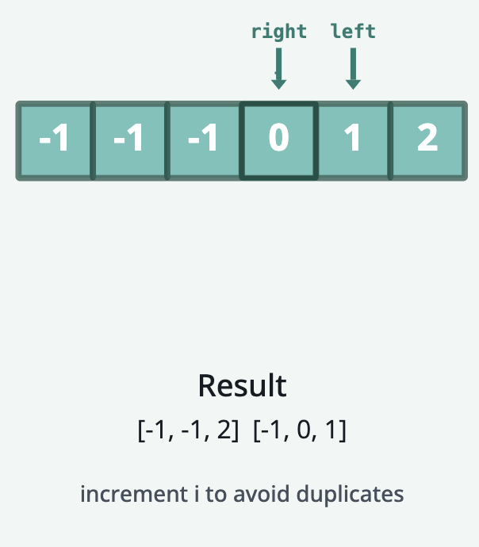

And we're ready to start the Two Sum algorithm again, so we reset our left and right pointers, and start the algorithm.

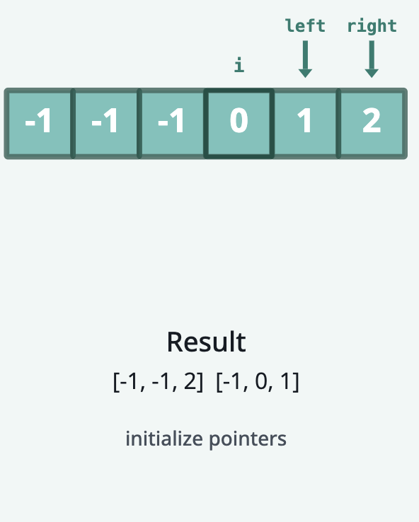
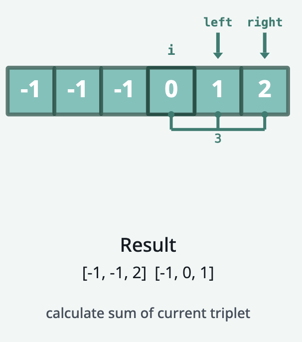
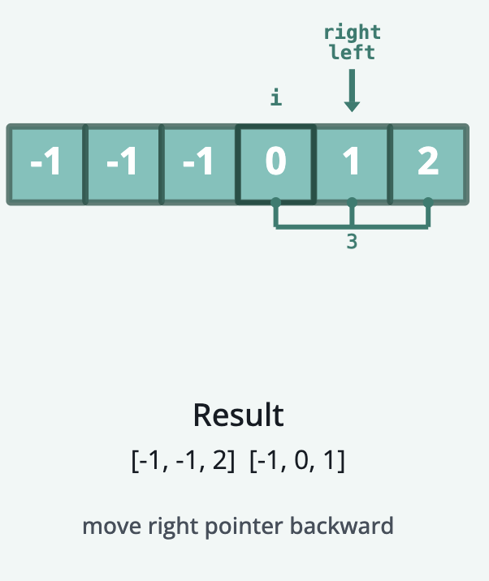

### Termination

Our algorithm terminates when i reaches the 3rd to last element in the array (i.e., i < n - 2). This is because we need
at least 2 more elements after i for left and right to form a triplet.

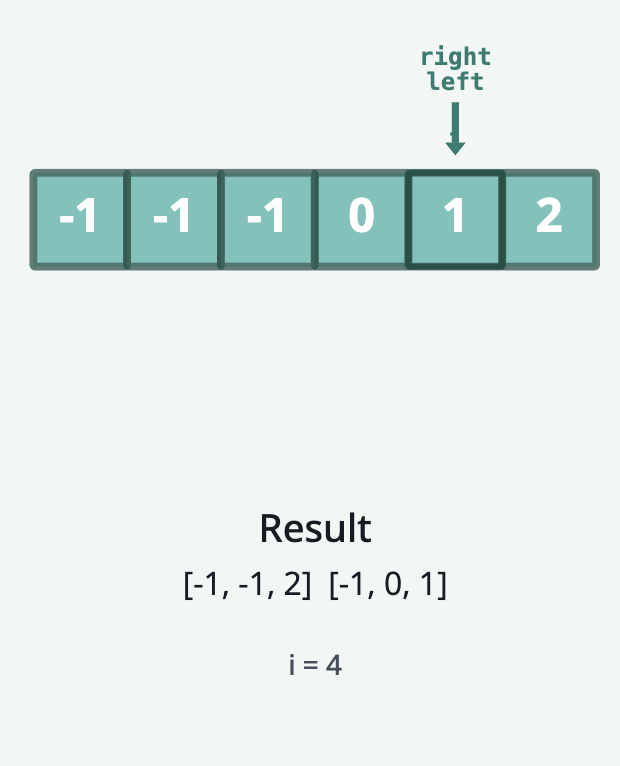
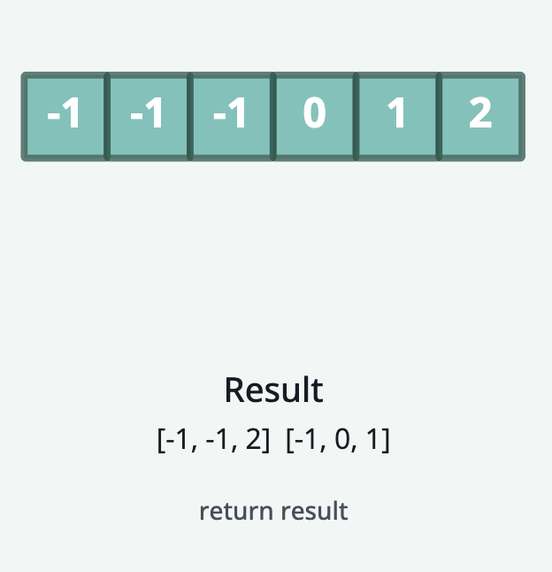
